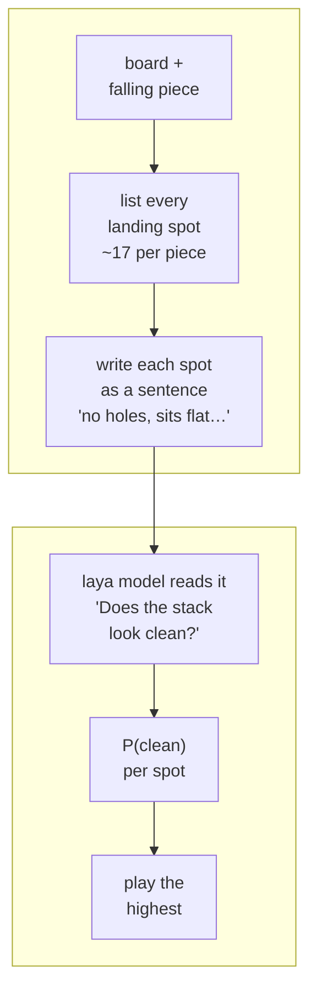
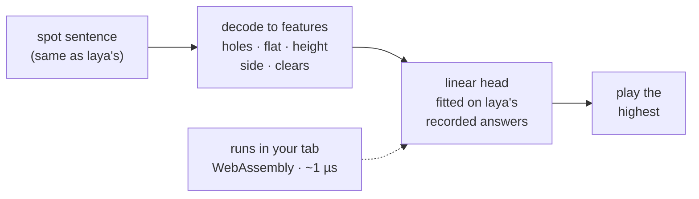
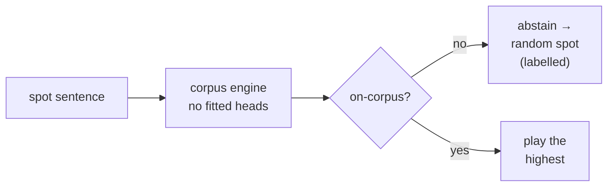
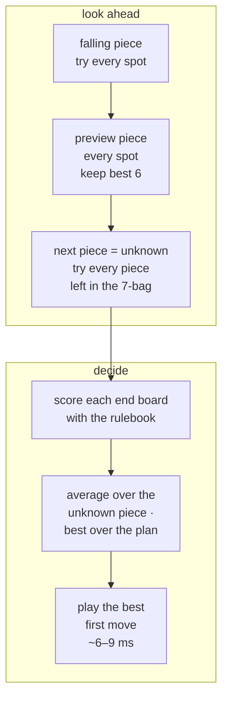
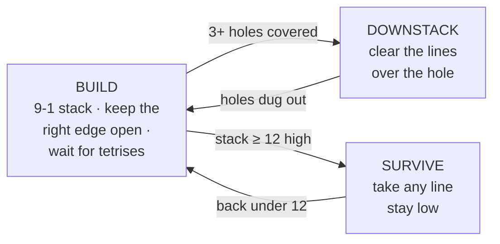

# Tetris arena lanes — how each lane picks a spot (the site figures)

> **Purpose:** the source of truth for the "How each lane decides" figures on
> [reflex.gist.rs/arena](https://reflex.gist.rs/arena/). Each `mermaid` block
> below renders ONE SVG (named by its `%% file:` line); the renderer is
> `reflex-site/scripts/render_tetris_flows.py`, which writes the SVG beside
> this doc AND into `reflex-site/assets/` (the mirror law of riir-reflex
> `.docs/03_decision_flow` — re-render from here, never hand-edit an SVG).
> Labels stay short: the figures must read at page scale; the numbers live
> in the records cited under each block.

Every lane plays the same game: a seeded 7-bag, a real hard drop from the
top (`laya-tetris-v3`), guideline scoring. They differ only in HOW a
landing spot is chosen.

## 1 · laya (Rust) and laya (Python) — the model reads every spot

Both lanes run the same open weights; Rust is the served port, Python the
torch reference it is measured against.

Cost: one model forward per spot (~0.1–0.7 s each on an M3); it sees one
piece — no preview, no plan. Records: katgpt-rs `.benchmarks/892_laya_h2h.md`.

## 2 · KatGPT modelless — laya's answers, distilled into a µs head

It imitates laya (44/120 agreement on the pinned corpus), so it plays like
laya — only ~10⁵× faster. Records: riir-reflex game heads, Plan 607.

## 3 · raw baseline — the engine with its heads removed

The honest floor every other lane is measured against.

## 4 · KatGPT rulebook search — plan three pieces ahead

The Issue 892 hybrid champion (genome `68cae9d382014662`): no model, no
sentence — it searches placements and scores the boards with a strategy
rulebook.

"Average over the unknown piece" is the point: a plan that only works if
the I-piece comes scores low, because it usually does not come.

## 5 · the rulebook's modes — play for tetrises only while it is safe

Build uses the self-evolved score weights (the 9-1 stack emerged from the
climb — nobody hand-coded it); Downstack and Survive use the proven
survival weights. The mode is re-read from the board before every piece
(Survive wins when both fire). Records: katgpt-rs `.benchmarks/892_tetris_rulebook_arena.md`.
