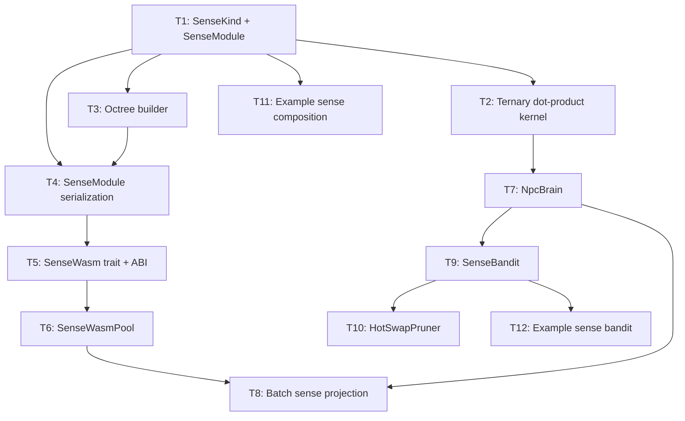

# Plan 221: KG Latent Octree — Modelless Inference-Time Sense Composition

> **Status:** 🟡 Planned
> **Research:** `.research/196_KG_Latent_Octree_WASM_Composition.md`
> **Feature Gates:** `sense_octree` (T1-T4), `sense_wasm` (T5-T8), `sense_bandit` (T9-T10)
> **Depends On:** `plasma_path` (TernaryWeights), `domain_latent` (DomainLatent), `bandit` (TrialLog)
> **Companion Plan:** riir-ai Plan 249 (model-based training)

---

## Overview

Compress game domain knowledge into fixed-type ternary bit-plane sense modules (~232B each). Each module encodes a KG latent octree + direction vectors. NPCs compose modules at spawn time and query at ~45ns/tick via bitwise dot-product. Self-learns from bandit feedback. No LLM inference needed.

---

## TL;DR

- **SenseKind** enum: CommonSense, FighterSense, GameTheorySense, SpatialSense, SocialSense, SkillSense
- **SenseModule**: 232B fixed Pod — octree bit-planes + ternary direction vectors + BLAKE3 commitment
- **SenseWasm**: WASM export ABI for sense modules — project, emit_triples, batch_project
- **SenseBandit**: TrialLog → AbsorbCompress → HotSwapPruner for self-learning
- Perf: 45ns/tick per NPC, ~100KB per NPC brain, 60% code reuse from existing infrastructure

---

## Tasks

### Phase 1: Core Types (sense_octree feature)

- [ ] **T1: SenseKind enum + SenseModule Pod** (`crates/katgpt-core/src/types.rs`)
  - `#[repr(u8)] pub enum SenseKind` — CommonSense(0), FighterSense(1), GameTheorySense(2), SpatialSense(3), SocialSense(4), SkillSense(5), Reserved(7)
  - `#[repr(C)] pub struct SenseModule` — kind, version, octree_depth, n_directions, octree_bits: [u64; 4], directions: [TernaryDir; 8], confidence: f32, commitment: [u8; 32]
  - `TernaryDir` — pos_bits: u64, neg_bits: u64, row_scale: f32 (20B each)
  - bytemuck Pod + Zeroable for zero-copy
  - BLAKE3 commitment over all fields
  - `SenseModule::project(&self, hla_state: &[f32; 8]) -> f32` — ternary dot-product + sigmoid
  - `SenseModule::query_octree(&self, level: u8, index: u8) -> Option<bool>` — 2-bit occupancy query
  - Tests: roundtrip serialize/deserialize, project nonzero changes output, octree query valid indices, BLAKE3 commitment verify
  - Feature gate: `sense_octree`

- [ ] **T2: Ternary dot-product kernel** (`crates/katgpt-core/src/simd.rs`)
  - `simd_ternary_dot_f32(state: &[f32], dir: &TernaryDir) -> f32` — branchless SIMD conditional add/subtract
  - Reuse existing `simd_ternary_matvec` pattern from plasma_path
  - Scalar fallback for non-SIMD platforms
  - Benchmark: vs full-precision dot-product, target <5ns per direction
  - Tests: ternary_dot matches scalar reference, SIMD and scalar agree
  - Feature gate: `sense_octree`

- [ ] **T3: Octree builder** (`crates/katgpt-core/src/sense/`)
  - `SenseOctreeBuilder` — takes Vec<KgEmbedding> → builds octree bit-planes
  - `KgEmbedding` — lightweight struct: entity_hash: u64, relation_hash: u64, embedding: [f32; 8], sign: bool
  - Spatial partition: recursively split embedding space by median at each level
  - Output: packed bit-planes (occupied + sign per node)
  - Max depth: 3 (8 levels, 128 nodes — fits in [u64; 4])
  - Tests: empty input → all zeros, single triple → correct occupancy, many triples → correct partitioning
  - Feature gate: `sense_octree`

- [ ] **T4: SenseModule serialization** (`crates/katgpt-core/src/sense/`)
  - Binary format: `[MAGIC: "SNSE" 4B][VERSION: 1B][KIND: 1B][MODULE: SenseModule bytes][BLAKE3: 32B]`
  - `SenseModule::save()` / `SenseModule::load()` — file I/O with BLAKE3 verification
  - `SenseModule::from_kg_embeddings(kind, embeddings, hla_dim)` — builder from extracted KG data
  - Tests: roundtrip save/load, invalid magic rejected, checksum mismatch rejected, from_kg_embeddings produces valid module
  - Feature gate: `sense_octree`

### Phase 2: WASM Composition (sense_wasm feature, depends on sense_octree)

- [ ] **T5: SenseWasm trait + WASM ABI** (`src/sense/`)
  - `pub trait SenseWasm: Send + Sync` — project(hla_state) -> f32, batch_project(states) -> Vec<f32>
  - WASM export ABI: `project(hla_ptr, hla_len, result_ptr) -> u32`, `batch_project(hla_ptr, n_states, result_ptr) -> u32`, `emit_triples(hla_ptr, hla_len, triple_ptr, triple_len) -> u32`
  - Same ABI for all sense kinds — polymorphic via behavior
  - Q16.16 fixed-point return values (no float FFI overhead)
  - Tests: mock WASM module roundtrip, ABI conformance
  - Feature gate: `sense_wasm`

- [ ] **T6: SenseWasmPool — per-thread WASM sense module pool** (`src/sense/`)
  - Reuse BomberWasmPruner pattern: `papaya::HashMap<ThreadId, Mutex<SenseWasmInner>>`
  - `SenseWasmInner` — wasmtime Store + Module + TypedFunc + Memory
  - `SenseWasmPool::new(modules: Vec<&Path>)` — load multiple sense WASM files
  - `SenseWasmPool::project_all(&self, hla_state: &[f32; 8]) -> Vec<f32>` — query all modules
  - Fuel gating: FUEL_PER_SENSE = 10_000 (sense queries are simpler than game validators)
  - Zero-copy state buffer for HLA state
  - Tests: single module project, multiple modules compose, fuel exhaustion returns default
  - Feature gate: `sense_wasm`

- [ ] **T7: NpcBrain — composable sense module composition** (`src/sense/`)
  - `pub struct NpcBrain` — modules: Vec<SenseModule> (native Rust, no WASM), hla_state: [f32; 8]
  - `NpcBrain::compose(modules: Vec<SenseModule>)` — load at NPC spawn time
  - `NpcBrain::project_all(&self) -> Vec<f32>` — project HLA onto all loaded modules
  - `NpcBrain::project_kind(&self, kind: SenseKind) -> Option<f32>` — project single sense
  - `NpcBrain::update_hla(&mut self, delta: &[f32])` — update HLA state (from BeliefDrafter or tick)
  - Native Rust path (no WASM) for core senses — faster than WASM for hot loop
  - Tests: compose 3 modules, project_all returns 3 scalars, project_kind filters correctly
  - Feature gate: `sense_octree`

- [ ] **T8: Batch sense projection** (`src/sense/`)
  - `batch_project_all(brains: &[NpcBrain], results: &mut [Vec<f32>])` — process N NPCs
  - For WASM path: serialize all HLA states, call batch_project once, deserialize results
  - For native path: parallel via rayon if N > 64 (per optimization.md guidelines)
  - Benchmark: N=1000 NPCs, target <50μs total (50ns per NPC)
  - Tests: batch matches individual, edge cases (0 NPCs, 1 NPC, max NPCs)
  - Feature gate: `sense_wasm`

### Phase 3: Self-Learning (sense_bandit feature, depends on bandit)

- [ ] **T9: SenseBandit — trial log for sense module quality** (`src/sense/`)
  - `SenseTrial` — npc_id: u32, sense_kind: SenseKind, activation: f32, action_taken: u32, reward: f32
  - `SenseTrialLog` — extends existing TrialLog with sense-specific fields
  - `AbsorbCompress` integration — high-reward trials reinforce direction weights
  - `decay_direction(module: &mut SenseModule, trial: &SenseTrial, alpha: f32)` — EMA weight update
  - Tests: high reward increases confidence, low reward decreases confidence, decay bounded
  - Feature gate: `sense_bandit`

- [ ] **T10: HotSwapPruner for sense modules** (`src/sense/`)
  - `SenseHotSwap` — atomically replace a sense module in NpcBrain at runtime
  - Uses papaya lock-free swap: `AtomicPtr<SenseModule>` with epoch-based reclamation
  - `SenseHotSwap::swap(&self, kind: SenseKind, new_module: SenseModule)` — zero-downtime replacement
  - Triggered by AbsorbCompress when bandit confidence exceeds threshold
  - Tests: swap during project_all returns consistent results, concurrent swap+project safe
  - Feature gate: `sense_bandit`

### Phase 4: Integration + Examples

- [ ] **T11: Example — sense composition demo** (`examples/sense_composition.rs`)
  - Demonstrates: load 3 sense modules, create NpcBrain, project HLA state, show activations
  - Before/after: "without sense modules" vs "with sense modules" decision quality
  - Uses synthetic KG data (no self-play needed for demo)
  - Print: sense activations, decision, confidence
  - Feature gate: `sense_octree`

- [ ] **T12: Example — sense bandit self-learning demo** (`examples/sense_bandit_demo.rs`)
  - Demonstrates: self-play loop → sense trials → AbsorbCompress → HotSwap
  - Shows confidence evolution over N episodes
  - Print: initial vs final confidence, direction weight changes
  - Feature gate: `sense_bandit`

---

## Dependency Graph



---

## Feature Gate Summary

| Feature | Dependencies | Tasks | Default |
|---------|-------------|-------|---------|
| `sense_octree` | `plasma_path` | T1-T4, T7, T11 | Opt-in → default-on after GOAT |
| `sense_wasm` | `sense_octree` | T5-T6, T8 | Opt-in (WASM sandbox) |
| `sense_bandit` | `sense_octree`, `bandit` | T9-T10, T12 | Opt-in → default-on after GOAT |

---

## File Structure

```
crates/katgpt-core/src/
  types.rs          — SenseKind, SenseModule, TernaryDir (T1)
  simd.rs           — simd_ternary_dot_f32 (T2)
  sense/
    mod.rs           — Feature gate, re-exports
    octree.rs        — SenseOctreeBuilder, KgEmbedding (T3)
    serialize.rs     — SenseModule save/load (T4)
    wasm.rs          — SenseWasm trait, WASM ABI (T5)
    pool.rs          — SenseWasmPool (T6)
    brain.rs         — NpcBrain (T7)
    batch.rs         — batch_project_all (T8)
    bandit.rs        — SenseTrialLog, decay_direction (T9)
    hotswap.rs       — SenseHotSwap (T10)

examples/
  sense_composition.rs   — T11
  sense_bandit_demo.rs   — T12
```

---

## CPU/GPU Auto-Route

| Operation | CPU Path | GPU Path | Threshold |
|-----------|----------|----------|-----------|
| Single NPC project | Native Rust (45ns) | N/A | Always CPU |
| Batch project (N < 64) | Serial | N/A | Always CPU |
| Batch project (N ≥ 64) | Rayon parallel | N/A | CPU wins for bitwise ops |
| Direction quantization | Scalar | N/A | CPU (too small for GPU) |
| Self-play training | N/A | riir-gpu LoRA | See Plan 249 |

**GPU is not needed for inference** — ternary bitwise ops are faster on CPU than GPU (kernel launch overhead ~50μs >> 45ns computation).

---

## Risks and Mitigations

| Risk | Mitigation |
|------|-----------|
| Ternary quantization loses KG structure | Start with full-precision NeuronShard, add ternary as draft path. Quality gate: if ternary vs full-precision correlation < 0.9, reject ternary. |
| WASM FFI overhead dominates | Only use WASM for community/untrusted sense modules. Core senses are native Rust. Batch API amortizes FFI. |
| Octree too shallow for real KG | Start with depth 3. Empirically validate on real self-play data. Deeper octree = larger SenseModule but still fits in cache lines. |
| Sense module quality varies wildly | Bandit feedback loop + KgQualityMetrics quality gate + HotSwapPruner for runtime replacement. |

---

## TL;DR

12 tasks across 4 phases. Phase 1 (T1-T4): core types + octree + serialization. Phase 2 (T5-T8): WASM composition + NpcBrain. Phase 3 (T9-T10): bandit self-learning + hot-swap. Phase 4 (T11-T12): examples. 60% reuse from existing TernaryWeights, BomberWasmPruner, and bandit infrastructure. Target: 45ns/tick per NPC, ~232B per sense module, composable at runtime.
