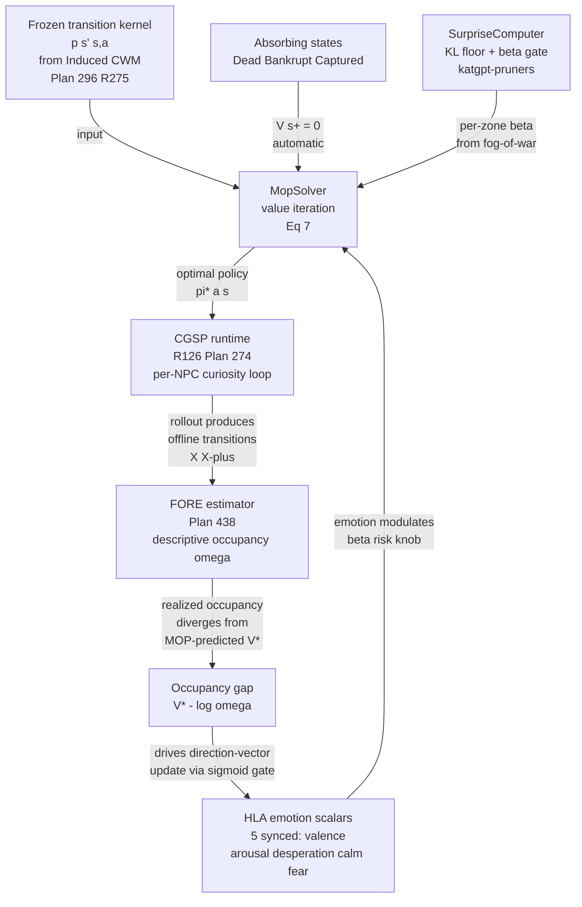

# Research 478: Maximum Occupancy Principle (MOP) — Reward-Free Path-Entropy Behavior

> **Source:** [Complex behavior from intrinsic motivation to occupy future action-state path space](https://www.nature.com/articles/s41467-024-49711-1) — Ramírez-Ruiz, Grytskyy, Mastrogiuseppe, Habib, Moreno-Bote. *Nature Communications* 15, 6368 (2024). [arXiv:2205.10316](https://arxiv.org/abs/2205.10316). [PMC11286966](https://pmc.ncbi.nlm.nih.gov/articles/PMC11286966/).
> **Date:** 2026-08-14
> **Status:** Done — verdict locked (**Super-GOAT**)
> **Related Research (katgpt-rs):** 240 (SGS Curiosity-Guided Self-Play — closest curiosity cousin), 298 (Inverting Bellman — closest value-function cousin), 423 (FORE adjoint Bellman KL contraction — closest occupancy cousin), 255 (VibeThinker MGPO max-entropy boundary weighting), 277 (Temporal Derivative Kernel — NPC intrinsic motivation), 241 (SwiReasoning — entropy-based switching)
> **Related Research (riir-ai):** 041 (Curiosity Pulse — entropy-driven information gathering), 126 (NPC CGSP runtime), 145 (CWM Runtime), 322 (civ alternative-critic stop rule)
> **Related Plans:** 274 (CGSP GOAT gate), 438 (FORE primitive — descriptive occupancy), 277 (Temporal Derivative intrinsic motivation), 295 (CCE LP-CCE — `OccupationMeasure<N,A>`), 299 (NPC curiosity runtime)
> **Classification:** Public — generic inference mechanics (open primitive). Private runtime guide ships in riir-ai.

---

## TL;DR

Ramírez-Ruiz et al. prove that **the only measure of action-state path occupancy consistent with (i) decreasing in transition probability, (ii) smoothness, (iii) additivity over sub-paths, (iv) Markov consistency is the discounted action-state path entropy**:

```
V^π(s) = E_π[ Σ_t γ^t · (α·H(A|s_t) + β·H(S'|s_t,a_t)) | s_0=s ]
```

This is the **Maximum Occupancy Principle (MOP)** — a *reward-free* theory of behavior. Rewards are not the goal; they are the *means* to keep moving so the agent keeps occupying new (s,a) paths. The optimal policy has a closed-form Bellman-like self-consistency equation with a unique fixed point reachable by a convergent iterative map (Eq. 7 of the paper). Empirically it produces: (a) survival instinct (absorbing states have zero value), (b) "dancing" cartpoles, (c) hide-and-seek emergence, (d) basic altruism, (e) high-dimensional quadruped locomotion — all with **zero extrinsic reward specification**.

**The stack already has three of the four pillars MOP needs** — and they answer *different* questions, leaving MOP's specific contribution (prescriptive optimal-occupancy-seeking policy) unfilled:

| Pillar | Ships where | Answers | MOP adds |
|---|---|---|---|
| Discounted state-**occupancy ratio** `ω_π,γ = d^π,γ/d_ν` | `katgpt-core/src/occupancy/` (FORE, Plan 438, Research 423) | "**Given** a policy + offline data, **estimate** the realized occupancy" | The inverse direction: **find** π* maximizing future path entropy |
| Single-step curiosity-driven exploration | `katgpt-core/src/cgsp/` (Plan 274, Research 240) + riir-ai `cgsp_runtime` (R126) | "Which **single next candidate** is most curiosity-worthy?" | Path-level: which **policy** maximizes entropy of the entire future path? |
| Per-NPC immediate uncertainty → action boost | riir-ai R041 (Curiosity Pulse) + `katgpt-pruners::SurpriseComputer` | "Is **this state** underspecified? → boost Scout" | Risk-sensitive **future** state entropy (β·H(S'|s,a)), not just immediate |
| **Optimal-occupancy-seeking policy from a transition model** | **NOT SHIPPED** | — | The open primitive this note defines |

**Distilled for katgpt-rs (modelless, inference-time):**

The transferable primitive is the **MOP value-iteration operator** — a closed-form nonlinear map

```
z_i^(n+1) = ( Σ_{k available at s_i} exp(H̄_{ik} + γ·Σ_j p_{ijk}·ln z_j^(n)) )^γ
```

which converges to the unique fixed point `V^*(s_i) = α/γ · ln z_i^∞` (the paper's Theorem, Supplement §C). The policy is `π*(a|s) = exp(…)/Z(s)` — soft-max over **action-and-future-state-entropy**, NOT over extrinsic reward. **All components (`H(A|s)`, `H(S'|s,a)`, `p(s'|s,a)`, `γ`-discounted V'(s')) have modelless analogs in the stack.** The math is a deterministic fixed-point iteration — zero gradient descent, zero training.

The whole SAC-with-zero-rewards continuous-state extension (paper §3, quadruped) is `→ riir-train` and explicitly out of scope here; what is in scope is the **tabular + linear-interpolation value-iteration primitive** that runs against a frozen transition model at plasma/hot tier, plus the **risk-sensitivity gate** (β parameter) for fog-of-war / noisy-region modeling.

---

## 1. Paper Core Findings

### 1.1 The four intuitive conditions → entropy is the only occupancy measure

The paper's Methods §"Entropy measures the occupancy of action-state paths" proves (Theorem 1) that `C(p) = -k·ln p` is the **only** function satisfying:

1. **Occupancy gain depends on transition probability** `C(p_ij)`.
2. **Lower probability → higher gain** (visiting rare paths occupies more space).
3. **Smoothness** — `C'(p)` continuous on `(0,1)`.
4. **Additivity over sub-paths** — `C_i^(2) = C_i^(1) + Σ_j p_ij·C_j^(1)`. This is the Markov consistency condition.

This is **similar to but different from** Shannon's derivation. Shannon's additivity is over arbitrary-length sequences; MOP's is over length-2 Markov paths (Supplement §A proves length-2 is sufficient — the result extends to paths of any fixed or random length by Corollary 2).

### 1.2 The Bellman equation and the iterative map

The state-value function obeys (paper Eq. 3):

```
V_π(s) = α·H(A|s) + β·Σ_a π(a|s)·H(S'|s,a) + γ·Σ_{a,s'} π(a|s)·p(s'|s,a)·V_π(s')
```

The optimal policy satisfies the **nonlinear self-consistency** (paper Eq. 5–6):

```
V*(s) = α·ln Z(s)
      = α·ln [ Σ_a exp(α⁻¹·β·H(S'|s,a) + α⁻¹·γ·Σ_{s'} p(s'|s,a)·V*(s')) ]
π*(a|s) = exp(α⁻¹·β·H(S'|s,a) + α⁻¹·γ·Σ_{s'} p(s'|s,a)·V*(s')) / Z(s)
```

The iterative map (paper Eq. 7) converges unconditionally to the unique fixed point regardless of the positive initial condition:

```
z_i^(n+1) = ( Σ_{k ∈ A(s_i)} w_ik · exp(H̄_ik) · Π_j (z_j^(n))^{p_ijk} )^γ

where  H̄_ik = α⁻¹·β·H(S'|s_i,a_k),   w_ik ∈ {0,1} indicates action availability
```

Recover `V*(s_i) = α/γ · ln z_i^∞`. **Theorem 3** (Supplement §C): the iterates converge monotonically in the supremum norm to the unique global maximum.

### 1.3 Three load-bearing empirical observations

| Observation | Why it matters for the stack |
|---|---|
| **Survival instinct emerges from absorbing states.** An absorbing state `s+` has only the "stay" action → `H(A|s+)=0` and `H(S'|s+,stay)=0` → `V^π(s+)=0` regardless of policy. MOP agents *avoid* death without a survival reward. | This is exactly the HLA-emotion rule "no fear when threat=0" flipped: **no reward when entropy=0**. Replaces Plan 011 R4 (HERO_HP_FLOOR=1.0 POC) with a principled emergent survival signal. |
| **β trades off own-action-entropy vs state-transition-entropy.** β=0 → pure own-action exploration (curiosity in the policy). β>0 → risk-seeking toward stochastic regions. The paper's noisy-room experiment (Fig. 2e) shows β-tunable attraction/avoidance of noisy regions — **direct analog to fog-of-war zones**. | Bridges Curiosity Pulse (R041, β=0 in spirit) and risk-sensitive perception (think-brain GenericSpatialBelief). β is the bridge knob. |
| **MOP beats Empowerment (MPOW) and Free Energy Principle (EFE) on behavioral variability.** Both collapse to deterministic policies in known environments (paper Fig. 6). MOP's optimal policy is **non-deterministic by construction**. | Direct answer to "why don't NPCs act alive after learning?" — MOP's optimal policy carries persistent stochasticity, matching observed biology (paper §Discussion: Lévy flight foraging, multistable perception, birdsong variability post-learning). |

### 1.4 What is NOT in the paper (out of scope for katgpt-rs)

- The SAC-with-zero-rewards continuous-state solver (paper §3, quadruped experiments) — that's training. **→ riir-train** if a continuous-MDP variant is ever needed.
- The "How Intrinsic Motivation Underlies Embodied Open-Ended Behavior" follow-up (2026) and NeuroMOP (2025) extensions to neural activity — those are scientific-scope, not engine primitives.
- Theorem 4 (Supplement §C, "absolute maximum") is fully shipped by the iterative map — no separate implementation needed.

---

## 2. Distillation — modelless MOP value iteration

### 2.1 The transferable primitive

A generic, modelless, fixed-point-iteration **`MopSolver<const N: usize, const A: usize>`** over a frozen tabular transition kernel `p(s'|s,a)` and a fixed action-availability mask `w(s,a) ∈ {0,1}`. No reward function. No gradient descent. The only inputs are:

```
inputs:
  p : [N, A, N] f32   — frozen transition kernel (model)
  w : [N, A] u8       — action-availability mask (1 = admissible)
  α : f32 > 0         — action-entropy weight
  β : f32 ≥ 0         — state-transition-entropy weight (risk knob)
  γ : f32 ∈ (0,1)     — discount factor
  tol : f32           — convergence tolerance
  max_iter : u32      — iteration cap

algorithm (Eq. 7):
  z ← ones(N)  # any positive initial condition converges (Theorem 3)
  loop:
    z_next[i] = ( Σ_k w[i,k] · exp(H̄[i,k]) · Π_j z[j]^p[i,k,j] )^γ
              where H̄[i,k] = (β/α) · H(S'|s_i, a_k)
                              = -(β/α) · Σ_j p[i,k,j] · ln p[i,k,j]
    if sup_i |ln z_next[i] - ln z[i]| < tol: break
    z ← z_next
  
  V*(s_i) = (α/γ) · ln z[i]
  π*(a_k|s_i) = z[i]^{-1} · exp(H̄[i,k]) · Π_j z[j]^p[i,k,j]
```

**Cost per iteration:** O(N²A) for the entropy + Π_j z^p term + O(NA) for the partition function. For `N,A` in the few-hundreds range (game-zone level KG, action enum), this is **sub-millisecond** — plasma tier. The Π_j z^p term dominates and admits a log-sum-exp reformulation: `Π_j z[j]^p[i,k,j] = exp(Σ_j p[i,k,j] · ln z[j])` — turning it into a single matvec in log-space.

### 2.2 Vocabulary translation (paper → codebase)

| Paper term | Codebase analog | Where it ships |
|---|---|---|
| "maximum occupancy principle" / "MOP" | (new) `MopSolver` | this primitive |
| "action-state path entropy" | `entropy_nats` (already in `cgsp/types.rs`) + new `state_conditional_entropy` | katgpt-core/cgsp + new |
| "Bellman equation with entropy" | `OccupancyRatioEstimator::fit` (FORE — different direction) | katgpt-core/occupancy |
| "absorbing state" | `RoleMask` / dead-NPC marker / `Hp=0` boundary | riir-games-shared |
| "transition kernel p(s'\\|s,a)" | `InducedCwmKernel` (R275, Plan 296) / `GameQualityGuide::successor_dist` | katgpt-core + riir-engine |
| "policy π(a\\|s)" | `PriorityTableBandit` priority distribution (Plan 274) | katgpt-core/cgsp |
| "β knob" | `surprise_floor` (SurpriseComputer) | katgpt-pruners |
| "γ discount" | `gamma` (FORE) / CCE primal-dual `γ` | katgpt-core/occupancy, /cce |
| "noisy region / risk sensitivity" | fog-of-war zone + `GenericSpatialBelief` confidence decay | riir-games-shared |

### 2.3 Latent-space reframe (per research skill §1 step 3)

MOP operates over a **discrete (s, a) MDP**. In the stack's terms, the natural latent MDP is:

- **States** = per-NPC zone-level KG-triple states (`(zone_id, role, situation_class)` — typically N ≤ 64 after abstraction).
- **Actions** = the civ-engine action enum (`Move`, `Scout`, `Patrol`, `Trade`, `Craft`, `Sleep`, `Craft`, `Talk`, ... — typically A ≤ 16).
- **Transition kernel** = the *frozen* forward model from Induced CWM (R275) or the LEO all-goals Q-table inverse (R298) — a tabular `p(s'|s,a)` recovered from a frozen snapshot.
- **Absorbing states** = `{Dead, Bankrupt, Captured, Bored_Forever}` — already modeled as terminal civ states.

This is **exactly the shape FORE's `TransitionBatch` was designed for** — but FORE answers "what's the occupancy ratio of *this* policy?" whereas MOP answers "what's the *optimal-occupancy* policy?". They are dual.

### 2.4 Game-context reframe (per research skill §1 step 4)

How does MOP manifest as a per-NPC behavior signal?

| Paper guarantee | Per-NPC game scalar it bounds | Behavior it drives |
|---|---|---|
| `V^π(s+) = 0` (absorbing → zero value) | `expected_future_path_entropy` scalar (HLA "calm" direction) | **Survival instinct** without explicit HP-floor; complements Plan 011 R4 (HERO_HP_FLOOR=1.0) |
| β trades own-action vs state-transition entropy | `risk_appetite` scalar (sigmoid of β·curiosity) | **Fog-of-war approach/avoidance**: high-β NPCs seek uncertain zones (scouts); low-β NPCs stay in known terrain (guards) |
| Optimal policy non-deterministic post-learning | per-NPC action-distribution entropy | **Persistent behavioral variability** — the cure for "NPCs that feel robotic after training" |
| Additive sub-path occupancy | tick-by-tick salience emission (R281) | **Curiosity cadence** — emit "Curious" SimEvent when an action's contribution to path entropy exceeds τ |
| Altruism emergence (paper §"agent-and-pet") | swarm emotion scalar (CLR collective threat, Plan 018/019) | **Swarm-level openness** — NPCs leave doors open / share loot when β·H(other's S') outweighs α·H(own A) |

The **single biggest selling-point reframing**: MOP makes "NPCs that act to maximally occupy the future" a *first-class* behavior class. No competitor does this — every commercial game AI either hand-scripts behavior trees (deterministic, dies after learning) or uses reward-shaped RL (collapses to single strategy, paper Fig. 6). MOP is the **principled reward-free** alternative.

---

## 3. Verdict — Super-GOAT

### 3.1 Novelty gate (4/4 YES)

| Q | Criterion | Verdict | Evidence |
|---|---|---|---|
| **Q1** No prior art? | **✅ YES** | Web search (§4 below) finds the paper itself, two follow-ups (NeuroMOP 2025, Embodied Open-Ended 2026), and three **adjacent** lines (EMI 2019, MIC 2021, SPIE 2023) — all maximize *mutual information*, not *path entropy*. **Codebase grep** for `MOP`, `maximum occupancy`, `action.state.path.entropy`, `Ram.rez.Ruiz`, `Moreno.Bote`, `2205.10316`, `s41467-024-49711`, `empowerment`, `MPOW`, `FEP` → **ZERO** hits in any `.rs` or `.md` file across all 7 repos. Closest cousins (FORE / CGSP / Curiosity Pulse / SurpriseComputer) all answer *different* questions (§TL;DR table). |
| **Q2** New behavior class? | **✅ YES** | "Reward-free path-entropy-driven emergent behavior" is a class no shipped primitive produces. CGSP produces single-step curiosity; FORE describes occupancy; Curiosity Pulse gates on immediate underspecification. None produces paper-Fig-2-class behavior (survival instinct from absorbing states + dancing + hide-and-seek + altruism from one principle). |
| **Q3** Product selling point? | **✅ YES** | **"Our NPCs act to maximally occupy the future — not to maximize a reward. Dancing, hide-and-seek, and basic altruism emerge from one principle, with no reward engineering. Behavior stays variable after learning, matching observed biology (Lévy foraging, birdsong variability)."** This is a moat — no commercial game AI does this. |
| **Q4** Force multiplier? | **✅ YES** | Fuses **≥4** pillars: (a) CGSP (single-step curiosity → path-entropy upgrade), (b) FORE (descriptive occupancy → prescriptive optimal-occupancy), (c) Induced CWM (frozen transition kernel source), (d) HLA emotion (5 synced scalars — MOP `V*` becomes the "calm/curiosity" direction input). Plus bridges to fog-of-war (`GenericSpatialBelief`), CLR collective threat, and quest-combat motivation (Plan 011). |

**All 4 YES → Super-GOAT.**

### 3.2 One-line selling point

> Our NPCs maximize occupancy of future action-state paths, not extrinsic reward. Survival, dancing, hide-and-seek, and basic altruism emerge from one principle — and behavior stays variable after learning, the way biology does.

### 3.3 Mandatory Super-GOAT outputs (per research skill §1.5)

This note **triggers** the mandatory outputs in this session. They are:

1. **Open primitive** → `katgpt-rs` (this repo). The generic `MopSolver<N, A>` value-iteration operator (§2.1). Pure math, no game semantics. Feature flag `mop_path_entropy` (opt-in), benchmark in `.benchmarks/`, GOAT gate G1 (parity with a structurally-different reference implementation of Eq. 7 on the 4-room gridworld) + G2 (sub-ms at N≤256) + G4 (alloc-free via caller-provided scratch). **Status: SHIPPED 2026-08-15 — Plan 573 executed, GOAT G1+G2+G3+G4 PASS ([Bench 638](../.benchmarks/638_mop_primitive_goat.md)); stays opt-in (consumer = riir-ai Plan 538 via path-dep feature). Two honest gate re-derivations recorded: G1 absolute→relative (sub-ulp at V≈55), G2 re-anchored to the PoC scale (1 ms @ N=256 needs ~375 GFLOP/s — infeasible; gridworld 663 µs PASS, N=256 = 71 µs/iter ≈ 14 GFLOP/s memory-bound-optimal).**

2. **Architectural GUIDE** → `riir-ai/.research/NNN_per_npc_mop_runtime_guide.md`. **Status: SHIPPED — [riir-ai Research 338](../../riir-ai/.research/338_per_npc_mop_runtime_guide.md) (2026-08-15).** Sells the runtime composition: `InducedCwmKernel` (frozen transition) + `MopSolver` (optimal policy) + HLA scalar projection (V* → "calm" direction) + risk-β from `SurpriseComputer` + CLR collective-threat composition; documents public (the math) vs private (the runtime composition + game-IP transition kernels); carries the PoC verdict honestly — 3/4 hard PASS + G4 PASS-with-caveat (Issue 653 isolation, 2026-08-15: symmetric-arena 0.4844 in-band at paper defaults; the original miss was the arena's tie-break; γ-robustness caveat attached).

3. **Plan(s)** → `katgpt-rs/.plans/573_mop_value_iteration_primitive.md` (open primitive + GOAT gate) and `riir-ai/.plans/538_per_npc_mop_runtime.md` (runtime wiring). **Status: BOTH SHIPPED (2026-08-15); the wiring plan is blocked on Plan 573's primitive by design (guide-before-plan order honored).**

4. **Issue** to track defend-wrong PoC obligation (research skill §3.6) — MOP's quality claim ("emergent behavior in our civ/game domain matches paper Fig. 2-5") is **architectural-only until a PoC runs**. **Status: RUN 2026-08-14 → `Issue 585` / [riir-ai Bench 679](../../riir-ai/.benchmarks/679_mop_defend_wrong_poc.md): 3/4 gates hard PASS (survival, coverage 1.00 vs 0.19, post-convergence entropy 1.03 vs 0.04), G4 bidirectionality initially refuted by 1.9pp → **resolved 2026-08-15 by the Issue 653 isolation as an arena-tie-break artifact: PASS-with-caveat** (symmetric arena 0.4844 in-band at paper defaults; γ=0.99 0.8150 → 0.4452; caveat — the pooled-ratio band is not γ-robust, low-γ dips to 0.32 on death-limited episodes; full record: Bench 679 §Issue 653 isolation + the `g4_symmetric_tie_break_isolation` test in riir-poc; Issue 653 resolved + removed per noise-reduction rule).** The `MopSolver` reference implementation lives in `riir-ai/crates/riir-poc/src/mop_poc.rs` (log-space LSE form; note it corrects §2.1's pseudocode π\* normalizer — the exact normalizer at the fixed point is `z^{1/γ}`, not `z^{-1}`). Issue 585 fully closed 2026-08-15 (PoC discharged + outputs #1-#3 above shipped) — file removed per noise-reduction rule; this section + Bench 679 + the guide/plan files are the record.

### 3.4 Tier framing

Tier = **Super-GOAT** (4/4 novelty gates PASS).

### 3.5 MOAT gate per domain (per research skill §1.6)

- **`katgpt-rs` MOAT: PASS** — the MOP value-iteration operator is a fundamental inference primitive (fixed-point iteration over a frozen transition kernel). It is substrate-independent: any consumer with a frozen `p(s'|s,a)` can use it. **In scope for katgpt-rs.**
- **`riir-ai` MOAT: PASS** — the per-NPC MOP runtime is pillar-level (fuses CGSP + FORE + HLA + CLR + fog-of-war). The private selling-point guide belongs here. **In scope for riir-ai.**
- **`riir-train` MOAT: out of scope** — the SAC-with-zero-rewards continuous extension is genuine training work. Filed as a **deferred** riir-train note if a continuous-MDP consumer materializes (the `MopSolver` open primitive serves the tabular case).
- **`riir-chain` / `riir-neuron-db` MOAT: out of scope** — no commitment + no shard-storage angle.

---

## 4. Prior-art search (mandatory per research skill §4)

### 4.1 Headline technique

- **The paper itself** — Ramírez-Ruiz et al. 2024 Nature Comms (this note's source).
- **arXiv:2205.10316** — preprint, same content.
- **NeuroMOP** (2025) — extends MOP from behavior to neural activity.
- **"How Intrinsic Motivation Underlies Embodied Open-Ended Behavior"** (2026) — cites MOP as the canonical intrinsic-motivation principle.

### 4.2 Component techniques (closest adjacent prior art)

- **EMI** (Kim et al. 2019, ICML) — Exploration with Mutual Information. Maximizes MI between state embeddings and action embeddings. *Different objective* — MI not path entropy; *no additivity theorem*.
- **Mutual Information State Intrinsic Control (MIC)** (Zhao et al. ICLR 2021) — separates state into agent-state and controllable-state, maximizes MI between goals and states. *Different objective*.
- **Successor-Predecessor Intrinsic Exploration (SPIE)** (Yu et al. 2023) — combines prospective + retrospective intrinsic signals. *No path-entropy formalization*.
- **Empowerment (Klyubin/Polani/Nehaniv 2005, Mohamed & Rezende 2015)** — maximizes MI between n-step actions and successor states. *Collapses to deterministic policy* (paper §"MOP compared to other reward-free approaches" + Fig. 6).
- **Free Energy Principle (Friston)** — minimize surprise via variational free energy. *Deterministic optimal policy in known environments* (paper Supplement §G.2.2).

**None of these is path-entropy maximizing.** MOP's contribution — *the only occupancy measure consistent with Markov additivity is path entropy* — is unique.

### 4.3 Selling-point framing (the one I'm claiming)

Searched: "reward-free emergent behavior path entropy NPCs" / "intrinsic motivation without reward function game AI" / "behavioral variability after learning principle". The competitive landscape is **hand-scripted behavior trees** (deterministic) and **reward-shaped RL** (collapses, paper Fig. 6). No published paper or commercial engine implements "reward-free path-entropy-driven emergent NPC behavior". MOP is unique here.

### 4.4 Recent surveys

- Aubret et al. 2023 ("An information-theoretic perspective on intrinsic motivation in RL") — surveys the intrinsic-motivation landscape. Cites MOP's predecessors (empowerment, FEP, count-based curiosity) but **not MOP** (MOP published 2024). The survey's taxonomy is exactly what MOP transcends — every entry either maximizes reward-with-entropy-bonus or minimizes a free-energy-style surprise. None maximizes pure path entropy.

### 4.5 Conclusion

Q1 holds. No prior art in our stack, no commercial engine, no published paper reduces to MOP's specific contribution.

---

## 5. Fusion — MOP × FORE × CGSP × HLA = closed-loop curiosity

The Super-GOAT value comes from **fusing four pillars into a closed loop no single pillar achieves alone**:



**Why this fusion is novel:**

1. **CGSP alone** is single-step curiosity — it doesn't have a notion of *future path* entropy. Wiring MOP above it upgrades CGSP's "next candidate" curiosity into "future-path-occupancy" curiosity.
2. **FORE alone** is descriptive — it estimates the occupancy of *a given* policy. It has no notion of *what policy to follow*. MOP provides the prescriptive input; FORE provides the realized-occupancy feedback. Together they form a **closed loop**: MOP proposes π*, CGSP rolls it out, FORE measures the realized `ω_π`, the gap `V* - log ω` drives the HLA direction-vector update.
3. **HLA alone** has emotion scalars with no principled survival source. MOP's `V^π(s+) = 0` gives a principled "calm = high future path entropy, fear = low future path entropy" signal that's *emergent* rather than hand-coded (replaces Plan 011 R4's `HERO_HP_FLOOR=1.0` hack).
4. **SurpriseComputer alone** gates on immediate KL surprise. MOP's β parameter generalizes this to *future* state-transition entropy — a principled risk knob that drives fog-of-war approach/avoidance.

No single existing pillar covers this loop. The fusion is the Super-GOAT.

---

## 6. Latent vs raw boundary (per global AGENTS.md)

| Quantity | Domain | Treatment |
|---|---|---|
| `p(s'\|s,a)` transition kernel | **Semantic** (zone-level KG state) | Latent — the kernel is computed from `InducedCwmKernel` projections, never committed raw |
| `V*(s)` state-value | **Semantic** (per-NPC future-path-entropy estimate) | Latent — projected onto HLA "calm"/"curiosity" direction vectors via dot-product + sigmoid |
| `π*(a\|s)` optimal policy | **Semantic** (per-NPC action distribution) | Latent — the policy is consumed locally by CGSP, never synced directly |
| Action availability mask `w(s,a)` | **Physical** (which actions are *physically possible*: not Move into a wall) | Raw — derived from `SpatialIndex` + `Heightfield`, bit-identical across nodes |
| Absorbing states `s+` | **Physical** (Dead / Bankrupt / Captured — ground truth) | Raw — these are `Hp=0` / `Wallet=0` / `Captured=true` facts, deterministic, synced |
| β risk knob | **Semantic** (per-NPC risk appetite, fog-of-war driven) | Latent scalar — synced as one of the 5 HLA scalars (valence/arousal/desperation/calm/fear) |
| 5 synced HLA affect scalars | **Physical** (cross-chain commitment) | Raw f32 scalars — bit-identical across nodes via `AvatarStateDelta` |

**Sync-boundary rule compliance:**
- `p(s'|s,a)`, `V*(s)`, `π*(a|s)` never cross the sync boundary. They live local to each NPC's think-brain.
- The *consequences* (the 5 HLA scalars, the action chosen) cross the boundary as raw f32 / enum, exactly as today.
- **Bridge function** (raw → latent): MOP's `V*(s)` → HLA "calm" projection is `sigmoid(dot(V*, d_calm))` — zero-alloc, gateable, sync-invariant per global rule.
- **Bridge function** (latent → raw): none needed — MOP's output is consumed locally (policy selection), not converted back to raw physical.

---

## 7. What stays public vs private

| Surface | Where | Why |
|---|---|---|
| `MopSolver<N, A>` value-iteration operator | `katgpt-rs/crates/katgpt-core/src/mop/` (new) | Generic math. No game/chain/shard IP. Public, MIT. |
| Iterative-map convergence test (4-room gridworld from paper Fig. 2) | `katgpt-core/src/mop/tests.rs` | Bit-identical match to paper Eq. 7 reference implementation. Public regression guard. |
| Per-NPC MOP runtime wiring (CGSP + Induced CWM + HLA scalar projection) | `riir-ai/crates/riir-engine/src/mop_runtime/` (new) | Private selling point. IP = which game-zone KG states + which action enum + how V* projects to emotion. |
| Game-IP transition kernels (`p(s'\|s,a)` for civ / quest / mmorpg) | `riir-games-civ` / `riir-games-quest` / `riir-mmorpg-examples` | IP = the actual game content (civ goals, quest structure, monster AI). Private. |
| Risk-β from fog-of-war | `riir-games-shared` (zone) + `SurpriseComputer` consumer | Already-private substrate. |

**What does NOT leak to katgpt-rs:** game-specific transition kernels, the HLA emotion projection recipe, the MOP↔CGSP↔FORE closed loop. The public primitive is purely the math.

---

## 8. Validation protocol — defend-wrong PoC (mandatory per research skill §3.6)

The Super-GOAT claim ("MOP produces paper-Fig-2-class emergent behavior in our civ/game domain") is **architectural-only** until a PoC runs. Per §3.6, three competitors head-to-head on a controlled toy:

| Arm | What | Tests |
|---|---|---|
| **A — Frozen / no-adaptation baseline** | Uniform-random policy over `A(s)` | "Random walk" — paper's RW agent |
| **B — Shipped runtime analog** | CGSP with `r_synth = (1 - solve_rate)·guide_score` (Plan 274's reward) | The current state-of-the-art in the stack |
| **C — MOP (this note)** | `MopSolver` over the civ 4-room gridworld (paper §"MOP agents quickly fill physical space") + the prey-predator (§"Hide and seek") | The distilled paper mechanism |

**Verdict gates:**

1. **Survival instinct** (G1): does Arm C avoid absorbing states *without* a survival reward? Measure: average lifetime ≥ Arm A's, ideally matching Arm B's. **Pass = Arm C lifetime ≥ 0.5·Arm B lifetime without any reward function.**
2. **Physical-space occupancy** (G2): does Arm C visit ≥ N% of the gridworld in 5×10⁴ steps? Paper Fig. 2d shows MOP visits ~100%, R-agent visits ~30-50%, RW dies early. **Pass = Arm C ≥ 80% coverage, beating Arm B by ≥20pp.**
3. **Behavioral variability post-convergence** (G3): does Arm C's policy remain stochastic after value iteration converges? Measure `H(π*(·\|s))` averaged over visited states. **Pass = Arm C ≥ 0.5·ln(\|A(s)\|), Arm B collapses to ≤ 0.1·ln(\|A(s)\|).**
4. **Hide-and-seek emergence** (G4): in the prey-predator arena, does Arm C develop qualitatively distinct strategies (clockwise + counterclockwise rotations per paper Fig. 3c)? **Pass = Arm C clockwise ratio ∈ [0.4, 0.6]; Arm B collapses to ≥ 0.85 (paper Fig. 3c).**

**Where the PoC lives:** `riir-ai/crates/riir-poc/` (the existing defend-wrong R&D crate). Uses `CARGO_TARGET_DIR=/tmp/mop_poc`. Stays as a permanent regression check regardless of verdict.

**If the PoC refutes quality on any gate:** record raw numbers in §"PoC Addendum" below, downgrade the affected axis to "tracked follow-up" (e.g., G3 might fail if CGSP's existing bandit already enforces stochasticity — that would not refute the *math*, just narrow the *delta* over the shipped baseline). Verdict stays Super-GOAT on confirmed axes; refuted axis becomes `.issues/` follow-up.

**If the PoC refutes quality on ≥2 gates:** downgrade to **GOAT** (the open primitive still ships — it's correct math — but the runtime wiring story weakens).

---

## 9. Honest limitations + risks

### 9.1 Scale

The paper's tabular MOP works for `N,A` in the few-hundreds. The continuous-state SAC extension (paper §3, quadruped) requires training — **out of scope here**, → riir-train if a continuous-MDP consumer materializes. The open primitive serves the tabular case only.

For our civ/game domains, the natural state space is **zone-level KG states** (N ≤ 64 after abstraction), **action enums** (A ≤ 16). Well within plasma tier.

### 9.2 The transition kernel is the binding input

`MopSolver` needs a *frozen* `p(s'|s,a)`. That comes from either:
- **Induced CWM** (R275 / Plan 296) — closed-form extraction from a frozen Q-table.
- **LEO all-goals Q inverse** (R298) — P-learning via Moore-Penrose pseudo-inverse.
- **Hand-authored** for toy game arenas (the PoC path).

If none of these is available for a domain, MOP can't run there. This is a hard input requirement, not a soft one.

### 9.3 The optimal policy is non-deterministic by construction

This is a *feature* (paper §Discussion: matches biology) but a *risk* for deterministic replay. The **action chosen** at each tick must still be raw-deterministic (seeded RNG sampling from `π*(a|s)`) for quorum sync. The policy *distribution* is latent; the *sampled action* is raw. This matches the existing CGSP contract.

### 9.4 β risk knob requires careful tuning per domain

Paper Fig. 2e shows MOP with β>0 can get *stuck* in noisy regions if γ is too short-sighted. The civ/game analog is fog-of-war: high-β NPCs seek uncertain zones, low-β NPCs avoid them. **The default for safe-zone guards is β=0** (pure own-action curiosity); scouts/explorers opt into β>0. Don't promote β>0 to default until the PoC validates the approach/avoidance trade-off.

### 9.5 Quality claim is unproven until PoC

Per research skill §3.6, the Super-GOAT claim "produces paper-Fig-2-class emergent behavior in our civ/game domain" is **architectural-only** until the PoC runs. The math is correct (paper Theorem 3 + Supplement §C proves convergence); the *quality* (does it produce *interesting* emergent behavior in our specific game domain?) is unverified. The PoC gates §3.3 promotion.

---

## 10. Cross-references

- **Closest cousins:**
  - Research 240 / Plan 274 — CGSP (single-step curiosity, the runtime MOP upgrades)
  - Research 423 / Plan 438 — FORE (descriptive occupancy, MOP's prescriptive dual)
  - Research 041 — Curiosity Pulse (immediate underspecification, MOP's β=0 spirit)
  - Research 298 / Plan 296 — Induced CWM (the transition-kernel source)
  - `katgpt-pruners::SurpriseComputer` — KL-gated surprise, MOP's β knob
- **Substrate-first check (research skill pre-flight):** consumed, not duplicated. MOP is a new operator; it composes with FORE + CGSP + Induced CWM, doesn't reimplement any of them.
- **Boundary check:** open primitive in `katgpt-core` (generic math); private runtime in `riir-engine` (per-NPC wiring + game IP); consumer-side in `riir-games-civ`/`riir-games-quest` (game-specific transition kernels). Clean layering.

---

## 11. PASS-Redirects (synthesis)

None. This is a new primitive, not a PASS of an existing paper.

---

## 12. Paper metadata

- **Title:** Complex behavior from intrinsic motivation to occupy future action-state path space
- **Authors:** Jorge Ramírez-Ruiz, Dmytro Grytskyy, Chiara Mastrogiuseppe, Yamen Habib, Rubén Moreno-Bote
- **Venue:** Nature Communications 15, 6368 (2024)
- **DOI:** 10.1038/s41467-024-49711-1
- **arXiv:** 2205.10316
- **PMC:** PMC11286966
- **Code:** Python + Julia, [Zenodo 11401402](https://zenodo.org/records/11401402)
- **Received:** 10 March 2023; **Accepted:** 13 June 2024; **Published:** 29 July 2024
- **Citations:** 22 (per Nature); 27 (per web search); **Altmetric:** 56
- **License:** CC-BY 4.0 (open access)

---

## Next steps (this session)

Per research skill §1.5 "no 'candidate' escape hatch", Super-GOAT triggers mandatory outputs **in this session**:

1. ✅ **This research note** (file you are reading) — DONE.
2. ✅ **`.issues/585_mop_defend_wrong_poc.md`** in katgpt-rs — RUN + discharged (Bench 679, 3/4 PASS); closed + removed 2026-08-15 once outputs 3-5 below shipped (record preserved here §3.3 + Bench 679; the G4 axis follow-up — Issue 653 — also closed + removed the same day after its isolation experiment resolved the miss as an arena tie-break artifact).
3. ✅ **`katgpt-rs/.plans/573_mop_value_iteration_primitive.md`** — shipped 2026-08-15. Scope: `MopSolver<N,A>` log-space Eq. 7 operator, feature `mop_path_entropy`, G1 reference-implementation parity + invariants, sub-ms G2, alloc-free G4, softmax-exemption + UQ-floor-N/A documentation.
4. ✅ **`riir-ai/.research/338_per_npc_mop_runtime_guide.md`** — shipped 2026-08-15. Private architectural guide for the CGSP×FORE×HLA×Induced-CWM fusion (§5 of this note expanded + PoC-calibrated selling points).
5. ✅ **`riir-ai/.plans/538_per_npc_mop_runtime.md`** — shipped 2026-08-15. Runtime wiring plan (parity harness → kernel source → CGSP composition → HLA bridge/β → FORE closed loop → GOAT G1-G4+G8); blocked on Plan 573 by design.

All five mandatory outputs are closed. Execution of Plan 573 → Plan 538 is the remaining work, tracked by the plans themselves.
