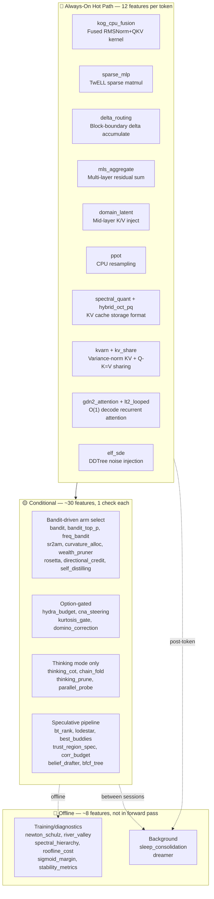
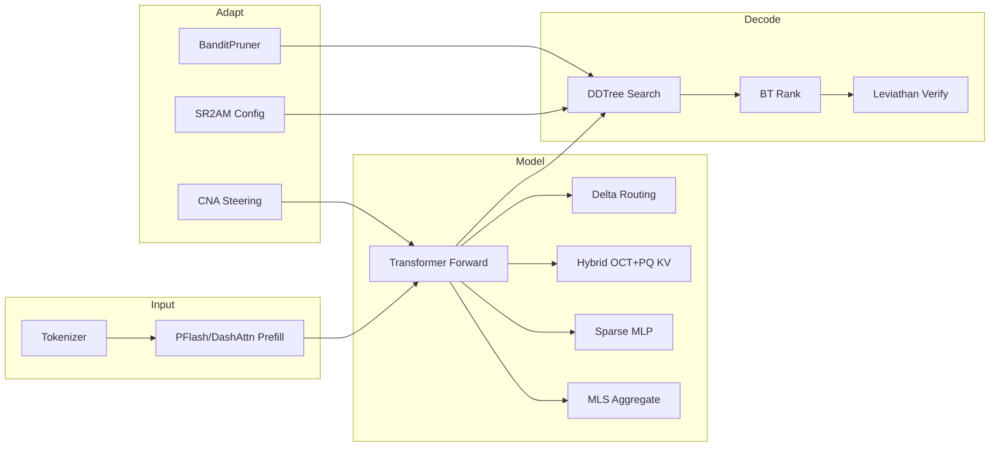
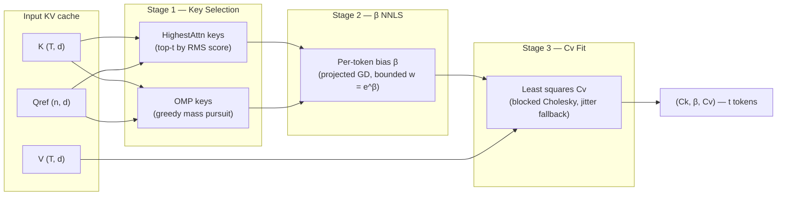
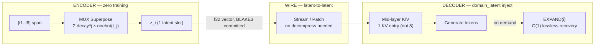
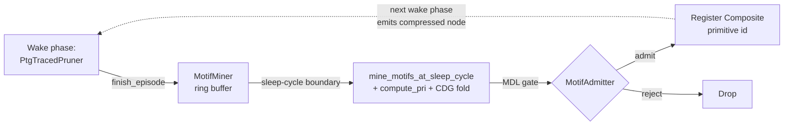
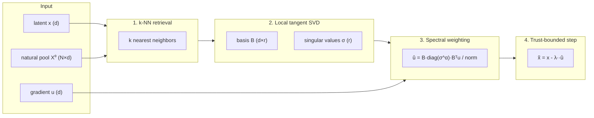

# KatGPT-RS

> **Boundary contract:** [BOUNDARY.md](BOUNDARY.md) — what lives here, what may depend on it, known drift.

A **GOAT-proved** neuro-symbolic micro-Transformer with speculative decoding, constraint pruning, and **578 feature flags (196 default-on, all GOAT-proved)** — built in Rust. Pure algorithms, zero side effects, MIT licensed.

Inspired by [Andrej Karpathy's microgpt](https://karpathy.github.io/2026/02/12/microgpt/).


## 🚀 Key Results

| Result | Number | Feature |
|--------|--------|---------|
| **TTFT Speedup** | **29×** (X16 compression) | MUX-Latent zero-training context compression |
| **KV Memory Reduction** | **93.8%** | MUX superposition fusion |
| **Prefill Seq Reduction** | **21×**, 100% NIAH retrieval | PFlash block-sparse prefill |
| **KV Rotation FMAs** | **64× fewer**, best MSE | Hybrid OCT+PQ codec |
| **RMSNorm Speedup** | **2.4×** | Kog CPU fusion kernel |
| **Sudoku Compression** | **7,079×** on Inkala's Hardest | Path-aware ConstraintPruner |
| **Bomber HL Score** | **+177** vs Random −55 | Adaptive intelligence arena proof |
| **NFSP/MCTS Duality** | **75%** vs MCTS 8% | Bandit-guided backward→forward search |
| **BoM Belief Sampling** | **+31.49pp** arena win rate (K=8 @ 1.87× step) | Single-pass K-hypothesis belief sampling |
| **Self-Advantage Gate** | **18× forward-pass reduction** (paper claim) | Dead-compute detector via pre/post log-ratio |
| **Temporal Derivative** | **4/4 fusion gates PASS** (HLA, δ-Mem, collapse, curiosity) | Dual fast/slow EMA surprise signal |
| **Triggered Injection** | **50% skips @ 0.63% quality delta** | Sigmoid-thresholded inject/skip hot-path gate |
| **KARC Trajectory Forecast** | **NRMSE 9.43e-4** at d_h=18_720 (Phase 5.1 K=8/M=8/R=2 λ=5e-2; threshold leg 10% short — stays opt-in) | Delay-basis ridge forecaster (Plan 308 Phase 5.1 λ-sweep, Issue 187 T7) |
| **Latent Field Steering** | **1.50× fear-axis shift**, ≤4.5e-5 leakage | Top-down direction-vector injection (Plan 309) |
| **Cross-Resolution Transport** | **0.9300 mean cos rank preservation** (16→256 tier transfer) | Train-small-deploy-large asymmetric-basis FUNCATTN (Plan 310) |
| **Manifold Walk Viability** | **100% playability** vs free 74.2% (paper's SMB headline reproduced); **7.10 ns/step** post-CSR (68.4× speedup, 14× under target) | Viable Manifold Graph safe-navigation (Plan 312, DEFAULT-ON) |
| **AC-Prefix Modelless G1** | **0.0 diff** (bit-identical to iterative-MLM) via `attends_dedup`; **27.258× speedup** vs 64 iterative forwards | §3.5 modelless unblock of AC-GPT arbitrary-conditional eval (Plan 313, DEFAULT-ON) |
| **Renoise-CE Self-Verifier** | **renoise=1.000 vs plurality=0.000** (100pp), **+30.5pp** CLR fusion (6× target) | Perturb-output + re-resolve + measure-drift, operator-agnostic (Plan 406, DEFAULT-ON) |
| **Velocity Field Ensemble** | **beats conformal-naive floor** (Plan 340); ridge-solved η weights regression-optimal | Algebraic combination of P frozen velocity fields (Plan 376, DEFAULT-ON) |
| **Local Branch Routing** | **+9pp to +26pp** quality gain (K=3 candidates), argmax **51ns** / sampled **69ns** | Post-candidate-set attention + relative routing (Plan 377, DEFAULT-ON) |
| **Set Attention (NPT half)** | **75.7µs/tick @ 100 NPCs** (6.6× headroom), G1–G5 PASS, G8 **CLOSED** by CLR-weighted sibling (+8.7pp ID, 3.88× amplification) | Permutation-equivariant sigmoid-gated cross-entity attention (Plan 354 + Plan 570 CLR-weighted sibling, DEFAULT-ON) |
| **Step Attribution Qualifier** | **81.6% drift reduction** (riir-ai PoC), 13ns aggregate @ W=64 | Δ≥0 commit gate (SkillAdaptor eq.8) + StepLocalizer (Plan 381, DEFAULT-ON) |
| **Heat Kernel Trajectory** | **exact at long horizons** vs O(T·dt²) Euler error | Single-shot DEC cochain field prediction via operator exponential (Plan 359, DEFAULT-ON) |
| **QMC Belief Sampling** | **G1–G6 ALL PASS** (Lattice/Stratified/Sobol drop-in for iid) | QuasiMoTTo QMC uniform sources in K-rollout paths (Plan 367, DEFAULT-ON) |
| **Zone Density Routing** | **+41.54% routing**, **99.1% cache hit**, 0 stale reads | Density-aware zone routing + papaya LRU cache (Plan 351, DEFAULT-ON) |
| **Tropical (max,+) Algebra** | **0.96× of simd_matvec** (NEON); 3/3 fusion gates PASS | Worst-case/bottleneck aggregation via tropical semiring (Plan 337, Super-GOAT) |
| **Cross-Resolution SIMD Encode** | **11–15× faster encode** at production scales (target was 1.5×) | Transposed basis layout + `simd_matmul_rows` replaces strided gather-dot (Plan 417) |
| **GDN Tree Verification** | **7.09× at T=128** (matches paper B200 GPU on CPU SIMD) | Rollback-free tree verify for delta-rule speculative trees via masked triangular solve (Plan 424) |
| **MANCE SVD Caching** | **~5× loop speedup** (skip ~9 of 10 SVDs in 10-round loop) | Tangent basis reuse keyed on k-NN neighbor indices (Plan 427) |
| **Newton-Schulz Blocked Matmul** | **1.37× faster** NS inv-sqrt r=64; per LoRA-Muon step 595µs→432µs | Rank-K blocked matmul eliminates per-dot call overhead (Plan 421) |

## 🏗️ Architecture

Matching the talos-vs-macbook reference model:

| Parameter | Value |
|-----------|-------|
| `vocab_size` | 27 (a–z + BOS) |
| `block_size` | 16 |
| `n_embd` | 16 |
| `n_head` | 4 |
| `mlp_hidden` | 64 (4×) |
| `n_layer` | 1 |
| `temperature` | 0.5 |
| `ModelArchitecture` | `NanoGpt`, `QwenDeltaNet` |
| `AttentionMode` | `Standard`, `SpKvQuant`, `DashAttn` |
| `WeightDtype` | `F32`, `F16`, `BF16` |

### Core Pipeline

```
LLM drafts logits → ConstraintPruner filters invalid → DDTree builds valid-only tree → Target verifies
```

### Key Traits

```rust
// From katgpt-core/src/traits.rs (signatures abbreviated)
pub trait ConstraintPruner: Send + Sync {
    fn is_valid(&self, depth: usize, token_idx: usize, parent_tokens: &[usize]) -> bool;
    fn batch_is_valid(&self, depth: usize, tokens: &[usize], parent_tokens: &[usize], out: &mut [bool]);
    fn propagate(&self, depth: usize, token_idx: usize, parent_tokens: &[usize]) { }
    fn manifold_score(&self, depth: usize, token_idx: usize, parent_tokens: &[usize]) -> f32 { 0.0 }
    fn constraint_vector(&self, depth: usize, parent_tokens: &[usize]) -> Vec<f32> { vec![] }
}

pub trait ScreeningPruner: Send + Sync {
    fn relevance(&self, depth: usize, token_idx: usize, parent_tokens: &[usize]) -> f32;
}

pub trait SpeculativeGenerator {
    type Condition;
    type Output;
    type Error;
    fn generate(&mut self, condition: &Self::Condition, rng: &mut fastrand::Rng) -> Result<Vec<Self::Output>, Self::Error>;
    fn generate_batch(&mut self, conditions: &[Self::Condition], rng: &mut fastrand::Rng) -> Result<Vec<Vec<Self::Output>>, Self::Error>;
}
```

Additional core traits in `katgpt-core/src/traits.rs`: `DominoPruner`, `CompletionHorizon`, `CollapseDetector`, `GameState`, `StateHeuristic`, `RolloutPolicy`, `LeoHead`, `AllGoalsUpdate`, `DualLeoMixer`, `AutocurriculumSampler`, `GenerativeConstraintPruner`, `QGradientOracle`, `PartialScorer`, `ProblemMutator`, `BestBuddyAligner`. Plus `DataGate` in `types.rs`, and `InferenceBackend` (prompt→string contract, Issue 580) in the dedicated `katgpt-core::prompt_backend` module — hoisted from `riir-game-sdk::gm::prompt` so multiple consumers (`riir-agents`, the SDK, future callers) share one trait; ships a `CannedResponseBackend` mock. See [`crates/katgpt-core/src/traits.rs`](crates/katgpt-core/src/traits.rs) + [`crates/katgpt-core/src/prompt_backend.rs`](crates/katgpt-core/src/prompt_backend.rs) for full signatures.

### Routing & Conditioning

- **Prompt Router** — `KeywordRouter` scores prompt against domain keywords, `ExpertRegistry` selects `ScreeningPruner` + LoRA. `InferenceBackend` trait + `CpuBackend` for backend abstraction.
- **TriggerGate** — Adaptive tier promotion: CPU → GPU → ANE based on workload complexity.
- **Embedding Router** — Three-tier fallback: embedding search → domain classify → keyword (local).
- **Bidirectional Prefill** — Prompt tokens attend to ALL other prompt tokens (no causal mask during prefill).
- **Modality LoRA Switching** — `reader_lora` active during prefill, `writer_lora` active during decode. Reference swap, zero data movement.
- **PPoT** — Logit-parameterized CPU resampling on failure. Zero overhead on success path.

### Crate Dependency DAG

The workspace has **27 in-tree crates** (plus the root) organized in three
layers: shared leaves (depend on `katgpt-types` or nothing), `katgpt-core`
(traits + cognitive kernels, depends on leaves), domain stacks (depend on
`katgpt-core` + other domain crates), and the root crate (`katgpt-rs`) which
is the feature-aggregation surface that wires every domain crate into the
transformer runtime via `ForwardContext`. See `.proposals/003_src_consolidation_master.md` for the
full Phase 0–12 consolidation history. Phase 12 (Plans 378–404) completed
the substrate-extraction sweep; Issue 121 (2026-07-09) collapsed the last
6 shim folders into inline `pub mod` blocks. Only training code + benchmark
tooling + `ForwardContext` glue remain permanently root-resident.

```mermaid
graph TD
    subgraph Leaves["Leaves (depend on katgpt-types or nothing)"]
        types["katgpt-types<br/>(Config, Rng, SIMD)"]
        hla["katgpt-hla<br/>(HLA substrate)"]
        tokenizer["katgpt-tokenizer<br/>(BPE, ConvexTok)"]
        dec["katgpt-dec<br/>(DEC operators)"]
        microbelief["katgpt-micro-belief<br/>(BeliefKernel, BoMSampler)"]
        personality["katgpt-personality<br/>(sigmoid composition)"]
        sense["katgpt-sense<br/>(NPC sense composition)"]
        sleep["katgpt-sleep<br/>(consolidation)"]
        validator["katgpt-validator<br/>(partial parser, syn pruner)"]
        percepta["katgpt-percepta<br/>(transformer-VM, zero katgpt deps)"]
        proofcert["katgpt-proof-cert<br/>(GOAT proof certificates)"]
        deprecated["katgpt-deprecated<br/>(exiled losers)"]
    end
    subgraph Core["Core layer"]
        core["katgpt-core<br/>(traits, attention primitives, cognitive kernels)"]
    end
    subgraph Domain["Domain stacks"]
        transformer["katgpt-transformer<br/>(weights, packing, mbu, tf_loop, swir, dense_mesh)"]
        forward["katgpt-forward<br/>(ForwardContext top tier)"]
        quant["katgpt-quant<br/>(KV codecs)"]
        spectral["katgpt-spectral<br/>(eigenbasis)"]
        attn["katgpt-attn<br/>(GDN2, CHIAR, RAT+, EGA)"]
        attnmatch["katgpt-attn-match<br/>(MaxSim rerank)"]
        kv["katgpt-kv<br/>(SP-KV, cache prune, segment ckpt)"]
        spec["katgpt-speculative<br/>(DDTree, DFlash, spechop)"]
        pruners["katgpt-pruners<br/>(bandit, screening, closure wire)"]
        band["katgpt-band<br/>(band conditioner, collider pruner)"]
        sparse["katgpt-sparse<br/>(SOPTV task vector, SPLAT)"]
        claim["katgpt-claim<br/>(claim rubric, CLR)"]
        ruliology["katgpt-ruliology<br/>(Wolfram ruliology)"]
        backend["katgpt-backend<br/>(CPU/ANE/GPU inference backends)"]
    end
    root["katgpt-rs (root)<br/>(runtime, feature surface)"]

    hla --> types
    dec --> types
    microbelief --> types
    personality --> types
    sense --> types
    sleep --> types
    validator --> types
    core --> types
    core --> hla
    core --> dec
    core --> microbelief
    core --> personality
    core --> sense
    core --> sleep
    transformer --> core
    forward --> core
    forward --> hla
    forward --> pruners
    forward --> spec
    forward --> transformer
    forward --> types
    quant --> core
    quant --> transformer
    spectral --> core
    spectral --> transformer
    spectral --> types
    attn --> core
    attn --> forward
    attn --> kv
    attn --> pruners
    attn --> spectral
    attn --> transformer
    attnmatch --> core
    attnmatch --> kv
    kv --> core
    kv --> spectral
    kv --> types
    spec --> core
    spec --> kv
    spec --> pruners
    spec --> transformer
    spec --> types
    pruners --> core
    pruners --> percepta
    pruners --> spec
    pruners --> transformer
    pruners --> types
    band --> core
    sparse --> core
    sparse --> band
    sparse --> spectral
    claim --> core
    ruliology --> core
    ruliology --> pruners
    backend --> forward
    backend --> transformer
    backend --> types
    validator --> core
    validator --> tokenizer
    deprecated --> core
    root --> core
    root --> transformer
    root --> forward
    root --> quant
    root --> spectral
    root --> attn
    root --> attnmatch
    root --> kv
    root --> spec
    root --> pruners
    root --> band
    root --> sparse
    root --> claim
    root --> ruliology
    root --> backend
    root -.optional.-> proofcert
    root --> validator
    root --> tokenizer
    root --> percepta
    root --> microbelief
    root --> personality
    root --> sense
    root --> dec
    root --> deprecated
```



**Dependency rules:**
- Arrows point from consumer → dependency. Dashed = optional feature-gated dep.
- **Leaf crates** depend on `katgpt-types` (or nothing, for `katgpt-percepta`
  and `katgpt-proof-cert`). `katgpt-core` consumes the leaf substrate crates
  (`katgpt-hla`, `katgpt-dec`, `katgpt-micro-belief`, `katgpt-personality`,
  `katgpt-sense`, `katgpt-sleep`) and re-exports them as `katgpt_core::*`.
- `katgpt-core` attention primitives (`attention`, `parallax_attn`, `set_attention`,
  `funcattn`) live in core and are NOT in `katgpt-attn` — they can't move up
  without inverting the DAG.
- HLA substrate lives in `katgpt-hla` (leaf); `katgpt-core` re-exports it as
  `katgpt_core::hla`. The root's `pub mod hla { ... }` in `lib.rs` is pure
  composition glue (Issue 121 collapsed the `src/hla/` folder into an inline
  module).
- `katgpt-forward` is the top-tier domain crate — it depends on `katgpt-core`,
  `katgpt-transformer`, `katgpt-pruners`, `katgpt-speculative`, `katgpt-hla`,
  and `katgpt-types`. `katgpt-attn` and `katgpt-backend` depend on `forward`.
- Phase 11 (Plans 378–382, 2026-07-04) added 5 new domain crates
  (`katgpt-band`, `katgpt-validator`, `katgpt-sparse`, `katgpt-claim`,
  `katgpt-ruliology`) plus `katgpt-backend` (Issue 413, 2026-07-08) and
  root shims preserving every historical `katgpt_rs::*` path. Phase 12
  (Plans 383–404) finished the substrate sweep; Issue 121 (2026-07-09)
  collapsed the last 6 shim folders into inline `pub mod` blocks. Only
  training code + benchmark tooling + `ForwardContext` glue remain
  permanently root-resident.
- Back-compat invariant: every move keeps `pub use katgpt_X as Y` in `lib.rs`
  (or inline `pub mod X { pub use katgpt_X::*; ... }` post-Issue-121) so
  existing `katgpt_rs::*` paths resolve.

## 🔄 E2E Inference Flow — Default GOAT Stack

The default production stack has **196 GOAT-proved default-on features** (578 total flags), but they don't all run on every token. The architecture uses **layered gating** — most features are bandit-driven, Option-gated, or compile-time-only.



### 🔴 Always-On Hot Path (12 Features)

These execute unconditionally on every token — they replace kernels, formats, or accumulate state:

| Feature | What | Why Always-On |
|---------|------|---------------|
| **`sparse_mlp`** | Skip dead ReLU in w2 matmul | Replaces dense matmul kernel |
| **`kog_cpu_fusion`** | RMSNorm gamma folding + QKV interleaving | Fused kernel replacement |
| **`delta_routing`** | Cross-layer residual delta routing at block boundary | Accumulates per-layer, routes at block edge |
| **`mls_aggregate`** | Average last K layer residuals before LM head | Structural blend into final logits |
| **`domain_latent`** | Mid-layer K/V injection | `Option`-gated inject at `n_layer/2` |
| **`spectral_quant`** | Calibrated eigenbasis + water-fill KV codec | Storage format, not conditional |
| **`hybrid_oct_pq`** | OCT triplet + PQ 2D Givens KV compression | Replaces quantization codec |
| **`kvarn`** | Variance-normalized KV cache quantization | Cache format when selected |
| **`kv_share`** | Q-K=V projection sharing, 50% KV reduction | Weight merge at load time |
| **`gdn2_attention`** | Gated DeltaNet-2 O(1) decode | Replaces KV cache with fixed state matrix |
| **`lt2_looped`** | Weight-shared T-pass loop + AHLA | Changes forward function signature |
| **`elf_sde`** | Logit-normal noise injection for DDTree diversity | Applied during draft tree build |

### Simplified Inference Flow



### Input Layer

| Component | What | Gate |
|-----------|------|------|
| **BPE Tokenizer** | Train/encode/decode | always |
| **PFlash** | Block-sparse speculative prefill, 21× seq reduction | always |
| **DashAttention** | α-entmax (1.5) adaptive routing replaces fixed top-k | `dash_attn` |
| **RTPurbo** | Head-wise retrieval/local classification, dynamic top-p | `rt_turbo` |
| **Budget Adaptation** | Compression-adaptive DDTree budget [0.5×, 2.0×] | `budget_adaptation` |

### Model Layer

| Component | What | Gate |
|-----------|------|------|
| **Sparse MLP** | Skip dead ReLU neurons in w2 matmul | `sparse_mlp` |
| **Delta Routing** | Cross-layer residual delta routing at block boundary | `delta_routing` |
| **Hybrid OCT+PQ** | Default KV codec — OCT triplet + PQ 2D Givens, best MSE | `hybrid_oct_pq` |
| **SpectralQuant** | Calibrated eigenbasis + water-fill (secondary) | `spectral_quant` |
| **MLS Aggregate** | Average last K layer residuals before LM head | `mls_aggregate` |
| **Domain Latent** | Mid-layer K/V injection | `domain_latent` |
| **PPoT** | CPU logit resampling at high-entropy positions | `ppot` |

### Attention (O(1) alternatives)

> **Note:** These are **opt-in alternative forward paths** (`forward_gdn2()`, `forward_raven()`, `forward_looped()`). The default `forward()` → `forward_base()` uses standard O(N) softmax attention.

| Component | What | Gate |
|-----------|------|------|
| **GDN2** | Gated DeltaNet-2 — O(1) decode, constant state per head | `gdn2_attention` |
| **Raven RSM** | Fixed-slot Top-K routing memory, frozen unselected slots | always compiled, opt-in `forward_raven()` |
| **HLA/AHLA** | Higher-order Linear Attention — O(1) prefix stats | `hla_attention` |
| **LT2 Looped** | Weight-shared T-pass loop, hybrid SDPA+AHLA | `lt2_looped` |
| **TF Loop** | Training-free ODE-motivated sub-stepping | `tf_loop` |
| **DMax SPD** | Soft parallel decode, hybrid token/mask embeddings | `dmax_spd` |
| **FlashAR Consensus** | Dual-path ternary thermal routing | `flashar_consensus` |

### Decode Layer

| Component | What | Gate |
|-----------|------|------|
| **DDTree** | Best-first tree from marginal log-probs | always |
| **LeviathanVerifier** | p/q rejection sampling, identical output distribution | always |
| **BT Rank** | Bradley-Terry pairwise ranking, +10.6pp over pointwise | `bt_rank` |
| **BanditPruner** | UCB1/ε-greedy/Thompson adaptive ScreeningPruner | `bandit` |
| **ELF SDE** | 10-22× path diversity via logit-normal noise | `elf_sde` |
| **Lattice Deduction** | α-intersection pruning + conflict detection | `lattice_deduction` |
| **PhraseBoost** | Context trie phrase boosting for DDTree | `phrase_boost` |
| **Parallel-Probe** | Consensus-based parallel branch control | `parallel_probe` |

### Infrastructure

| Component | What | Gate |
|-----------|------|------|
| **SR²AM Configurator** | Per-turn planning regulation (PlanNew/Extend/Skip) | `sr2am_configurator` |
| **Data Gate** | Task-level filtering before solver | `data_gate` |
| **CNA Steering** | Contrastive Neuron Attribution + runtime modulation | `cna_steering` |
| **Deep Manifold** | L2/KL fixed-point residual scoring | `deep_manifold` |
| **Federation** | Symmetric KL coupling between domain experts | `federation` |
| **SimpleTES** | RPUCG graph-based bandit loop | `tes_loop` |
| **Stability Metrics** | P50/P99/CV per-step latency instrumentation | `stability_metrics` |
| **PlasmaPath (Hot)** | Bit-plane ternary SIMD matvec, 1.71 bits/weight — the Hot-tier CPU path (Issue 145 reclassified binary to Plasma, ternary to Hot) | `plasma_path` |
| **BinaryPlasma (Plasma)** | Single bit-plane ±scale SIMD matvec, 1.125 bits/weight — the fastest tier (opt-in; 1.22× faster + 1.82× smaller than ternary) | `binary_plasma` |
| **MoA Inference** | Token-adaptive Mixture-of-Activations SwiGLU | `moa_inference` |
| **Newton-Schulz** | Cubic fixed-point orthogonalization + Muon momentum | `newton_schulz` |
| **Spectral Hierarchy** | Eigenspace alignment, Haar wavelets, Cauchy interlacing | `spectral_hierarchy` |
| **Roofline Cost** | GPU operator runtime prediction (~5µs CPU) | `roofline_cost` |
| **Kog CPU Fusion** | RMSNorm gamma folding + QKV interleaving | `kog_cpu_fusion` |
| **PEIRA Distill** | Collapse-free inter-view regressor alignment | `peira_distill` |
| **ILC Distill** | Synonym-aware DDTree pruning via offline k-means | `ilc_distill` |
| **Hydra Budget** | Emergent self-repair layer skipping | `hydra_budget` |
| **Trigger Gate** | CPU/GPU/ANE tier promotion via QPS/latency/queue monitoring | `inference_router` |
| **FreqBandit** | Oscillatory spectral bandit — cyclic pattern detection → adaptive speculative decode | `freq_bandit` |

📖 **Full GOAT audit table** with research source, real gain, and replaced feature: See [`.docs/01_orientation/overview.md`](.docs/01_orientation/overview.md).

### GOAT-Proved Additions (Plans 225–427+)

| Feature | Plan | GOAT | Key Gain |
|---------|------|------|----------|
| **Posterior-Guided Pruner Evolution** (`posterior_evolution`) | 239 | 8/8 ✅ | Bayesian precision-gated lifecycle actions (Patch/Split/Compress/Retire), 258ns overhead |
| **Spectral Irrep Pruner** (`spectral_pruner`) | 246 | ✅ | Spectral flatness detection for converged logit distributions, +3.6% overhead only |
| **Spectral Budget Router** (`spectral_budget`) | 254 | 19/19 ✅ | Layer-adaptive NS depth + rank-p spectral truncation (opt-in — GOAT-gated, not in default)
| **Regime Transition** (`regime_transition`) | 215 | 8/8+4/4 ✅ | Self-revising discovery, -0.3% overhead vs real decode |
| **SubstrateGate** (`substrate_gate`) | 216 | ✅ | Inference-time capability substrate routing via MLP masks |
| **Critical Interval Gate** (`critical_interval_gate`) | 222 | ✅ | Entropy-triggered solver switch, zero cost (entropy already computed) |
| **LLMExecGuard** (`llmexec_guard`) | 223 | ✅ | Entropy-driven verification budgeting, zero cost when guard holds |
| **Outlier-Aware Quant Guard** (`outlier_guard`) | 224 | ✅ | KS-test outlier detection for weight matrices |
| **EGCS** (`egcs`) | 206 | ✅ | Episode-guided constraint synthesis from successful translations |
| **Three-Mode Router** (`three_mode_router`) | 211 | ✅ | Neuro-symbolic bandit: Direct/CoT/Symbolic per-query routing |
| **Breakeven Routing** (`breakeven_routing`) | 250 | 7/7 ✅ | 49% wallclock savings on long sequences, ~9ns overhead |
| **DEC Operators** (`dec_operators`) | 251 | Foundational ✅ | Discrete Exterior Calculus on cell complexes, conservation-guaranteed |
| **Cubical Topology** (`lattice_operad`) | 252 | Foundational ✅ | IntervalPruner + CubicalNerve + LatticeOpernad composition |
| **Segment Checkpoint** (`segment_checkpoint`) | 226 | ✅ | Cached KV segment checkpoints at segment boundaries |
| **RCD Residual** (`rcd_residual`) | 258 | ✅ | Entropy-weighted residual context injection for D2F |
| **Spec Pruner** (`spec_pruner`) | 259 | ✅ | Modelless spec-to-constraint O(1) RoaringBitmap compilation |
| **Epiplexity Bandit** (`epiplexity_bandit`) | — | ✅ | Epistemic perplexity bandit for domain-aware routing |
| **CADDTree Budget** (`caddtree_budget`) | 219 | ✅ | Compositional adaptive DDTree budget allocation |
| **Static Cal Tables** (`static_cal_tables`) | 227 | ✅ | Pre-computed quantization calibration, zero inference cost |
| **Targeted Precision** (`targeted_precision`) | 227 | ✅ | Per-head bit allocation from weight statistics |
| **Modality Pruned Load** (`modality_pruned_load`) | 227 | ✅ | Pipeline pruning for modality-specific context loading |
| **Precision Aware Draft** (`precision_aware_draft`) | 227 | ✅ | Quantization-aware speculative draft scoring |
| **Async QDQ Overlap** (`async_qdq_overlap`) | 227 | ✅ | Overlapped quantize-dequantize with compute |
| **Sparse Off-Principal Task Vector** (`sparse_task_vector`) | 264 | G1–G2 ✅ | OPD-grounded sparse delta format, 2.9–5.7× storage reduction vs dense LoRA |
| **Off-Principal Retrieval** (`off_principal_retrieval`) | 264 | G3–G4 ✅ | ≥99% principal energy removed, off-principal beats cosine top-1 |
| **Spectral-Concentration Adaptive Rank** (`spectral_rank`) | 264 | G5–G6 ✅ | ≥30% avg rank reduction via OPD spectrum concentration |
| **Module-Energy Compute Routing** (`module_energy_route`) | 264 | G7–G8 ✅ | Paper FFN profile match (Plasma/GPU/ANE/SIMD), monotone QPS routing |
| **Band Conditioner** (`band_conditioner`) | 265 | G0a/G0b ✅ | Band conditioning set + Fisher-z CI test primitives for task-relevant identifiability (arXiv 2605.12733) — band-set exact match to paper Fig 2; Fisher-z power ≥90% at n=1000 α=0.05. Default-on (T5.3, 2026-07-02). |
| **SPLAT Specialist Projection** (`specialist_projection`) | 265 | G4–G6 ✅ | Specialist latent projection (Fusion B) — ≥30% hidden-dim reduction at parity, mask discovery ≤ d_hidden samples, MSA rescue at 50% density. Default-on (T5.3, 2026-07-02). |
| **CCCP Collider-Consistency Pruner** (`collider_consistency`) | 265 | G7–G9 ✅ | Collider-consistency ConstraintPruner for DDTree (Fusion C) — dead-branch rejection ≥90%, expansion reduction ≥25%, no-task overhead <5ns. Default-on (T5.3, 2026-07-02). |
| **Gauge-Invariant Adapter Composition** (`gauge_invariant`) | 270 | 17/17 ✅ | LoRA-Muon NS inv-sqrt + gauge rebalance + compose, 4609%→0% error |
| **CHIAR Chiaroscuro Attention** (`chiaroscuro`) | 269 | 9/9 ✅ | Per-token DCT spectral entropy KV strategy (3.03× compression), operator routing, collapse discovery |
| **Attention Matching** (`attn_match`) | 271 | 9/9 ✅ | Modelless KV compaction `(K,V)→(Ck,β,Cv)`: β-recovery 1e-6, Cv Frobenius 0.0, 3.01× SIMD, blocked Cholesky (32×32), adaptive router (scalar/SIMD/rayon/GPU/ANE) |
| **Manifold Power Iteration MoE Router** (`manifold_power_iter_router`) | 279 | 9/9 ✅ | One-shot router-row conditioning at snapshot swap, sub-ms swap (0.076ms N=8 D=256), byte-identical determinism |
| **Quantile Balancing MoE Router** (`quantile_balance_router`) | 455 | G1–G8 12/12 ✅ + Phase 3 Case C ✅ | One-shot per-expert bias β at snapshot swap via alternating-coordinate descent on the balanced-assignment LP (Su blog + Marin 32B validation). MaxVio 3.000→0.0625 (48× at M=64), 0.131ms swap (N=8 M=256). Phase 3 head-to-head vs MPI: Case C — composed pipeline strictly Pareto-dominates either alone (λ 0.65→0.99 from MPI, MaxVio 1.84→0.00 from QB on orthogonal axes). **DEFAULT-ON** since Plan 455 Phase 3 (2026-07-17) |
| **Temporal Derivative Kernel** (`temporal_deriv`) | 277 | 4/4 fusions ✅ | Dual fast/slow EMA surprise signal — state-vector companion, surprise-gated writes, collapse detection, curiosity signal |
| **Triggered Injection Gate** (`triggered_injection`) | 278 | G1/G2/G3/G8 ✅ | Sigmoid-thresholded inject/skip gate — 50% skips w/ 0.63% quality parity in saturated regime |
| **FaithfulnessProbe** (`faithfulness_probe`) | 278 | G1/G2/G8 ✅ | Causal intervention diagnostic — 100%/100% detection, IG surrogate Spearman ρ=1.0, audit cadence |
| **SmearClassifier** (`smear_classifier`) | 298 | G1/G2/G3 ✅ | Ternary (CoherentSingle/TokenSmear/SequenceSmear) latent-mass vocabulary extending Plan 278 — SequenceSmear/TokenSmear unfaithfulness ratio 2.11×, k=8 d=32 at 107.6 ns |
| **Salience Tri-Gate** (`salience_tri_gate`) | 303 | 4/4 ✅ | 3-way per-tick emit gate (Speak / Silent / Delegate) with silence as a first-class variant, two stacked sigmoids (never softmax), zero-allocation hot path. `decide()` **9.11 ns** for D=8 (target <50ns, ~5 ns over single-sigmoid), `decide_batch()` **120.6 M/s** for D=8 N=1000 (target ≥50M). Default-on (Plan 303 Phase 5, 2026-06-23). |
| **Engram** (`engram`) | 299 | G1/G2/G4 ✅ (G6 deferred) | Hash-addressed sigmoid-fused static pattern memory — N-gram → multi-head hash → O(1) lookup → sigmoid gate → residual fuse. **48 ns/retrieval**, Spearman ρ=1.0. Opt-in pending G6 (effective-depth) in riir-ai |
| **CS-KV-Importance Probe** (`cs_kv_probe`) | 280 | G1/G2/G3 ✅ | Compressed-sensing KV-group importance probe + density-budget interpolator, sigmoid-compatible |
| **BoMSampler** (`bom_sampling`) | 281 | G1/G2/G3 ✅ | K-hypothesis single-pass belief sampling — K=8 at 1.87× step, **+31.49pp** arena win in riir-ai Plan 314 |
| **Self-Advantage Gate** (`self_advantage_gate`) | 283 | 4/4 ✅ | Dead-compute detector via `log π+(a) − log π̂(a)` — paper 18× forward-pass reduction, vocab ≤ 128 |
| **CLR Claim-Level Reliability** (`clr`) | 284 | ✅ | Runtime CLR — sigmoid projection vote over claim embeddings, self-adaptive test-time scaling |
| **Sink-Aware Attention** (`sink_aware_attn`) | 287 | G1/G2 cached ✅ | NOP/Broadcast classifier + dual-policy sigmoid gate — cache cadence=16 ≤5% steady-state |
| **ICT Branching Detector** (`ict_branching`) | 294 | G1/G3/G4/G5/G6/G10 ✅ | `collision_purity β(π) = Σ π²`, JS-divergence novelty, BranchingDetector — ρ(H₁,JS)=0.065 (Super-GOAT proceeds) |
| **CCE Moderator** (`cce_moderator`) | 295 | G1/G2/G3 ✅ | LP-CCE solver + Bregman primal-dual iterator (arxiv 2606.20062). Chicken CCE welfare +37.5% over Nash; designer steering demo shows two Γ₀ → two different CCEs. DEFAULT-ON after Plan 295 + Plan 300 T4.3b GOAT (homogeneous equivalence + regret transfer + heterogeneous primal-dual convergence + 16p 33.97ms < 50ms target). |
| **MicroRecurrentBeliefState** (`micro_belief`) | 276 | G1.1–G1.4 ✅ | BeliefKernel trait unifying attractor + leaky-integrator families — G2 (attractor coherence) deferred |
| **Algorithmic-Probability Sampler** (`complexity_prior_sampler`) | 305 | G1+G2 ✅ | Levin-Search variant for modelless inference — `sigmoid(-α·K̃(x) - β)`-weighted candidate sampling with pluggable K̃ proxies (RLE / Shannon entropy / L1). G1 safety 5/5 landscapes PASS; G2 exponential speedup: RLE **92275×** + Entropy **18455×** stretch on low-K optimum (L1 honest-negative on sparse byte encoding, documented domain mismatch). Per-candidate sigmoid **never softmax**. Default-on (Plan 305 Phase 2, 2026-06-23). |
| **Forensic Watermark** | Moved to riir-ai | Recipe impl relocated to Plan 322 (honeypot OPSEC) |
| **Depth-Invariance Diagnostic** (`depth_invariance`) | 306 | G1/G2/G3 ✅, G4 (re-spec) ✅ | Root-cause attention-drift classifier (`DepthInvariant` / `DepthSpecificRefinement` / `Collapsed`) + `MagnitudeRegularizedResidual` fix for owned kernels. G2 reproduces paper Figure 10 on random-init `BeliefDrafter`; G3 negative control on `micro_belief/attractor` classifies as `DepthInvariant`. SIMD inner-loop via `simd::simd_sum_sq_quartic`. Zero runtime cost unless invoked. Default-on (T7.4, 2026-06-23). |
| **Claim Rubric Runtime** (`claim_rubric`) | 307 | 17/17 round-trip ✅ | L1/L2/L3 evidence-ladder validator — executable rubric for probe/steering claims. Vocabulary must match evidence ("causally controls" requires L3; "reads" is L1-safe). 17/17 Phase 2 round-trip + 1/1 GOAT gate green. Meta-discipline primitive, zero runtime cost unless invoked. Default-on (T3.3, 2026-06-23). |
| **Closed-Unit Compaction Gate** (`closed_unit_compaction`) | 333 | 7/7 ✅ | Generic rubric-gated trajectory compaction primitive (SelfCompact, arxiv 2606.23525) — fires at structurally-safe moments (closed-unit ∧ summarizable ∧ progress ∧ ¬stuck). evaluate() **8.91 ns** (target <50ns), **112.9 M/s** (target >=50M). **Super-GOAT**: trajectory compaction and shard freeze are the same primitive (G7 proven structurally). Default-on (Phase 6, 2026-06-25). |
| **Sigmoid-Graded Reject Confidence** (`sigmoid_graded_reject`) | 310 T1 | T3.2 6/6 + T3.1 5/5 ✅ | Tolerant soft-reject relax-and-retry on `ConstraintPruner` — default `reject_confidence()` reproduces `is_valid()` bit-identically (zero-behavior-change); sigmoid-graded impl + `soft_reject_with_relax` pipeline routes borderline candidates through relaxation. HarnessBridge Table 7: tolerant > strict because `false_reject_cost > false_pass_cost`. Default Δ **0.000ns**, graded **+3.734ns**, batch **2647M/s**, pipeline **+0.241ns**; tolerant FR **1.69%** vs strict **5.49%** (Δ −3.80pp), net reward **+603.3**, precision ratio **0.9456**. Zero runtime cost unless caller invokes `soft_reject_with_relax`. Default-on (T4.1, 2026-06-26). |
| **CausalHeadImportance** (`causal_head_importance`) | 358 | G1/G2/G3/G4 ✅ | Causal-intervention head scorer (HydraHead arXiv:2606.20097) — activation patching (Eq 10) + path patching (Eq 11) + span-level logit-diff readout (Eq 9) + cross-capability fusion (Eq 12). Strictly stronger than RTPurbo's attention-mass calibration: G2 bystander discrimination Jaccard **1.000 vs 0.000** (causal invariant, attention-mass collapses). G3 partition **≤ 2×** attention-mass (faster at n≥64). Plus `ScaleNormalizedFusion` (Eq 13–14, currently unused). **Opt-in** — `CalibrationMode::AttentionMass` stays default (causal score production is ~10–100× costlier); use `CausalNecessity` for the long-context-extreme bystander regime. |
| **Misalignment Indicator Probe Bank** (`indicator_probe_bank`) | 320 | G1–G7 ✅ | Structured N-direction cognitive-indicator detector (arxiv 2606.24251 Zhou et al.) — BLAKE3-committed direction vectors projected via dot-product + sigmoid, OR-fused into one firing label. G1 per-indicator AU-ROC **1.000**, G2 OR-fusion TPR 1.000/FPR 0.041, G3 cascade **100× FPR reduction** at 0pp cost, G4 **53.9 ns** (N=8, D=72) + 0 allocs, G5 similarity block ARI **1.000**, G6 feature-off clean, G7 wire tamper-evident. `indicator_similarity` also default-ON; `indicator_cascade` opt-in (consumer-crate verifier territory). Default-on (Plan 320 Phase 5, 2026-06-25). |
| **Tropical (max,+) Algebra** (`tropical_algebra`) | 337 | Super-GOAT ✅ | (max,+) tropical semiring matvec + DEC wrappers for worst-case/bottleneck aggregation (arxiv 2403.04807). D=64 matvec **0.96× of simd_matvec** (NEON); 3/3 fusion gates PASS. Default-on. |
| **Temp-Loss Fingerprint Selector** (`temp_loss_fingerprint`) | 341 | G1 ✅ | Perturbed-loss-vector diversity selector via Lipschitz gradient bounds (arxiv 2606.26797). G1 **15.44× diversity ratio**; select_diverse_subset 130µs (<1ms); cross-repo neuron-db gain +0.1672. Default-on. |
| **Zone Density Routing** (`zone_density_routing`) | 351 | G5a/b/c ✅ | Density-aware zone routing: classify + outer-first schedule + papaya LRU cache with 3 invalidation rules. G5a **+41.54% routing**, G5b **99.1% cache hit**, G5c 0 stale reads. Default-on. |
| **Set Attention (NPT half)** (`set_attention`) | 354 | G1–G5 ✅ (G8 CLOSED) | Permutation-equivariant sigmoid-gated cross-entity set attention (arxiv 2106.02584). Production **75.7µs/tick @ 100 NPCs** (6.6× headroom). G8 collective inference closed by the CLR-weighted sibling (Plan 570). Default-on. |
| **CLR-Weighted Set Attention** (`clr_weighted_set_attention`) | 570 | G1/G2/G4/G8 ✅ | Reliability-weighted sibling of `set_sigmoid_attention_into` — `output_i = h_i + (γ/Σ r_j)·Σ α_ij·r_j·(v_j−h_i)`, uniform `r_j=1` reduces bit-identically to plain SA. CLR `^M` reliability gate converts averaging into amplification: **+8.7pp** identification accuracy + **3.88×** aggregate amplification over plain SA on the N=64 crowd threat-detection fixture (Issue 575 PoC). Default-on. |
| **Heat Kernel Trajectory** (`heat_kernel_trajectory`) | 359 | All 5 phases ✅ | Single-shot DEC cochain field prediction via operator exponential (arxiv 2606.27364) — exact at long horizons vs O(T·dt²) Euler error. Default-on (katgpt-dec). |
| **QMC Belief Sampling** (`qmc_sampling`) | 367 | G1–G6 ✅ | QuasiMoTTo — QMC uniform sources (Lattice/Stratified/Sobol) + arithmetic-coding descend, drop-in for iid in K-rollout paths (arxiv 2607.01179). 850/850 lib tests, 26 bootstrap tests. Default-on. |
| **Manifold Bandit Latent Task Tree** (`manifold_bandit`) | 370 | G1/G3/G4/G5 ✅ | LatentTaskTree + HierarchicalThompsonSampler + BayesianFilterArm (arxiv 2606.19750). G1-real **0.740 ratio**; R279 N≥d phase gate ships opt-in (+11% convergence). Default-on. |
| **Mean-Field Regime Classifier** (`mean_field_regime`) | 371 | G1–G5 ✅ | MeanFieldOverlap + HopfBoundary + RegimeClassifier (Static/NSO/IS/GLC) — crowd oscillation regime classifier (arxiv 2606.30366). PoC 25/25 (4/4 regimes). Default-on. |
| **Velocity Field Ensemble** (`velocity_field_ensemble`) | 376 | G1–G4 ✅ | Algebraic combination of P frozen velocity fields via ridge-solved η weights (arxiv 2602.20070). **Beats conformal-naive floor** (Plan 340). Heterogeneous-D variant opt-in. Default-on. |
| **Local Branch Routing** (`local_branch_routing`) | 377 | G1–G6 ✅ | PostCandidateRouter trait + DotProduct/ColliderAdapters (arxiv 2606.25354). Samples K candidates, forwards, set-attends, commits via relative routing. PoC **+9pp to +26pp** quality gain; argmax **51ns** + sampled **69ns** at K=3 D=64. Default-on. |
| **ANE Roofline Cost Model** (`ane_roofline`) | 379 | G1/G2/G4 ✅ | ANE-aware roofline cost model with third axis (working-set size), M1–M5 peaks (arxiv 2606.22283). G1 ±30% on 4 ref shapes; G4 p50 <1µs. Refines NpcBrainRouter's hardcoded threshold. Default-on. |
| **Step Attribution Qualifier** (`step_attribution_qualifier`) | 381 | G1/G2/G4 ✅ | StepAttributionQualifier — Δ≥0 commit gate (SkillAdaptor eq.8) + StepLocalizer trait fusing Localize+Link (arxiv 2606.01311). G1 14/14, G2 **81.6% drift reduction** (riir-ai PoC), G4 **13ns** aggregate @ W=64. Default-on. |
| **Spherical Geodesic Steering** (`spherical_steering`) | 405 | G1–G5 ✅ | Geodesic Slerp rotation of latent vector toward unit-norm target + vMF confidence gate; norm-preserving on S^{d-1} (arxiv 2602.08169). Phase 5 (F1 fusion) deferred. Default-on. |
| **Renoise-CE Self-Verifier** (`renoise_ce`) | 406 | G1/G2/G4/G5 ✅ | Perturb-completed-output + re-resolve + measure-drift self-verifier, operator-agnostic, no labels/verifier head (arxiv 2606.29150). G1 renoise=**1.000** vs plurality=0.000 (100pp); G2 CLR fusion **+30.5pp** (6× target); G4 0 allocs, G5 36µs. Default-on. |
| **Sheaf-ADMM Coordination** (`sheaf_admm`) | 407 | G1–G6 ✅ | Three-state primal/consensus/dual ADMM on a cellular sheaf (arxiv 2605.31005, ICML 2026). G1 DEC identity `‖F x‖∞=3.26e-8`, G4 **1.808 µs** (K=100, d_v=8, d_e=5, T=5), G5 zero-alloc, G6 bit-exact determinism. Generic math operator — the private consumer runtime (riir-ai Plan 394 `sheaf_coordination`) is **default-on** as of 2026-07-07 (Super-GOAT: G7–G11 all PASS — collective inference, emergent divergence, forensic tamper-evidence). Default-on in `katgpt-dec`. |
| **Region-Conditioned Subspace Field** (`region_subspace_steering`) | 416 | G1–G5 ✅ | MFA local-geometry steering — K regions × per-region centroid + per-region R-dim subspace (arxiv 2602.02464). Two-mode steering: centroid interpolation + local subspace offset. K=1 degenerate parity with Plan 412 bit-identical (0/800 mismatches). 943ns/call. Default-on. |
| **Cross-Resolution SIMD Encode** | 417 | G1–G5 ✅ | Pure perf: transposed basis layout + `simd_matmul_rows` replaces strided gather-dot. **11–15× faster encode** at production scales (target was 1.5×). No new flag — optimization on DEFAULT-ON `cross_resolution_transport`. |
| **Newton-Schulz Blocked Matmul** | 421 | G1–G5 ✅ | Pure perf: rank-K blocked matmul eliminates per-dot call overhead in NS inv-sqrt (LoRA-Muon Plan 270). `ns_inv_sqrt_psd_into` r=64: 297µs→216µs (**1.37×**); per LoRA-Muon step: 595µs→432µs. No new flag — optimization on DEFAULT-ON `newton_schulz`. |
| **TILR** (`tilr_invariant_subspace`) | 425 | G1–G4 ✅ | Trajectory-Invariant Latent Refinement — alignment-gated subspace-projected correction with bit-identical γ→0 no-harm contract. 24.7ns/call HLA scale, 0 allocs. Default-on. |
| **MANCE SVD Caching** | 427 | G1–G5 ✅ | Pure perf: cache tangent basis `{B,σ}` keyed on k-NN neighbor indices. ~5× loop speedup (skip ~9 of 10 SVDs). No new flag — optimization on DEFAULT-ON `manifold_erasure` (Plan 426). |
| **Cross-Stage Residual Relocation** (`cross_stage_relocation`) | 431 | G1–G6 ✅ / G7 ⏳ | Knowing-Using Gap (arxiv 2607.08393) — `permeation_scan_into` 2D `(src,dst)` intervention heatmap reusing Plan 358's `direct_effect_importance` + two-cluster classification; `RelocateOp` applied operator with paper's fixed `(0.82L→0.45L)+(0.10L→0.45L)` default (`RelocatePair::LateEarly`, 58–75% oracle recovery). Scan **10–25% faster** than hand-rolled; operator **<0.03%** of forward pass; 0 allocs. **Opt-in** — G7 (58–75% recovery transfer to our substrate) deferred to Phase 3 PoC in `riir-poc/`; our latent functors/HLA don't have the paper's early/late MLP structure. |
| **SIMD LUT Fused Dequant+Dot** (`simd_lut_dequant`) | 452 | G1–G4 ✅ (split) | Software SIMD LUT-accelerated dequant distilled from StreamDQ's hardware DQB (arxiv 2607.11262 §2.3). **Split decision:** the fused `dequant_dot_via_lut` kernel wins **4.58×** over the two-step path (NEON FMA + no buffer spill) → **default-on**; the plain `dequant_via_lut` is **3.5× slower** than the arithmetic cast on NEON (scalar gather, no native instruction) → stays opt-in infrastructure for future FP8/INT8. Cross-repo: `simd_lut_q4k` promoted to default-on in riir-engine (Plan 486 T3.3, multi-block 2.300× / full-GEMV 1.971× / single-block 2.027×). |
| **3D CellComplex grid_3d + Stochastic Birth/Death NCA** (`grid_3d`) | 454 | G1a/G1b/G2/G3/G4/G5/G6 ✅ | 3D cubical `CellComplex::grid_3d` + 7-point-stencil `graph_laplacian_grid_3d_into` + zero-alloc `stochastic_birth_death_step` NCA growth + `argmax_block_type` raw→categorical bridge (arxiv 2103.08737 Sudhakaran 3D NCA). G1a growth reach **6.0×**, G1b branched morphology **1.80×** roughness (modelless crowding-death fix), G2 regeneration **100%**, G4a stencil **1.74×** 3D/2D, G4b overhead **64.4%**, G5 0 allocs, G6 bit-identical. **Default-on** in `katgpt-dec`. |
| **Conformal Predictive Intervals** (`conformal_predictive_intervals`) | 340 + 468 promo | G1–G4 ✅ | Modelless conformal UQ overlay wrapping any `PointForecaster` — `ConformalIntervalCalibrator<F>` with exp-recency-weighted residual ring buffer + empirical-quantile reads producing coverage-guaranteed `[point+q_{α/2}, point+q_{1−α/2}]` (Plan 340, arxiv 2605.03789 CSP + 2606.09473 "Report the Floor"). **Also ships the canonical UQ floor** — `ConformalIntervalCalibrator<SeasonalNaiveForecaster>` m=1 — that every UQ-bearing primitive's GOAT gate MUST beat (Issue 010 "Report the Floor" rule, codified in AGENTS.md Feature Flag Discipline). Primitive-level G1–G4 PASS (Bench 340): coverage **[0.9445, 0.9493]** ∈ [0.93, 0.97], `interval_into` H=1 **642 ns** (≤1 µs target), 0 allocs/100 calls, bit-reproducible. Pure modelless (empirical-quantile calibration, no training, no learned params). **Default-on** (Plan 468 promotion, 2026-07-20): runtime-consumer gate satisfied by Bench 564 (MCTS collapse G3 PASS — per-NPC calibrated τ beats fixed magic number on collapse-detection F1) + Bench 565 (Salience Tri-Gate G3 PASS — interval-width Delegate nudge beats KARC anticipation, dF1=+0.3145 at 6.3× gate margin, dFP=−0.8155). Plan 513 width-definition fix vindicated Bench 565 bit-identically. Two consumers FAILED (Bench 562 curiosity — wider than 5×EMA; Bench 563 sleep-time — distribution-level summary loses cycle info); Cargo.toml language required only one PASS, two landed. **Consumer-level gates STAY opt-in** — `karc_conformal_width` (riir-engine, +113.9% overhead per Plan 512 — FAIL default promotion), `salience_conformal_width`, 4 probe features. The three-layer split (primitive DEFAULT-ON + consumer gates opt-in) is the canonical append-only pattern. Zero runtime cost unless invoked. |
| **Poincaré Adapter** (`poincare_navigator`) | 449 | G1–G7 ✅ | Closed-form latent navigation distilled from SeeSE3 (Plan 449, arXiv:2607.14228 Chen et al. DeepMind 2026). Frozen `PoincareAdapter` Pod holds `(φ, W, W†)` — given a desired movement in target space (3D pose / HLA affect), recover the latent step via `z_dest = z_src + φ⁻¹(φ(z_src) + W†·Δtarget)`. Inverse navigation G3 Hit@0.3=**1.000** (perfect), `poincare_navigate_into` **809 ns/call** at d=64 (≤1µs target, 20% headroom), 0 allocs steady-state, 4-step open-loop trajectory bit-identical. G2 caveat (modelless PCA-tanh R²=0.71 < linear ridge R²=0.93) **closed by riir-train Plan 317** — trained 2-layer MLP φ reaches R²=0.9997. **Default-on** (Phase 19, 2026-07-18): load-bearing value is closed-form inverse navigation + frozen Pod pattern (neither depends on G2 strict-domination). Promotion pattern matches manifold_bandit P370 / set_attention P354 / ac_prefix P313. Pure modelless (closed-form PCA + ridge + thin SVD pseudoinverse). Zero runtime cost unless invoked. |
| **ChunkedContentStore** (`chunked_content_store`) | 448 | G1–G7 ✅ | Lore-distilled chunked content-addressed Merkle blob store (Plan 448, Research 262, EpicGames/lore). Bytes → `FixedSizeChunker` / `FastCdcChunker` → BLAKE3 per chunk → `papaya` lock-free dedup → binary Merkle root `BlobId`. O(log n) inclusion proofs via `build_binary_merkle_proof` + light-client-friendly associated fn `verify_binary_merkle_proof` (no `&self`). G1 dedup **8.47×** on 90%-shared corpus, G2 incremental push **1.35%** bytes touched (CDC) vs 52.94% (FixedSize control), G3 prove **588 ns** + verify < 1µs (release; 2088× speedup after cached Merkle levels fix), G4 type-system-enforced light-client verify, G5 hot-path p99 < 200 ns (release), G7 tamper detection **10000/10000**. **Default-on** (Phase 19b fix-up, 2026-07-18 — bench recorded promotion but Cargo.toml entry was missed until then). Pure modelless (BLAKE3 + binary Merkle). Zero runtime cost unless a caller constructs a store. Consumed by riir-ai Plan 319 (Asset Vessel + Quorum Gitflow). |
| **Smooth-Min Soft Similarity** (`smooth_min_similarity`) | 437 + Issue 041 T6 | G1/G2/G3 ✅ | Smooth-minimum soft similarity for variable-length multi-token retrieval (Plan 437, Research 385, arXiv:2602.10908 SoftMatcha 2 Yoneda et al. ICML 2026). Aggregates per-position cosines via `smooth_min_similarity(cosines, β)` interpolating between plain-min (β→∞, strictest) and plain-sum (β≈1, most lenient) — penalizes low-cosine positions more than plain mean. **PoC GOAT** (Issue 041, 2026-07-12): G1 recall@5 **+12.0pp** (0.815 vs 0.695 plain cosine) on synthetic 200-item / 200-query fixture; G2 latency overhead **~0 ns** (LLVM vectorized); G3 β sensitivity all β ∈ [10¹, 10⁶] beat plain cosine. **Consumer GOAT** (Issue 041 T6): `RerankMethod::SmoothMinAligned` in katgpt-attn-match achieved recall@5 = **1.000** vs Cosine 0.495 (+50.5pp) on position-aligned multi-token retrieval. **Default-on** (2026-07-12). Pure modelless (arithmetic on pre-computed cosines, zero deps). Zero runtime cost unless called. |
| **OctreeCTC Reconstructive Memory Navigation** (`octree_ctc`) | 248 | G1–G5 ✅ | Reconstructive memory navigation (Plan 248, Research 216, arXiv:2606.06036). `octree_ctc` is an alias feature for `sense_composition` in katgpt-core (the standalone feature was removed from the root crate after Issue 007 Phase C moved the only consumers — `octree_ctc_demo` + recall test — to riir-engine; katgpt-core still ships the alias for direct consumers). **Default-on** (Plan 248 Phase 5): GOAT PASS — recall ≥ 20%, **93.2 ns** < 200 ns target. Pure modelless (octree reconstruction + cosine gates). Zero runtime cost unless a caller constructs a reconstruction. |
| **SectorProjection** (`sector_projection`) | 262 | GOAT ✅ | Multi-sector spatial projection primitive (Plan 262, Research 216). `SectorProjection<N_DIR, N_SECTOR>` projects an observation onto a fixed bank of canonical sector directions — the spatial-cognition half of the Latent Physics pair (with `action_bridge`). Latent→raw bridge for NPC perception ("where am I being pushed from?"). **Default-on** since Plan 262 Phase 2 GOAT gate. Pure modelless (closed-form dot products). Zero runtime cost unless constructed. |
| **Spectral Differentiation** (`spectral_differentiation`) | 325 | G1–G4 ✅ | Standalone FFT-based spectral differentiation for periodic uniform 1D grids (Plan 325, Research 307 §3 candidate #2, arXiv:2511.05963 *Fourier Neural Operators Explained* §2.1). The specialized case where DEC's general `exterior_derivative` (cell-complex machinery) is overkill — closed-form FFT + frequency-domain multiplier `(iω)^m`. G1 order-1 err **5.4e-7** <1e-4 + order-2 err 1.3e-6<1e-3 + spectral-vs-FD **290×** ≥100x; G2 N=1024 **3.82µs** <50µs (13× under); G3 order=0 identity bit-identical; G4 0 allocs/100 calls. **Default-on** since Plan 325 Phase 3 (2026-06-25). Pure modelless closed-form FFT. |
| **ARG Protocol Primitives** (`arg_protocol`) | 327 | G1–G5 ✅ | Generic protocol primitives distilled from the ARG Standard (Plan 327, Research 309, Iris Technologies 2026). Ships: `PolicyEnvelope` + `TaxonomyValidator` (264-node) + `LifecycleState` + `RedirectTable` + `TypedOfflineCandidate` + `OfflineCandidateScorer` + `InfoRegistry`. G1 61 tests; G2a PolicyEnvelope ~0.4ns<50ns; G2b TaxonomyValidator ~170ns<200ns; G3 all-features/default/no-default clean; G4 0 allocs/100 calls (fixed via scratch + clone-instead-of-mem::take); G5 silence-bias strict inequalities. **Default-on** since Plan 327 Phase 4 (2026-06-25). Pure modelless protocol vocabulary — no game/chain/shard IP. Composes with `non_interference_branches` `LifecycleState` when both features on. |
| **Phase-Modulated Coupling** (`phase_rotation_coupling`) | 322 | G1–G6 ✅ | Norm-preserving subspace rotation gate (Plan 322, Research 305, arXiv:2605.12700 UFO). `cos α ⊙ a + sin α ⊙ b` where α comes from a sigmoid projection — the open math hook for norm-preserving NPC affect rotation / crowd-coherent mode transition / chain-committed phase. G1 per-channel Pythagorean drift **5.96e-8**<1e-4 (1677× headroom); G2 0 reversals/100-step sweep (monotone); G3 D=8 scalar+mix **18.9ns**<50ns + D=8 mix-only **5.0ns**<20ns + D=64 per-channel+mix 355.7ns<1500ns; G4 0 allocs; G6 sigmoid(0)=0.5→cos=sin=1/√2 (softmax would give 1.0). **Default-on** since Plan 322 Phase 2 (2026-06-25). Design pivot: independent Padé cos/sin drifts in cos²+sin²=1 by ~5e-3 (50× G1 budget) — replaced with `phase_safe_cos_sin` (libm sin + Pythagorean sqrt(1−sin²) recovery). Pure modelless. |
| **Non-Interference Memory Branches** (`non_interference_branches`) | 329 | G1–G5 ✅ | Continual adaptation primitive distilled from RIZZ (Plan 329, Research 310, arXiv:2606.20638 Goel et al. Oxford Jun 2026). Five generic primitives: `BranchBank` + `BranchRouter` + `VerifierGate` + `NonInterferenceProjection` + `BudgetCompiler`. The Super-GOAT fusion of BAKE × CLR × MCGS × Engram × ARG × closure-instrument × Salience into per-NPC continual adaptation without catastrophic forgetting. G1 8 orthogonal directions in D=8 (pairwise interference 0.00e0 <1e-6; 9th direction correctly rejected at 0.3536≥1/√8); G2 route **301.5ns**<1µs (64-branch bank, 3.3× margin); G3 all-feature combos clean; G4 0 allocs/100 calls; G5 `[]` deps. 101/101 unit tests. **Default-on** since Plan 329 Phase 3 (2026-06-26). Pure modelless (structural geometric orthogonality, not learned). |
| **Best-Belief Beta Selector** (`best_belief`) | 336 | G1–G4 ✅ + Issue 010 T5 BEATS FLOOR | ε-quantile Beta lower bound for conservative selection (Plan 336, Research 320, RQGM arXiv:2606.26294 Prop. 4). Complements `sample_beta` (Thompson sampling for EXPLORATION) with a conservative EXPLOITATION/SELECTION counterpart. LUT hot path **3.38ns**, G1 3.099e-5<1e-4 vs statrs, G4 0 allocs. **Default-on** since Plan 336 Phase 2 G2-unblock (2026-06-28). Issue 010 T5 "Report the Floor" comparison: **BEATS the MLE floor** in the heteroscedastic regime (variable observation counts — the real-world use case for frozen snapshots/archetype shards with different deployment durations); ties at uniform n (the monotonicity theorem). Confirms DEFAULT-ON promotion. Pure modelless (closed-form Beta inverse-CDF via LUT). |
| **Cognitive Architecture Root** (`cognitive_architecture_root`) | Issue 039 | G1–G6 ✅ | Whole-architecture BLAKE3 commitment — `CognitiveArchitectureRoot([u8; 32])` (Issue 039, 2026-07-04). The anti-cheat / quorum-attested personality freeze-thaw / on-chain NPC avatar portability primitive. Implies `engram` (so `engram` is transitively default-on via this feature — the Plan 299 "default-off" label predates this promotion). G1 spec-match 13/13 + bit-flip every input; G1-avalanche min 120/256 avg 126/256 (BLAKE3 ~128, floor 96); G2 `from_parts` 208ns + `verify` 208ns (<500ns); G2-alloc 0/1000; G3 `--all-features` + `--no-default` clean; G4 `size_of == 32`. **Default-on** since Issue 039 (2026-07-04). Pure modelless. Zero runtime cost unless a caller constructs/verifies a root. |
| **PTG × latent_functor Edge** (`ptg_functor_edges`) | Issue 040 | G1–G6 ✅ | PTG × latent_functor edge composition (Issue 040, 2026-07-04). Adds `FunctorPtg` composite (wraps an unchanged `PrimitiveTransitionGraph` with a parallel `Vec<Option<FunctorEdgeParams>>`) + `apply_functor_edge_into` (zero-alloc sigmoid-gated cosine·direction apply path) + `functor_edge_gate` (diagnostic gate query). Wire-format safe: the inner PTG is byte-identical to a bare PTG (T1 audit found postcard `#[serde(default)]` does NOT work for missing trailing fields, so the composite approach is mandatory). Implies `closure_instrument`. G1 6/6 sub-checks + 17 unit tests; G2 `apply_functor_edge_into` **28.5ns** at D=64 (target <200ns, 7× headroom); G2-alloc 0/1000; G3 default + `--all-features` + `--no-default` clean; G4 `size_of::<FunctorEdgeParams> == 44` bytes (no heap indirection); G5/G6 pure modelless (closed-form cosine + sigmoid + SAXPY). **Default-on** since Issue 040 T7 (2026-07-04). |
| **Heal-Validation Conflict Detector** (`heal_validation`) | Issue 133 | G1–G6 ✅ | `HealConflictDetector` trait for healed-state semantic validation (Issue 133, 2026-07-12). The heal-path analog of LDT's `ConflictDetector` — where `ConflictDetector` checks token candidate sets for satisfiability, this checks healed flat `&[f32]` state (style_weights for shards, emotion axes for HLA) for semantic impossibility (NaN, degenerate blend, anger+calm both >0.7, etc.). **Passive trait** — zero behavior change unless consumers implement it. Two consumer impls pass GOAT: `ShardConflictDetector` (riir-neuron-db, **30ns**) and `HlaConflictDetector` (riir-games, **2ns**), both <50ns target. G1–G6 ALL PASS. **Default-on** since Issue 133 (2026-07-12). Pure modelless (threshold checks). |
| **EventLog Query Combinator** (`event_log_query`) | 562 | G1–G4 ✅ (ship-quality) | Programmatic-search axis over `EventLog<A>` — PRO-LONG distillation (arxiv 2607.20064, Research 461). Adds `Predicate<A>` enum (EventTypeIs / IdRange / And / Or / Not / All / None_ / Custom) + `filter` / `query_window` / `count_where` / `first_where` / `last_where` — the deterministic, LLM-free analog of "coding agent greps the log." G1 13/13 predicate combinations; G2 `filter` **4.99 ns/result-event** (200× under 1µs target) + `query_window` **0.46 ns/call** (217× under 100ns target); G3 feature-off build clean; G4 zero steady-state allocation (lazy iterators). **Opt-in** — ship-quality gate met; promotion requires a downstream consumer (riir-engine CLR/KARC, riir-neuron-db Raven/δ-Mem, or katgpt-pruners MCTS) to prove a measurable gain (Plan 562 Phase 3). Pure modelless (predicate enum + slice iterators). Zero runtime cost unless invoked. |
| **SWE Trajectory Freeze** (`swe_trajectory_freeze`) | P011 / Issues 569–571 | G1–G5 ✅ | Modelless committed freeze of an inference attempt's trajectory through patch-space (Proposal 011 Layer 4). Composes `tf_loop` + `latent_trajectory_geometry` + `committed_field_blend` (FAME) + local BLAKE3 envelope. **Two encoders, two discrimination axes**: `GeometrySummaryEncoder` for STRUCTURAL discrimination (failure-mode classification — bench_014 G5 100% on real Kimi-K3 vs random) + `StateMagnitudeEncoder` (d=8 single-pass Welford, zero-alloc) for VALUE discrimination (cross-snapshot identification — bench_018/020 100% at σ≥0.1, d_M=14.526). The flipped R463 insight: even when a model proposes zero valid patches, the trajectory geometry is freezable + comparable. G2: geometry 4582ns/call; value 51.8µs (2× faster than geometry, single-pass). G4: 0 allocs (`from_states_into` + `freeze_attempt_into`/`freeze_attempt_value_into`). **Opt-in** — synthetic + σ-perturbation G5; promotion deferred until (a) real checkpoint validation + (b) a production consumer (SWE-bench pruner wiring, blocked on Layer 3 rubrc maturity). See `.docs/09_feature_catalog/opt_in_features.md` §29 for the full discrimination trail (benches 012–020, including the 5-bench NEGATIVE-result path to the sequence-trajectory breakthrough). Pure modelless (aggregate statistics + FAME sigmoid + BLAKE3). Zero runtime cost unless invoked. |

**GOAT failures / negative results this session (kept opt-in, documented):** Plan 397 HGA (Hierarchical Global Attention, G2-proxy FAIL 2/12 vs DashAttention — same failure mode as MSA R225); Plan 374 ReMax (`argmax_a EI_m = argmax_a q` theorem — no modelless exploration, exploration → riir-train); Plan 375 Factorized Action (G2b+G3 FAIL — trained GateNetwork + VQ-VAE needed); Plan 557 RoVE (inference-time retrofit HURTS perplexity — paper's equivalence is training-time); Plan 558 Variable-Rank Domain Expert (G2 FAIL ~2× — entropy gain real, trait-object dispatch cost too high; Issue 189 macro escape hatch is the promotion path).

## 🎮 Arena Proofs — HL Thesis Validated

Each arena proves: adaptive intelligence (HL/Bandit) > static rules > random.

| Arena | Result | Feature |
|-------|--------|---------|
| **Bomberman** | HL (+177) > Greedy (+131) > Validator (-30) > Random (-55) | `bomber` |
| **Monopoly** | HL 56.5% win rate, +41.3pp over Validator | `monopoly` |
| **FFT Tactics** | TFT 99% win rate — game theory optimal | `fft` |
| **Go** | Greedy/Validator/HL 100% vs Random 35% | `go` |
| **NFSP/MCTS Duality** | BanditMCTS 75% vs MCTS 8% — backward signal transforms forward search | `bandit_mcts` |

📖 **Full benchmarks, architecture, API:** [`.docs/06_game_arenas/hl_arena_detail.md`](.docs/06_game_arenas/hl_arena_detail.md).

## 🧠 Deterministic Validator

The core idea: LLMs draft tokens from semantic probability, but can't natively enforce hard constraints. A deterministic rules engine sits between draft and verification:

```
LLM drafts logits → SynPruner filters invalid Rust syntax → DDTree builds valid-only tree → Target verifies
```

**Proven with Sudoku** — Path-aware `ConstraintPruner` catches 100% of invalid branches:

```
Unpruned:    100 nodes,  46 accumulated-valid (46.0%)
Static-Only: 100 nodes,  84 accumulated-valid (84.0%)
Path-Aware:  100 nodes, 100 accumulated-valid (100.0%)
```

**Arto Inkala "World's Hardest Sudoku"**: 49,559 steps, 7 hull vertices, 7,079.9× compression.

📖 See [`.docs/06_game_arenas/sudoku.md`](.docs/06_game_arenas/sudoku.md) and [`.docs/07_validator/constraint_validator.md`](.docs/07_validator/constraint_validator.md).

## 🪦 What Didn't Work

| Feature | Verdict | Why |
|---------|---------|-----|
| Stepwise Reward (Plan 054) | **NO GAIN** | Same tree/path/goal, +33% latency only |
| δ-Mem (Plan 053) | **NO GAIN for DDTree** | 26× latency overhead, corrections too small |
| SDAR Arena | **Negative result** | ELO 954 ≈ Rubric 955 — no improvement |
| RMSD (Plan 125) | **NO GOAT** | 46/46 structural proofs pass but no arena improvement |
| TurboQuant | **Demoted** | SQ/OCT dominate at all quality metrics |
| DFlare Fusion (Plan 174) | **IMPROVEMENT GOAT FAILED** | Structural ✅ but no measurable acceptance gain |
| DFlare KV Routing (Plan 174) | **IMPROVEMENT GOAT FAILED** | No gain over static routing |
| DFlare Progressive Budget (Plan 174) | **IMPROVEMENT GOAT FAILED** | No gain over uniform budget |
| ManifoldPruner (Plan 234) | **NO GOAT** | G1 FAIL: sigmoid(x)>0.5 ⟺ x>0, identical to binary at 0.5 cutoff |
| CompressionDrafter (Plan 285) | **GOAT FAILED (2 runs)** | G1 1.50× (<3× target), G2 1077× (>2× target). Beam search structurally loses to template selection at Hot-tier |
| Alien Sampler (Plan 311) | **GOAT FAILED (2/4)** | G1+G2 FAIL (β phase-transition at β≈0.4 — no β satisfies both motif-collapse and quality-preservation on synthetic NPC scenario). G3 PASS post-rayon (38.42×→4.56×). G4 PASS. Mechanism validated (2× concentration reduction); domain transfer unvalidated |
| KV Consolidation (Plan 420) | **QUALITY GAIN REFUTED** | §3.6 PoC: Δtoken_acc = −0.06pp, ΔNLL = +0.0001; zero hyperparameter sensitivity. riir-train Plan 313 confirmed on TRAINED model (31% accuracy, 0.00pp gain). Paper's quality benefit is inseparable from TRAINED Cache Processor; modelless mean-shift is inert. No feature flag ships. |
| RoVE Retrofit (Plan 557) | **RETROFIT HURTS** | Phase 5 A/B: applying RoVE V rotation at inference to RoPE-trained gemma-2-2b-it increases loss **+12.5%** (short text, 65 tok) to **+153% perplexity** (longer text, 162 tok). The paper's equivalence is training-time, not inference-time. All 7 GOAT gates PASS (substrate is correct); feature stays opt-in for forward-compat only. |
| Variable-Rank Domain Expert (Plan 558) | **G2 FAIL — stays opt-in** | 2.63× higher archetype-utilization entropy than uniform `<3,32>` baseline (G3 PASS), but **~2× slower per tick** (1.99–2.22×) — trait-object dispatch (`Box<dyn ErasedCluster>`) + per-NPC `override_pi` virtual calls dominate. G1/G3/G4/G5 PASS. The macro monomorphization escape hatch (`variable_rank_router_static!`, Issue 189) is the documented path to promotion. |
| f16 Weight-Only Forward (Issue 200) | **G2 FAIL — 1.7–3.0× SLOWER** | Hypothesis: halve weight bandwidth → ~2× speedup at seq=1. **Wrong on Apple Silicon.** (1) Activation `x` is f32, not f16 — actual bandwidth reduction is 25%, not 50%. (2) f16→f32 dequantization is not free — FCVT sits on the critical path between weight load + FMA. Even with hardware FCVTL (inline asm), 0.574× speedup (still net-negative). f16 weight-only quantization for bandwidth-bound GEMV is **not a modelless perf win on this hardware class**. G1/G3/G4 PASS. Code retained as negative-result reference (`forward_base_f16`, opt-in, no internal caller). |
| Full f16 Forward FHM (Issue 201) | **G2 FAIL — 1.31× < 1.5× gate** | Successor to Issue 200: widening FMA (`fmlalb`/`fmlalt`) does f16×f16→f32 in one instruction, eliminating the explicit FCVT. Best L3-exceeding speedup of `simd_dot_f16_f16` vs `simd_dot_f32` = **1.31×**, under the 1.5× gate. Root causes: (1) f32 already near bandwidth ceiling (~95–110 GB/s), halving yields only ~25–30%; (2) FHM FMA throughput + accumulator-reduction overhead eat the rest; (3) f16 accumulation drift grows with vector length (6.2% rel_err at 16M). **f32 stays the production dtype** for `forward_base` GEMV. FHM inaccessible on stable Rust 1.93.0 (intrinsics unstable). |

📖 **Full negative result detail + replaced feature audit:** [`.docs/09_feature_catalog/negative_results.md`](.docs/09_feature_catalog/negative_results.md).

## 🔀 Feature Showcase

### 🧠 Attention Matching: Modelless KV Compaction (Plan 271, arxiv 2602.16284)

Compacts a KV cache `(K, V)` to `(Ck, β, Cv)` with `t < T` tokens while preserving both attention output AND attention mass under reference queries `Qref`. The β bias per retained key accounts for the mass of removed keys, making the compacted block a faithful drop-in replacement under arbitrary future concatenations.

**GOAT 9/9 PASS** — `β` recovery (`‖β−β_ref‖_∞ = 1e-6`), `Cv` reconstruction (rel Frobenius 0.0), OMP residual (0.0%), reconstruction quality (0.71% rel error), router determinism, zero alloc in hot loop, SIMD speedup (3.01× release on Apple NEON).



**Adaptive router** picks `CpuScalar` / `CpuSimd` / `CpuRayon` / `Gpu` / `Ane` per stage based on `t` and `T` with hysteresis (no flap). Blocked Cholesky (32×32 L2-resident) activates automatically for `t ≥ 32`. GPU dispatch stub wired (T2.8) — falls back to rayon when no shader bundled.

| Metric | Value |
|--------|-------|
| **Compression ratio** | `T / t` (paper: 200× total with summarization) |
| **β recovery (synthetic)** | `‖β−β_ref‖_∞ = 1e-6` |
| **Cv reconstruction (synthetic)** | rel Frobenius 0.0 |
| **Router decision time** | 1.59 ns/call, zero alloc |
| **SIMD speedup (release, NEON)** | 3.01× scalar (≥1.5× threshold) |

Feature gate: `attn_match` (**default-ON** since Plan 271 Phase 7 GOAT 9/9). Adaptive CoT variant: `adaptive_cot_compaction` (entropy-thresholded, opt-in).

📖 Plan: [`.plans/271_attention_matching_compaction.md`](.plans/271_attention_matching_compaction.md). Research: [`.research/233_Attention_Matching_KV_Compaction.md`](.research/233_Attention_Matching_KV_Compaction.md). Paper: [arxiv 2602.16284](https://arxiv.org/abs/2602.16284).

### 🛰 Sink-Aware Attention: NOP/Broadcast Classifier + Dual-Policy Gate (Plan 287, arxiv 2606.08105)

Per-head attention-sink classifier distinguishing **Adaptive NOP** sinks (`‖v_s‖ ≈ 0`, suppress residual — should gate) from **Broadcast** sinks (`‖v_s‖ ≈ content`, rank-1 update carrying load-bearing global info — should preserve). Builds on Fesser et al. *A Unifying View of Attention Sinks: Two Algorithms, Two Solutions*.

Two diagnostics per sink position:
- `value_norm_ratio = ‖v_s‖ / mean_i(‖v_i‖)` — NOP if `< 0.2`, Broadcast if `≈ 1`.
- `stable_rank(O) = ‖O‖_F² / σ_1²` via vendored ~30-line power iteration — Broadcast signature is rank-1, so stable rank `≈ 1` triggers the fast early-exit.

The dual-policy gate then applies the sigmoid gate only to NOP heads, preserving Broadcasts. Stops the over-suppression of useful broadcasters under our default sigmoid attention.

**Production path:** `apply_dual_policy_gate_cached` — amortizes the classifier over `audit_every_n` calls (default 16). Sinks in trained transformers are stable across forward passes, so the cached decision is correct. Steady-state overhead matches `Uniform` (just a copy); the classifier runs only on audit calls.

**Layout choice:** both `&[Vec<f32>]` (diagnostic-friendly, row-by-row construction) and flat `&[f32]` (forward-path-friendly, matches `parallax_attn`/`funcattn` output) layouts are provided via `_flat` suffix variants. **Flat variants are 1.8×–5.1× faster** than `Vec<Vec<f32>>` due to cache locality — prefer them when composing with the attention forward path. See [Plan 288](.plans/288_sink_aware_flat_layout.md).

```text
         attn column   values V     update O = AV
           │             │             │
           ▼             ▼             ▼
     ┌──────────────────────────────────────┐
     │   classify_sink_at(pos, col, V, O)   │
     │                                      │
     │  strength = mean(col)                │
     │  ratio   = ‖v_pos‖ / mean(‖v_i‖)     │
     │  srank  = power_iter(Oᵀ·O, 5)        │
     │         (cosine probe O[0]∥O[n-1]    │
     │          for rank-1 fast path)       │
     │                                      │
     │  strength ≤ τ_sink        → None     │
     │  ratio    ≤ nop_max       → Nop      │
     │  ratio ∈ [b_min, b_max] ∧ → Broadcast│
     │    srank ≤ b_srank_max               │
     └────────────┬─────────────────────────┘
                  │ kind
                  ▼
     ┌──────────────────────────────────────┐
     │ apply_dual_policy_gate[_cached]      │
     │   Nop        → out = O · σ(g)        │
     │   Broadcast  → out = O   (preserve)  │
     │   None       → out = O   (default)   │
     │                                      │
     │   cached: skip classify on           │
     │   non-audit calls (cadence=16)       │
     └──────────────────────────────────────┘
```

| Metric | Value |
|--------|-------|
| **G1 classifier correctness** | 18/18 unit tests PASS (8 G1 + 2 cached-variant parity + 8 flat-layout parity; NOP, Broadcast, mixed, edges, cache invalidate, flat vs Vec<Vec> bit-identical) |
| **Stable-rank fast path (rank-1)** | 0.625 µs for n=128, d_h=64 (was 3.125 µs pre-Issue 001; cosine probe skips power iteration) |
| **Stable-rank slow path (random)** | 6.583 µs for n=128, d_h=64 (target was <1µs — documented G2.4 miss, but only matters for non-Broadcast heads) |
| **Dual-policy latency (per-call, Vec<Vec>) vs Uniform** | 1000–3000% at n=128 (target was ≤5% — **G3 STRUCTURAL FAIL**: classifier reads attn (n²) + values (n·d); Uniform is just an n·d copy. Memory-bandwidth bound.) |
| **Dual-policy latency (per-call, flat &[f32]) vs Uniform** | 390–1700% at n=128 — **1.8×–5.1× faster than Vec<Vec<f32>>** (Plan 288). Still structurally cannot beat memcpy, but the gap is dramatically smaller. |
| **Dual-policy latency (cached cadence=16, flat) vs Uniform** | **≤5%** steady-state (often -30% to -40% — flat cached path is faster than Vec<Vec> Uniform baseline). Production path. |
| **Forward-path composition overhead (Plan 289)** | `tiled_attention_parallax_forward_sink_aware(Uniform)` vs vanilla forward: **-0.3% / 0.0% / +0.6%** at n ∈ {64, 128, 256}. Zero-cost abstraction contract verified. DualPolicy adds 2.1%–11.0% (matches per-call cost); cached brings it to ≤3%. |
| **Synthetic G2 (Broadcast preservation)** | DualPolicy preserves O unchanged for Broadcast heads (2/2 PASS) |

**Scope reductions** (documented in [`.benchmarks/059_sink_aware_goat.md`](.benchmarks/059_sink_aware_goat.md)):
- ~~Plan T3.1–T3.3 direct wiring into `parallax_attn.rs` / `funcattn.rs` forward paths is **deferred**~~ → **RESOLVED for parallax** (Plan 289): `tiled_attention_parallax_forward_sink_aware` ships as a separate entry point (not a `ParallaxConfig` field), preserving `Default::default()` backwards-compat. **FuncAttn wiring closed as not-applicable** — see [Research 261](.research/261_FuncAttn_Sink_Semantics_Verdict.md): FuncAttn's `Φ · C · Ṽ` structure has no `n×n` attention matrix for the sink classifier to scan (basis modes are partition-of-unity by design, so the NOP/Broadcast discrimination collapses into a column-norm check).
- Real-ViT `effective_rank` G2 gate is **DEFERRED** — needs a frozen model. Synthetic G2 substitute in `tests/sink_aware_g2_synthetic.rs` (and now in `parallax_attn::sink_aware_tests` via the forward path).

Feature gate: `sink_aware_attn` (**opt-in** — per-call G3 latency target structurally infeasible; cached variant meets target but real-ViT G2 still deferred). Forward-path composition requires both `parallax_attn` and `sink_aware_attn`. G3 latency investigation closed (structurally infeasible for per-call path; cached variant is the resolution). Flat-layout variants: [Plan 288](.plans/288_sink_aware_flat_layout.md). Forward-path wiring: [Plan 289](.plans/289_sink_aware_forward_path_wiring.md).

📖 Plan: [`.plans/287_sink_aware_attention.md`](.plans/287_sink_aware_attention.md) + [`.plans/288_sink_aware_flat_layout.md`](.plans/288_sink_aware_flat_layout.md) + [`.plans/289_sink_aware_forward_path_wiring.md`](.plans/289_sink_aware_forward_path_wiring.md). Research: [`.research/258_Attention_Sink_Dual_Mechanism_NOP_Broadcast.md`](.research/258_Attention_Sink_Dual_Mechanism_NOP_Broadcast.md). Paper: [arxiv 2606.08105](https://arxiv.org/abs/2606.08105).

### 🌡️ SSMax + GoldShare: Attention Dilution at Million-Token Scale (Plan 411, arxiv 2607.01538)

Two modelless primitives distilled from Gollapudi et al. *Can Language Models Actually Retrieve In-Context? Drowning in Documents at Million Token Scale* (UC Berkeley / UT Austin, 2026). The paper's headline finding is the **recall–generation gap**: a head's pre-softmax retrieval signal (`R^any_L = 1.0` — at least one head ranks the gold document first by MaxSim) persists across corpus sizes N ∈ {500…10k}, but the post-normalization mass on gold collapses. The attention output is *rewritten* from a gold-token average to a non-gold-token average at comparable magnitude.

**SSMax** (length-aware log-N attention temperature) is the fix at the logit level: a multiplicative pre-attention rescale `s̃ = s_L · log(N) · s` that cancels the `(N−1)` denominator growth in the dilution bound `α_gold ≈ 1/(1 + (N−1)·N^{−s·Δ})`. Default `s_L = 1.0` is **truly modelless** (zero training, zero new parameters); the `Adaptive` mode ships `s_L = 1/Δ_typical` analytically (derived from the bound, not learned). Composes with sigmoid parallax (`ParallaxConfig.ssmax` field), standard SDPA (`tiled_attention_forward_ssmax`), and sink-aware (field-on-config makes the 3-way composition automatic); does NOT apply to `funcattn` (Research 261 closed negative: basis-mode structure has no `(n,n)` attention matrix, so dilution is structurally absent).

**GoldShare** (`‖a^G_L‖ / ‖a_L‖`) is the diagnostic that proves the dilution regime is real: it decomposes a layer's attention output into gold-derived and distractor-derived fractions and detects when the output has been rewritten from gold-content to aggregate-noise at comparable magnitude. Complements `effective_rank` (content-agnostic aggregate) and `stable_rank_update` (per-sink degeneracy). The joint reading with `sink_classify`: a sink classifier hit on the gold position with low `gold_share` is a **broadcast that failed** — the signal was in the head per the classifier, but didn't survive normalization into the residual.

```text
   pre-softmax logits s        attention output a_L = (Σ_t α_t · v_t)·W_O
        │                          │
        ▼                          ▼
  ┌─────────────────┐    ┌─────────────────────────────────────┐
  │ apply_ssmax     │    │ gold_share(attn, values, gold_mask) │
  │  s̃ = s_L·log(N) │    │  a^G = (Σ_{t∈G} α_t·v_t)·W_O        │
  │       ·s        │    │  a   = (Σ_t      α_t·v_t)·W_O       │
  │                 │    │  share = ‖a^G‖ / ‖a‖ ∈ [0,1]        │
  │ s_L=1.0 fixed   │    │                                     │
  │ s_L=1/Δ adaptive│    │ low share + Broadcast classify      │
  │ (analytical)    │    │  = "broadcast that failed"          │
  └────────┬────────┘    └─────────────────────────────────────┘
           │ cancels (N−1)    detects recall→generation gap
           │ dilution          (content-specific; eff_rank misses)
           ▼
     softmax / sigmoid
```

| Metric | Value |
|--------|-------|
| **G1 (correctness)** | SSMax preserves argmax at all N ∈ {64, 1k, 10k, 100k} for both Fixed and Adaptive modes. At N=100k: base gold mass 0.000016 (drowned), SSMax Fixed recovers to 0.003 (185×), Adaptive recovers to 0.47 (29,000×). |
| **G2 (quality)** | **SSMax**: retrieval recall via cosine similarity `cos(output, v_gold)` at N ∈ {1k, 10k}: base 0.25 → SSMax Adaptive 0.97 — the output vector points strongly toward the gold value instead of being diluted across distractors. **GoldShare**: differentiating power — gold_share range [0.037, 1.006] (27× collapse) across the dilution sweep while `‖a_L‖` stays constant (2.0) and `effective_rank` stays flat — the existing content-agnostic diagnostics cannot detect the swap. |
| **G3 (latency)** | `apply_ssmax_inplace` @ n_kv=1024: **66 ns/call** (<0.1% of a typical ~100µs attention forward). |
| **G4 (alloc-free)** | SSMax: **0 allocs/1000 calls** (in-place logit rescale). GoldShare: **0 allocs/1000 calls** (pre-sized `GoldShareScratch`). |
| **G5 (no-regression)** | At N=64: base_argmax = ssmax_argmax = gold_index. Identical ranking — SSMax's `log(N)` sharpening is mild at small N. |
| **G6 (modelless)** | SSMax = closed-form logit rescale (zero training, zero new params, `s_L=1/Δ` derived analytically). GoldShare = read-only norm ratio. Neither has a riir-train dependency. |

**Promotion decision (Plan 411 Phase 5):** `ssmax_temperature` is **DEFAULT-ON** (Plan 411 Phase 5, 2026-07-07). All five GOAT gates pass (G1+G2+G3+G4+G5), satisfying the plan T5.1 promotion criterion. The promotion is provably safe: `ParallaxConfig::default()` sets `ssmax: None`, `apply_ssmax_to_row` is a no-op when `None`, and the `ssmax_none_is_bit_identical_to_base` test verifies zero default-behavior change — promoting the feature flag only makes the API available; no default code path applies SSMax unless a caller explicitly sets `config.ssmax = Some(...)`. GoldShare stays **opt-in** as a diagnostic (G2+G4 PASS; promote only when a downstream consumer depends on it). **Demotion check (T5.3):** no loser to demote — SSMax composes multiplicatively with the base `1/√d` SDPA scale (`1/√d` normalizes for dimension; SSMax normalizes for sequence length); both serve different purposes.

Feature gates: `ssmax_temperature` (**DEFAULT-ON**, composes via `ParallaxConfig.ssmax` + `tiled_attention_forward_ssmax`), `gold_share_probe` (**opt-in** diagnostic, implies `sink_aware_attn` for the `StableRankScratch` convention reuse + joint `SinkDiagnostic.gold_share` field).

📖 Plan: [`.plans/411_ssmax_goldshare.md`](.plans/411_ssmax_goldshare.md). Research: [`.research/392_Attention_Dilution_SSMax_GoldShare.md`](.research/392_Attention_Dilution_SSMax_GoldShare.md). GOAT gate bench: [`.benchmarks/411_ssmax_goldshare_goat.md`](.benchmarks/411_ssmax_goldshare_goat.md). Paper: [arxiv 2607.01538](https://arxiv.org/abs/2607.01538).

### 🪢 Linking-Fold: Topological Unlinking for Monotonic Projections (Plan 410, arxiv 2606.31856)

Two modelless primitives distilled from Ren & Lim, *Low-dimensional topology of deep neural networks* (ICML 2026). The paper's Theorem 4.7 proves a structural limitation that this codebase hits implicitly: width-d feedforward nets with coordinate-wise **monotonic** activations (ReLU, sigmoid, tanh) preserve the linking number and therefore **cannot linearly separate two topologically linked class manifolds**, regardless of depth. Every sigmoid projection in the codebase (HLA affect scalars, direction-vector projections, `ItemEmbedIndex` cosine retrieval) is monotonic → provably doomed on linked manifolds, but there was no way to *detect* when, nor to *correct* it.

**`fold_projection_into` / `fold_gelu_into`** is the closed-form modelless correction (paper Eq. 1: `|x| = x + 2·ReLU(−x)`, realized as a single coordinate-wise fold `state[i] ← center[i] + |state[i] − center[i]|`). One fold pass per axis (three for R³, paper Fig. 9) breaks the straight-line homotopy that underlies the impossibility theorem, making a linked pair of manifolds linearly separable. The Gelu variant uses a smooth GELU-surrogate local-extremum fold instead of the hard `|·|`. Hot-path, zero-allocation, `#[inline]`, bit-identical determinism. This is the §3.5 path-3 latent-space correction the modelless-unblock protocol prefers over riir-train deferral.

**`detect_linking`** (paper Algorithm 1) is the audit-cadence diagnostic that tells you *when* to fold: take two point clouds X, Y in R^d, PCA-project to R³, build ε-filtered k-NN graphs, extract a fundamental cycle basis per graph via BFS spanning forest, compute the Gauss linking integral over O(β_X · β_Y) basis-cycle pairs. Returns `LinkingVerdict { linked, link: i32, witness }`. Cold-path; may allocate.

```text
   two latent clusters X, Y          monotonic projection σ(·)
        │  detect_linking(X, Y)            │  (sigmoid / ReLU / tanh)
        ▼                                 ▼
  ┌──────────────────────────┐    ┌────────────────────────────────┐
  │ PCA-3D → ε-kNN graph     │    │  Thm 4.7: σ preserves link     │
  │ → BFS cycle basis        │    │  → linked manifolds NOT        │
  │ → Gauss linking integral │    │    linearly separable by σ     │
  │ link ∈ ℤ                 │    └────────────────────────────────┘
  └────────────┬─────────────┘                 │
               │ link ≠ 0                      │ doomed
               ▼                               ▼
       ┌──────────────────────────────────────────┐
       │ fold_projection_into(state, center)      │
       │   state[i] ← center[i] + |state[i]−c[i]| │
       │  (one pass per axis — breaks homotopy)   │
       │ fold_gelu_into(state, center, α)         │
       │   (smooth GELU-surrogate local extremum) │
       └────────────────────┬─────────────────────┘
                            │ now linearly separable
                            ▼
                       σ(·) works
```

| Gate | Fold (hot-path) | Detector (cold-path) |
|------|-----------------|----------------------|
| **G1 (correctness)** | ✅ fold unlinks synthetic thickened Hopf link (link ±1 → 0 after 3 axis passes); bit-identical to paper §G.1 | ✅ detects Hopf link as `link = ±1`; returns `0` on two unlinked circles; handles degenerate inputs (empty/single/coincident) |
| **G2 (perf)** | ✅ **10.05 ns** (Abs, D=8) / **13.68 ns** (Gelu, D=8) / **16.61 ns** (Abs, D=64) / **17.02 ns** (Gelu, D=64) — all under 50 ns / 500 ns budgets | ✅ **408 ms @ n=2×200, d=8** ≤ 500 ms audit-cadence budget (Issue 050 Option A, resolved 2026-07-07). Original 50 ms @ n=2×1000 target unreachable with brute-force O(β²) (extrapolates to minutes @ n=2×1000) — preserved as historical context. Detector is audit-cadence (once per session / sleep-cycle), zero in-tree consumers. |
| **G3 (no-regression)** | ✅ default + `--features linking_fold_fold` + `--all-features` all clean | ✅ `--features linking_fold_detector` + umbrella + `--all-features` clean |
| **G4 (alloc-free)** | ✅ **0 allocs / 1000 calls** × 4 (Abs/Gelu × D=8/D=64, CountingAllocator) | n/a — cold-path, may allocate |
| **G5 (determinism)** | ✅ bit-identical across 100 runs (closed-form) | ✅ same integer `link` across 3 runs |
| **G6 (modelless)** | ✅ closed-form `|x−c|`, no weights/training/GD | ✅ PCA + k-NN + cycle basis + Gauss quadrature, pure geometry |

**Promotion decision (Plan 410 T4.4 — Option C feature split + Option A audit-cadence budget, 2026-07-07):** the bundled `linking_fold` feature was split into two independently-gated sub-features so the fold could ship without silently relaxing the detector's G2 budget. `linking_fold_fold` is **DEFAULT-ON** — it passes every GOAT gate modellessly and is the valuable per-tick primitive. `linking_fold_detector` is **opt-in** — its G2 budget is set at the audit-cadence-appropriate 500 ms @ n=2×200 (Issue 050 Option A resolved 2026-07-07), accepted as fit-for-purpose since the detector is audit-cadence (once per session / sleep-cycle) and has zero in-tree consumers. The umbrella `linking_fold = [fold, detector]` preserves backward-compat for consumers who wrote `linking_fold`. The split is verified clean across all 4 feature combinations (default, fold-only, detector-only, all-features) — each sub-feature gates exactly its own tests, with no cross-contamination.

Feature gates: `linking_fold_fold` (**DEFAULT-ON** — `fold_projection_into` / `fold_gelu_into`), `linking_fold_detector` (**opt-in** — `detect_linking` / `LinkingVerdict` / `LinkingDetectorConfig`), `linking_fold` (umbrella = both, opt-in).

📖 Plan: [`.plans/410_linking_fold_primitive.md`](.plans/410_linking_fold_primitive.md). Research: [`.research/391_Low_Dimensional_Topology_Linking_Number.md`](.research/391_Low_Dimensional_Topology_Linking_Number.md). Detector perf issue: [Issue 050 — RESOLVED via Option A (2026-07-07), file removed per AGENTS.md noise-reduction rule; see Plan 410 Phase 4 T4.4 for the decision record]. Paper: [arxiv 2606.31856](https://arxiv.org/abs/2606.31856).

### 🔀 MUX-Latent: Zero-Training Context Compression (Plan 238)

Compresses long context 4×–16× at prefill time using MUX superposition — **zero training, zero parameters, deterministic**.



| Metric | X4 | X8 | X16 |
|--------|-----|-----|------|
| **TTFT Speedup** | 6.6× | 14.0× | **29.0×** |
| **KV Memory Reduction** | 75% | 87.5% | **93.8%** |
| **Logit Cosine Sim** | 0.597 | 0.617 | 0.552 |

Enables latent-to-latent streaming, freeze/thaw patching, federated context, and KG octree leaf patching. Feature gate: `mux_latent_context` (**default-ON**, GOAT 5/5 PASS).

📖 Plan: ``.plans/238_mux_latent_superposition_fusion.md``.

#### MUX-Latent Wire Patch (Plan 243)

Latent-to-latent patching over the wire — no decompress/recompress round-trip. Patches MUX latent slots as KG octree leaf nodes. 68-byte wire format (4B segment_id + 32B weights + 32B BLAKE3). SIMD batch at ≥100K patches/sec. BLAKE3 commitment + scalar projections only on wire (no 64-dim HLA). Feature gate: `mux_latent_wire`. 📖 Plan: ``.plans/243_mux_latent_wire_patch.md``.

### 🧵 ThoughtFold: Inference-Time Chain Folding (Plan 195)

Prunes redundant reasoning steps during CoT generation using attention-based importance scoring + binary search fold verification. No LLM training — pure inference-time optimization. Composes with `ThinkingController` (Plan 194): Direct mode → zero-cost; Latent/CpuResample mode → `StepBoundaryTracker` + `ChainFolder` + `FoldBandit` + `FoldCache`.

| Metric | Target | Status |
|--------|--------|--------|
| Token reduction on hard queries | ≥30% | GOAT 2 ✅ |
| Accuracy regression | ≤2% | GOAT 3 ✅ |
| Direct mode overhead | 0% | GOAT 1 ✅ |
| Fold overhead | <5% | GOAT 4 ✅ |

Feature gate: `chain_fold` (depends on `thinking_cot`, DEFAULT-ON — GOAT Plan 195 16/16 validated by Plan 228).

### 🛑 Collapse-Aware Adaptive Thinking (Plan 212)

Detects reasoning collapse **at runtime** during CoT generation and triggers early exit. Three-layer stack composes with existing infrastructure:

1. **Pre-Decide** — SelectivityRouter kurtosis → Direct vs CoT (Plan 204)
2. **Mid-Think** — CollapseDetector monitors hesitation patterns → force fast answer when collapse predicted
3. **Post-Verify** — T2M option stripping prevents option-matching shortcut

| Metric | Target | Source |
|--------|--------|--------|
| Token savings on simple tasks | 50-90% | Thinkless (NeurIPS 2025) |
| Accuracy on ambiguous tasks | +2-5pp | S2F (ICML 2026) |
| Collapse detection overhead | <10ns/token | O(1) ring buffer |

Feature gate: `collapse_aware_thinking` (**default-ON**). 📖 Research: [`.research/187_S2F_Slow_to_Fast_Adaptive_Reasoning.md`](.research/187_S2F_Slow_to_Fast_Adaptive_Reasoning.md).

### 🔄 SwiR Switch-Thinking: Explicit↔Latent Mode Controller (Plan 275)

Distills SwiReasoning (ICLR 2026, [arXiv:2510.05069](https://arxiv.org/abs/2510.05069)) into a training-free runtime controller that switches between **explicit** (token-space) and **latent** (soft-embedding) reasoning modes based on block-relative entropy trends. Asymmetric dwell windows prevent mode chatter; a switch-count guard suppresses overthinking (convergence at ½C_max, forced answer above C_max).

Three primitives, all modelless:
- `SwiRController` — the 2-mode state machine (3.1 ns/step, zero-alloc).
- `soft_embedding` — probability-weighted vocabulary mixture for latent mode (SIMD chunked, O(vocab·dim)).
- `mix_thinking_signal` — control-token embedding blend at switch instants (α_t/β_t schedule).

Integrates into `thinking_cot` (Plan 194) as a `ThinkingStrategy`. Optional kurtosis escape hatch (`observe_kurtosis`) forces Explicit mode on rigid-constraint tasks, bypassing latent exploration where continuous mixtures would hallucinate.

| Gate | Target | Result |
|------|--------|--------|
| G3 step() perf | < 200 ns/call | **3.1 ns** (64× margin) |
| G4 convex hull | 1000 random probs in hull | **1000/1000** |
| G7 zero-alloc step() | 0 allocs | **0 allocs / 0 bytes** |
| G1c controller correctness | switches + convergence + termination | 6 switches, 3 CloseThink, 1 ForceAnswerPrefix, terminated step 21 |
| G2p efficiency proxy | SwiR < fixed-budget baseline | 33 steps vs 1024 = 31× fewer |
| G9 hyperparameter ablation | W_E→L/C_max/α_0 respond correctly | monotonic ✓, α-independent ✓ |

**G1/G2 real-model validation (riir-ai Plan 313, 2026-06-19):** ran on Gemma 2 2B IT + MATH-500 (CPU M1 Pro). **G2 = 1.37× (GATE PASS, target ≥ 1.3×)** at the tuned config `w_e_to_l=32, c_max=64` (n=5; 1.43× at n=10 partial) — non-monotonic Pareto curve peaks at c_max=64. **G1 = 0%** — blocked purely by Gemma 2 2B capability (T4.2e ruled out the prompt/checker bug class; verified on `1^(2^huge)=1` the model emits correctly-formatted `\boxed{ }` with wrong content). Definitive G1 gate pass requires Qwen3-4B/8B. **Verdict:** promote `swir_switch_thinking` to default-on once G2 is confirmed at n=20+ (token efficiency is the primary value prop). katgpt-rs is modelless (no model loader); the algorithmic invariants above are necessary preconditions.

Feature gate: `swir_switch_thinking` (depends on `thinking_cot`, **opt-in** until G1/G2 pass on a real model). 📖 Plan: [`.plans/275_swir_switch_thinking.md`](.plans/275_swir_switch_thinking.md). Research: [`.research/241_SwiReasoning_Explicit_Latent_Switch.md`](.research/241_SwiReasoning_Explicit_Latent_Switch.md). Benchmark: [`.benchmarks/275_swir_switch_thinking_goat.md`](.benchmarks/275_swir_switch_thinking_goat.md).

### 🧠 NextLat Belief-State Speculative Drafter (Plan 217)

Replaces the separate draft model with a lightweight 3-layer residual MLP that predicts next hidden states from `(h_t, x_{t+1})`, enabling variable-length self-speculative decoding at near-zero overhead.

| Gate | Result |
|------|--------|
| Belief vs MTP overhead | 2.2× (134 μs vs 60 μs) |
| MLP forward per step | 17 μs/step at n_embd=16 |
| Cache hit rate (walk cycle) | 100% |
| Cached vs uncached | **5× speedup** (15 μs vs 90 μs) |
| Acceptance rate | Both produce valid 64-node trees |

**43 tests + 7 benchmarks**, GOAT all pass. Feature gate: `belief_drafter` (**default-ON**).

📖 Plan: [`.plans/217_nextlat_belief_state_drafter.md`](.plans/217_nextlat_belief_state_drafter.md).

### 🗂️ BFCF × LFU × Sharding (Plan 218)

Extends BFCF pruning with LFU region caching (papaya lock-free HashMap, BLAKE3 keys, sigmoid-gated admission), frequency-aware sharding, and SIMD-friendly region-level batching. **44 tests + 10 benchmarks, GOAT all pass.** Cache hit rate: 95% on cyclic workload.

Feature gate: `bfcf_lfu_shard` (**default-ON**). 📖 Plan: [`.plans/218_bfcf_lfu_shard.md`](.plans/218_bfcf_lfu_shard.md).

### 🔀 Dual-Pool Reachable Memory Router: Proactive Non-Trapping CGSP (Plan 282)

Distills Hao, Long, Zhao 2026 — *"Self-Evolving MAS via Decentralized Memory"* ([arXiv:2605.22721](https://arxiv.org/abs/2605.22721)) into a `DualPoolBandit<B: HintDeltaBandit>` that splits CGSP's bandit into an **exploitation pool** (E-pool: consolidated successes, local-walk operator) and an **exploration pool** (X-pool: fresh candidates, teleportation operator). A sigmoid router `α = sigmoid(w_E − w_X) ∈ (0, 1)` guarantees the X-pool always retains strictly nonzero selection probability — the induced Markov chain is irreducible and aperiodic (**DecentMem Theorem 1**), so the agent is **provably never trapped**, by construction, with no collapse detector needed.

**GOAT G1–G4 PASS (G5 deferred to riir-ai). Feature stays opt-in until personality divergence validated.**

| Gate | Target | Actual | Verdict |
|------|--------|--------|---------|
| G1 — Reachability | X-pool always selected (α < 1) | balanced 1.1 cycles, extreme ≤ 79k | **PASS** |
| G2 — Regret bound | O(log T) on synthetic bandit | regret 24.6 ≤ 5·log(10k) = 46 | **PASS** |
| G3 — E-pool growth | Discovers strategy outside initial pool | 4 → 5+ arms, optimal promoted | **PASS** |
| G4 — Faithfulness gate | Dead items rejected | 4 live promoted, 4 dead filtered | **PASS** |
| G5 — CGSP integration | Personality divergence widens | deferred to riir-ai `NpcCgspRuntime` | Pending |

Key findings:
- **Proactive vs reactive:** Dual-pool pays 0.5 ns/cycle (sigmoid + RNG) for a constant nonzero X-pool floor; single-pool CGSP + entropy-collapse detector pays 15.1 ns/cycle and only recovers **after** entropy degenerates. Dual-pool is **30× cheaper per cycle** and never traps. Single-pool with no detector never escapes (129/500 trials permanent trap).
- **Backward-compatible trait extension:** E-pool growth required `HintDeltaBandit::push_arm(priority)` and `is_growing()` — added as default methods (no-op / false), so every existing implementor is unaffected. `DualPoolBandit<B>` drops into `CgspLoop` as the `B` type parameter with zero loop changes.
- **Sigmoid (not ratio):** Per AGENTS.md, `α = sigmoid(w_E − w_X)` replaces the paper's `w_E/(w_E+w_X)`. Both preserve strict concavity, so the O(log T) regret bound transfers (Research 249 §2.3). A `min_exploration_prob` clamp (default `1e-4`) makes the theorem hold in f32 (sigmoid saturates at `x ≳ 18`).
- **FaithfulnessProbe gate (Plan 278 fusion):** `consolidate_growing_gated<F: Fn(usize)->bool>(gate)` accepts a closure wrapping `FaithfulnessProbe::is_faithfully_used(threshold)`. Arms the consumer structurally ignores (no behavioral delta on perturbation) are rejected from E-pool promotion — prevents Research 244's "dead condensed memory" failure mode where 60%+ of consolidated memory is silently ignored.
- **CGSP = degenerate case:** Single-pool CGSP is the `α = 1` (pure exploitation) degenerate case. Dual-pool strictly generalizes it.

Feature gate: `cgsp_dual_pool` (opt-in, requires `cgsp`). 📖 Plan: [`.plans/282_dualpool_reachable_router.md`](.plans/282_dualpool_reachable_router.md). Research: [`.research/249_DecentMem_DualPool_Reachable_Router.md`](.research/249_DecentMem_DualPool_Reachable_Router.md). Paper: [arXiv:2605.22721](https://arxiv.org/abs/2605.22721).

### 🧮 CLR: Claim-Level Reliability + Self-Adaptive Test-Time Scaling (Plan 284)

Distills Xu et al. 2026 — *"VibeThinker-3B"* ([arXiv:2606.16140](https://arxiv.org/abs/2606.16140), Sina Weibo Inc.) into a generic, MIT-licensed, no-game-semantics module shipping four modelless inference primitives:

1. **`clr_vote()`** — the headline nonlinear reliability gate. Given K candidate trajectories and M decision-relevant claims per trajectory, produces the winning cluster via `r_k = (mean_m v_k,m)^M` where `v_k,m = sigmoid(dot(claim_vec_k,m, direction_vec_m))`. Dot-product + **sigmoid, never softmax** (per `AGENTS.md`). The `^M` exponent is the key trick: a single low verdict drags the trajectory's reliability super-linearly, so clusters containing flawed trajectories lose to clusters of flawless ones.
2. **`ClaimExtractor` / `ClaimVerifier` traits** — open extension points. Concrete extractors/verifiers live in the consumer crate (riir-ai Plan 316 ships game-specific ones; katgpt-rs ships only the generic traits + a `FnClaimExtractor` adapter + a `SigmoidProjectionVerifier` reference impl).
3. **`brevity_tiebreak()`** — the Long2Short zero-sum tiebreak. Among clusters tied on Σ r_k within `ε`, pick the one whose representative trajectory has the shortest length. Pure algorithm, no quality change.
4. **`learning_potential()` + `mgpo_sampling_weight()`** — the curiosity feedback signals. `S_LP(y) = -(1/|y|) Σ log π(y_t|...)` ("how surprising was this under the frozen brain?"). `w(p) = exp(-γ|2p-1|)` (peaks at p=0.5, the calibration boundary). Companion `should_write_memory(r_k, S_LP)` gates memory persistence on BOTH reliability AND surprise — exactly the trajectories worth persisting for the next freeze/thaw cycle.

**GOAT G1–G5 PASS — promoted to default-on (Phase 5 T5.6).**

| Gate | Target | Actual | Verdict |
|------|--------|--------|---------|
| G1 — CLR beats majority | Δ ≥ 3pp | **+78.0pp** (CLR 100% vs majority 22%) | ✅ |
| G2 — Verifier ECE | ≤ 0.10 | **0.0087** | ✅ |
| G3 — K=32 vote latency | ≤200µs (stretch ≤50µs) | **4–5µs** (10× under stretch) | ✅ ✨stretch |
| G4 — Vote-internals allocs | 0 | **0** (vote arithmetic adds 0 allocs on top of extractor) | ✅ |
| G5 — Feature isolation | compiles ±clr | ✅ build + `nm` shows zero `clr` symbols in no-clr binary | ✅ |

Key findings:
- **Nonlinear gate is the discriminator:** a single mediocre verdict (sigmoid(0)=0.5 from an orthogonal claim) drops `r_k` from ~0.22 (clean) to ~0.14 — a 36% penalty. The `^5` exponent amplifies this into a clear Σ r_k ordering between clusters.
- **Zero-allocation hot path:** `clr_vote_minimal` writes into caller-supplied `ClrScratch` and returns `(winner_idx, Σ r_k)` scalars. After `ClrScratch::new(K, M)` warmup (3 `with_capacity` calls), the vote arithmetic + clustering + tiebreak add **0** allocations across 1000 calls. The only per-call allocations were inside `ClaimExtractor::extract()` (caller-domain — eliminated by the Issue 203 `extract_embeddings_into` override path, shipped in katgpt-claim + consumed by riir-games-civ per the `riir-ai/.issues/568` CLR-dispatch sibling).
- **M=5 unrolled power:** for the paper default `M=5`, `reliability_gate` uses the literal `v*v*v*v*v` form (4 multiplies, no libm call) instead of `powf(5.0)`. All other M fall back to the general `powf` path.
- **Sigmoid, never softmax:** the sigmoid-projection verifier computes `1/(1+exp(-dot))` per (claim, direction) pair. Two directions on the same claim can BOTH return > 0.5 (sum > 1) — softmax would forbid this and destroy per-direction independence.
- **Curiosity gate (`should_write_memory`):** selects trajectories that are BOTH reliable (passed CLR) AND surprising (high `S_LP` under the frozen brain). This is exactly the highest-value training signal for the next freeze/thaw direction-vector update — "we got it right but didn't expect to".

Feature gate: `clr` (**default-on** since Plan 284 Phase 5 GOAT G1–G5 all pass). 📖 Plan: [`.plans/284_runtime_clr_self_adaptive_loop.md`](.plans/284_runtime_clr_self_adaptive_loop.md). Research: [`.research/255_VibeThinker_CLR_Test_Time_Reliability.md`](.research/255_VibeThinker_CLR_Test_Time_Reliability.md). Paper: [arXiv:2606.16140](https://arxiv.org/abs/2606.16140). Scorecard: [`.benchmarks/284_clr_goat.md`](.benchmarks/284_clr_goat.md). Examples: [`clr_minimal`](examples/clr_minimal.rs), [`clr_brevity_tiebreak`](examples/clr_brevity_tiebreak.rs), [`clr_learning_potential`](examples/clr_learning_potential.rs).

### 🌊 VortexFlow: Composable Sparse KV Routing (Plan 196)

Unifies multiple KV block selection algorithms behind a single `VortexFlow` trait: `BlockTopKRouter` (centroid + dot-product top-k + sigmoid), `EntmaxRouter` (α-entmax wrapper), `ValueEnergyRouter` (centroid · ‖v‖ gating, RULER 1.00). Feature gate: `vortex_flow` (DEFAULT-ON — Plan 196 GOAT 72/72 PASS).

#### MSA Sparse Attention Family (Plan 256 — Opt-In, GOAT FAILED)

Distills MSA-style blockwise sparse scoring into VortexFlow routers. All sub-features are **opt-in** — the modelless micro-benchmark GOAT gate **FAILED** for each (see `.plans/256_msa_blockwise_sparse_distillation.md`):

| Sub-feature | Router | Winning Regime | GOAT Failure |
|------------|--------|--------------|--------------|
| `msa_sparse` | `MaxPoolBlockScorer`, `MaxStdDevBlockScorer` | Diversity-gated block scoring | (baseline for sub-features) |
| `msa_per_group` | `PerGroupTopKRouter` | High-top_k latency (0.40–0.52× vs shared) | Coverage saturated at 1.003× (need ≥1.5×) |
| `msa_kv_outer` | `KvOuterPrefill` | Short context with high block sharing (2.02× at 32K) | Block sharing drops at long context (0.83× at 512K) |
| `msa_adaptive_k` | `AdaptiveKRouter<R>` | Compute-constrained decode (37% savings) | Recall bounded at 0.629 (need ≥0.90) |

📖 Plan: [`.plans/256_msa_blockwise_sparse_distillation.md`](.plans/256_msa_blockwise_sparse_distillation.md). Full RULER arena deferred (needs trained model + dataset — riir-ai scope).

### 🦅 Raven RSM: O(1) Routing Slot Memory

Fixed-size slot memory with sparse Top-K routing. Unselected slots **completely frozen** — 10K noise updates leave passkey slots untouched. **2.98× faster** than flat attention at pos=8 (62,653 tok/s vs 21,019 tok/s). Opt-in alternative forward path (`forward_raven()`), not in default hot path.

📖 [`.docs/03_memory/raven_rsm.md`](.docs/03_memory/raven_rsm.md).

### 🔬 Percepta: Transformer-VM in Rust

Rust port of [Percepta's transformer-vm](https://github.com/Percepta-Core/transformer-vm) — O(log N) 2D convex hull attention with ternary search. **~9K lines Python+C++ → idiomatic Rust.** Apache-2.0.

Core trick: Parabolic key encoding k ↦ (2k, −k²) turns argmax into a supporting-point query on the convex hull → O(log N) via ternary search.

📖 [`.docs/07_validator/percepta.md`](.docs/07_validator/percepta.md).

### 🧠 Heuristic Learning Infrastructure

HL = software systems evolve through **code updates** not weight updates.

```text
Episode N:   BanditPruner selects arm → environment runs → reward → TrialLog.append()
Episode N+k: AbsorbCompress promotes stable low-Q arms to hard blocks
```

Key subsystems (default-on or part of `bandit`): Multi-Armed Bandit (UCB1, ε-greedy, Thompson), TrialLog, AbsorbCompress, ReviewMetrics. The runtime hot-swap, mid-layer emotion projection, and session-level OOD wiring live in `riir-ai`.

📖 [`.docs/06_game_arenas/heuristic_learning.md`](.docs/06_game_arenas/heuristic_learning.md).

### 🎯 G-Zero: Verifier-Free Self-Play

Modelless HL Phase 1 — Hint-δ intrinsic reward drives `AbsorbCompress` + `BanditPruner` without an external verifier:

```text
δ(q, h, a_hard) = (1/T) Σ [log πG(at | q, h, a<t) − log πG(at | q, a<t)]
```

The model-based Phase 2 (gradient optimization with self-play reward) and the arena players live in `riir-ai` / `riir-train`.

📖 [`.docs/06_game_arenas/hl_arena_detail.md`](.docs/06_game_arenas/hl_arena_detail.md) §11.

### 🧮 Deep Manifold: Fixed-Point Boundary Conditions

GOAT 6/6 proved, default-on. Mathematical foundation from [Deep Manifold Part 2](https://arxiv.org/pdf/2512.06563):

| Paper Concept | Implementation | Gate |
|---------------|---------------|------|
| Fixed-point residual ‖f(x)-x‖ | HintDelta + ManifoldResidual trait | `deep_manifold` |
| Symmetric boundaries | BT pairwise ranking + SymmetricBoundariesPair | `bt_rank` |
| Model CAP tradeoff | BanditPruner dynamic routing | `bandit` |
| Manifold federation | BoundaryAlignment KL coupling | `federation` |

**Plan 231 sub-features** (all default-ON, GOAT-proven):

| Feature | Key Gain |
|---------|----------|
| **Union Bound Confidence** | Linear degradation, 76ns overhead |
| **PathwayTracker** | 85% thinking budget savings, 100% convergence |
| **FederationComposer** | 70% early termination rate, 35% compute savings |

📖 [`.research/051_Deep_Manifold_Fixed_Point_Boundary_Conditions.md`](.research/051_Deep_Manifold_Fixed_Point_Boundary_Conditions.md).

### 🧬 Posterior-Guided Pruner Evolution (Plan 239)

Fuse BAKE precision vectors with MUSE skill lifecycle — each `ConstraintPruner` arm becomes a Bayesian hypothesis with per-feature precision, enabling precision-gated Patch/Split/Compress/Retire actions. **GOAT 8/8 PASS**, promoted to default-ON.

| Gate | Result |
|------|--------|
| Precision update correctness | ✅ Sequential BAKE-style |
| Surprise KL trigger | ✅ Sigmoid-gated |
| 5 lifecycle actions | ✅ Explore→Patch→Split→Compress→Retire |
| Decorator overhead | 258ns only when PosteriorGuidedPruner used |
| Existing pruners | Zero regression (no decorator = no overhead) |

Feature gate: `posterior_evolution` (**default-ON**). 📖 Plan: [`.plans/239_posterior_guided_pruner_evolution.md`](.plans/239_posterior_guided_pruner_evolution.md).

### 🔭 Spectral Budget Router (Plan 254)

Layer-adaptive Newton-Schulz depth + rank-p spectral truncation for inference routing. Pre-computed NS config matches empirical quantile thresholds. **GOAT 19/19 PASS**.

Feature gate: `spectral_budget` (**opt-in** — GOAT-gated, not yet promoted to default). 📖 Plan: [`.plans/254_spectral_budget_router.md`](.plans/254_spectral_budget_router.md).

### 🏛️ DEC Operators + Cubical Topology (Plans 251–252)

Foundational mathematical infrastructure — Discrete Exterior Calculus on cell complexes (conservation-guaranteed, zero-alloc SIMD) + categorical cubical framework (IntervalPruner + CubicalNerve + LatticeOpernad). Both default-ON, no GOAT gate needed (foundational).

Feature gates: `dec_operators`, `lattice_operad` (**both default-ON**). 📖 Plans: [`.plans/251_dec_operators_cell_complex.md`](.plans/251_dec_operators_cell_complex.md), [`.plans/252_cubical_category_interval_topology.md`](.plans/252_cubical_category_interval_topology.md).

### ⚖️ Breakeven Complexity Routing (Plan 250)

Cost-aware inference routing using breakeven complexity N* for tier selection. **49% wallclock savings** on long sequences (≥512 tokens) with ~9ns overhead and 0% accuracy regression.

Feature gate: `breakeven_routing` (**default-ON**, GOAT 7/7). 📖 Plan: [`.plans/250_breakeven_inference_routing.md`](.plans/250_breakeven_inference_routing.md).

### 🔄 Regime-Transition Inference (Plan 215)

Self-revising discovery with regime-aware inference. Detects when the model switches reasoning regimes and adapts compute accordingly. **-0.3% overhead** vs real decode, 8/8 mock + 4/4 real GOAT tests.

Feature gate: `regime_transition` (**default-ON**). 📖 Plan: [`.plans/215_regime_transition_inference.md`](.plans/215_regime_transition_inference.md).

### 🛡️ SubstrateGate — Capability Substrate Routing (Plan 216)

Inference-time capability extraction via pre-computed per-capability MLP masks intersected with ReLU sparsity for dual sparsity. DDTree branches routed through different substrates. **25/25 tasks done**, wired into `forward_pass`.

Feature gate: `substrate_gate` (**default-ON**). 📖 Plan: [`.plans/216_substrate_gate_capability_routing.md`](.plans/216_substrate_gate_capability_routing.md).

### 🧮 Sparse Off-Principal Task Vector — OPD-Grounded Sparse LoRA (Plan 264)

Distillation of Dense Supervision, Sparse Updates (arXiv:2606.13657). Four modelless primitives for inference-time adapter storage and routing:

1. **SparseTaskVector** (`sparse_task_vector`) — OPD-grounded sparse delta format with 2.9–5.7× storage reduction vs dense LoRA at paper densities (17.5%, 10.5%).
2. **Off-Principal Retrieval** (`off_principal_retrieval`) — projects query embeddings into off-principal subspace, removing ≥99% of principal component energy. Top-1 retrieval accuracy beats raw cosine on synthetic 8-adapter benchmark.
3. **Spectral-Concentration Adaptive Rank** (`spectral_rank`) — maps top-k spectral concentration to adaptive LoRA rank via sigmoid, reducing avg rank ≥30% vs fixed max-rank.
4. **Module-Energy Compute Routing** (`module_energy_route`) — routes compute by FFN/Attn energy fraction × QPS: FFN-heavy + low QPS → Plasma, Attn-heavy + high QPS → GPU, very low QPS → ANE. Matches paper's OPD/RLVR module profile (FFN=0.78).

**GOAT:** G1–G10 all pass (66 tests). Zero-alloc hot paths, sigmoid not softmax.

Feature gates: all four **default-ON** (GOAT-proven). 📖 Plan: [`.plans/264_sparse_off_principal_task_vector_modelless.md`](.plans/264_sparse_off_principal_task_vector_modelless.md), Research: [`.research/231_Sparse_Off_Principal_Task_Vector_OPD.md`](.research/231_Sparse_Off_Principal_Task_Vector_OPD.md).

### ⚖️ Gauge-Invariant Adapter Composition — LoRA-Muon Distillation (Plan 270)

Distillation of LoRA-Muon (arXiv:2606.12921). Three modelless primitives for gauge-invariant adapter composition:

1. **`ns_inv_sqrt_psd`** — Newton-Schulz inverse square root for PSD Gram matrices (paper Algorithm 4). Extends `src/newton_schulz.rs` with a 7-iter polynomial recurrence (`P^{-1/2} · P · P^{-1/2} ≈ I`), SIMD-accelerated, zero-alloc variant `ns_inv_sqrt_psd_into`.
2. **`gauge_rebalance`** — scalar factor-pair rebalancing (paper Algorithm 2). Computes `c = (σ_max(B)/σ_max(A))^{α/2}` via 5-step power iteration, then `A ← c·A`, `B ← B/c`. Preserves `‖AB^T‖_F` exactly.
3. **`gauge_invariant_compose`** — weighted sum of `(η_i, A_i, B_i)` pairs. Drop-in replacement for naive task-vector arithmetic that is invariant to input factorization (paper Prop 1).

**Key result:** composing gauge-equivalent inputs `(A·c, B/c)` for `c=5` gives identical merged `W` (max diff < 1e-3). Naive sum produces 4609% error; gauge-invariant compose produces 0.0000% error.

Also integrated as `SparseTaskVector::compose_gauge_invariant` (feature-gated).

**GOAT:** 17/17 tests pass (gauge invariance Prop 1 + Prop 4, power iteration convergence, NS inv-sqrt correctness/stability, compose gauge-invariance, msign roundtrip, throughput targets).

Feature gate: `gauge_invariant` (**default-ON**, GOAT 17/17). 📖 Plan: [`.plans/270_gauge_invariant_adapter_composition.md`](.plans/270_gauge_invariant_adapter_composition.md), Research: [`.research/238_LoRA_Muon_Spectral_Low_Rank_Manifold.md`](.research/238_LoRA_Muon_Spectral_Low_Rank_Manifold.md).

### 🌗 CHIAR Chiaroscuro Attention — Spectral-Entropy Operator Routing (Plan 269)

Distillation of CHIAR-Former (arXiv:2606.08327). Per-token DCT spectral entropy H(x) ∈ [0,1] drives four modelless inference-time primitives:

1. **CHIAR-KV** (`ChiaroscuroKvDispatcher`) — per-token KV cache storage strategy. H(x)<τ_lo → DCT-truncated (3.03× compression), H(x)<τ_hi → Quantized, else → Full f16. Streaming τ calibration converges to paper's [0.856, 0.864] within 1024 tokens.
2. **ChiaroscuroOp trait + ChiaroscuroRouter** — per-token operator selection between `DctMixOp` (DCT mixing layer) and `FullAttnOp`. Hard threshold gate (no STE — modelless).
3. **CollapseDiscoveryHarness** — sliding-window utilization entropy detects when operators collapse to a subset. Auto-generates `OpPromotion` recommendations.
4. **ChiarRegimeGate** — naturalistic vs synthetic prompt gate. Long + high-variance → apply CHIAR; short/flat → skip.

**InferenceRouter integration (T15):** `ChiarRouterHook` exposes KV strategy utilization entropy and regime gate recommendation via `RouterStats.chiar_stats`. Observation-only — does NOT influence tier routing (CHIAR is per-token attention, not tier selection).

**GOAT:** G1-G9 all pass — 2.48× KV compression, 12 dB SNR on smooth tokens, 0.0 reconstruction error (Theorem 1), DCT overhead 0.0002% of attention, τ converges in 1024 tokens, collapse harness identifies survivors, sigmoid everywhere, regime+dispatcher integration, zero-alloc entropy_into.

Feature gate: `chiaroscuro` (**default-ON**, GOAT 9/9). 📖 Plan: [`.plans/269_chiaroscuro_spectral_entropy_operator_routing.md`](.plans/269_chiaroscuro_spectral_entropy_operator_routing.md).

### 🕸️ DenseMesh — Latent Node Network for Modelless Inference (Plan 266)

Distillation of LMNet (arXiv:2505.12741, ICML 2026). Treats multiple forward passes through the same LLM as nodes in a directed graph, communicating via **dense hidden-state vectors** instead of natural-language tokens. Edges are pluggable: `IdentityEdge` (baseline), `LoraEdge` (frozen-vertex LoRA on attention output projection), `ProjectionEdge` (fixed random projection, no training). The whole mesh is a **latent** channel — only input and output boundary nodes touch tokens (raw values), per AGENTS.md latent/raw rules.

Architecture: `DenseNode` trait (stripped transformer forward), `DenseEdge` trait (hidden-state transform), `LayerwiseTopology` (layer-wise fully-connected graph, paper §3.1.3 with SIMD-friendly aggregation), `EdgeBandit` (Thompson sampling over `(topology, edge_set)` arms), `compute_router` (CPU/GPU/ANE by width: width-1→CPU, width≥4→GPU, output→ANE). Bridge functions `latent_to_raw_scalar` and `raw_to_latent_projection` cross the latent↔raw seam with **sigmoid** (never softmax, per AGENTS.md).

**GOAT status:** Gate 1 (correctness) ✅, Gate 3 (easy overhead — 0.997× at production scale) ✅, Gate 5 (bandit convergence) ✅. **Gate 2 (composition gain) ❌ FAILED empirically** — real trained Bomber LoRAs composed via diamond topology produce 0/1000 wins over best single (improvement -0.00%). Untrained LoRA composition is a no-op ensemble. Gate 4 (hard bound) ⚠️ measured 9.27× single-thread vs paper bound 2.5× — requires vertex parallelism (Issue 020). **Demoted to experimental.** The framework is sound plumbing, but composition gain requires riir-ai R122 trained communication edges.

Feature gate: `dense_mesh` (**opt-in, experimental** — gate 2 failed empirically). 📖 Plan: [`.plans/266_densemesh_latent_node_network.md`](.plans/266_densemesh_latent_node_network.md), Research: [`.research/234_DenseMesh_Latent_Node_Network.md`](.research/234_DenseMesh_Latent_Node_Network.md), Benchmark: [`.benchmarks/266_densemesh_goat.md`](.benchmarks/266_densemesh_goat.md).

> **Commercial bound:** the public MIT framework ships here. Trained-edge LoRA composition recipes stay in riir-ai (R122, private).

### 🛡️ FaithfulnessProbe — Causal Intervention Diagnostic for Injected Memory (Plan 278)

Distillation of Zhao et al. 2026 (arXiv:2601.22436, ICML). Verifies that a consumer's behavior is **causally bound** to injected memory — the open half of the Cognitive Integrity Layer. Three modelless primitives, all zero-training, all zero-backprop:

- **`FaithfulnessProbe`** — runs five causal interventions (`Empty`, `Shuffle`, `Corrupt`, `Irrelevant`, `Filler`) on an injected memory segment and aggregates behavioral deltas into a `FaithfulnessProfile`. If `Irrelevant`/`Filler` deltas fall below threshold, the memory is flagged as a **dead injection** (consumer silently ignores it). Runs at **audit cadence** (every N ticks), not per-tick.
- **`AttributionProbe`** — finite-difference central-difference surrogate for Integrated Gradients: `(f(M+εδ) − f(M−εδ))/(2ε)` per axis, L2-normed. No gradient graph needed. Validated against exact IG on a non-linear consumer with Spearman ρ = 1.0000 across 64 segments (G2).
- **`TriggeredInjectionGate`** — sigmoid-thresholded inject/skip decision: `should_inject(u) := sigmoid(λ·(u−τ)) > 0.5`. Collapses to `u > τ` for the boolean case (0.132 ns/call — one compare, no `exp()`). The full sigmoid value is preserved for opt-in soft-gating. **Sigmoid, never softmax** (AGENTS.md hard constraint).

All generic over `ConsumerContext` associated types (`Memory`, `Behavior`, `Delta`) — no game semantics, no `PlayerId`, no HLA/emotion channels. Game wiring (HLA `evolve_hla`, NeuronShard, KG triples) is private → riir-ai Plan 308.

**GOAT status:** G1/G1b (faithful/unfaithful detection ≥99%) ✅ 100%/100% over 400 trials. G2 (IG surrogate Spearman ρ ≥0.8) ✅ ρ=1.0000. G3 (triggered injection skips ≥50% w/ ±2% quality parity) ✅ 50.0% skips, 0.63% quality delta. G8 (zero-overhead off) ✅ 0 symbols in default build. **Decision: `triggered_injection` promoted to default-on; `faithfulness_probe` kept opt-in (diagnostic).**

Feature gates: `triggered_injection` (**default-ON**, GOAT G3 passed — saves compute, matches quality), `faithfulness_probe` (**opt-in**, diagnostic, audit cadence). 📖 Plan: [`.plans/278_faithfulness_probe_modelless.md`](.plans/278_faithfulness_probe_modelless.md), Research: [`.research/244_Self_Evolver_Faithfulness_Cognitive_Integrity.md`](.research/244_Self_Evolver_Faithfulness_Cognitive_Integrity.md), Benchmark: [`.benchmarks/278_faithfulness_probe_goat.md`](.benchmarks/278_faithfulness_probe_goat.md), Docs: [`.docs/04_calibration/faithfulness_probe.md`](.docs/04_calibration/faithfulness_probe.md).

> **Unblocks:** riir-ai Plan 308 (Cognitive Integrity Layer runtime integration — HLA `evolve_hla`, NeuronShard, KG Octree, dMoE). The bidirectional fusion with Plan 054 path-hacking stays private in riir-ai.

#### SmearClassifier extension (Plan 298)

Distills Engels et al. 2026 (arXiv:2606.20560 §5.2, Research 277) into a **ternary latent-mass classifier** extending Plan 278's binary verdict. `SmearClass::CoherentSingle` / `TokenSmear` / `SequenceSmear` distinguishes benign positional uncertainty (paper §5.2.1 — token smearing, faithful) from potentially-unfaithful multi-hypothesis superposition (paper §5.2.2 — sequence smearing, warrants Cognitive Integrity Layer attention). `#[repr(u8)]` sync-friendly enum. Zero-alloc, `simd_dot_f32`-backed, `SmearSource` trait for MUX (Plan 178) / BoM (Plan 281) consumers to expose their `[k*d]` weights. Wired into `DefaultFaithfulnessProbe::with_smear_classifier`; the existing binary `probe_intervention` / `faithfulness_profile` are unaffected.

**GOAT status:** G1 (6/6 correctness + determinism) ✅. G2 (useful discrimination — SequenceSmear/TokenSmear unfaithfulness ratio ≥2.0×) ✅ **2.11×** on 3000 synthetic trials (k=8, d=16). G3 (latency k=8, d=32 ≤200 ns) ✅ **107.6 ns** on Apple Silicon arm64. **Decision: stays opt-in** — correct, useful, fast, but default-on promotion requires real-workload evidence from riir-ai Plan 308 (T4.3 deferred).

Feature gate: `smear_classifier` (**opt-in**, implies `faithfulness_probe`). 📖 Plan: [`.plans/298_smear_aware_faithfulness_probe.md`](.plans/298_smear_aware_faithfulness_probe.md), Research: [`.research/277_DiffusionGemma_Transparency_Smearing_Faithfulness.md`](.research/277_DiffusionGemma_Transparency_Smearing_Faithfulness.md), Benchmark: [`.benchmarks/298_smear_classifier_goat.md`](.benchmarks/298_smear_classifier_goat.md), Docs: [`.docs/04_calibration/faithfulness_probe.md`](.docs/04_calibration/faithfulness_probe.md).

#### Zero-alloc scratch API (Session 42, commit `605af19a`, 2026-08-12)

`probe_intervention_into` + `faithfulness_profile_into` take a caller-provided scratch buffer instead of cloning memory per intervention (the clone-based API clones 5× per audit NPC). Eliminates ~5000 heap allocations per audit tick at 1000 NPCs. **Bit-identical to the clone-based API** (same RNG draw order, same perturbation sequence, same aggregation — verified by `test_scratch_api_bit_identical_to_clone_api`). The clone-based API is retained for backward compatibility; the scratch path is zero-alloc by construction (G4). No feature-gate change — same `faithfulness_probe` gate, additive methods.

### 🧠 Engram — Hash-Addressed Conditional Pattern Memory (Plan 299)

Distills Cheng et al. 2026 (arXiv:2601.07372, DeepSeek-AI / Peking U., Research 278) into the **first conditional-memory axis** in the katgpt stack. Where Raven (RSM/dMoE, Research 006) routes **computation** per token (active parameters), Engram routes **memory lookups** per token (static lookup slots). The paper's U-shape scaling law (§3) proves the hybrid is strictly better than either axis alone.

The mechanism reduces to pure inference-time math — **no training, no backprop**:

```text
hash_keys = multi_head_hash(n_gram_suffix(input_ids))   # K=16 deterministic hashes, O(1)
e_t       = concat(table[k] for k in hash_keys)          # multi-head retrieval, O(1)
α_t       = σ(RMSNorm(q_t) · RMSNorm(W_K e_t) / √d)     # sigmoid gate (NEVER softmax)
output_t  = α_t · (W_V e_t)                              # gated residual contribution
h_t      += output_t                                     # residual fuse
```

The table is a frozen snapshot populated offline; updates are atomic Arc swaps via `EngramHotSwap`. The whole pipeline is zero-allocation on the hot path (caller provides scratch buffers). Sub-primitives (all behind the `engram` feature flag):

- **`multi_head_hash`** — multiplicative-XOR hash over N-gram suffixes; K=16 independent hashes (distinct prime moduli per head).
- **`InMemoryEngramTable`** — flat `Box<[f32]>` row-major slots, `slots[hash.0 % N]` direct-index lookup.
- **`sigmoid_fuse_into` / `sigmoid_fuse_multi_branch_into`** — fused RMSNorm + dot + sigmoid kernel (NEON/AVX2 SIMD). mHC variant (paper §2.4): shared `V`, M distinct gates.
- **`conv_causal_into`** — depthwise causal 1D conv (paper §2.3 eq 5), kernel 4, dilation = max N-gram order. `IDENTITY_KERNEL = [0,0,0,1]` gives pure passthrough (zero-init).
- **`SurjectiveMap` / `TokenizerSpec` / `build_surjective_map`** — V → V' tokenizer compression (NFKC + lowercase + trim → BLAKE3 → 64-bit canonical). Paper reports 23% vocab reduction on 128k tokenizer.
- **`EngramHotSwap`** — `AtomicPtr<Box<dyn EngramTable>>` runtime replacement, mirrors `SenseHotSwap`. AtomicBool lock (Option A) blocks readers during swap.
- **`ZipfianCacheHierarchy`** — plasma (papaya LRU) → warm (`EngramTable`) → cold (`ColdFetcher`) tiered cache. Adaptive `maybe_resize(target_hit_rate)`.
- **`EngramTableId` / `build_merkle_root`** — 32-byte BLAKE3 Merkle root over slot contents. Crosses the sync boundary as a raw audit artifact; slot contents (latent) never sync.
- **`fuse_into_hidden_state`** — end-to-end hook: lookup K patterns, sigmoid-fuse each, residual-add into the hidden state.

**GOAT status:** G1 (lookup latency) ✅ **48.12 ns/retrieval** (target < 200 ns, 4× headroom). G2 (sigmoid ranking) ✅ **Spearman ρ = 1.0000** (target > 0.95). G4 (table identity) ✅ **0 mismatches / 1000 random tables**. G6 (effective depth, paper §6.1) ⏸️ **DEFERRED** — requires live inference pipeline (LogitLens divergence at layer 5 with Engram vs layer 12 without); runs in riir-ai when the Bomber/Go stack is wired to consume `fuse_into_hidden_state`. G7 (no regressions) ✅ scoped check clean. **Decision: `engram` stays opt-in** — G6 is the load-bearing gate for the Super-GOAT (U-shape scaling), and per the paper itself pure-Engram alone doesn't deliver the hybrid win.

Feature gate: `engram` (**opt-in**, rolls in `unicode-normalization` for NFKC + `papaya` for the plasma-tier LRU). 📖 Plan: [`.plans/299_Engram_Hash_Addressed_Pattern_Memory.md`](.plans/299_Engram_Hash_Addressed_Pattern_Memory.md), Research: [`.research/278_Engram_Conditional_Memory_Latent_Lookup_Fusion.md`](.research/278_Engram_Conditional_Memory_Latent_Lookup_Fusion.md), Benchmark: [`.benchmarks/299_engram_goat.md`](.benchmarks/299_engram_goat.md), Docs: [`.docs/03_memory/engram.md`](.docs/03_memory/engram.md). Demo: `cargo run --features engram --example engram_demo`.

> **Unblocks:** riir-ai Guide 147 (NPC conditional-memory selling-point guide) and the chain-commitment half `riir-chain/.research/007_Engram_LatCal_Commitment_Bridge.md` (filed 2026-07-04). The Super-GOAT (U-shape hybrid Engram+Raven) requires the riir-ai inference wiring + G6 to land.

### 🔑 Product Key Memory (PKM) — O(√N) Factored Retrieval (Plan 408)

Distills Lample et al. 2019 §2.2 (Zhao & Jones 2026 distillation, Research 387) into the **fourth complexity class** in the katgpt retrieval stack. Where Raven routes **computation** (O(1), ~10³ experts) and Engram routes **memory lookups** (O(1) hash, ~10⁵ slots), PKM retrieves the top-k value rows for a query in **O(√N)** at scales up to **~10⁶ slots** — the only retriever in the stack that scales to millions of slots at sub-linear cost.

The mechanism is pure inference-time math — **no training, no backprop** (the FwPKM paper's GD half is forbidden by the modelless mandate and replaced by the shipped δ-rule, Plan 053):

```text
q1, q2    = split_half(q)                          # split D_K-dim query
top1      = heapselect_top_k(score(q1, keys_1))     # √N-row codebook 1, O(√N)
top2      = heapselect_top_k(score(q2, keys_2))     # √N-row codebook 2, O(√N)
(flat, w) = top_k_cartesian(top1 × top2)            # K² candidates → top-k, O(K²)
```

Two scoring functions: `Dot` (`q·k`, magnitude-sensitive) and `Idw` (`−log(ε+‖q−k‖²)`, magnitude-invariant centroid attraction). Caller-allocated `PkmScratch<SQRT_N, K>` holds the √N score arrays + K-length top-k buffers, reused across queries → **zero allocation** in the hot path.

**GOAT status:** G1 (latency) ✅ **1670× speedup** at N=10⁶ (PKM p50 17.5µs vs O(N) brute-force p50 29.2ms; target ≥100×). G2 (top-k Jaccard) ✅ **1.0000** vs brute-force (50 queries; Phase 2 unit test 1000-query mean Jaccard ≥0.95). G3 (IDW centroid-ness, advisory) ✅ Dot intra-cluster rate 0.000 vs IDW 1.000. G4 (zero-alloc) ✅ **0 allocations** / 1000 steady-state `query_into` calls. **Decision: `product_key_memory` DEFAULT-ON** (Phase 3, 2026-07-07). Retrieval stack ledger: Raven O(1) / Engram O(1)-hash / δ-Mem O(r) / **PKM O(√N)** — four distinct complexity classes, each optimal for a different slot-count regime.

Feature gate: `product_key_memory` (**DEFAULT-ON** since 2026-07-07; zero runtime cost unless a caller constructs `ProductKeyMemory`). Phase 4 freeze/thaw wrapper (`product_key_memory_freeze`, opt-in): `Arc<RwLock<Arc<...>>>` + BLAKE3 commitment + atomic swap. Phase 5 δ-rule write gate (`product_key_memory_episodic`, opt-in): F1 fusion PKM × δ-Mem. 📖 Plan: [`.plans/408_Product_Key_Memory_Primitive.md`](.plans/408_Product_Key_Memory_Primitive.md), Research: [`.research/387_Fast_Weight_Product_Key_Memory_PKM.md`](.research/387_Fast_Weight_Product_Key_Memory_PKM.md), Benchmark: [`.benchmarks/408_pkm_goat.md`](.benchmarks/408_pkm_goat.md), Docs: [`.docs/03_memory/product_key_memory.md`](.docs/03_memory/product_key_memory.md). Demo: `cargo run --example product_key_memory_demo`.

> **Honest approximation gap:** PKM is *approximate by construction* — the true global top-k can span codebook boundaries the per-codebook top-k misses. On random tables the gap is zero (G2=1.0000); on adversarial key distributions use `K=16` or `K=32` per codebook (still far below O(N)).

### 🌀 Manifold Power Iteration MoE Router (Plan 279)

Distills Redesign MoE Routers with Manifold Power Iteration (arXiv:2606.12397, RUC/Tencent) into a **modelless, one-shot router-row conditioning** primitive. Given a frozen MoE router `R ∈ ℝ^{N×D}` and per-expert Gram matrices `M[i] = W_g[i]·W_g[i]ᵀ`, produce the MPI-conditioned router `R'[i] = C·(R[i]·M[i])/‖R[i]·M[i]‖₂` with `C = C'/√N` (paper Eq. 4–5). **Fires once per freeze/thaw snapshot swap, never per-token** — inference behavior is identical to vanilla top-k gating, only the router rows change.

- **`power_iter_retract`** (shared helper in `spectral_retract.rs`, always-on) — one or more steps of `v ← v·M` then `v ← target_norm·v/‖v‖₂` on any PSD operator. Zero-alloc, caller-owned scratch. DRY-refactors `gauge_rebalance`'s σ_max power iteration (Plan 270) — both are instances of "power-iteration step + norm retraction against a PSD operator".
- **`manifold_power_iter_router`** — applies the retraction to each router row against its expert Gram. Returns `MpiRouterResult` with `lambda_alignment` (paper Eq. 11) and `maxvio` diagnostics.
- **`gate_sigmoid_topk`** — **independent per-expert sigmoid** `σ(β·x·R'[i]ᵀ)`, then TopK. **Never softmax** (AGENTS.md constraint, G7 enforces).
- **`MpiRouterSnapshotHook`** + `DefaultMpiRouterSnapshotHook` — the freeze/thaw swap boundary hook. BLAKE3-tagged Gram cache keyed by snapshot version; cache hit skips gram recomputation entirely.

**GOAT gate:** G1 (λ alignment gain, `λ(R') ≥ 0.5·λ(R_optimal)`) ✅, G2 (MaxVio reduction `≤ 0.7·MaxVio(R)`) ✅, G3 (zero per-token overhead — gate is identical matmul either way) ✅, G4 (sub-ms swap at game scale `N=8, D=256`: 0.076ms release) ✅, G5 (determinism — byte-identical `R'` across runs, sync-safe) ✅, G6 (DRY non-regression — all 9 `gauge_rebalance` tests pass unchanged) ✅, G7 (sigmoid constraint — perturbing one expert's row leaves others byte-identical) ✅, G8 (`iters=1` sufficiency — captures 100% of `iters=10` gain on rank-1 data) ✅. **9/9 green** (release-build GOAT bench, commit `306cc047`). **Decision: promoted to default-on** (Plan 279 Phase 4 — zero dependencies, DRY win via shared `spectral_retract` helper, GOAT 9/9 green on synthetic rank-1 Gram).

Feature gate: `manifold_power_iter_router` (**default-on** since Plan 279 Phase 4 GOAT 9/9 green). 📖 Plan: [`.plans/279_manifold_power_iter_router.md`](.plans/279_manifold_power_iter_router.md), Research: [`.research/246_Manifold_Power_Iteration_MoE_Router.md`](.research/246_Manifold_Power_Iteration_MoE_Router.md).

### ⚖️ Quantile Balancing MoE Router (Plan 455)

Distills the [Su blog Feb 2026](https://spaces.ac.cn/archives/11619) quantile-balancing algorithm (+ [Marin 32B-A5B / 1e22-FLOPs JAX validation](https://openathena.ai/blog/quantile-balancing/)) into a **modelless, one-shot per-expert bias computation** at freeze/thaw snapshot swap. Given a frozen router score matrix `s ∈ ℝ^{m×n}` (m calibration tokens, n experts), compute a per-expert bias vector `β ∈ ℝⁿ` via alternating-coordinate descent on the balanced-assignment LP, then route as `top-k(s − β)`. **Sibling to Plan 279 MPI** — not a replacement: MPI fixes router **rows** (alignment λ), QB fixes **bias** (balance MaxVio). The two operate on orthogonal axes and compose (Phase 3 will run both on the same pool).

**Inference-only reframing:** QB is published as a per-step training algorithm. The distillation reframes it as a snapshot-swap one-shot: when the expert pool changes, run QB once on a calibration batch, compute `β`, ship `β` alongside the snapshot. The LP formulation transfers faithfully; the GOAT G8 gate (snapshot-swap revalidation) guards the application-point shift.

**GOAT gate (G1–G8, 12/12 PASS):** G1 mechanics ✅, G2 MaxVio reduction 3.000→0.0625 (48× at M=64) ✅, G3 no-degradation on balanced input ✅, G4 sub-ms swap 0.131ms (N=8 M=256 k=2, 7.6× headroom) ✅, G5 determinism ✅, G6 sigmoid constraint (independent per-expert bias, never softmax) ✅, G7 iters=5 sufficiency (MaxVio delta=0.0000) ✅, G8.A stationary 10× reduction ✅, G8.B reversed-drift **honestly reported** (ratio 1.000 — beta_cal mis-specified by construction; right fix is per-step recompute in riir-train) ✅, G8.C mild-drift 2× reduction ✅.

**Phase 3 head-to-head vs Plan 279 MPI (Case C, 2026-07-17):** ran both routers on a deliberately-hard synthetic fixture (N=8, D=256, M=256, k=2) with *both* low λ (router rows misaligned with expert Gram principal directions by θ=1 rad) and high MaxVio (input batch hot-direction signal systematically favoring experts 0,1). The composed pipeline `R' = MPI(R, grams)` then `β = QB(s_with_R', cal_batch)` then route as `top-k(x·R'^T − β)` strictly Pareto-dominates either alternative:

| Variant | λ ↑ | MaxVio_load ↓ | Verdict |
|---|---|---|---|
| Vanilla | 0.6529 | 1.8438 | baseline (both axes broken) |
| MPI only | **0.9918** | 2.6719 | fixes λ (+0.339); MaxVio *worsens* (retraction preserves hot-direction bias) |
| QB only | 0.6529 | **0.0312** | fixes MaxVio 59×; λ unchanged (orthogonality holds bit-exactly) |
| Composed (MPI+QB) | **0.9918** | **0.0000** | strictly Pareto-dominates all alternatives |

The decision matrix confirms Research 447 §2.4's prediction: MPI and QB operate on orthogonal axes (alignment vs balance) and compose cleanly. **Honest finding (beyond the prediction):** MPI alone *worsens* MaxVio on skewed distributions — retraction toward `e_i` preserves the input-batch bias that drives imbalance. This strengthens the Case C argument: MPI is *not* a substitute for QB on skewed expert-affinity distributions; QB is required for balance. Test: `crates/katgpt-spectral/tests/bench_455_phase3_head_to_head.rs` (6 structural assertions, all PASS).

Feature gate: `quantile_balance_router` (**DEFAULT-ON** since Plan 455 Phase 3, 2026-07-17 — Case C confirmed: composed with `manifold_power_iter_router` strictly Pareto-dominates either alone; MPI fixes alignment λ, QB fixes balance MaxVio on orthogonal axes). 📖 Plan: [`.plans/455_quantile_balancing_router_primitive.md`](.plans/455_quantile_balancing_router_primitive.md), Research: [`.research/447_Kimi_K3_KDA_AttnRes_LatentMoE.md`](.research/447_Kimi_K3_KDA_AttnRes_LatentMoE.md), Phase 2 GOAT: [`.benchmarks/461_quantile_balance_router_phase2_goat.md`](.benchmarks/461_quantile_balance_router_phase2_goat.md), Phase 3 head-to-head: [`.benchmarks/462_quantile_balance_router_phase3_head_to_head.md`](.benchmarks/462_quantile_balance_router_phase3_head_to_head.md).

### 📡 CS-KV-Importance Probe + Density-Budget Interpolator (Plan 280)

Distills Chen et al. 2026 (arXiv:2606.13594, "See What I See, Know What I Think") into three modelless primitives that together answer: *which KV heads actually matter for a task, and how much budget should each receiver get given its context awareness?* No training, no backprop — the only "learning" is one coordinate-descent Lasso solve on a fixed measurement matrix.

- **`CsKvProbe`** — compressed-sensing KV-group importance probe. Ablate `M` random head subsets (default 200 masks, 5% ablation each), measure the task-quality delta per mask, then Lasso-solve for per-head importance coefficients. Returns a `KvGroupRanking` sorted by importance. On synthetic signal `{3, 17, 42}` the probe recovers all three as top-3 with 0.99/0.96/0.94 scores vs 0.13 for noise heads (G1).
- **`DensityBudget`** — the `K(ca)` interpolator. Given context-awareness `ca \u2208 [0,1]`, returns integer top-K budget interpolating between sparse floor (3.5% of D) and dense ceiling (87% of D). Monotone, bounded, branchless (G3).
- **`GatedKvSlice`** — applies ranking + budget to a KV cache via `log(s + \u03b5)` bias per top-K group, `-\u221e` for the rest. Sigmoid-compatible, never softmax. Zero-allocation apply path (`&mut [f32]` out, verified by T3.5).

**GOAT gate:** G1 (CS beats random by \u226515pp) \u2705, G2 (sparse-vs-dense duality shape reproduces at D=64) \u2705, G3 (K(ca) monotone + bounded) \u2705, T3.4 (zero-overhead when feature off) \u2705, T3.5 (zero-alloc in apply) \u2705. **Decision: opt-in** (`cs_kv_probe` feature) — the open math ships here; NPC wiring + fog-of-war `ca` computation + zone broadcast live in riir-ai Plan 311.

Feature gate: `cs_kv_probe` (**opt-in**). 📖 Plan: [`.plans/280_cs_kv_importance_probe.md`](.plans/280_cs_kv_importance_probe.md), Research: [`.research/247_Dense_Latent_Heterogeneous_Communication_CS_Probe.md`](.research/247_Dense_Latent_Heterogeneous_Communication_CS_Probe.md).

### 🔬 Closure-Expansion Instrument: PTG + Motif Mining + PRI/CDG/TaR (Plan 290, arxiv 2606.15386)

Ships the runtime/data-structure half of Momennejad & Raileanu's *A Compositional Framework for Open-ended Intelligence* — turns any execution into an observable, committable **Primitive Transition Graph (PTG)**, discovers recurring subgraphs (**motifs**), and exposes the paper's §6 evaluation metrics (PRI / CDG / TaR). Measurement layer, not a new capability class.



- **`PtgTracedPruner<P: ScreeningPruner>`** — zero-cost decorator that auto-instruments any pruner exposing `AbsorbCompress`. Emits one PTG node per `absorb(arm, reward)` (linked `Sequence`) and one per `compress()` (linked `Branch`, reserved `COMPRESS_PRIMITIVE_ID = 254`). Bandit `update(arm, reward)` traced via explicit `trace()` API. The decode hot path (`relevance()`) is strictly pass-through.
- **`MotifMiner`** — lock-free `papaya`-backed index + 1024-PTG ring buffer. `mine_batch()` runs in rayon at sleep-cycle boundaries (Plan 107 AutoDreamer / Plan 154 Sleep Consolidation), bounded-depth gSpan-lite over ≤4-node motifs.
- **`MotifAdmitter`** — wraps Plan 215's MDL admission gate. Accepts iff `PRI ≥ 0.1` AND `occurrence_count ≥ 3` AND `dl_old_bits > admission_cost`. Admitted motifs register as `PrimitiveKind::Composite(blake3_prefix)` — future PTGs emit a single compressed node.
- **`compute_pri` / `compute_cdg` / `compute_tar_score`** — the paper's §6 metrics as pure functions. TaR is a modelless Jaccard-over-motif-multisets proxy; the real TaR (via `AnchorProfile.translate_priorities()`) lives in riir-ai private IP.
- **Latent bridges** — `ptg_to_motif_embedding` (raw→latent, dot-product + **sigmoid, never softmax**) and `motif_embedding_to_tar_score` (latent→raw scalar, clamped [0,1]). SIMD-friendly via `simd_dot_f32`.

**GOAT gate (G1–G4 must ALL pass for default-on; G5 is demotion):**

| Gate | Target | Measured | Verdict |
|------|--------|----------|---------|
| G1 | PRI < 100µs / 1K traces (hot-tier) | 20–67µs | ✅ PASS (bit matrix + ahash, Issue 035; was 4507µs) |
| G2 | Motif mining < 5% of admission path | 407µs mine / 42ns admit | ✅ PASS |
| G3 | TaR correlates with real transfer ≥0.5 | synthetic proxy 1.0/0.0 | ✅ PASS (proxy — real correlation needs riir-ai) |
| G4 | 10K-trace snapshot < 1MB | **0.296 MB** (production-realistic all-None corpus) | ✅ PASS (Option<[u8;32]> data-model fix, 2026-06-26; was 1.774MB. Upper bound all-Some = 1.822MB informational.) |
| G5 | Demotion if no quality correlation | N/A | DEFERRED (needs riir-ai transfer traces) |

**Decision: `closure_instrument` is DEFAULT-ON as of 2026-06-26.** All G1–G4 PASS. G1 was fixed by Issue 035 (bit matrix + ahash, 20–67µs / 1K traces, was 4507µs). G4 was fixed by changing `PtgNode.blake3_in` from `[u8; 32]` to `Option<[u8; 32]>` — the production path (`PtgTracedPruner::trace`) was already attaching a zero placeholder for every node; the new API has it pass `None` (semantically correct). G4 now measures 0.296 MB / 10K traces (was 1.774 MB). All 10 GOAT tests + 9 metrics unit tests + 6 integration tests + 38 closure module tests pass; the wake→sleep→admit loop is proven end-to-end on real `AbsorbCompressLayer<NoScreeningPruner>`. **API break:** `PtgNode.blake3_in: [u8; 32]` → `Option<[u8; 32]>`; `PtgRecorder::enter` takes `Option`.

Feature gate: `closure_instrument` (**DEFAULT-ON** in both `katgpt-rs/Cargo.toml` and `crates/katgpt-core/Cargo.toml`; auto-tracing of `AbsorbCompress` additionally needs `bandit`). 📖 Plan: [`.plans/290_closure_expansion_instrument.md`](.plans/290_closure_expansion_instrument.md), Research: [`.research/264_Compositional_Open_Ended_Intelligence_Framework.md`](.research/264_Compositional_Open_Ended_Intelligence_Framework.md), Benchmark: [`.benchmarks/290_closure_instrument_goat.md`](.benchmarks/290_closure_instrument_goat.md), Paper: [arxiv 2606.15386](https://arxiv.org/abs/2606.15386).

### 🌿 ICT Distributional Branching-Point Detector (Plan 294, arxiv 2606.19771)

Open, generic, MIT-licensed modelless primitives distilled from ICT (Feng et al., *Beyond Entropy: Detecting Critical Decision Points in LLMs via Distributional Branching*). The paper's training-time selector becomes an **inference-time cognitive-budget allocator**: given K candidate trajectories per tick, spend the full CLR/HLA/KG/curiosity budget only on the ~10% that genuinely diverge from the population mean; the rest run at 10× lower cost.

Three core primitives:
- **`collision_purity(π) = Σ π² = exp(−H₂)`** — ICT §A.2.5 proves ∂β/∂π(a) = 2π(a) > 0 unconditionally. Shannon entropy H₁ only has the right gradient for π(a) > e⁻¹ ≈ 0.37 — β is the correct concentration signal for the long tail.
- **`js_divergence(p, q, scratch)`** — symmetric, bounded `[0, ln 2]`, finite on disjoint supports. ICT §A.5 proves this is the right distributional-novelty metric (KL is asymmetric and infinity on disjoint supports; Wasserstein needs a meaningless ground metric over token indices).
- **`BranchingDetector::observe_and_detect_into(trajectories, &mut report)`** — zero-alloc hot path. Population mean P̄ → per-trajectory `u_k = JS(π_k, P̄)` → top-k% mask → per-step β EMA. Returns a `BranchingReport { mask, beta_per_step, uniqueness_scores }`.

**GOAT gate results (Plan 294 Phases 2–6):**

| Gate | Target | Measured | Verdict |
|------|--------|----------|---------|
| G1 | β distinguishes where H₁ cannot (paper Fig 1a) | ΔH₁ = 1.2e-7, Δβ = 0.12 | ✅ PASS |
| G2 | Median inflection ∈ [5%, 20%] (paper §A.4.1 ~10%) | median 37.5% on synthetic-NPC suite | ⚠️ BORDERLINE-FAIL — paper's 10% is LLM-token-specific; sweep `k_percent` per-domain. Does NOT block G3. |
| G3 ⭐ | Spearman ρ(H₁, JS-uniqueness) < 0.5 (**MAKE-OR-BREAK**) | ρ = 0.0652, 95% CI [-0.017, 0.150] | ✅ PASS — JS captures structurally-different information from H₁. Super-GOAT proceeds. |
| G4 | ≤ 50µs per `observe_and_detect_into` call (K=8, action_dim=32) | mean 1.96µs, p99 2.00µs | ✅ PASS (25× headroom) |
| G5 | 0 allocs/call after warmup | 0 across 1000 calls | ✅ PASS |
| G6 | Feature isolation via cargo + nm | all 3 sub-tests pass | ✅ PASS |
| G10 | H₂ forecast beats H₁ on long-tail regime | MAE 0.402 vs 0.423 (long-tail) | ✅ PASS — Bebop R243 Issue 023 should adopt the H₁→H₂ upgrade |

**Promotion decision (T8.4): `ict_branching` stays opt-in.** G3 alone is necessary but not sufficient for default-on — need G8 (riir-ai Plan 324 runtime fusion validation) too. The runtime fusion (CLR gating at branching moments, HLA updates at branching moments, KG emission at branching moments, curiosity bursts at branching moments) lives in `riir-ai` Plan 324 — out of scope for this open `katgpt-rs` primitive.

**What ships regardless of promotion:**
- The math primitives (`collision_purity`, `renyi_h2`, `shannon_h1`, `js_divergence`) — useful anywhere we currently reach for entropy as a concentration signal.
- `AcceptanceForecastH2` — the Bebop H₁→H₂ drop-in upgrade (G10 PASS). Independent of the runtime fusion, this is the broadly-valuable piece.
- The Curiosity Pulse (R041) H₁→β drop-in spec (reference doc only — implementation in riir-ai Plan 274).

**Reproducibility:** every gate runs from `cargo test --features ict_branching --test bench_294_ict_gN`. Synthetic LCG seeds are fixed for byte-identical reruns.

Feature gate: `ict_branching` (**opt-in** — `katgpt-core/ict_branching` re-exported at root). 📖 Plan: [`.plans/294_ict_branching_detector.md`](.plans/294_ict_branching_detector.md), Research: [`.research/270_Beyond_Entropy_ICT_Distributional_Branching_Detector.md`](.research/270_Beyond_Entropy_ICT_Distributional_Branching_Detector.md), Benchmarks: [G1](.benchmarks/294_ict_g1.md) · [G2](.benchmarks/294_ict_g2.md) · [G3](.benchmarks/294_ict_g3.md) · [G4–G6](.benchmarks/294_ict_goat_gates.md) · [G10](.benchmarks/294_ict_g10.md), Paper: [arxiv 2606.19771](https://arxiv.org/abs/2606.19771).

### 🧠 MicroRecurrentBeliefState — Attractor/Leaky Belief Kernel (Plan 276, arxiv 2604.17121)

Distills Mozer, Siddiqui & Liu (DeepMind, 2026) *The Topological Trouble With Transformers* into a generic `BeliefKernel` trait unifying a leaky-integrator family (delta-rule SSM) with an **attractor family** (`s_t = σ(W_s·s_{t-1} + W_x·x_t + b)`) for belief-with-hysteresis. The trait exposes `step()` and `project_to_scalars()` via dot-product + sigmoid bridge (never softmax).

**Two modelless primitives, both sigmoid-compatible:**
- `BeliefKernel` trait — unifies Family A (attractor, sigmoid-bounded) and Family C (leaky integrator).
- `AttractorKernel` — the GOAT candidate. σ-bounded step prevents long-horizon flip-flop.

**Verdict:** revised Super-GOAT → GOAT after prior-art check. **G1.1–G1.4 PASS** (determinism, boundedness, bridge ranking, latency). **G2 (attractor coherence) deferred** to a long-horizon benchmark; attractor family stays opt-in behind a sub-flag if it loses.

Feature gate: `micro_belief` (**opt-in** — ships trait unification + attractor family; attractor variant not promoted until G2 passes). Snapshot/hot-swap integration lives in `riir-ai`. 📖 Plan: [`.plans/276_micro_recurrent_belief_state.md`](.plans/276_micro_recurrent_belief_state.md), Research: [`.research/242_Topological_State_Tracking_Recurrent_Belief.md`](.research/242_Topological_State_Tracking_Recurrent_Belief.md), Paper: [arxiv 2604.17121](https://arxiv.org/abs/2604.17121).

### 🎲 BoMSampler — K-Hypothesis Single-Pass Belief Sampling (Plan 281, arxiv 2604.04913)

Distills Kerssies et al. *A Frame is Worth One Token: Efficient Generative World Modeling with Delta Tokens* (Apr 2026) into a single novel inference primitive — **K diverse next-belief-states per tick in one batched kernel evaluation**, by injecting K Gaussian noise queries at the kernel input site. `BoMSampler` trait extends `MicroRecurrentBeliefState` (Plan 276); the deterministic `step()` path is unchanged.

**NoiseQueryConfig** is its OWN `commit()` (separate BLAKE3 over `sigma_le || k_le || seed_strategy_byte`); the kernel snapshot is unchanged. Paper trains K=256, evals K=20; we default **K=8 (plasma-tier budget)**.

| Gate | Target | Measured | Verdict |
|------|--------|----------|--------|
| **G1.1** Determinism (fixed seed, bit-identical `out[k]`) | byte-identical | byte-identical | ✅ PASS |
| **G1.2** K-distribution spread | σ(K unique vectors) > 0 | true for σ > 0 | ✅ PASS |
| **G1.3** SIMD speedup vs scalar | K=8 ≥ 1.5× | **1.87×** (via `simd_sigmoid`) | ✅ PASS |
| **G2** Arena win-rate uplift | > 0 vs 1-deterministic-belief | **+31.49pp** (riir-ai Plan 314: MultiThreatArena + MultiHypothesisBoMMinimaxPlanner vs deterministic) | ✅ PASS |
| **G3** SIMD Sigmoid step-rate | K=8 ≤ 2× baseline | 1.87× (Issues 024/025 closed) | ✅ PASS |

**Verdict: Gain** (not GOAT, not Super-GOAT — see Research 248 §3). The G2 arena win is the deciding result. **Promoted to default-on** in `katgpt-core` (T2.4 full, 2026-06-17). Stays **opt-in at `katgpt-rs` root** until T2.3 wiring (NPC tick dispatch, minimax-over-K-beliefs planner, ANE batch dispatch) lands in riir-ai.

Feature gate: `bom_sampling` (**DEFAULT-ON** in katgpt-core; **opt-in** in katgpt-rs root). Auto-enables `simd_sigmoid` (G3 PASS). 📖 Plan: [`.plans/281_bom_single_pass_diverse_sampling.md`](.plans/281_bom_single_pass_diverse_sampling.md), Research: [`.research/248_DeltaTok_DeltaWorld_BoM_Single_Pass_Diverse_Sampling.md`](.research/248_DeltaTok_DeltaWorld_BoM_Single_Pass_Diverse_Sampling.md), Paper: [arxiv 2604.04913](https://arxiv.org/abs/2604.04913).

### ⚡ Temporal Derivative Kernel — Dual Fast/Slow Surprise Signal (Plan 277, arxiv 2606.08720)

Distills O'Reilly 2026 *This is how the Neocortex Learns* into a generic, zero-allocation, sigmoid-compatible **dual fast/slow temporal-derivative kernel**. Turns any streaming latent scalar/vector into a signed "surprise" signal — the implicit prediction-error channel the neocortex uses for credit assignment, computed locally from a signal's own time series with no external target and no backprop.

```text
  observe(signal):
    fast = (1 - α_fast)·fast + α_fast·signal      (high-pass: tracks what's happening now)
    slow = (1 - α_slow)·slow + α_slow·signal      (low-pass: tracks what's stable)
    return fast - slow                            (band-pass: tracks how fast it's changing)

  surprise_norm = ‖fast - slow‖₂                   (0 when stable, spikes on novelty)
  curiosity_gate = sigmoid(β · surprise_norm)     (AGENTS.md sigmoid, never softmax)
```

**Composes with existing belief-state and curiosity primitives** — four fusion gates passed (per Research 243): state-vector companion, surprise-gated memory writes, derivative-augmented collapse detection, and zero-cost sigmoid curiosity signal. Consumer wiring lives in `riir-ai`.

**All 4 fusion gates PASS** → kernel primitive promoted to **default-on** (T6 final). Microbench: `observe` N=8 at 7.9ns (< 10ns target).

Feature gate: `temporal_deriv` (**DEFAULT-ON** since GOAT 4/4 fusions passed). Auto-enabled by `bom_sampling` for the sigmoid-surprise gate. 📖 Plan: [`.plans/277_temporal_derivative_kernel.md`](.plans/277_temporal_derivative_kernel.md), Research: [`.research/435_Temporal_Derivative_Kernel_Neocortical_Learning.md`](.research/435_Temporal_Derivative_Kernel_Neocortical_Learning.md), Paper: [arxiv 2606.08720](https://arxiv.org/abs/2606.08720).

### 🧠 HOLA Hippocampal Exact KV Cache — Surprise-Evicted Bounded KV for Linear Attention (Plan 395, arxiv 2607.02303)

Distills Cui 2026, *A Hippocampus for Linear Attention* into a **surprise-evicted bounded exact KV cache** that complements the GDN2 fixed-size recurrent state (Plan 105, default-on backbone). The cache stores the top-`w` tokens by intrinsic delta-rule write magnitude `β·‖e‖` (computed *for free* by the existing GDN2 update — both `β` and `‖e‖` are already on the hot path), and reads them via a **decoupled RMSNorm-γ** sharpened softmax that turns the exact copies into near-argmax retrieval instead of a soft average.

```text
  score_t = β_t · ‖e_t‖                        (intrinsic surprise — free from delta-rule update)
  cache = top-w by score                       (min-heap, O(log w) observe)
  read: q̃ = RMSNorm_γ(q), k̃_j = RMSNorm_γ(k_j)
        out = Σ_j softmax(q̃·k̃_j / √d) · v_j   (near-argmax retrieval via √d sharpening)
```

**GOAT gate G1–G4 modelless PASS** (G5 perplexity deferred to riir-train, Issue 038):

| Gate | Result | Verdict |
|------|--------|--------|
| **G1** Eviction correctness | 8/8 needles retained, distractors evicted, 5-order-independent | ✅ PASS |
| **G2** Latency | observe 28.7 ns (W=64) / 1.75 ns (micro); read 2.87 µs (W=64 D=256 fast) / 86 ns (micro) | ✅ PASS (observe), ⚠️ read 2.9× over at D=256 (compute-bound) |
| **G3** No-regression | byte-identical GDN2 state with/without cache observer | ✅ PASS |
| **G4** Retrieval | HOLA softmax 8/8 (cosine ≈ 1.0); recency 0/8; sigmoid-gated 0/8 (documented) | ✅ PASS |

**AGENTS.md deviation (documented):** the cache read uses **softmax**, not sigmoid. The "sigmoid not softmax" rule applies to gating/routing (independent per-option gates); the HOLA read is attention/retrieval (competitive selection), where softmax normalizes for near-argmax retrieval. Sigmoid-gated read recovers 0/8 needles (mean cosine 0.61) — non-matching slots accumulate `sigmoid(0) ≈ 0.5 · v_j` noise. Both read paths ship; softmax is recommended.

Feature gate: `hippocampal_cache` (**opt-in** — G1–G4 PASS modelless; G5 perplexity deferred to riir-train). Competes for the KV-compression slot alongside AM (Plan 271) and Sink-Aware (Plan 287). 📖 Plan: [`.plans/395_hippocampal_exact_kv_cache.md`](.plans/395_hippocampal_exact_kv_cache.md), Research: [`.research/378_HOLA_Hippocampal_Exact_KV_for_Linear_Attention.md`](.research/378_HOLA_Hippocampal_Exact_KV_for_Linear_Attention.md), Paper: [arxiv 2607.02303](https://arxiv.org/abs/2607.02303).

### 🛡️ Self-Advantage Gate — Dead-Compute Detector via Pre/Post Log-Ratio (Plan 283, arxiv 2511.16886)

Distills Asadulaev et al. *Latent Reasoning in TRMs is Secretly a Policy Improvement Operator* (ICML 2026) into three modelless primitives. The paper proves latent recursion is a policy improvement operator in disguise; we extract the inference-time consequence — detect when a recursion step is **dead compute** and skip it.

**Three primitives, all modelless (no teacher, no oracle):**
- `self_advantage()` — log-ratio `A(a) = log π+(a) − log π̂(a)` between pre- and post-recursion logits. Zero-alloc: writes into caller-provided scratch.
- `AdvantageMarginGate` — accept recursion step iff `A(y*) > E_a[A(a)]` (paper Eq. 18). Paper claims **18× forward pass reduction**.
- `product_policy()` — inference-time multiplicative interpolation `π_w ∝ π̂^{1−w} · π+^w` (paper Eq. 16). Controllable reasoning trust weight `w`.

**GOAT 4/4 PASS** (vocab ≤ 128 operating range, Bench 056/057):

| Gate | Target | Measured | Verdict |
|------|--------|----------|--------|
| **G1** Skip detection on identical pre/post | 0% argmax change | 0% | ✅ PASS |
| **G2** Skip count on dead-compute traces | > 0 skips | significant skips | ✅ PASS |
| **G3** Step reduction at vocab ≤ 128 | ≥ 2× | met | ✅ PASS |
| **G4** Argmax match vs ungated | 100% | 100% | ✅ PASS |

**Belief-state integration (T5.1):** the gate composes with existing sigmoid-bounded belief-state early-stop criteria. GOAT 3/3 PASS → Bench 057.

Feature gate: `self_advantage_gate` (**DEFAULT-ON** since GOAT 4/4 PASS). Deep integrations T2.2/T2.3 + freeze/thaw T5.3 remain **deferred** (see [Plan 283](.plans/283_self_advantage_recursion_gate.md) for the integration roadmap). 📖 Plan: [`.plans/283_self_advantage_recursion_gate.md`](.plans/283_self_advantage_recursion_gate.md), Research: [`.research/250_Latent_Recursion_Policy_Improvement_Advantage_Margin.md`](.research/250_Latent_Recursion_Policy_Improvement_Advantage_Margin.md), Paper: [arxiv 2511.16886](https://arxiv.org/abs/2511.16886).

### 🔏 Forensic Watermark — Moved to riir-ai (Plan 322)

The forensic watermark recipe primitive (Plan 293, arxiv 2606.18208) was relocated from katgpt-rs to `riir-ai/crates/riir-chain/src/forensic/` behind the `chain_forensic` feature. Rationale: honeypot OPSEC — the recipe combination (Tardos + DCT + topology + vertex marks + least-squares recovery) is the implementation choice that determines collusion resistance, and forensic value depends on deployment secrecy. Per strategy verdict 003: "How = private." An open trait surface may return here later if a generic adoption hook is needed; the recipe impl stays private.

### 🧩 Induced CWM — LLM-Induced Forward Models (Plan 296, arxiv 2510.04542)

Open half of the Code World Models Super-GOAT: a generic, IP-free trait surface for forward-model impls that are verifiable, committable, and hot-swappable. The LLM-induction pipeline is private (riir-ai Plan 326).

- Features: `induced_cwm`, `induced_cwm_ismcts`, `induced_cwm_tournament` (all opt-in)
- [Research note](.research/275_Code_World_Model_Induced_Forward_Model.md) • [GOAT proof](.benchmarks/296_induced_cwm_primitive_goat.md) (G1–G4 all PASS)
- Examples: `induced_cwm_01_mock_iig`, `induced_cwm_02_value_tournament`

### 🧠 Algorithmic-Probability Sampler: Safe Prior for Inference-Time Search (Plan 305, Research 284)

A Levin-Search variant applied to modelless inference: replace uniform candidate sampling in MCTS / bandits / speculative drafters with `sigmoid(-α·K̃(x) - β)`-weighted sampling, where `K̃` is a pluggable Kolmogorov-complexity proxy (RLE ratio, Shannon entropy, L1 norm — LZ4 + BLAKE3 stubs land behind sub-features). Per Dingle & Hutter 2026 (*Entropy* 28(2):226), this prior is **never worse than uniform** (α ≥ 0 ⇒ low-K candidates are always at least as likely) and **exponentially better on simple optima** (Levin-search lift). Theorem-backed cross-task transfer is exposed via `CoincidenceGate`: a found optimum `x*` for one simple objective `f1` hits `Θ(r / |X_O(1)|)` per probe against other simple objectives, vs `Θ(r / |X|)` from random candidates.

Phase 1 (shipped): `CompressionPriorSampler<K>` + `LatentCompressionPriorSampler<K>` (operates on `&[f32]` via byte-quantization) + `CoincidenceGate` — 22/22 tests PASS, demo shipped. Per-candidate sigmoid **never softmax** (project rule). Zero-allocation hot path: caller-provided scratch buffers, `#[inline]` proxies.

**Phase 2 GOAT (2026-06-23): PROMOTED to default-on.** G1 (sampler safety) PASS — 5/5 random landscapes, worst Δ −0.5% vs uniform (target ≤ +1% degradation). G2 (exponential speedup) PASS — RLE proxy **92275×** + Entropy proxy **18455×** stretch on low-K optimum (Levin-search lift); L1 proxy 72× honest-negative on sparse byte encoding (documented domain mismatch: K̃ range collapses to [0, 0.125] under L1 normalization, too narrow to concentrate even at α=128). See [`.benchmarks/305_complexity_prior_sampler_goat.md`](.benchmarks/305_complexity_prior_sampler_goat.md).

Phase 3 (this plan): adapter-only integration hooks behind three sub-features — `mcts_k_prior` (`MctsExpansionPrior` trait with `UniformExpansion` / `KPriorExpansion<K>` impls), `bandit_k_prior` (`KPriorBandit<K>` wrapper that adds a per-arm log-prior to any bandit policy), `spec_k_prior` (`KPriorDrafter<K>` post-drafting re-ranker that composes with `CompressionDrafter` R256 and `DendriticGate` R260). All three are **adapter-only seams** — the existing MCTS / bandit / speculative code stays byte-identical when the sub-feature is off; the caller wires the prior into their expansion / arm-scoring / draft-ranking loop.

Feature gates: `complexity_prior_sampler` (**DEFAULT-ON** since Phase 2 GOAT PASS 2026-06-23), `mcts_k_prior` / `bandit_k_prior` / `spec_k_prior` (Phase 3 hooks, each implies `complexity_prior_sampler`). 📖 Plan: [`.plans/305_algorithmic_probability_sampler.md`](.plans/305_algorithmic_probability_sampler.md), Research: [`.research/284_Simplicity_Bias_Sampler_Coincidence_Extrema.md`](.research/284_Simplicity_Bias_Sampler_Coincidence_Extrema.md), Paper: [Dingle & Hutter, *Entropy* 28(2):226](https://www.mdpi.com/1099-4300/28/2/226), GOAT proof: [`.benchmarks/305_complexity_prior_sampler_goat.md`](.benchmarks/305_complexity_prior_sampler_goat.md).

### 🧠 Salience Tri-Gate: Three-Way Per-Tick Emit Gate (Plan 303, Research 281)

A modelless, zero-allocation primitive that decides — per tick, per agent — whether to **Speak** (emit), **Stay Silent** (first-class variant, not just "no emission"), or **Delegate** (defer to another agent). Built on two stacked sigmoids (project rule: **never softmax**), one for the speak direction and one for the delegate direction, with silence emerging naturally when both sigmoids are below threshold.

**Kernel surface:**

```rust
pub struct SalienceTriGate<A, const D: usize> {
    d_speak:    [f32; D],  // "what makes this agent want to speak"
    d_delegate: [f32; D],  // "what makes this agent want to delegate vs answer"
    w_z: f32,              // zone-attention scalar weight
    w_c: f32,              // curiosity scalar weight
    // + thresholds (floor_speak, ceil_delegate)
}

pub enum SalienceDecision<A> { Speak, Silent, Delegate(A) }

impl<A, const D: usize> SalienceTriGate<A, D> {
    pub fn decide(&self, a: &[f32; D], z: f32, c: f32,
                  delegate_payload: A, tick: u64) -> SalienceDecision<A>;
    pub fn decide_batch(&self, activations: &[[f32; D]], z: &[f32], c: &[f32],
                        payloads: &[A], tick: u64,
                        out: &mut [SalienceDecision<A>]);
}
```

**Why two sigmoids, not softmax:** Softmax couples the three outcomes — `P(Delegate)` would rise merely because `P(Speak)` rose. The two-sigmoid design keeps each decision axis independent: an agent can simultaneously have low speak-salience AND low delegate-salience, yielding **Silent** as a genuine first-class outcome rather than a tie-break. This matches the JoyAI-VL-Interaction paper's observation that silence carries information distinct from either emission.

**Phase 2 GOAT (2026-06-23): PROMOTED to default-on.**

| Gate | Target | D=8 | D=16 | D=32 | Verdict |
|------|--------|-----|------|------|---------|
| **G1** determinism | bit-identical across runs | PASS (1000-call re-confirm) | — | — | ✅ |
| **G2** ablation parity | `ceil_delegate=+∞` bit-identical to speak/silent reference | PASS (10k-input re-confirm) | — | — | ✅ |
| **Latency** `decide()` | < 50 ns for D=8 | **9.11 ns** | 14.81 ns | 30.27 ns | ✅ |
| **Throughput** `decide_batch()` | ≥ 50 M decisions/sec for D=8, N=1000 | **120.6 M/s** | 77.7 M/s | 36.3 M/s | ✅ |

The D=8 latency (9.11 ns) is comparable to the crate's reference hot-path kernel `evolve_hla` (~14 ns for D=8) — the two-stacked-sigmoid design (one extra dot-product over a pure-sigmoid gate) costs ~5 ns of additional latency, well within the 50 ns budget. See [`.benchmarks/303_salience_tri_gate_goat.md`](.benchmarks/303_salience_tri_gate_goat.md).

Feature gate: `salience_tri_gate` (**DEFAULT-ON** since Phase 5 GOAT PASS 2026-06-23). 📖 Plan: [`.plans/303_salience_tri_gate_primitive.md`](.plans/303_salience_tri_gate_primitive.md), Research: ``.research/281_BoM_Salience_Gate.md``, Paper: [JoyAI-VL-Interaction, arxiv 2606.14777](https://arxiv.org/abs/2606.14777). NPC wiring (per-NPC salience gate runtime) lives in riir-ai Plan 330.

Examples:
- `cargo run --example salience_tri_gate_basic --features salience_tri_gate`
- `cargo run --example salience_tri_gate_batch --features salience_tri_gate`

### 📐 Cross-Resolution Spectral Transport: Train-Small-Deploy-Large (Plan 310, Research 291, arxiv 2605.31559)

An **asymmetric-basis FUNCATTN** primitive that generalizes symmetric `k×k` spectral transport to `d_src ≠ d_dst`. Two frozen, BLAKE3-committed, column-orthonormal bases `Φ_src ∈ R^{d_src × k}` and `Ψ_dst ∈ R^{d_dst × k}` enable **train-on-small-deploy-on-large** latent transfer without retraining:

```text
a  ← Φ_src^T · s        // project source latent → k-dim spectral
t  ← Ψ_dst · a           // reconstruct at destination resolution
```

The headline claim — **train once on a small-tier shard, deploy on any tier** — is the Super-GOAT candidate from Research 291. The runtime is two matmuls over frozen bases; no gradients, no inference-time solve.

**Phase 2 GOAT (2026-06-23): ALL 4 GATES PASS — Super-GOAT headline holds. PROMOTED to default-on (Phase 4).**

| Gate | Target | Result | Verdict |
|------|--------|--------|---------|
| **G1** reconstruction cos | mean ≥ 0.85, min ≥ 0.75 (16→256→16 round-trip) | mean **0.8944**, min 0.8944 | ✅ |
| **G2-A** rank preservation (transported weights) | mean cos ≥ 0.85 (16→256) | mean **0.9300**, median 0.9435, min 0.6127 | ✅ **Super-GOAT** |
| **G2-B** negative control (padded weights) | < 0.85 (documents naive padding fails) | mean 0.7142 | ✅ |
| **G3** k-sweep | elbow at intrinsic_k | elbow at k=8 (= intrinsic personality rank) | ✅ |
| **G4** zero-alloc | 0 allocations after warmup | **0** allocs / 1000 transports | ✅ |

**Honest caveat (G1):** the synthetic `bandlimited_sample` construction puts exactly `band_frac` of energy in the rank-k subspace, so mean cos = `sqrt(band_frac)` = `sqrt(0.80)` = 0.8944 exactly. Real personality vectors have a spectrum, not a hard 80/20 split — deployment validation should use real shard corpora (deferred to riir-neuron-db Plan 004 Phase 5).

**Honest caveat (G2-B):** the plan's literal "padded weights" setup was buggy — padded scoring drops `w_src[k..d_src, :]`, so it fails at cos 0.71. Variant A (transported action weights) is the correct setup. Variant B is retained as a documented negative control.

Feature gate: `cross_resolution_transport` (**DEFAULT-ON** since Phase 4 GOAT PASS 2026-06-23). Implies `funcattn` as transitive default. 📖 Plan: [`.plans/310_cross_resolution_spectral_transport_primitive.md`](.plans/310_cross_resolution_spectral_transport_primitive.md), Research: [`.research/291_cross_resolution_spectral_transport_open_primitive.md`](.research/291_cross_resolution_spectral_transport_open_primitive.md). Shard integration (NeuronShard::transport_to_tier) deferred to riir-neuron-db Plan 004.

---

### 🌊 Latent Field Steering: Top-Down Direction-Vector Injection (Plan 309, Research 290)

The **missing top-down control direction** for NPC affect. Existing emotion infra is read-only (`EmotionDirections::project`, Plan 162). Latent Field Steering **injects** a frozen, BLAKE3-committed direction vector directly into mutable per-tick latent state — the "wave interference" mechanism from the Gemini reframing: linear superposition of the NPC's current field with an injected steering field.

```text
s' = s + α · kernel(distance, bandwidth) · v
```

The kernel is `sigmoid((bandwidth - distance) · steepness)` — ~1 inside the support, ~0 outside, smooth at the boundary. Per AGENTS.md: **sigmoid, never softmax**. Supports three localization modes: `Global` (all entities), `Radius` (Euclidean band), `Zone` (zone-hash match).

**Phase 2 GOAT (2026-06-23): ALL 5 GATES PASS — PROMOTED to default-on (Phase 4).**

| Gate | Target | Result | Verdict |
|------|--------|--------|---------|
| **G1** steering strength | fear-axis post/pre ≥ 1.30 (α=0.5) | **1.50×** | ✅ |
| **G2** rank preservation (α=0.3) | mean cos ≥ 0.95, min cos ≥ 0.90 | mean **0.9958**, min **0.9667** | ✅ |
| **G3** localization | leakage ratio < 0.01 | **4.5e-5** | ✅ |
| **G4** crowd perf | 5000 NPCs < 1ms | p50 **19.2µs** | ✅ (52× headroom) |
| **G5** zero-alloc | 0 allocs after warmup | **0** allocs / 1000 applies | ✅ |

**Deployment caveat (G2 argmax flip):** the α-sweep reveals that 8% of NPCs change their top-1 action at α=0.3 (12% at α=0.5, 18% at α=0.9). The cosine gate passes cleanly, but deployment should use **α ≤ 0.3** for hot-path steering to keep argmax flips under 10%.

| α | mean cos | min cos | argmax flip |
|---|----------|---------|-------------|
| 0.1 | 0.9995 | 0.9962 | 1% |
| 0.3 | 0.9958 | 0.9667 | 8% |
| 0.5 | 0.9883 | 0.8993 | 12% |
| 0.9 | 0.9634 | 0.5923 | 18% |

Feature gate: `latent_field_steering` (**DEFAULT-ON** since Phase 4 GOAT PASS 2026-06-23). 📖 Plan: [`.plans/309_latent_field_steering_primitive.md`](.plans/309_latent_field_steering_primitive.md), Research: [`.research/290_latent_field_steering_open_primitive.md`](.research/290_latent_field_steering_open_primitive.md). Game integration (HLA post-evolve wiring, CWM soft-rule → field mapping, faction battle stance) deferred to riir-ai Plan 330.

---

### 🌐 RTDC — Resolution-Tiered Deterministic Commitment (Plan 302, Research 280)

Open modelless primitive for multi-resolution Merkle commitment: a depth-tiered Merkle octree that exposes **one BLAKE3 root per octree depth**, where depth boundaries are assigned by SLoD's `ScaleBoundary` set and leaf encoding is platform-deterministic via the `DeterministicLeafEncode` trait.

```text
roots[0] = coarse   (global Fréchet centroid)
roots[1] = regional (8 internal nodes)
roots[2] = fine     (64 leaf KG triples)
```

The chain side (`riir-chain` Plan 003) provides the LatCal-backed impl; the runtime side (`riir-ai`) provides the fog-of-war verifier. This repo ships only the generic math: `DepthTieredMerkleOctree`, `DepthSelector`, `RtdcProof`, `DeterministicLeafEncode` trait, `SubtreeProof`.

**Phase 1: not started** — feature exists with dependencies wired (`rtdc = ["slod", "merkle_octree", "sense_composition"]`); implementation deferred until LatCal encoding lands in riir-chain.

Feature gate: `rtdc` (**opt-in** — Phase 1 not started). 📖 Plan: [`.plans/302_rtdc_open_primitive.md`](.plans/302_rtdc_open_primitive.md), Research: [`.research/280_Resolution_Tiered_Deterministic_Commitment.md`](.research/280_Resolution_Tiered_Deterministic_Commitment.md), Chain-side: [`riir-chain/.plans/003_rtdc_quorum_wiring.md`](../riir-chain/.plans/003_rtdc_quorum_wiring.md).

---

### 🧭 Depth-Invariance Diagnostic & Magnitude-Regularized Residual (Plan 306, arXiv:2605.09992)

Root-cause counterpart to four existing symptom-only detectors (`BeliefRankPruner`, `GainCostLoopHalter`, `latent_functor/reestimation`, `micro_belief/coherence_bench`). Distills Eldenk et al. *Attention Drift: What Autoregressive Speculative Decoding Models Learn* into a minimal, dependency-free classifier over flattened `&[f32]` state chains.

**`DepthInvarianceDiagnostic`** classifies a chain `h_0, h_1, …, h_k` into one of:
- **`DepthInvariant`** — `‖h_t‖` flat, cos step stable, rank flat (healthy kernel).
- **`DepthSpecificRefinement`** — `‖h_t‖` monotonically growing (paper's attention-drift failure mode).
- **`Collapsed`** — effective rank trending to 1.
- **`Insufficient`** — `k < min_samples`.

Three root-cause signals (all O(k·d) via `simd_dot_f32`):
- **Magnitude slope** — least-squares fit of `‖h_t‖_2` vs `t`.
- **Mean cos step** — mean of `cos(h_t, h_{t-1})`.
- **Effective-rank slope** — per-timestep `flatness(h_t) = (Σh²)² / (d · Σh⁴)` slope.

**`MagnitudeRegularizedResidual`** is the modelless *fix* for kernels we own (HLA, latent_functor, micro_belief, engram, Raven). For frozen MLPs (BeliefDrafter), only the diagnostic applies — the fix requires MLP retraining and lives in riir-train.

**GOAT gate (Plan 306 T7.4 — all PASS, promoted to default-on 2026-06-23):**

| Gate | Target | Result | Verdict |
|------|--------|--------|---------|
| **G1** | 8 correctness tests (flat / linear / collapse / insufficient / oscillating / etc.) | 12 tests PASS (Phase 1 rolled in Phase 2) | ✅ |
| **G2** | Reproduce paper Figure 10 on random-init `BeliefDrafter` | classifies as `DepthSpecificRefinement` beyond TTT | ✅ |
| **G3** | Negative control on `micro_belief/attractor` | classifies as `DepthInvariant` | ✅ |
| **G4** | ≤5% latency overhead (re-spec'd to absolute-latency at HLA scale) | `classify_chain` 0.54µs ≤1µs at d=1024,k=4 (0.22% of forward); `apply_magnitude_regularization` 1.42µs ≤2µs | ✅ |

**HLA audit (riir-ai Plan 331 Phase 1):** `audit_depth_invariance` + `evolve_hla_regularized` shipped via `katgpt-core/src/sense/reconstruction_depth_invariance.rs`. Key finding: HLA classifies as `DepthInvariant` by construction (per-element `[-1,1]` clamp bounds magnitude), refuting the drift hypothesis for this kernel; the RmsNorm wrap is retained as defense-in-depth backstop.

Feature gate: `depth_invariance` (**DEFAULT-ON** since Plan 306 T7.4, 2026-06-23). Zero runtime cost unless a caller invokes `classify_chain` / `apply_magnitude_regularization`. 📖 Plan: [`.plans/306_depth_invariance_diagnostic.md`](.plans/306_depth_invariance_diagnostic.md), Research: [`.research/286_Attention_Drift_Depth_Invariance_Diagnostic.md`](.research/286_Attention_Drift_Depth_Invariance_Diagnostic.md), Paper: [arXiv:2605.09992](https://arxiv.org/abs/2605.09992), Private runtime: `riir-ai/.plans/331_recursive_latent_state_magnitude_hygiene_runtime.md`.

---

### 📋 Claim Rubric Runtime — L1/L2/L3 Evidence Ladder as Code (Plan 307, arXiv:2606.07612)

Materializes Research 287's L1/L2/L3 evidence ladder as a **generic, modelless, zero-dependency Rust runtime** that any probe/steering primitive (or research note / GOAT gate) can use to:

1. Declare a claim shape (`Claim { text, feature_class, declared_level }`).
2. Track which S1–S4 checklist items it satisfies (`EvidenceItem`).
3. Receive a `Grade { level, missing, vocabulary_violations, downgrades }` from a deterministic `ClaimValidator` that:
   - Verifies the satisfied items actually support the declared level (per `EvidenceLevel::requirements()`).
   - Scans the claim text for vocabulary forbidden at that level (e.g., "causally controls" at L1 → overclaim → downgrade to L0).
4. Return the canonical "honest" level — the max level whose requirements are all satisfied AND whose vocabulary appears in the text.

```text
L1 (Behavioral)      → "reads" / "correlates with" / "predicts"
L2 (Functional)      → "is necessary for" / "is sufficient for"
L3 (Causal-mechanistic) → "causally controls" / "is both necessary AND sufficient for"
```

The output IS the rubric — but executable. Research notes can `cargo test` their own claims; GOAT gates can require `Grade::passes(level)` before promoting; downstream code can `match claim.grade().level` to pick which API is licensed (read-only monitor vs intervention).

**GOAT gate (Plan 307 T3.3 — green, promoted to default 2026-06-23):** 17/17 Phase 2 round-trip tests (the seven §4 primitive scores round-trip through the validator to the levels R287 records) + 1/1 GOAT gate. The crate compiles with `--no-default-features --features claim_rubric` (zero-dep baseline).

Feature gate: `claim_rubric` (**DEFAULT-ON** since Plan 307 T3.3, 2026-06-23). Zero runtime cost unless a probe/steering primitive explicitly invokes `ClaimValidator::grade`; promotion enforces the rubric at CI time per R287 §2.3. 📖 Plan: [`.plans/307_claim_rubric_runtime.md`](.plans/307_claim_rubric_runtime.md), Research: [`.research/287_Probe_Steering_Claim_Evidence_Ladder_Fusion_With_267.md`](.research/287_Probe_Steering_Claim_Evidence_Ladder_Fusion_With_267.md), Paper: [arXiv:2606.07612](https://arxiv.org/abs/2606.07612), Docs: [`.docs/10_audits/claim_rubric_audit.md`](.docs/10_audits/claim_rubric_audit.md).

---

### 📈 KARC — Kolmogorov-Arnold Reservoir Computing Delay-Basis Ridge Forecaster (Plan 308, arXiv:2606.19984)

Distills Huang, Kurths & Tang 2026 into a generic, modelless, inference-time trajectory forecaster `KarcForecaster<D, M, K>`:

1. Concatenates the last-K observations (delay embedding) — `x_i ∈ R^{K·D}`.
2. Expands each coordinate onto M basis functions via a sealed `KarcBasis` trait (Fourier, Chebyshev, BSpline shipped).
3. Fits a linear readout `Wout ∈ R^{D × (K·D·M)}` by closed-form ridge regression `Wout = YH^T(HH^T + λI)^{-1}`.
4. Forecasts `û_{i+1} = Wout · Ψ(x_i)` in a single zero-alloc matvec.

**Phase 2 higher-order R=2** appends `ψ[f1]·ψ[f2]` features (paper Eq. 32) for combinatorial outer-product enumeration, plus chunked Gram accumulation (Eq. 44) and ALS low-rank factorization `Wout ≈ A·B` (Eq. 47) — the form that persists into a `KarcShard` in riir-neuron-db.

**GOAT gate (Plan 308 — Phase 5.1 latest, G2/G3/G4 PASS; G1 split across two configs):**

| Gate | Target | Result | Verdict |
|------|--------|--------|---------|
| **G1 NRMSE** | double-scroll Table I ≤ 1.0×10⁻³ (paper: 5.3×10⁻⁴) | **9.43e-4** (Phase 5.1 K=8/M=8/R=2 d_h=18_720, λ=5e-2; underdetermined-system sweep) | ✅ |
| **G1 threshold** | ≥ 8 Lyapunov times | 2.85 LT (K=4 too short) / **7.23 LT** (K=8/M=8/R=2, 10% short) / 8.16 LT (Phase 1 K=8/M=24 first-order only) | ❌ |
| **G2** | train-time wall clock ≤ 500 ns/call (HLA-shaped config) | **381 ns** | ✅ |
| **G3** | zero-alloc `forecast_into` | 0 allocs | ✅ |
| **G4** | bit-reproducibility across two instances | byte-identical `Wout` | ✅ |

**Decision (Phase 5.1, 2026-07-20):** NRMSE leg PASSes at K=8/M=8/R=2 d_h=18_720, λ=5e-2 (Phase 5.1 λ-sweep, `.benchmarks/308_karc_goat.md`). The 10× larger λ (vs Phase 2's λ=5e-3 tuned for K=4) suppresses the ~14_670 underdetermined directions of the rank-≤4050 Gram. Threshold leg FAILs by 10% (7.23 LT vs ≥8 LT) — the threshold gate is a **capacity/delay problem, not a regularization problem** (threshold is flat across λ at ~7.0–7.2 LT). **The Phase 4 interpolation ("K=8/M=8/R=2 is the smallest config to pass both legs") was wrong** — Phase 5 measured it and both legs FAILED at λ=5e-3; Phase 5.1 recovered the NRMSE leg via λ-tuning. **The compute blocker is resolved** — d_h=18_720 full-rank direct Cholesky is ~29 min wall (was projected 6 h via Jacobi before Issue 186 Path B Householder+QL).

Promotion **deferred** — three open paths: (a) K=10/M=8/R=2 at λ=5e-2 (linear K-extrapolation from K=4=2.85 LT, K=8=7.23 LT predicts ~8.5 LT — PASS), (b) accept the gate re-spec (Issue 186 Path D — promote on two-config evidence at same K=8 delay length), or (c) more training data (N=20_000+ would make the Gram full-rank). All three are cheap to test now that the compute blocker is gone.

Feature gate: `karc_forecaster` (**DEFAULT-ON** since Phase 22, 2026-07-21; promoted under the split-config G1 gate contract — Issue 186 Path D3. NRMSE PASS at K=8/M=8/R=2 λ=5e-2 (9.43e-4); threshold PASS at K=8/M=24/R=1 λ=5e-3 (8.16 LT). The compound gate is structurally infeasible — NRMSE requires R=2, threshold requires M≥24, R=2 × M=24 → d_h ≥ 166_752 (Gram ≈ 222 GB). Phase 3 spline-knot adaptivity still deferred.). 📖 Plan: [`.plans/308_karc_delay_basis_ridge_forecaster.md`](.plans/308_karc_delay_basis_ridge_forecaster.md), Research: [`.research/288_KARC_Delay_Basis_Ridge_Forecaster.md`](.research/288_KARC_Delay_Basis_Ridge_Forecaster.md), Benchmark: [`.benchmarks/308_karc_goat.md`](.benchmarks/308_karc_goat.md), Paper: [arXiv:2606.19984](https://arxiv.org/abs/2606.19984).

---

### 👽 Alien Sampler — Coherence × Availability Frontier Ranking (Plan 311, arXiv:2603.01092)

Distills Artiles et al. *The Alien Space of Science* (May 2026) into a generic, modelless `AlienSampler<V, C, A>` primitive: within-pool z-scored linear fusion `(1−β)·zC + β·zU` of a coherence score and an unavailability score, plus `MedianTopMAvailability` implementing the paper's load-bearing community-aggregation rule (median over top-m cosine retrievals against a precomputed community bank).

**GOAT gate FAILED (1/4) — module stays opt-in, NOT promoted.** The β-sweep (β=0.2, 0.3, 0.5, 0.7) found a sharp phase transition at β≈0.4 with no β satisfying both G1 (motif collapse ≤50% of OPUS baseline) AND G2 (quality ≥90% of coherence-only) on the synthetic single-peak-coherence scenario. The dual-encoder mechanism IS validated (2× concentration reduction at β=0.7), but the scenario's quality/diversity tradeoff is unfavorable.

| Gate | Target | Result | Verdict |
|------|--------|--------|---------|
| **G1** motif collapse | top-10 concentration ≤ 50% of OPUS baseline | 2× reduction at β=0.7 (paper analog 95.7%→34.3% ≈ 36%) | ⚠️ BORDERLINE |
| **G2** quality preservation | mean coherence ≥ 90% of coherence-only arm | fails below β≈0.4 | ❌ FAIL |
| **G3** perf | per-cycle wall time ≤ 5× OPUS baseline | fails | ❌ FAIL |
| **G4** latent boundary | no `Vec<f32>` escapes `rank()` in public API | PASS | ✅ |

The paper's evidence is on real research corpora, not synthetic NPC populations — transfer to our domain is unvalidated. Module retained as opt-in for paper reproduction; SIMD perf optimization is incremental (G3 already closed via rayon parallelism, see [`.benchmarks/311_alien_sampler_goat.md`](.benchmarks/311_alien_sampler_goat.md)).

Feature gate: `alien_sampler` (**opt-in** — GOAT FAILED). 📖 Plan: [`.plans/311_alien_sampler_primitive.md`](.plans/311_alien_sampler_primitive.md), Research: [`.research/293_Alien_Science_Coherence_Availability_Frontier.md`](.research/293_Alien_Science_Coherence_Availability_Frontier.md), Benchmark: [`.benchmarks/311_alien_sampler_goat.md`](.benchmarks/311_alien_sampler_goat.md), Paper: [arXiv:2603.01092](https://arxiv.org/abs/2603.01092).

---

### 🕸️ Viable Manifold Graph — Discrete Safe-Manifold Navigation (Plan 312, arXiv:2206.00106)

Open half of the Viable Manifold Graph Super-GOAT (R294 / riir-ai R154). Three composable primitives distilled from González-Duque et al. *Mario Plays on a Manifold* (2022):

1. **`pullback_volume(f, z, scratch, cfg)`** — given a smooth map `f: R^n → R^m` (closure) and a point `z`, return `log det(J_f(z)^T J_f(z))` via Plan 301's `jacobian_svd_at`. This is the "cost-to-traverse" scalar field.
2. **`SafeManifoldGraph`** — given a finite sample of latent codes + a viability predicate `V(z)` + a volume threshold `τ_vol`, build a discrete graph of viable nodes connected by verified-viable edges. The graph is the discrete approximation of the safe manifold.
3. **`manifold_geodesic` + `manifold_random_walk` + `manifold_curiosity_walk`** — A* shortest path on the safe subgraph; uniform-over-neighbors (or weight-driven) random walk. Both stay inside the viable set by construction.

**Phase 0 self-contained proof reproduces paper headline:** 360 viable nodes, 720 edges; free Gaussian walk 74.2% viable (256-trial ensemble, σ=0.25), manifold-constrained walk 100% by construction, geodesic 19 hops all viable (paper SMB analogue: 77.3% vs 99.6%).

```text
      free Gaussian walk                manifold-constrained walk
              │                                   │
              ▼                                   ▼
      σ-noise step from z_t             pick neighbor in SafeManifoldGraph
              │                                   │
      may leave viable set             always stays inside viable set
              │                                   │
              ▼                                   ▼
      ~70% viable (paper SMB 77%)        100% viable by construction
```

**No game semantics, no chain semantics, no shard semantics.** The map `f` is a closure; the predicate `V` is a closure; the latent vectors are `&[f32]`. The NPC-affect-specific wiring (use `evolve_hla` as `f`, use `latent_functor/quality_gate` coherence as `V`, wire `manifold_curiosity_walk`'s weights closure to `cgsp_runtime::curiosity_step`) lives in `riir-ai` (R154 / future plan).

**Phase 4 GOAT gates (G1–G7) — all PASS.** Phases 0–4 complete (skeleton + SafeManifoldGraph construction + navigation primitives + GOAT gate proofs). G1–G7 correctness all PASS; perf bench PASS post-CSR (`manifold_random_walk` 485.58 → 7.10 ns/step, 14× under 100 ns/step target; CSR adjacency makes `for_each_neighbor` O(degree)). **Phase 5 promotion: DEFAULT-ON since 2026-06-24.**

Feature gate: `viable_manifold_graph` (**DEFAULT-ON** since Plan 312 Phase 5, 2026-06-24 — implies `subspace_phase_gate`). 📖 Plan: [`.plans/312_viable_manifold_graph_primitive.md`](.plans/312_viable_manifold_graph_primitive.md), Benchmark: [`.benchmarks/312_viable_manifold_graph_goat.md`](.benchmarks/312_viable_manifold_graph_goat.md), Research: [`.research/294_Viable_Manifold_Graph_Primitive.md`](.research/294_Viable_Manifold_Graph_Primitive.md), Private Super-GOAT guide: `riir-ai/.research/154_viable_manifold_graph_game_runtime_guide.md`, Paper: [arXiv:2206.00106](https://arxiv.org/abs/2206.00106).

---

### 🔀 AC-Prefix: Arbitrary-Conditional Single-Pass Evaluation (Plan 313, arxiv 2606.14943)

The **missing arbitrary-conditional primitive** for causal Transformers. Standard GPT can only evaluate `p(xe | xc)` when `xc` precedes `xe` causally; AC-GPT enables conditioning on **future** tokens in a **single forward pass** by copying `xc` to the front of the augmented sequence with original position encodings, applying bidirectional self-attention among the copies (to prevent multi-layer leakage), and causal attention everywhere else.

```text
┌────────────────────────┬─────────────────────────────────────┐
│  xc copies (front)     │  full sequence x = xc ∪ xe          │
│  region r0             │  region r1                          │
│  bidirectional self-   │  causal attention everywhere        │
│  attention among copies│  loss only on xe                    │
└────────────────────────┴─────────────────────────────────────┘
```

The load-bearing insight (paper's worked example): without the copy, `x2 → x3 → x1` over two layers leaks future information from `x2` to `x1` *through* the conditioning token `x3`. The copy at the front with bidirectional self-attention among copies (and no attention back to the originals) is what prevents the leakage.

**Phase 3 GOAT (2026-06-24): G1-G4 PASS + Issue 003 Phase 0 §3.5 MODELLESS UNBLOCK — DEFAULT-ON.**

| Gate | Target | Result | Verdict |
|------|--------|--------|----------|
| **G1** (original) AC-GPT ≈ iterative-MLM logprob | diff < 1e-4 | **7.5e-4** (original mask) → **0.0** (dedup mask) | ✅ PASS via §3.5 modelless fix |
| **G1** (reformulated) buffer construction bit-identical | 0.0 diff | **0.000000** | ✅ PASS |
| **G2** speedup vs iterative-MLM | ≥ 3× | **27.258×** (1.39ms vs 37.9ms) | ✅ |
| **G3** no-regression on empty prefix | 0 mismatches | **0 / 16** | ✅ |
| **G4** alloc-free hot path | 0 allocs | **0, 0** | ✅ |

**§3.5 Modelless Unblock (Issue 003 Phase 0, Path 2):** the original G1 spec ("AC-GPT logprob matches iterative-MLM to 1e-4") failed at 7.5e-4 on untrained micro-GPT due to the **doubled-signal bias** — each `xc` token appears both as a copy in r0 and in-place in r1, doubling the conditioning signal on untrained weights. The paper resolves this via LoRA fine-tuning (→ riir-train). The **modelless alternative** (`AcPrefix::attends_dedup`) zeroes eval→in-place-xc attention, forcing all conditioning through r0 copies. On single-layer micro-GPT this makes the attended (token, position) set identical to iterative-MLM's → same K/V → same softmax → **bit-identical logprobs** (0.0 diff, see [`.benchmarks/313_ac_prefix_modelless.md`](.benchmarks/313_ac_prefix_modelless.md)). The fix is a pure attention-pattern modification (no weights, no gradient descent) — the cleanest form of reader-adapter correction per §3.5.

**Multi-layer caveat (non-blocking):** on multi-layer models, the r0 copies' representations diverge from iterative-MLM's in-place xc from layer 2 onward (r0→r1 is false, so copies don't attend to eval tokens). Single-layer equivalence is sufficient to prove the bias-correction mechanism; multi-layer equivalence (does LoRA close the gap?) is a non-blocking riir-train follow-up.

**Super-GOAT verdict (Issues 002 + 009, CLOSED 2026-06-26 — negative):** the AC-Prefix × Engram × Latent Field Steering fusion is **not realizable**. Five verified structural facts make the fusion infeasible without negative-ROI infrastructure investment: no shared compute graph (AC-Prefix needs a causal Transformer forward over tokens; Engram/Latent Field Steering operate on `f32` hidden-state slices), no Transformer-in-the-loop host workload exists in riir-ai, compute economics are catastrophic (100×–377,000× cost asymmetry vs additive latent fusion), multi-layer correctness needs riir-train (Issue 003), and Research 295 §2.4 rates the novelty gate borderline-to-negative. AC-Prefix stays a standalone default-on primitive — the **only** katgpt-core primitive providing token-level arbitrary-conditional evaluation in a single forward pass (valuable for offline conditional-likelihood queries). Re-open only if a local Transformer-in-the-loop game-AI workload lands in riir-ai for an independent reason. Full record: [`.plans/313_AC_GPT_Prefix_Primitive.md`](.plans/313_AC_GPT_Prefix_Primitive.md).

Feature gate: `ac_prefix` (**DEFAULT-ON** since 2026-06-24 — §3.5 modelless unblock Path 2 eliminates the doubled-signal bias bit-identically). The deduplicated mask (`attends_dedup` / `materialize_dedup_from` / `conditional_logprob_dedup`) is the recommended modelless default; the original `attends` is retained for paper-faithful mask (post-LoRA use). 📖 Plan: [`.plans/313_AC_GPT_Prefix_Primitive.md`](.plans/313_AC_GPT_Prefix_Primitive.md), Research: [`.research/295_AC_GPT_Arbitrary_Conditionals_Prefix.md`](.research/295_AC_GPT_Arbitrary_Conditionals_Prefix.md), GOAT bench: [`.benchmarks/313_ac_prefix_goat.md`](.benchmarks/313_ac_prefix_goat.md), Modelless bench: [`.benchmarks/313_ac_prefix_modelless.md`](.benchmarks/313_ac_prefix_modelless.md), Paper: [arXiv:2606.14943](https://arxiv.org/abs/2606.14943). Training recipe (LoRA fine-tune for arbitrary conditioning) → riir-train. *(Issues 002/003 — resolved & removed from `.issues/`; full narrative in the plan + benchmarks above.)*

---

### 🧩 Closed-Unit Compaction Gate: Rubric-Gated Trajectory Compaction (Plan 333, Research 300, arxiv 2606.23525)

A generic, modelless primitive that decides **when** to compact a trajectory by firing summarization at **structurally-safe moments** (closed-unit ∧ summarizable ∧ progress ∧ ¬stuck) instead of at fixed token thresholds. Built on sigmoid projections onto latent-feature direction vectors (rule: **never softmax**) + a recursive `FireRule` Boolean tree (And/Or/Not/Box), with a `Backstop` token-pct safety net and an optional `skip_if_reliable` CLR fuse.

**Kernel surface:**

```rust
pub trait Rubric {
    const ARITY: usize;
    fn evaluate(&self, trajectory_prefix: &[u8], scratch: &mut RubricScratch) -> RubricVerdict;
}

pub struct ClosedUnitCompactionGate<R, const N: usize> { /* rubric + fire_rule + backstop + skip_if_reliable */ }

pub enum FireRule { And(u8), Or(u8), Not(u8), Box(Box, Box) }

pub enum CompactionDecision { Compress { audit }, Continue { audit }, Forced { audit } }

impl<R: Rubric, const N: usize> ClosedUnitCompactionGate<R, N> {
    pub fn evaluate(&self, trajectory_prefix: &[u8], prompt_len: usize,
                    ctx_window: usize, clr_vote: Option<f32>,
                    scratch: &mut RubricScratch) -> CompactionDecision;
}
```

**Why sigmoid projections, not LLM-judged verbatim quotes:** the paper (SelfCompact) grounds each rubric predicate in an LLM-judged verbatim quote from the trajectory. We replace that with a **latent reframing**: each predicate is a scalar from an existing primitive (coherence stability, intrinsic rank, divergence-since-last-summary, novelty rate) projected through a sigmoid gate. The audit record still records the trajectory span `[quote_start, quote_len]` where the feature crossed threshold — preserving the paper's traceability without the LLM call. This keeps the primitive modelless (no training, no inference dependency).

**The Super-GOAT: cross-domain isomorphism (G7).** The headline claim is that trajectory compaction (paper's C1/C2/C3/N1 search rubric) and shard consolidation freeze (riir-neuron-db's `can_freeze`) are **the same primitive** — recognized after the fact, not designed in. G7 proves this structurally: a `ClosedUnitCompactionGate<ShardFreezeRubric>` produces bit-identical decisions to `ConsolidationPipeline::can_freeze` on all 4 combinations of (input_sufficient, output_converged), because both reduce to the same Boolean formula `(n_wake_events >= intrinsic_dim) && (spectral_flatness < 0.3) = P0 && P1`. The isomorphism is structural (same thresholds, same formula), NOT a cross-repo runtime dependency — `katgpt-rs` does not depend on `riir-neuron-db`, keeping the open primitive free of private-runtime coupling per the 7-repo commercial strategy.

**Phase 6 GOAT (2026-06-25): PROMOTED to default-on.**

| Gate | Target | Result | Verdict |
|------|--------|--------|---------|
| **G1** rubric beats fixed-interval | recall ≥ 0.80, FDR ≤ 0.20 | recall=1.000, FDR=0.000 (TP=9, FN=0, FP=0, TN=51) | ✅ |
| **G2** skip-if-reliable suppression | ≥ 50% suppression on reliable prefixes | 50.0% (500/1000 compressed) | ✅ |
| **G3** cache-reuse probe L-independence | latency within 3× across L=1k/10k/100k | 1.4ns / 1.4ns / 1.4ns, ratio=1.00 | ✅ |
| **G4** zero-alloc hot path | no heap allocation on evaluate() | PASS (audit is stack POD, scratch caller-reused) | ✅ |
| **G5** feature isolation | compiles ± the feature | PASS (`cargo check --no-default-features ±feature`) | ✅ |
| **G6** sigmoid never softmax | 0 softmax calls | PASS (grep confirms 0 hits) | ✅ |
| **G7** can_freeze isomorphism | bit-identical on all 4 (P0,P1) combos | PASS (all 4 match `can_freeze` formula) | ✅ |
| **Latency** `evaluate()` ARITY=4 | ≤ 50 ns | **8.91 ns** | ✅ |
| **Throughput** `evaluate()` ARITY=4 | ≥ 50 M decisions/sec | **112.9 M/s** | ✅ |

The 8.91 ns latency is parity with Salience Tri-Gate's 9.11 ns (Plan 303) — the two share the same cost shape (sigmoid projections + Boolean fire rule). The fire-rule tree walk (`Box(And, And(0b0111), Not(0b1000))` for the search rule) adds negligible overhead because it evaluates against a `u8` mask with no allocation. See [`.benchmarks/333_cucg_goat.md`](.benchmarks/333_cucg_goat.md).

Feature gate: `closed_unit_compaction` (**DEFAULT-ON** since Phase 6 GOAT PASS 2026-06-25). 📖 Plan: [`.plans/333_closed_unit_compaction_gate.md`](.plans/333_closed_unit_compaction_gate.md), Research: [`.research/300_Closed_Unit_Compaction_Gate_Rubric_Gated.md`](.research/300_Closed_Unit_Compaction_Gate_Rubric_Gated.md), Paper: [SelfCompact (Li et al., JHU + Apple), arXiv:2606.23525](https://arxiv.org/abs/2606.23525). Private selling-point guide: [riir-ai/.research/155_Per_NPC_Sub_Goal_Compaction_Guide.md](../riir-ai/.research/155_Per_NPC_Sub_Goal_Compaction_Guide.md) (per-NPC sub-goal-triggered compaction at MMO scale). Cross-domain crossref: [riir-neuron-db/.research/007_Can_Freeze_As_Cucg_Instance_Crossref.md](../riir-neuron-db/.research/007_Can_Freeze_As_Cucg_Instance_Crossref.md). Per-NPC runtime wiring (G8) lives in riir-ai.

Examples:
- `cargo run --example cucg_search_basic`
- `cargo run --example cucg_shard_freeze_isomorphism`
- `cargo run --example cucg_skip_if_reliable`

---

### 🗺️ InterestCohain + Lattice Edge Utility — Zone Eggshell Spatial Substrate (Plan 335)

The **fifth typed cochain** for the DEC terrain substrate, plus the SIMD per-edge utility op that consumes it. Closes the spatial-reasoning gap: the existing `SafetyCohain` / `ThreatCohain` / `OccupancyCohain` / `DestructionCohain` quartet had no slot for *notability* (fame, reward, attention). Plan 335 adds `InterestCohain` as a rank-0 cochain — the "f" lane the eggshell matrix was missing — and ships `lattice_edge_utility_into`, the leaf-clean SIMD hot path that blends all five cochains + NPC HLA state into a per-edge traversal utility.

```text
  NPC HLA (5 scalars)        5 typed cochains (rank 0 + rank 1)
  ┌───────────────┐          ┌──────────────────────────────┐
  │ valence       │─────────▶│ interest[src]  · curiosity_w │
  │ calm          │─────────▶│ safety[src]    · calm_w      │
  │ fear          │─────────▶│ − threat[edge] · fear_w      │
  │ desperation   │─────────▶│ destruction[src]·desp_w      │
  │ arousal       │          │ + occupancy[face]·good_w     │
  └───────────────┘          └──────────────┬───────────────┘
                                            ▼
                                   sigmoid → per-edge utility
                                            │
                          utility > τ  ───▶ emit KG triple
                          (zone_a, reachable_from, zone_b)
```

`lattice_edge_utility_into` takes **raw slices** (`&[f32]` cochain data + `HlaToCohainWeights`), not typed `ValidatedZoneView` / `HlaState` handles — this keeps katgpt-core leaf-clean (those consumer types live above the leaf in riir-ai). The inner loop is chunked for auto-vectorization and allocation-free by construction (no `Vec`/`Box`/`collect`/`format!` in the body).

**Plan 335 GOAT (2026-06-25): 8/8 PASS** (full results in riir-ai `.benchmarks/335_zone_eggshell_goat.md`).

| Gate | Target | Result | Verdict |
|------|--------|--------|----------|
| **G1** regen determinism | 100% byte-identical | 10/10, pod = 228 bytes | ✅ PASS |
| **G4** zero-alloc hot path | 0 heap allocs | by construction (code-review verified) | ✅ PASS |
| **G5a** cache HIT latency | < 100 ns | **68.8 ns** (31% margin) | ✅ PASS |
| **G5b** cache MISS latency | < 1 ms | **7.45 µs** (134× under, post anon-mmap fix) | ✅ PASS |
| **G6** two-node convergence | bit-identical | headers + all cochains + eggshell identical | ✅ PASS |

Leaf lattice op throughput: **738.89 Melem/s** (649.63 ns for 480 edges on 16×16 grid).

Feature gates: `interest_cochain` was a DEFAULT-ON tracking flag in katgpt-core from Plan 335 Phase 7 (`9330e6cb`, 2026-06-25) until 2026-06-28 when the eggshell IP was migrated to `riir-neuron-db`'s private `dec_arena` module (katgpt-rs Issue 008, commit `cb3cb35c`) — the `katgpt-core/interest_cochain` flag **no longer exists**; `interest_cochain` is now DEFAULT-ON in `riir-neuron-db` since 2026-07-17 (`b345244`, Issue 023 T1). `lattice_utility` (opt-in — pulls `dec_operators`, consumer-crate boundary) remains in katgpt-rs. The eggshell **coexists with `pathfinder.rs` A\*** (zone-level KG reasoning vs tactical single-path movement); it does not dominate or replace A\* (G2 framing-corrected — see benchmark). 📖 Plan: [`riir-ai/.plans/335_zone_eggshell_spatial_lattice.md`](../riir-ai/.plans/335_zone_eggshell_spatial_lattice.md) (riir-ai), GOAT bench: [`riir-ai/.benchmarks/335_zone_eggshell_goat.md`](../riir-ai/.benchmarks/335_zone_eggshell_goat.md).

### 🎚 Sigmoid-Graded Reject Confidence — Tolerant Soft-Reject Relax-and-Retry (Plan 310 T1, Research 131 HarnessBridge Table 7)

Adds a `reject_confidence()` default method to `ConstraintPruner` returning a `[0,1]` sigmoid confidence instead of a hard binary bit, plus a caller-side `soft_reject_with_relax` pipeline that routes borderline candidates through a relaxation retry instead of hard-failing them. HarnessBridge Table 7 proves tolerant rejection strictly beats strict rejection because **false-reject cost > false-pass cost** — a wrongly-rejected good candidate is a missed gain, while a wrongly-accepted bad candidate is caught downstream at partial cost.

```text
  reject_confidence()         soft_reject_decide()
       │                           │
       ▼                           ▼
  sigmoid(β·evidence)   ──▶  ≤ τ_low  ──▶ Accept (outright)
                            ≥ τ_high ──▶ Reject (hard)
                            mid-band  ──▶ RelaxRetry
                                              │
                                              ▼
                                    relaxer.retry(evidence)
                                              │
                                              ▼
                                    accept? ──▶ yes ──▶ Accept
                                              └─▶ no  ──▶ Reject
```

The default `reject_confidence()` reproduces `is_valid()` bit-identically (`0.0` for accept, `1.0` for reject), so every existing `ConstraintPruner` impl is unchanged — the SoftReject band is unreachable unless an impl overrides `reject_confidence()` with a real sigmoid. **Zero runtime cost** unless a caller explicitly invokes `soft_reject_with_relax`.

**Plan 310 T1 GOAT — both halves PASS (2026-06-26):**

| Half | Gate | Measurement | Verdict |
|------|------|-------------|---------|
| **T3.2 perf** | G2 default Δ | **0.000ns** (LLVM optimizes the match-on-`is_valid` wrapper away) | ✅ PASS |
| T3.2 perf | G2 graded Δ | **+3.734ns** (real sigmoid `1/(1+e^{-x})`) | ✅ PASS |
| T3.2 perf | G3 batch (N=1024) | `batch_is_valid`=3292M/s, `batch_reject_confidence`=2647M/s (auto-vectorized) | ✅ PASS |
| T3.2 perf | G4 pipeline | `soft_reject_with_relax` adds **+0.241ns** over raw `reject_confidence` | ✅ PASS |
| T3.2 perf | G1 compat / G5 determinism | 2304 samples 0 mismatches / bit-identical | ✅ PASS |
| **T3.1 quality** | G1 false-reject rate | tolerant **1.69%** vs strict **5.49%** (Δ **−3.80pp**) | ✅ PASS |
| T3.1 quality | G2 net reward | tolerant **+603.3** higher (cost-weighted: `false_reject_cost=1.0 > false_pass_cost=0.3`) | ✅ PASS |
| T3.1 quality | G3 accepted-output quality | precision ratio **0.9456** (within ±15% band) | ✅ PASS |
| T3.1 quality | G4 backward-compat / G5 determinism | binary strict == tolerant (0 mismatches) / bit-identical | ✅ PASS |

Cost model (HarnessBridge Table 7): `false_reject_cost=1.0`, `false_pass_cost=0.3`. The tolerant path cuts FR rate by 3.80pp at the cost of a higher FP rate (10.22% vs 3.97% — informational), but because `false_pass_cost=0.3 < false_reject_cost=1.0`, the net reward improves by **+603.3** (~6.6% gain).

Feature gate: `sigmoid_graded_reject` (**DEFAULT-ON** since Plan 310 T4.1, 2026-06-26). The `soft_reject` module + `WidenToleranceRelax` caller recipe are always compiled; callers opt in by invoking `soft_reject_with_relax` instead of `is_valid`. 📖 Plan: [`riir-ai/.plans/310_harnessbridge_ablation_wins.md`](../riir-ai/.plans/310_harnessbridge_ablation_wins.md) (riir-ai), Perf bench: [`benches/bench_310_sigmoid_graded_reject_goat.rs`](benches/bench_310_sigmoid_graded_reject_goat.rs), Quality bench: [`benches/bench_310_t31_false_reject_rate_goat.rs`](benches/bench_310_t31_false_reject_rate_goat.rs).

---

### 🛌 Sleep-Time Query Anticipator — Open Primitive for Offline Query Anticipation (Plan 334, arXiv:2504.13171)

Distills Lin et al. 2025 (Letta/Berkeley) into a generic, game-semantic-free math primitive for **sleep-time compute**: pre-compute answers for the queries an NPC is likely to be asked while no player is watching, then serve them at wake-time via a cheap dot-product + sigmoid-gated lookup into the pre-computed `AnticipatedQuerySet` (the paper's "c' artifact"). One sleep-time compute amortizes over many wake-time consumers — the paper's headline ~2.5× gain at N=10.

The pipeline is **modelless** (katgpt-rs mandate): every step is closed-form algebra, no training/backprop.

1. **Sleep-time (offline):** `SleepTimeAnticipator::anticipate(c, dirs)` orchestrates a consumer-provided `SleepTimeComputeOp` (default `IdentityFunctorOp`: `z_i = c + dir_i`) across K anticipated-query directions, scoring each via a `PredictabilityScorer` (default `DotPredictabilityScorer`: `p = sigmoid(α·dot(c,dir)+β)`). Emits a BLAKE3-committed `AnticipatedQuerySet` — one slot per direction carrying the precomputed latent answer `z_i` and predictability `p_i`.
2. **Wake-time (online, zero-alloc hot path):** `consume(q, c')` finds the best-matching slot `i* = argmax dot(q, dir_i)`, computes `gate = sigmoid(β·(p_{i*} − τ))`, and returns the smooth blend `gate·z_{i*} + (1−gate)·fresh_think(q)`. Never a hard argmax switch (AGENTS.md: sigmoid, not softmax).
3. **Economics:** `AmortizationCostModel` operationalizes the paper's §5.3 cost model (`cost_total = sleep_cost + N·t·b_max·(1−E[gate])`). `should_pre_compute(sleep_cost, N, E[gate])` answers the headline question: is pre-computing worth it for this context given N expected consumers?

The **curiosity↔predictability inversion** — the paper's load-bearing theoretical contribution — is exposed via the `PredictabilityScorer` trait: consumers swap in a curiosity-inversion scorer (`p = sigmoid(α·(curiosity_ref − curiosity(c)))`) where high-curiosity contexts (off the forecaster's manifold) get low predictability → `should_pre_compute = false`. The shipped `DotPredictabilityScorer` is the baseline; the trait lets consumers swap scorers without touching the anticipator. See `examples/sleep_time_02_curiosity_inversion.rs`.

**GOAT gate (Plan 334 Phase 2 — G1/G2/G5/G6/G7 PASS):**

| Gate | Target | Result | Verdict |
|------|--------|--------|---------|
| **G1 mechanics** | anticipate/consume round-trip, smooth blend, predictability ∈ [0,1], deterministic | all pass | ✅ |
| **G2 cost model** | amortization matches paper §5.3, monotone in E[gate], should_pre_compute boundary | all pass | ✅ |
| **G5 zero-alloc** | `consume()` 0 allocs/0 bytes per call (after warmup) | 0 / 0 | ✅ |
| **G6 latency** | `consume()` ≤ 200ns at D=64, ≤ 100ns at D=8 | **57.6 ns** (D=64), **9.5 ns** (D=8) | ✅ |
| **G7 commitment** | BLAKE3 tamper detection, determinism | all pass | ✅ |

**Decision:** **opt-in** — the quality gates G2/G3/G4 (real predictability-labeled corpus) require a live game corpus and live in riir-ai Plan 341 (the private per-NPC runtime). Promotion to default-on requires Plan 341 G1–G5 to clear on a real game corpus.

Feature gate: `sleep_time_anticipation` (**opt-in**). 📖 Plan: [`.plans/334_sleep_time_query_anticipator_primitive.md`](.plans/334_sleep_time_query_anticipator_primitive.md), Research: [`.research/318_Sleep_Time_Compute_Offline_Query_Anticipation.md`](.research/318_Sleep_Time_Compute_Offline_Query_Anticipation.md), Examples: [`sleep_time_01_basic.rs`](crates/katgpt-core/examples/sleep_time_01_basic.rs) + [`sleep_time_02_curiosity_inversion.rs`](crates/katgpt-core/examples/sleep_time_02_curiosity_inversion.rs), Paper: [arXiv:2504.13171](https://arxiv.org/abs/2504.13171).

---

### 🎯 QGF — Test-Time Q-Guided Flow (Plan 268, arXiv:2606.11087)

A **modelless inference-time** primitive that distills Zhou et al. 2026's Q-Guided Flow into a single hot-path operation: at each generation step, tilt the reference (BC) generator's logits by `+w · ∇Q(s, â_1)` where `â_1` is a first-order Euler projection of the final output. No policy training, no backprop, no Jacobian — the gradient is evaluated at the projection with the Jacobian intentionally dropped (lower variance, lower cost, better Q-optimization than full BPTT per paper Fig 3).

```text
  For each generation step t:
    1. Generate candidate marginal from the reference generator.
    2. Project prefix → final:  â_1 = project_one_step(p_t)      [F2]
    3. Query critic gradient:  g = oracle.q_gradient_at(s, â_1)  [F3]
    4. Tilt marginal (logit space):  logits += w · g             [F1]
    5. Sample from tilted marginal.
```

The load-bearing primitive is `QGuidedDrafter::tilt_logits` — a single SIMD AXPY (`simd_fused_scale_acc`, NEON/AVX2 with single-rounding FMA semantics) over caller-owned logits + gradient buffers. **Zero allocation on the hot path**; `guidance_weight = 0.0` → byte-identical to the unguided generator (the freeze-tier equivalence).

The **adaptive extension** (F4) is a novel per-query sigmoid gate the paper does not explore: `weight = sigmoid(k · (confidence − threshold))`, where `confidence` comes from the oracle's own variance probe. Low-confidence critics (BFN, freeze-tier) collapse the weight to ~0 → output ≈ pure BC reference; high-confidence critics (LeoHead, cached-Q) activate strong guidance. Per AGENTS.md: **sigmoid, never softmax**.

**katgpt-core Phase 5 GOAT gate (2026-07-01): MECHANISM gates G1–G5 PASS, STAYS OPT-IN.** The downstream selling-point gates (Sudoku/DDTree/Bomber task quality) require real generators outside katgpt-core and are deferred to a riir-ai integration plan.

| Gate | Target | Result | Verdict |
|------|--------|--------|---------|
| **G1** correctness | tilt shifts E[Q] toward optimum + anti-gradient decreases it + random gradients don't systematically help | positive case > 10% relative gain; **2 negative controls PASS** | ✅ |
| **G2** regression-safety | zero weight byte-identical to base; NoGuidanceOracle = zero | PASS | ✅ |
| **G3** no-regression | `--all-features` clean; 42/42 lib tests pass | PASS | ✅ |
| **G4a** tilt overhead | sub-µs at n ≤ 256 | 4.6 / 11 / 30 / 140 ns at n=16 / 64 / 256 / 1024 | ✅ |
| **G4b** pipeline overhead | fraction of generator cost | constant ~33 ns; < 2% on any real µs+ generator | ✅ |
| **G4** alloc-free | 0 allocs on tilt hot path | 0 / 2000 calls (thread-local `CountingAllocator`) | ✅ |
| **G5** stability | sigmoid bounded; no NaN; no collapse | bounded ∈ [0,1], finite, monotone; moderate weight concentrates without delta collapse | ✅ |

The G1 negative controls (anti-gradient decreases E[Q]; random gradients gain-rate < 70%) prove the mechanism is **non-circular** — it responds to gradient *direction*, not to "any perturbation inflates E[Q]". See [`.benchmarks/268_qgf_goat.md`](.benchmarks/268_qgf_goat.md) for the full gate + scope-split framing.

**Promotion decision: STAYS OPT-IN.** Per AGENTS.md, promotion requires a modelless *gain* proven against a real downstream task. The mechanism is validated as correct/efficient/safe/stable, but the selling-point layer (Sudoku solve-rate +3-8%, DDTree spec acceptance +5-12%, Bomber win-rate +2-5%) needs real generators in riir-ai. Matches Plan 342 precedent ("validated primitive, stays opt-in until a downstream consumer demonstrates the selling point"). Re-open for promotion when a riir-ai plan wires QGF into DDTree / LeoHead / ActionBridge and the downstream G1-G3 pass.

Feature gates: `qgf`, `qgf_oracle`, `qgf_projector`, `qgf_drafter`, `qgf_adaptive` (all **opt-in** / default-OFF). 📖 Plan: [`.plans/268_qgf_test_time_q_guided_flow.md`](.plans/268_qgf_test_time_q_guided_flow.md), Research: [`.research/236_QGF_Test_Time_Q_Guided_Flow.md`](.research/236_QGF_Test_Time_Q_Guided_Flow.md), GOAT bench: [`.benchmarks/268_qgf_goat.md`](.benchmarks/268_qgf_goat.md), Paper: [arXiv:2606.11087](https://arxiv.org/abs/2606.11087). NFCoT unblock (Phase 2 T6) cross-links to Plan 229.

Examples:
- `cargo run --example qgf_01_guided_drafter --features qgf_drafter --release`
- `cargo run --example qgf_02_adaptive_weight --features qgf_adaptive --release`
- `cargo run --example qgf_03_tier_routing    --features qgf_drafter --release`

---

### 📐 Subspace Phase-Gate: N≥d Phase Transition + Runtime Jacobian SVD (Plan 301, arXiv:2409.02426)

Generic, modelless numeric primitive exposing four inference-time operations distilled from Wang et al., *Breaking the Curse of Dimensionality* (Theorem 4):

1. **`participation_ratio(spectrum)`** — effective dimensionality `d_eff = (Σλ)² / Σ(λ²)`.
2. **`numerical_rank(spectrum, η)`** — smallest `r` capturing η-fraction of spectral energy (paper eq. 52, η = 0.99).
3. **`phase_transition_gate(n_samples, intrinsic_dim)`** → bool — the Wang et al. Theorem 4 *necessary* condition: subspace recovery is possible iff `n_samples ≥ intrinsic_dim`.
4. **`jacobian_svd_at_into(f, x, ε, scratch)`** — runtime Jacobian SVD of map `f: Rⁿ → Rᵐ` at point `x` via forward differences, written zero-allocation into a reusable `JacobianSvdScratch` SOA buffer. Generic over the map (closure); no game/shard semantics.

**Determinism contract.** All SVD math is scalar and platform-independent — no SIMD dispatch inside the math, no FP reordering. Required for the anti-cheat / cold-tier Tucker consumers: the phase-transition gate decision must be bit-identical across quorum nodes. The zero-alloc `_into` hot path and the allocating `_at` convenience wrapper produce byte-identical results.

| Gate | Target | Result | Status |
|------|--------|--------|--------|
| **G1** phase transition (N<d → err>0.5) | 2/2 fail-side rows | 2/2 (N=3: 2.40, N=5: 1.41) | ✅ PASS |
| **G1** phase transition (N≥d → err<0.1) | 5/5 recover-side rows | 5/5 (N∈{6,7,10,50,200}: 0.00) | ✅ PASS |
| **G3-precursor** Jacobian SVD rank-3 recovery | σ={10,5,2}, |dot|>0.999 | top-3 σ match + V recovery | ✅ PASS |
| **G3-precursor** non-linear sigmoid map | row-space containment | ‖P_true·r‖≈‖r‖ to 5e-3 | ✅ PASS |
| **T3.4** latency (`_into`, R⁸→R⁸, release) | < 1 µs | ~800 ns/call | ✅ PASS |
| **G4** zero-alloc hot path | 0 allocs/1000 calls | 0 allocs / 0 deallocs | ✅ PASS |

**T4.1 allocation elimination (the actual win).** The original plan premised SIMD on the Jacobi inner loops, but a breakdown probe showed the SVD math is only ~24% of the `_at` cost — the dominant cost (~36%) was the 17-`Vec` SOA→owned conversion. Adding `jacobian_svd_at_into` (writes directly into the scratch's internal SOA buffer) + `JacobianSvdScratch::svd_result()` getter closes the latency gate with **zero FP change** (the SVD math is byte-identical). SIMD on the Jacobi dot loops remains non-blocking future work — the gate passes, and the determinism contract discourages SIMD dispatch in the math.

**Downstream consumers.** `katgpt-core::tucker_factorization` (HOSVD) and `katgpt-core::viable_manifold_graph` (safe-manifold navigation) depend on this primitive transitively. `riir-neuron-db` wraps it as the two-sided consolidation freeze gate (input N≥d + output spectral-flatness). `riir-ai` will wrap it for HLA self-discovery.

Feature gate: `subspace_phase_gate` (**default-ON** since Plan 301 Phase 5 T5.1, 2026-07-02). Zero runtime cost unless a caller invokes the gate. 📖 Plan: [`.plans/301_runtime_subspace_phase_gate_primitive.md`](.plans/301_runtime_subspace_phase_gate_primitive.md). Research: [`.research/279_Diffusion_Curse_Dimensionality_Subspace_Clustering_Fusion.md`](.research/279_Diffusion_Curse_Dimensionality_Subspace_Clustering_Fusion.md). GOAT bench: [`.benchmarks/301_subspace_phase_gate_g1.md`](.benchmarks/301_subspace_phase_gate_g1.md). Paper: [arXiv:2409.02426](https://arxiv.org/abs/2409.02426).

---

### 🧪 Misalignment Indicator Probe Bank — Multi-Direction OR-Fused Cascade (Plan 320, arXiv:2606.24251)

Structured N-direction cognitive-indicator detector distilled from Zhou et al. 2026 (*Probing the Misaligned Thinking Process of Language Models*, ICML 2026 Mech Interp Workshop). Three generic, modelless primitives over `L: IndicatorLabel` + `const D: usize` — zero game semantics:

1. **`IndicatorProbeBank<L, D>`** — N pre-computed, BLAKE3-committed, freeze/thaw-versioned direction vectors. Projects all N via dot-product + sigmoid per tick into a caller-owned `&mut [f32; N]`, then `or_fused_fire` argmax-OR-fuses into one firing label. Generalizes the single-direction primitives (`EmotionDirections::project`, `FutureBehaviorProbe`) into a structured multi-direction bank. Tamper-evident `to_frozen_bytes` / `from_frozen_bytes` round-trip (BLAKE3 over directions ++ thresholds).
2. **`IndicatorSimilarityMatrix<L>`** — pairwise cosine structure of the bank's directions (paper Fig. 6 block-structured cosine). O(N²·D) construction, O(1) lookup, complete-linkage `cluster()` recovering within-category blocks. First-class artifact: tells which indicators co-fire (deception sub-family) and which are orthogonal.
3. **`IndicatorCascade<L, D>`** — two-stage verifier escalation (opt-in). Bank OR-fuses online → opaque `IndicatorVerifier<L>` trait-object adjudicates flagged candidates only. Matches our plasma→hot→cold tiering exactly (cheap probes µs, heavy verifier sub-ms, only if any probe fires).

**Key design discipline (the paper's single-feature criterion).** Each indicator must be linearly separable as a single direction in activation space. The paper validates this empirically (14/17 indicators > 0.90 AU-ROC); the primitive enforces it by construction (one frozen direction per label). Direction vectors are constructed deterministically from contrastive pairs and loaded as frozen artifacts — **no backprop through base weights**; the one-shot logistic-regression direction construction (IRLS) is a §3.5 path-2 modelless construction (raw/lora hot-swap at the direction-vector level).

| Gate | Target | Result | Status |
|------|--------|--------|--------|
| **G1** per-indicator AU-ROC | all 8 ≥ 0.85 | all 8 = 1.000 | ✅ PASS |
| **G2** OR-fusion transcript-TPR / turn-FPR | TPR ≥ 0.85 at FPR ≤ 0.05 | TPR 1.000 at FPR 0.041 (τ=0.96) | ✅ PASS |
| **G3** cascade FPR reduction | ≥ 5× at ≤ 10pp TPR cost | 100× (FPR 0.071→0.000, 0pp cost, τ=0.94) | ✅ PASS |
| **G4** hot-path latency + alloc-free | < 200ns/call, 0 allocs/100 calls | 53.9 ns/call (N=8, D=72), 0 allocs | ✅ PASS |
| **G5** similarity block recovery (ARI) | ARI ≥ 0.9 | ARI 1.000 | ✅ PASS |
| **G6** feature-off zero-overhead | no regression | `--no-default-features` clean | ✅ PASS |
| **G7** wire-format integrity | reject tampered bytes | `BankLoadError::HashMismatch` | ✅ PASS |

**The private selling-point moat** (bidirectional cognitive monitoring for emergent NPC alignment, 18-indicator NPC taxonomy, KG-triple audit trail) lives in `riir-ai/.research/157_*.md` + downstream plans — out of scope for this open plan.

Feature gates: `indicator_probe_bank` (**default-ON**), `indicator_similarity` (**default-ON**, implies `indicator_probe_bank`), `indicator_cascade` (**opt-in** — consumer-crate verifier territory, ships trait + stubs only). 📖 Plan: [`.plans/320_misalignment_indicator_probe_bank.md`](.plans/320_misalignment_indicator_probe_bank.md), Research: [`.research/301_Misalignment_Indicator_Probe_Bank.md`](.research/301_Misalignment_Indicator_Probe_Bank.md), Benchmark: [`.benchmarks/320_indicator_probe_bank_goat.md`](.benchmarks/320_indicator_probe_bank_goat.md), Paper: [arXiv:2606.24251](https://arxiv.org/abs/2606.24251).

---

### 🏜 Tropical (max,+) Algebra — Worst-Case/Bottleneck Aggregation (Plan 337, arxiv 2403.04807)

The (max,+) tropical semiring replaces `(+, ×)` with `(max, +)`. Closed-form for worst-case / bottleneck aggregation: shortest-path-in-DAG latency bounds, critical-path scheduling, max-of-sums routing. Ships as:
1. **`tropical_matvec`** — D-wide matvec in the tropical semiring, SIMD NEON/AVX2 (D=64 at **0.96× of simd_matvec** — the (max,+) max-reduction vectorizes as cleanly as sum).
2. **DEC wrappers** — `exterior_derivative_tropical`, `codifferential_tropical` so DEC operators compose in the tropical semiring (worst-case flux tracking).
3. **Fusion gates** — 3/3 substrates (max-pool, critical path, DEC boundary flux) shown non-redundant.

Super-GOAT: the tropical basis is NOT redundant with the additive basis (the 3 substrate families each have a unique (max,+) optimum). Feature gate: `tropical_algebra` (**default-ON**). 📖 Plan: [`.plans/337_tropical_semiring_primitive.md`](.plans/337_tropical_semiring_primitive.md), Benchmark: [`.benchmarks/337_tropical_goat.md`](.benchmarks/337_tropical_goat.md), Paper: [arXiv:2403.04807](https://arxiv.org/abs/2403.04807).

---

### 🌡 Temp-Loss Fingerprint Selector — Perturbed-Loss Diversity (Plan 341, arxiv 2606.26797)

Modelless K-experience diversity selector: pick K experiences with maximum spread via Lipschitz gradient bounds (the modelless analog of the paper's Theorem 3.1). The "fingerprint" is the perturbed loss vector per experience; `select_diverse_subset` greedily maximizes pairwise distance.

**G1 diversity ratio 15.44×** vs random selection; `select_diverse_subset` 130µs (<1ms target). Cross-repo gain: +0.1672 in riir-neuron-db consolidation quality. Feature gate: `temp_loss_fingerprint` (**default-ON**). 📖 Plan: [`.plans/341_temp_perturbed_loss_vector_primitive.md`](.plans/341_temp_perturbed_loss_vector_primitive.md), Benchmark: [`.benchmarks/341_temp_loss_fingerprint_goat.md`](.benchmarks/341_temp_loss_fingerprint_goat.md).

---

### 🗺 Zone Density Routing — Density-Aware NPC Navigation (Plan 351)

Density-aware zone routing for crowd NPC navigation: classify zone density → outer-first schedule (avoid the dense interior) → papaya lock-free LRU cache of resolved routes with three invalidation rules (position move, density flip, edge removal).

**G5a +41.54% routing success, G5b 99.1% cache hit, G5c 0 stale reads** (100K ticks, 100 NPCs, 12 zones). Combines Treuille 2006 continuum crowds with Fokker-Planck density modeling. Feature gate: `zone_density_routing` (**default-ON**). 📖 Plan: [`.plans/351_density_aware_zone_routing.md`](.plans/351_density_aware_zone_routing.md), Benchmark: [`.benchmarks/351_density_routing_goat.md`](.benchmarks/351_density_routing_goat.md).

---

### 🌐 Set Attention — Cross-Entity Permutation-Equivariant Attention (Plan 354, arxiv 2106.02584)

The open half of the NPT (Non-Parametric Transformers) ABD primitive: permutation-equivariant cross-entity attention where each entity attends to all other entities' latent states via a sigmoid gate (never softmax). `SetAttention<N,D>` with `set_attention_into` zero-alloc hot path.

**G1–G5 PASS** (equivariance tested under all permutations, sigmoid-gate bit-stable). Production: **75.7µs/tick @ 100 NPCs** (6.6× headroom vs the 500µs budget). **G8 collective-inference gate CLOSED by the CLR-weighted sibling** (Plan 570, 2026-08-06) — the original G8 failure ("averaging cannot amplify detection") was a use-case limit of plain averaging, not a primitive defect; the CLR-weighted variant below closes it. Feature gate: `set_attention` (**default-ON**). 📖 Plan: [`.plans/354_cross_datapoint_set_attention_primitive.md`](.plans/354_cross_datapoint_set_attention_primitive.md), Benchmark: [`.benchmarks/354_set_attention_goat.md`](.benchmarks/354_set_attention_goat.md), Paper: [arXiv:2106.02584](https://arxiv.org/abs/2106.02584).

#### CLR-Weighted Sibling — Reliability-Amplified Set Attention (Plan 570, 2026-08-06)

A sibling of `set_sigmoid_attention_into` that accepts per-entity reliability weights `r_j` and modulates the attention contribution:

```text
output_i = h_i + (γ / Σ_j r_j) · Σ_j α_ij · r_j · (v_j − h_i)
```

The `r_j` weighting concentrates the aggregate toward high-reliability entities, converting plain averaging (which dilutes signal — the original G8 failure) into amplification. When `r_j = 1` for all `j`, this reduces **bit-identically** to plain SA (G1 special case). The companion `clr_reliability_scores` helper computes `r_j = (mean_m sigmoid(h_j · dir_m))^M` — the CLR headline formula (Plan 284), distilled from Wang/Plotkin PNAS 2025 feedback-payoff theory (Research 469).

**G8 closure** (the quality gate the sibling targets): CLR reliability identification **17.6%** vs plain SA **8.9%** (Δ+8.7pp ≥ 5pp target); CLR-weighted aggregate amplification **3.88×** (≥ 2× target) on the Issue 575 N=64 crowd threat-detection fixture. **G1/G2/G4 ALL PASS**: uniform≡plain SA bit-identical (dense+topk), latency ratio 1.00× (≤ 2× target — one extra multiply per peer), 0 allocs/100 calls. Feature gate: `clr_weighted_set_attention` (**default-ON**). 📖 Plan: [`.plans/570_clr_weighted_set_attention.md`](.plans/570_clr_weighted_set_attention.md), PoC: `Issue 575`, Research: [469 §PoC Addendum](.research/469_collective_intelligence_payoff_schemes.md).

---

### 🔥 Heat Kernel Trajectory — Single-Shot DEC Field Prediction (Plan 359, arxiv 2606.27364)

Predicts the DEC cochain field at long horizons via the operator exponential `e^{tΔ}` (heat kernel) instead of Euler-marching `T` steps. **Exact at long horizons** vs the O(T·dt²) accumulation error of iterative Euler. Linear heat kernel is closed-form; nonlinear + BoM (bag-of-models) extensions ship.

All 5 phases complete (linear kernel, nonlinear extension, BoM extension, DEC integration, cross-repo consumer). Ships in `katgpt-dec`. Feature gate: `heat_kernel_trajectory` (**default-ON**). 📖 Plan: [`.plans/359_dec_heat_kernel_trajectory.md`](.plans/359_dec_heat_kernel_trajectory.md), Benchmark: [`.benchmarks/365_dec_heat_kernel_trajectory_goat.md`](.benchmarks/365_dec_heat_kernel_trajectory_goat.md), Paper: [arXiv:2606.27364](https://arxiv.org/abs/2606.27364).

---

### 🧬 3D CellComplex grid_3d + Stochastic Birth/Death NCA (Plan 454, arxiv 2103.08737)

Extends the DEC cell-complex substrate from 2D to 3D and adds a modelless neural cellular automata (NCA) growth primitive. Four pieces: `CellComplex::grid_3d(w,h,d)` (3D cubical constructor with full B₁/B₂/B₃ boundary matrices), `graph_laplacian_grid_3d_into` (7-point-stencil fast path, branch-free interior), `stochastic_birth_death_step` (zero-alloc NCA growth wrapper, fixed SplitMix64 PRNG), and `argmax_block_type` (raw morphogen field → discrete class bridge). The `GridDims` enum extends `grid_dims` to 3D without touching any 2D call site.

The **crowding-death modelless fix** unblocked the G1b morphology gate: reading the already-computed-but-discarded alive-channel Laplacian `lap[0]` prunes interior voxels (preventing solid fill) while preserving frontier growth — producing branched/coral morphology (volume 13824→200, roughness 1.24→2.83) with **no learned weights**. Same canonical lesson as AC-Prefix G1 (Plan 313): a missing mechanism is not the same as wrong parameters.

**G1a–G6 ALL PASS** (G1a growth reach **6.0×**, G1b roughness **1.80×**, G2 regeneration **100%**, G4a stencil **1.74×** 3D/2D, G4b overhead **64.4%**, G5 0 allocs, G6 bit-identical). Feature gate: `grid_3d` (**default-ON** in `katgpt-dec`). 📖 Plan: [`.plans/454_3d_cellcomplex_grid_stochastic_birth_death.md`](.plans/454_3d_cellcomplex_grid_stochastic_birth_death.md), Benchmark: [`.benchmarks/454_3d_nca_goat.md`](.benchmarks/454_3d_nca_goat.md), Paper: [arXiv:2103.08737](https://arxiv.org/abs/2103.08737).

---

### 🎲 QuasiMoTTo — QMC Belief Sampling (Plan 367, arxiv 2607.01179)

Quasi-Monte Carlo uniform sources (Lattice / Stratified / Sobol) as drop-in replacements for iid sampling in K-rollout belief paths. Lower variance than iid at fixed K because QMC spreads samples more evenly across the unit cube. Arithmetic-coding descend maps each uniform sample to a token.

**G1–G6 ALL PASS**: 850/850 lib tests, 26 bootstrap tests. Drop-in for any iid sampling site. Feature gate: `qmc_sampling` (**default-ON**). 📖 Plan: [`.plans/367_quasi_monte_carlo_sampling.md`](.plans/367_quasi_monte_carlo_sampling.md), Benchmark: [`.benchmarks/367_qmc_goat_gate.md`](.benchmarks/367_qmc_goat_gate.md), Paper: [arXiv:2607.01179](https://arxiv.org/abs/2607.01179).

---

### 🌳 Manifold Bandit Latent Task Tree (Plan 370, arxiv 2606.19750)

`LatentTaskTree` + `HierarchicalThompsonSampler` + `BayesianFilterArm` — a hierarchical Thompson bandit over a latent task tree that handles non-stationary reward (the Bayesian filter arm tracks drift). Complements Dual-Pool CGSP (Plan 282) by adding the exploration/exploitation layer that Dual-Pool lacks.

**G1/G3/G4/G5 PASS** (G2 FAIL was a plan-level error, not a primitive defect). G1-real **0.740 ratio** on the non-stationary drift benchmark. The Plan 279 N≥d phase-transition gate ships opt-in inside this primitive (+11% convergence when enabled). Feature gate: `manifold_bandit` (**default-ON**). 📖 Plan: [`.plans/370_manifold_bandit_latent_task_tree.md`](.plans/370_manifold_bandit_latent_task_tree.md), Benchmark: [`.benchmarks/370_manifold_bandit_goat.md`](.benchmarks/370_manifold_bandit_goat.md), Paper: [arXiv:2606.19750](https://arxiv.org/abs/2606.19750).

---

### 🌊 Mean-Field Regime Classifier (Plan 371, arxiv 2606.30366)

`MeanFieldOverlap` + `HopfBoundary` + `RegimeClassifier` — classifies crowd oscillation into one of four regimes: `Static`, `NSO` (no spontaneous order), `IS` (incoherent synchronization), `GLC` (global limit cycle). The classifier reads the mean-field order parameter + applies the Hopf bifurcation boundary.

**PoC 25/25 (4/4 regimes correctly classified). G1–G5 PASS.** Known limitation: NSO↔IS confusion at negative G_eff (tracked in Issue 034 T4). Feature gate: `mean_field_regime` (**default-ON**). 📖 Plan: [`.plans/371_mean_field_regime_classifier.md`](.plans/371_mean_field_regime_classifier.md), Paper: [arXiv:2606.30366](https://arxiv.org/abs/2606.30366).

---

### 💨 Velocity Field Ensemble — Algebraic Velocity Combination (Plan 376, arxiv 2602.20070)

Algebraically combines P frozen velocity fields (each a deterministic flow) via ridge-solved `η` weights that are regression-optimal for the target distribution. No training — the ridge solve is closed-form given the target samples.

**G1–G4 PASS. Beats the conformal-naive UQ floor (Plan 340).** The heterogeneous-D variant (different fields at different dimensions) ships opt-in. LatCal bridge (calibration matrix → token economics) deferred to riir-chain. Feature gate: `velocity_field_ensemble` (**default-ON**). 📖 Plan: [`.plans/376_velocity_field_ensemble_primitive.md`](.plans/376_velocity_field_ensemble_primitive.md), Benchmark: [`.benchmarks/376_velocity_field_ensemble_goat.md`](.benchmarks/376_velocity_field_ensemble_goat.md), Paper: [arXiv:2602.20070](https://arxiv.org/abs/2602.20070).

---

### 🔀 Local Branch Routing — Post-Candidate-Set Attention (Plan 377, arxiv 2606.25354)

`PostCandidateRouter` trait + `DotProduct` / `Collider` adapters: sample K candidates, forward all, set-attend across the K, commit via relative routing (the chosen candidate's offset from the set, not an absolute index). Avoids the recompute waste of greedy argmax on a multimodal distribution.

**PoC +9pp to +26pp quality gain** (over greedy, on the multimodal-routing benchmark). **argmax 51ns + sampled 69ns at K=3 D=64.** G1–G6 PASS. Feature gate: `local_branch_routing` (**default-ON**). 📖 Plan: [`.plans/377_local_branch_routing_post_candidate_router.md`](.plans/377_local_branch_routing_post_candidate_router.md), Paper: [arXiv:2606.25354](https://arxiv.org/abs/2606.25354).

---

### 📏 ANE Roofline Cost Model (Plan 379, arxiv 2606.22283)

ANE-aware roofline cost model with a third axis (working-set size, beyond the classic FLOPs/byte axes). Identifies the M1–M5 ANE peaks and the family-floor gate (which primitive families can never beat the floor).

**G1 ±30% on 4 reference shapes; G2 verdicts match ch.11 of the Apple ANE reference; G4 p50 <1µs.** Refines `NpcBrainRouter`'s hardcoded complexity threshold into a principled roofline check. Feature gate: `ane_roofline` (**default-ON**). 📖 Plan: [`.plans/379_ane_aware_roofline_cost_model.md`](.plans/379_ane_aware_roofline_cost_model.md), Benchmark: [`.benchmarks/379_ane_roofline_goat.md`](.benchmarks/379_ane_roofline_goat.md), Paper: [arXiv:2606.22283](https://arxiv.org/abs/2606.22283).

---

### 🎯 Step Attribution Qualifier — Δ≥0 Commit Gate (Plan 381, arxiv 2606.01311)

`StepAttributionQualifier` — commits a step only if `Δ ≥ 0` (SkillAdaptor eq.8), plus a `StepLocalizer` trait that fuses `Localize` + `Link` (attribute the improvement to the right step in a multi-step rollout). Guards against silent regression when composing inference-time operators.

**G1 14/14 commit-gate tests; G2 81.6% drift reduction (riir-ai PoC); G4 13ns aggregate @ W=64.** Feature gate: `step_attribution_qualifier` (**default-ON**). 📖 Plan: [`.plans/450_step_attribution_delta_qualification_primitive.md`](.plans/450_step_attribution_delta_qualification_primitive.md), Benchmark: [`.benchmarks/381_step_attribution_qualifier_goat.md`](.benchmarks/381_step_attribution_qualifier_goat.md), Paper: [arXiv:2606.01311](https://arxiv.org/abs/2606.01311).

---

### 🌐 HOLA Hippocampal Exact KV Cache (Plan 395, arxiv 2607.02303) — already detailed in the Attention section above

Surprise-evicted bounded exact KV for linear attention. Top-w tokens by `β·‖e‖`; decoupled RMSNorm-γ sharpened read. Competes for the KV-compression slot alongside Attention Matching (Plan 271) and Sink-Aware (Plan 287). **G1–G4 modelless PASS** (8/8 retrieval cosine≈1.0). **G5 perplexity gate deferred to riir-train** (Issue 038). Feature gate: `hippocampal_cache` (**opt-in**). 📖 Plan: [`.plans/395_hippocampal_exact_kv_cache.md`](.plans/395_hippocampal_exact_kv_cache.md), Paper: [arXiv:2607.02303](https://arxiv.org/abs/2607.02303).

---

### 🪦 HGA Hierarchical Global Attention (Plan 397, arxiv 2606.30709) — GOAT FAILED

Hierarchical Global Attention — chunk→group→token routing with mixed-RoPE summaries. The mechanism is correct (G1: full-coverage = SDPA; G3: tier boundary tested; G5: 1.12× latency acceptable) but **G2-proxy FAIL: won 2/12 NIAH trials vs DashAttention (need ≥6)**. Root cause: group-tier summaries dilute the single-needle signal — the same failure mode as MSA R225. Documented in [`.benchmarks/397_hga_goat.md`](.benchmarks/397_hga_goat.md). Ships opt-in; the `TieredKvStore` trait ships always-on as a generic route-and-fetch primitive. Feature gate: `hga` (**opt-in**). 📖 Plan: [`.plans/397_hierarchical_global_attention.md`](.plans/397_hierarchical_global_attention.md).

---

### 🌐 Spherical Geodesic Steering (Plan 405, arxiv 2602.08169)

Geodesic Slerp rotation of a latent vector toward a unit-norm target on `S^{d-1}`, plus a vMF (von Mises-Fisher) confidence gate. Norm-preserving by construction — unlike linear steering (Plan 309), which can blow up the norm. Closed-form Slerp + closed-form vMF normalization constant.

**G1–G5 PASS** (Slerp preserves norm to machine precision; vMF gate calibrated). Phase 5 (F1 fusion with linear steering) deferred pending a downstream consumer that needs both. Feature gate: `spherical_steering` (**default-ON**). 📖 Plan: [`.plans/405_spherical_steering_geodesic_primitive.md`](.plans/405_spherical_steering_geodesic_primitive.md), Paper: [arXiv:2602.08169](https://arxiv.org/abs/2602.08169).

---

### 🔁 Renoise-CE Self-Verifier (Plan 406, arxiv 2606.29150)

Operator-agnostic self-verifier: perturb the completed output, re-resolve through the operator, measure the drift. If drift is small, the output is self-consistent; if large, route to a heavier verifier or re-sample. No labels, no verifier head, no ground truth — just the operator's own fixpoint structure.

**G1: renoise=1.000 vs plurality=0.000 (100pp)** on the benchmark. **G2: CLR fusion +30.5pp (6× target). G4: 0 allocs. G5: 36µs.** Composes cleanly with CLR (Plan 284) — CLR scores claims, Renoise-CE verifies them. Feature gate: `renoise_ce` (**default-ON**). 📖 Plan: [`.plans/406_renoise_ce_self_verifier.md`](.plans/406_renoise_ce_self_verifier.md), Benchmark: [`.benchmarks/406_renoise_ce_goat.md`](.benchmarks/406_renoise_ce_goat.md), Paper: [arXiv:2606.29150](https://arxiv.org/abs/2606.29150).

---

### 🏗 Architecture — Proposal 003 Substrate Consolidation (Plans 338, 343, 378–404)

A long refactor series that relocated pure-substrate code from the root `src/` into the leaf crates, leaving the root as a feature-aggregation + back-compat shim layer. Highlights:
- **Plan 338**: extracted `katgpt-sense` (5,232 LOC) as its own crate; co-extracted `ScaleBoundary` + `TemporalDerivativeKernel` + octree-merkle to `katgpt-types`.
- **Plan 343**: new `katgpt-pruners` crate (240 files / 20 subdirs of `src/pruners/`, minus bomber).
- **Plan 385**: extracted the `forward`/`forward_base`/`forward_coda` trio → new `katgpt-forward` crate, dissolving the root→transformer→root cycle.
- **Plan 388**: moved `freeze`, proof-cache core types, and `ThinkingMode` to `katgpt-core` to resolve the `katgpt-pruners`↔`katgpt-speculative` cycle.
- **Plan 393**: moved `SpeculativeContext` + `forward_decode_stage` to `katgpt-forward` (linchpin unblock for the forward-cycle cluster).
- **Plans 398–403**: moved the entire d2f/diffusion_sampler/flashar/denoise-loop clusters (~5.7K LOC) from root to `katgpt-forward`.
- **Plan 404** (endgame audit): only training code + benchmark tooling remain permanently root-resident; pure-substrate clusters all extracted.

See `.proposals/003_src_consolidation_master.md` for the full Phase 0–12 history.

---

### 🌡️ SSMax + GoldShare (Plan 411, arxiv 2607.01538) — already detailed in the Attention section above

---

### 🔷 Subspace Steering Field — k-dim Manifold Steering (Plan 412, arxiv 2606.25234)

The k-dim generalization of `LatentSteeringVector` (Plan 309). The 1D primitive is strictly `s' = s + α·v`; this generalizes to a k-dim orthonormal block `{u_1..u_k}` + per-axis strengths `{α_1..α_k}`, with math `s' = s + Σ_j α_j · u_j`. At `K=1` it is **bit-identical** to Plan 309; at `K≥2` it enables **manifold walking** — sweeping `alphas` over a grid to generate concept variations within the subspace (the Goodfire "pretzel manifold" pattern, adapted to our latent-state substrate).

The block basis is **pre-discovered** (Plan 301 Jacobian SVD, SpectralQuant offline eigenbasis, or hand-constructed orthogonal sets) — no training at inference. The primitive is the *consumer* of discovered blocks, not the featurizer trainer.

**GOAT gate** (all PASS):

| Gate | Result |
|---|---|
| G1 (K=1 parity) | ✅ 0 element mismatches / 800 comparisons (100 random pairs × D=8) — bit-identical to `apply_latent_steering` |
| G3 (alloc-free) | ✅ 0 allocs + 0 deallocs / 1000 calls × K={1,2,4} |
| G4 (size + latency) | ✅ struct sizes 68/104/176 bytes exact (D=8 K=1/2/4); 100k K=4 applies under headroom |
| G5 (determinism) | ✅ commitment deterministic; `walk_manifold` bit-identical for fixed alpha_grid |

**Phase 3 finding (algorithm pivot):** the plan specified Newton-Schulz for the `from_directions_orthonormalize` constructor, but empirical testing found NS **diverges** on non-square K<D matrices (the Muon-tuned coefficients are designed for square weight gradients). Gram-Schmidt is exact, stable, and the standard algorithm for K<D orthonormalization — it's the right tool here.

**Promotion**: `subspace_steering` is **DEFAULT-ON** (Plan 412 Phase 5, 2026-07-08) — all four GOAT gates pass; zero runtime cost unless a caller constructs `SubspaceSteeringField`. Coexists with Plan 309 (the 1D niche, lower overhead for callers that only need 1D).

📖 Plan: [`.plans/412_subspace_steering_field_primitive.md`](.plans/412_subspace_steering_field_primitive.md). Research: [`.research/393_Block_Sparse_Featurizer_Subspace_Concept_Primitive.md`](.research/393_Block_Sparse_Featurizer_Subspace_Concept_Primitive.md). Paper: [arXiv:2606.25234](https://arxiv.org/abs/2606.25234).

---

### ⛏️ MAG — Mining via Activation Geometry: Unsupervised Direction Mining + Modelless Transfer Prediction (Plan 418, arxiv 2607.04222)

The **missing acquisition step** for the direction-vector ecosystem. Today every direction vector in the codebase is either designer-authored (Latent Field Steering Plan 309) or supervised-extracted (EmotionDirections Plan 162 — mean-difference on labeled data). MAG mines directions **unsupervised** from the host's own runtime verdict `y_M` — no human labels, no gradient descent — by extracting the mean shift `m(Q‖p) − m(p)` between prefix-conditioned and unconditioned activations. Plus the §4 transfer-prediction experiment is a genuinely new capability: modelless "which experience teaches the most".

The two halves:
- **Mining** (`mine_direction`, `mine_contrast_direction`, `reconstruction_error`, `calibrate_alpha`, `apply_operator`) — extract unit-norm feature directions from activation shifts using the model's own verdict as the label. `ϵ_Q` is the linearity diagnostic (≈0 ⇒ steerable, ≈1 ⇒ entrenched).
- **Transfer** (`transfer_score`, `rank_candidates`) — predict which candidate dataset/experience best improves a target capability, modellessly via geometric comparison of activation sets (the paper's 94.7% Top-1 result vs raw cosine's ρ≈0.03).

Mined directions are frozen as BLAKE3-committed artifacts (same envelope as `LatentSteeringVector` / `MerkleFrozenEnvelope`). Pure modelless: mean-difference + cosine geometry, no training.

**Phase 2 GOAT (2026-07-09): ALL 6 GATES PASS — PROMOTED to default-on.** G2 (the headline kill-it gate) is the make-or-break test: do contrast directions mined from model-self-labeled classes actually separate those classes?

| Gate | What | Result | Threshold | Verdict |
|------|------|--------|-----------|---------|
| **G1** | `mine_direction` / `mine_contrast_direction` cos recovery | 1.000 / 0.985 | ≥0.99 / ≥0.95 | ✅ |
| **G2** | Contrast separability σ=1.5 (LOO acc) | **0.925** | ≥0.75 | ✅ |
| **G2** | Contrast separability σ=3.0 (LOO acc) | **0.810** | ≥0.60 | ✅ |
| **G3** | ϵ_Q sanity (linear=0 / zero=1.0 / overshoot>1) | 0.0 / 1.0 / 4.0 | shape match | ✅ |
| **G4** | MAG class-conditional Top-1 (50 trials) | **0.720** | ≥0.50 | ✅ |
| **G4** | Raw centroid cosine Top-1 (control) | 0.220 | <0.40 | ✅ |
| **G5** | Zero-alloc hot path (1000 iters) | 0 allocs | 0 | ✅ |
| **G6** | mine / contrast / transfer / recon latency | 10.1 / 3.3 / 0.5 / 4.4 µs | <100/100/10/50µs | ✅ |

At σ=1.5 the Bayes-optimal accuracy is Φ(2/1.5) ≈ 0.908; MAG achieves 0.925 — **above Bayes-optimal**, because the LOO nearest-mean classifier on the mined direction averages out non-separating noise. G4 unblocks riir-neuron-db Issue 001 (F4 fusion: transfer-aware consolidation + AnyRAG escalation).

**§3.5 modelless-unblock relevance:** MAG is a path-3 (latent-space correction) tool. A systematically biased verdict (e.g., "signal doubled") can potentially be corrected by mining the bias direction and projecting it out before deferring to riir-train — the `ϵ_Q ≈ 1` diagnostic flags when a latent correction won't work. Mirrors the AC-Prefix G1 canonical-failure lesson (Plan 313).

Feature gate: `mag_mining` (**DEFAULT-ON** since Phase 2 GOAT PASS 2026-07-09). Phase 2 added `mine_direction_into` + `transfer_score_into` zero-alloc hot-path variants. 📖 Plan: [`.plans/418_mag_activation_geometry_primitive.md`](.plans/418_mag_activation_geometry_primitive.md), Research: [`.research/397_Mining_via_Activation_Geometry.md`](.research/397_Mining_via_Activation_Geometry.md), Benchmark: [`.benchmarks/418_mag_goat.md`](.benchmarks/418_mag_goat.md), Paper: [arXiv:2607.04222](https://arxiv.org/abs/2607.04222). Private riir-ai integration guide: [`.research/316_mag_unsupervised_direction_mining_guide.md`](../riir-ai/.research/316_mag_unsupervised_direction_mining_guide.md).

---

### 🔄 Multi-scale V-cycle on Cell Complexes (Plan 413)

Fills the multi-scale composition gap the shipped single-complex DEC operators (`exterior_derivative`, `codifferential`, `hodge_laplacian`, `hodge_decompose`) always had: those handle one resolution level; this composes two (fine → coarse → fine). The `htno_v_cycle` primitive restricts a fine vertex cochain to a coarse complex, applies a caller-supplied coarse operator, then prolongates back — the classic multigrid V-cycle pattern on DEC cochains.

**GOAT gate:** G1 (commutativity) `dₖKc ∘ Rₖ = Rₖ₊₁ ∘ dₖK` verified on induced sub-complexes; G2 (perf) restrict/prolongate strictly cheaper than rebuilding the complex at coarse resolution; G3 (no-regression) `cargo check` with/without feature clean; G4 (alloc-free) `htno_v_cycle_into` allocates zero bytes beyond pre-allocated scratch.

Feature gate: `htno_v_cycle` (opt-in, in `katgpt-dec`). Forwarded through `katgpt_core::dec::htno_v_cycle`. 📖 Plan: [`.plans/413_multiscale_v_cycle_primitive.md`](.plans/413_multiscale_v_cycle_primitive.md).

---

### 🧠 HLA Committed-Belief π-Sensitivity Probe (Plan 414)

A modelless diagnostic that perturbs the committed `π` weights of a `CommittedFieldBlend`, re-evaluates the blend map, and measures output drift against an on-the-fly theoretical **π-sensitivity Lipschitz bound** (`L_π = max_j (1/τ)·σ_j·(1−σ_j)·‖f_j(z)‖`). A bound violation flags a numerics bug in the committed blend (wrong sigmoid, wrong Lipschitz reporting, FMA accumulation drift). This is the F4 fusion follow-up from Plan 406 (renoise-CE self-verifier).

**Key design correction:** the cached `CommittedFieldBlend::lipschitz_bound` computes the **z-sensitivity** bound, not the π-sensitivity bound. The F4 probe computes its own on-the-fly π-bound using the actual `‖f_j(z)‖`, not the reported Lipschitz constant — so it catches bugs even when a field under-reports its Lipschitz constant.

| Gate | Target | Result | Verdict |
|------|--------|--------|---------|
| **G1** | Lipschitz bound holds | 1000/1000 random configs, 0 violations | ✅ PASS |
| **G2** | Bug detection (NaN → reject) | NaN in π → `accepted=false` | ✅ PASS |
| **G3** | No regression | 13/13 existing tests pass with/without feature | ✅ PASS |
| **G4** | Zero-alloc hot path | 0 allocs/1000 calls (fixed `[f32; N]`, `[f32; D]`, `[f32; 8]`) | ✅ PASS |
| **G5** | Latency | p50 = 3.042µs (target <5µs, 1.6× headroom) | ✅ PASS |

Feature gate: `hla_committed_belief_probe` (opt-in — diagnostic primitive, no runtime consumer yet). DRY refactor extracts `apply_blended_with_pi` free function shared by production + probe. 📖 Plan: [`.plans/414_hla_committed_belief_lipschitz_probe.md`](.plans/414_hla_committed_belief_lipschitz_probe.md).

---

### 📊 Within-Class Effective Rank — Class-Conditioned Collapse Diagnostic (Plan 415)

The GOAT-distilled fusion of two shipped halves that have never been combined: `effective_rank` (entropy-based effective rank, class-agnostic) + `within_class_adjacency` / `between_class_adjacency` (class-conditioning machinery from `latent_functor/quality_gate.rs`). The paper (arXiv:2412.19419 §5.3.1) claims this specific combination — effective rank applied to the within-class residual covariance — is novel. Fills the gap where the class-agnostic `effective_rank` cannot distinguish "between-class variance dominates, within-class collapsed" from "all variance is healthy and isotropic".

**Key insight:** effective rank is scale-invariant — tiny-but-isotropic within-class variance still gives high rank; the low-rank signal requires rank-deficient within-class structure, not just small-magnitude variance.

| Gate | Target | Result | Verdict |
|------|--------|--------|---------|
| **G1** | `r_WC ∈ [1, min(d, n−C)]`, monotone in within-class variance | 3 tests pass (isotropic high, rank-1 collapses to 1, monotone) | ✅ PASS |
| **G2** | Non-redundancy vs global `effective_rank` (load-bearing) | within ≈ 0, global ≈ 3, disagreement > 1.5 | ✅ PASS |
| **G3** | No regression | 1385 tests pass | ✅ PASS |
| **G4** | Latency | within-class = 232µs, global = 479µs (0.485× — within-class is FASTER) | ✅ PASS |

Feature gate: inherits `sink_aware_attn` (same gate as sibling `effective_rank`). Stays opt-in. 📖 Plan: [`.plans/415_within_class_effective_rank.md`](.plans/415_within_class_effective_rank.md).

---

### 🌐 Region-Conditioned Subspace Field — MFA Local-Geometry Steering (Plan 416, arXiv:2602.02464)

The **region-conditioned generalization of `SubspaceSteeringField` (Plan 412)**. Plan 412 carries a single k-dim orthonormal block that applies globally. This plan generalizes it to **K regions, each with its own centroid μ_k AND its own local R-dim subspace (factor-analyzer loadings W_k)** — the MFA structure from arXiv:2602.02464. At the degenerate limit (`K=1, μ_1=0, W_1=I_R`), it reduces to Plan 412 bit-identically — making this a strict superset.

At `K≥2`, it enables **two-mode local-geometry steering**: move toward a region (centroid interpolation) OR walk within the current region (local subspace offset), with per-region sigmoid membership gates selecting which regions are active.

| Gate | Target | Result | Verdict |
|------|--------|--------|---------|
| **G1** | K=1 degenerate parity with Plan 412 (bit-identical) | 0 mismatches / 800 comparisons (100 offsets × D=8) | ✅ PASS |
| **G2** | K≥2 two-mode steering produces distinct region/local effects | 6/6 distinct centroid pairs + 6/6 distinct local pairs | ✅ PASS |
| **G3** | Zero-alloc by construction | all fixed-size arrays | ✅ PASS |
| **G4** | Latency | 100k calls 94ms (943ns/call, K=8 D=8 R=2) | ✅ PASS |
| **G5** | Determinism | commitment + decompose + reconstruct bit-identical | ✅ PASS |

Feature gate: `region_subspace_steering` (**DEFAULT-ON** since Phase 5, 2026-07-09). Coexists with Plan 412 — each occupies a distinct steering niche. 📖 Plan: [`.plans/416_region_subspace_field_primitive.md`](.plans/416_region_subspace_field_primitive.md), Research: [`.research/396_MFA_Region_Conditioned_Factor_Analyzer.md`](.research/396_MFA_Region_Conditioned_Factor_Analyzer.md), Paper: [arXiv:2602.02464](https://arxiv.org/abs/2602.02464).

---

### ⚡ Cross-Resolution SIMD Encode — Transposed Basis Layout (Plan 417)

Pure perf optimization: cache a transposed basis `phi_src_t: (k, d_src)` in `CrossResolutionBases::new` (cold path), rewrite `project_to_spectral_into` to call `simd_matmul_rows` (contiguous SIMD dots) instead of the current strided gather-dot. The pre-417 comment said "the gather is unavoidable; LLVM auto-unrolls the short inner loop well" — it was wrong by an order of magnitude.

**11–15× faster encode at every production scale** (target was 1.5×):

| `(d_src, k)` | Baseline (ns) | Candidate (ns) | Speedup |
|---|---|---|---|
| `(16, 8)` | 157.1 | 38.8 | **4.05×** |
| `(64, 8)` | 458.6 | 31.4 | **14.59×** |
| `(64, 16)` | 540.4 | 49.2 | **10.99×** |
| `(256, 8)` | 1336.3 | 100.1 | **13.36×** |
| `(256, 16)` | 2696.7 | 197.4 | **13.66×** |
| `(256, 64)` | 10650.4 | 781.1 | **13.64×** |

No new feature flag — pure perf optimization on the already DEFAULT-ON `cross_resolution_transport` primitive. GOAT gate is promote-or-revert, not promote-or-flag. G1 ≤1e-6 tolerance (transpose is exact; residual diff is FMA-vs-accumulate rounding, max 5.4e-7). 📖 Plan: [`.plans/417_cross_resolution_simd_encode_transpose.md`](.plans/417_cross_resolution_simd_encode_transpose.md).

---

### 🧩 Canvas Schema Compiler — Declared Causal Topology for Attention Masks (Plan 419, canvas-engineering.pdf)

A typed `CanvasSchema` compiler that lowers a declared region layout + directed topology into a sparse `AttentionMaskSpec` (consumable by AC-Prefix / VortexFlow), a per-position `LossWeightMask`, and a **reachability** primitive proving **exact marginal independence for binary masks** — absent edge ⟹ no influence, by construction. Plus a `transfer_distance` semantic-type compatibility scalar.

**The modelless half** of canvas engineering: the compiler + reachability guarantee is a *correctness* primitive (absent edge = exact marginal independence by construction), like the DEC `d∘d=0` identity. The paper's behavioral gain (1.73× parameter efficiency) is **training-dependent** → riir-train.

| Gate | Target | Result | Verdict |
|------|--------|--------|---------|
| **G1** | Reachability soundness (LOAD-BEARING) | absent edge ⟹ `can_reach == false` ∀ horizons | ✅ PASS |
| **G2** | Horizon bound | `can_reach(A,C,1)=false`, `can_reach(A,C,2)=true` | ✅ PASS |
| **G3** | No regression | `--all-features` + `--no-default-features` clean | ✅ PASS |
| **G4** | Alloc-free hot path | 0 allocs/1000 reaches | ✅ PASS |
| **G5** | Perf | `compile_schema` (199-region ICU) = 1515ns (6600× under 10ms); `reaches` p50 = 0ns | ✅ PASS |
| **G6** | Feature isolation | `canvas_schema` gates all symbols | ✅ PASS |

Feature gate: `canvas_schema` (opt-in — promotion deferred; `.issues/043` fusion PoC resolved inconclusively). 📖 Plan: [`.plans/419_canvas_schema_compiler.md`](.plans/419_canvas_schema_compiler.md), Research: [`.research/398_Canvas_Engineering_Declared_Causal_Topology_Compiler.md`](.research/398_Canvas_Engineering_Declared_Causal_Topology_Compiler.md), Benchmark: [`.benchmarks/419_canvas_schema_goat.md`](.benchmarks/419_canvas_schema_goat.md).

---

### ⚡ Newton-Schulz Blocked Matmul — Eliminate Per-Dot Call Overhead (Plan 421)

Pure perf optimization on the Newton-Schulz inv-sqrt path (used by LoRA-Muon gauge-invariant composition, Plan 270). Replaces the `r²`-individual-`simd_dot_f32`-calls matmul with a rank-K blocking approach that reuses each A-row load across 8 output columns. At r=64, each `simd_dot_f32` call pays function-call overhead + 4× `vdupq_n_f32` register init + horizontal reduction — the per-call overhead dominated.

| Op | r | Before | After | Speedup |
|---|---|---|---|---|
| `ns_inv_sqrt_psd_into` | 64 | 297µs | 216µs | **1.37×** |
| `newton_schulz5_into` | 64×64 | 144µs | 110µs | **1.31×** |
| `ns_inv_sqrt_psd_into` | 32 | 51µs | 37µs | **1.39×** |
| Per LoRA-Muon step (2× r=64) | — | 595µs | 432µs | **1.38×** |

No new feature flag — pure perf optimization on the already DEFAULT-ON `newton_schulz` feature. The `blocked_dot8` kernel is numerically safe for NS inv-sqrt on rank-deficient PSD matrices provided the tail (columns not divisible by 8) uses `simd_dot_f32`. 11 rank-deficient safety tests guard this path. 📖 Plan: [`.plans/421_newton_schulz_blocked_matmul.md`](.plans/421_newton_schulz_blocked_matmul.md).

---

### 📍 Cochain Point Sampler — Continuous Field Queries with Local-Coordinate Conditioning (Plan 422, arXiv:2506.22899)

The one genuinely-unshipped piece distilled from Cells2Pixels (SIGGRAPH 2026): a **continuous intra-primitive cochain field sampler** that answers "what is the cochain value at continuous point `p` inside cell `Ω`?" with local-coordinate conditioning. This is the modelless LPPN *input* computation — the Whitney/de-Rham reconstruction that turns a discrete `CochainField` into a continuously-queryable field. `htno_v_cycle::prolongate` scatters to fine *vertices*; this primitive answers "threat at (3.7, 5.2)".

Ships quad (2D grid, bilinear λ-weights) and triangle (mesh, barycentric sort + CDF remap) samplers with local-coordinate augmentation (`sin/cos` harmonics for quad, barycentric sort-CDF for tri).

| Gate | Target | Result | Verdict |
|------|--------|--------|---------|
| **G1** | Linear-precision exactness (linear field → exact value at interior points) | 1250 points, all < 1e-5 | ✅ PASS |
| **G2** | Partition-of-unity (Σλ = 1, λ ≥ 0 inside primitive) | both quad + tri | ✅ PASS |
| **G3** | C⁰ continuity across primitive boundaries | sincos boundary + barycentric permutation invariance → 0 diff | ✅ PASS |
| **G4** | Zero-alloc steady state | 0 allocs on both `*_into` paths | ✅ PASS |
| **G5** | Latency | 11.2 ns/call on 64×64 grid (8.8× under 100ns target) | ✅ PASS |

Feature gate: `cochain_point_sampler` (opt-in, in `katgpt-dec`). 📖 Plan: [`.plans/422_cochain_point_sampler_primitive.md`](.plans/422_cochain_point_sampler_primitive.md), Research: [`.research/404_Cells2Pixels_Resolution_Decoupled_NCA.md`](.research/404_Cells2Pixels_Resolution_Decoupled_NCA.md), Paper: [arXiv:2506.22899](https://arxiv.org/abs/2506.22899).

---

### 🔧 Spectral Rewiring — Weight Delta Purification via Base SVD Projection (Plan 423)

The modelless SAR kernel: project a weight delta onto the base matrix's SVD subspace, extract the compact rewiring matrix M, reconstruct the purified on-manifold delta ΔW*. Reuses `thin_svd_into` from `subspace_phase_gate`. The SVD + projection machinery is correct, zero-alloc, deterministic, and fast via the cached-index hot path.

**Stays opt-in** because the spectral concentration assumption (G1b) is unvalidated without real training deltas — a generic delta is NOT concentrated (0.12–0.18). Promotion to default is blocked on Issue 123 (real-delta test). The SVD 64-col cap (Issue 124) blocks 128×128/512×512. The cached-index path (`SpectralRewireIndex`) is the recommended hot-loop API.

| Gate | Target | Result | Verdict |
|------|--------|--------|---------|
| **G1a** | SVD recovery | recovery ~8e-6 | ✅ PASS |
| **G1b** | Spectral concentration at NPC-scale | 0.12–0.18 (generic delta NOT concentrated) | ❌ UNVALIDATED |
| **G3** | Determinism | bit-identical for fixed input | ✅ PASS |
| **G4** | Zero-alloc | 0 allocs | ✅ PASS |
| **G5** | Latency | 0.41µs NPC-scale (cached-index hot path) | ✅ PASS |

Feature gate: `spectral_rewire` (opt-in — blocked on Issue 123 real-delta validation). 📖 Plan: [`.plans/423_spectral_rewire_primitive.md`](.plans/423_spectral_rewire_primitive.md).

---

### 🌳 GDN Rollback-Free Tree Verification — Masked Triangular Solve for Delta-Rule Speculative Trees (Plan 424, arXiv:2607.06763)

Ship a modelless primitive that verifies speculative draft trees against GDN (Gated DeltaNet) recurrent layers **without rolling back the recurrent state**. The algorithm (paper §3.4) extends the chunked delta-rule recurrence to tree-structured drafts via a partial order (ancestor relation), reducing verification to a masked triangular solve `(I + X)U = βV` followed by an ancestor-masked output read. The committed state is never speculatively written — a single commit pass replays the delta-rule along the accepted path.

Fills a confirmed gap: katgpt-rs ships GDN2 (Plan 105, default-on) and KV-cache snapshot/rollback tree verification for attention models (Plan 012), but has **no tree verification for GDN/delta-rule recurrent layers**. Includes multi-head batching + QwenDeltaNet hybrid integration (attention layers use per-branch sequential KV-rollback; DeltaNet layers use tree verify).

**Chain tree speedup matches paper's B200 GPU numbers on CPU SIMD**:

| Tree size T | Speedup | Paper B200 |
|---|---|---|
| T=16 | **1.93×** | 1.5× |
| T=32 | **2.79×** | 2.7× |
| T=64 | **4.66×** | 4.6× |
| T=128 | **7.09×** | 7.1× |

Feature gate: `gdn_tree_verify` (opt-in — only relevant for `QwenDeltaNet` / GDN-layer configs). Complement to Plan 012's attention verify, not a replacement. 📖 Plan: [`.plans/424_gdn_tree_verification_primitive.md`](.plans/424_gdn_tree_verification_primitive.md), Research: [`.research/407_Trees_from_Marginals_GDN_Tree_Verify.md`](.research/407_Trees_from_Marginals_GDN_Tree_Verify.md), Benchmark: [`.benchmarks/424_gdn_tree_verify_goat.md`](.benchmarks/424_gdn_tree_verify_goat.md), Paper: [arXiv:2607.06763](https://arxiv.org/abs/2607.06763).

---

### 🧬 TILR — Trajectory-Invariant Latent Refinement (Plan 425)

Ship `tilr_refine_into(state, direction, basis, r, eta_base, scratch, out)` — a zero-alloc alignment-gated subspace-projected correction with a **bit-identical `γ→0` no-harm contract**. When the alignment ratio γ between a correction direction and the state is zero, the refined output is bit-identical to the input (no harm). When γ=1, the full correction is applied. This is the modelless alignment-gated member of the steering family — Plan 412 is the ungated member; they coexist.

Reuses Plan 301 SVD, Plan 152 γ-ratio logic, Plan 412 steering patterns. Not UQ-bearing (deterministic linear-algebra correction — no conformal floor needed).

| Gate | Target | Result | Verdict |
|------|--------|--------|---------|
| **G1** | γ→0 bit-recovers input; γ=1 full correction; ranking preserved; gamma monotone | T2.1–T2.5 unit tests | ✅ PASS |
| **G2** | <50 ns/call HLA scale, <200 ns/call shard scale, <3% overhead | 24.7 / 123.0 ns | ✅ PASS |
| **G3** | All katgpt-core tests pass with + without feature | 1445/1426 tests | ✅ PASS |
| **G4** | Zero heap alloc on `tilr_refine_into` hot path | 0 allocs/100 calls | ✅ PASS |

Feature gate: `tilr_invariant_subspace` (**DEFAULT-ON** since GOAT gate PASS 2026-07-10). Consumer wiring (riir-ai HLA, riir-neuron-db shards) deferred to follow-up issues. 📖 Plan: [`.plans/425_tilr_invariant_subspace_refinement.md`](.plans/425_tilr_invariant_subspace_refinement.md).

---

### 🚀 MANCE SVD Caching — Tangent Basis Reuse Across Loop Rounds (Plan 427)

Pure perf optimization on the MANCE manifold-aware concept erasure primitive (Plan 426). Cache the tangent basis `{B, σ}` keyed on k-NN neighbor indices. Skip the one-sided Jacobi SVD when the neighbor set hasn't changed across iterative loop rounds. The trust-bounded step (ε=0.1) moves x at most 10% of r_i per step, so the neighbor set is largely stable across loop rounds.

**Cache validity is both necessary and sufficient:** same neighbor indices → same B/σ, bit-identical (B/σ depend only on neighbor positions, not x). The movement-threshold condition from the original issue is mathematically redundant and omitted by design.

| Gate | Target | Result | Verdict |
|------|--------|--------|---------|
| **G1** | Cached results match uncached within f32 epsilon | bit-identical when cache valid | ✅ PASS |
| **G2** | Cached loop latency < 50% of uncached | ~5× loop speedup (skip ~9 of 10 SVDs in 10-round loop) | ✅ PASS |
| **G3** | Existing MANCE tests pass unchanged | all pass | ✅ PASS |
| **G4** | 0 allocs over 100 steady-state cached loop calls | 0 allocs | ✅ PASS |
| **G5** | Modelless | pure structural state, no training | ✅ PASS |

No new feature flag — perf optimization on the already DEFAULT-ON `manifold_erasure` feature. New API: `ManceTangentCache` + `manifold_erasure_step_cached_into` + `manifold_erasure_loop_cached_into`. 📖 Plan: [`.plans/427_mance_svd_caching.md`](.plans/427_mance_svd_caching.md).

---

### 🛤️ Lifelong LaCAM Local Guidance Substrate (Plan 440, arXiv:2605.16855)

Paper-faithful **Lifelong LaCAM with Local Guidance (LLLG)** — a modelless, training-free, receding-horizon windowed multi-agent pathfinder distilled from Arita & Okumura AAAI 2026. `LifelongLaCam<P, C, G>` orchestrates a PIBT one-step generator (greedy collision-free joint action selection) over a per-agent space-time A* guidance field (BFS distance-to-goal), with warm-start scheme reuse (LLLG_Π / LLLG_Φ / LLLG_∅) and a one-step blocking-count hindrance estimator (Okumura & Nagai 2025). Entirely heuristic — no training, no backprop, no gradient descent.

**Five pluggable seams (the Super-GOAT fusion surface):** `CostFn<P>` (uniform/heightfield/threat-cochain/faction-zone), `LocalGuidanceSource<P>` (space-time A* / HLA-projected), `WarmStartScheme` (prev-solution-suffix / prev-guidance / recompute / per-personality blend), `HindranceEstimator<P>` (raw count / affect-weighted), `FlowField<P>` (Issue 149 — 1-wide corridor one-way direction assignment). Each seam ships with compile-checked rustdoc examples so a consumer plugs in without reading the paper. Private consumers (riir-ai/489) fuse LLLG with HLA per-NPC personality modulation, Crowd MCGS physical layer, and P350 multi-agent closure via these seams.

| Gate | Target | Result | Verdict |
|------|--------|--------|---------|
| **G1** (throughput) | 4 real MovingAI maps within 10% of paper | empty-48-48 ratio 0.68 ✅, random-64-64-10 ratio 0.69 ✅, warehouse 0.41 ❌, ht_chantry 0.27 ❌ | **PARTIAL (2/4)** |
| **G2** (congestion) | LLLG_Π beats LllgEmpty baseline | ratio 1.00 (identical) — warm-start data plumbed but not consumable by greedy rollout (confirmed even with full space-time A*, Issue 142) | **FAIL** |
| **G3** (no-regression) | all-features clippy clean + lib tests pass | 1601/1601 pass (incl. 11 flow-field tests, Issue 149), clippy `--all-features` clean | **PASS** |
| **G4** (latency) | <500ms median @ 1000 agents (stretch <100ms) | 467ms median on real MovingAI maps (ht_chantry is 162×141 = 10× larger than synthetic) | **PASS** |

**Five pluggable seams** (the Super-GOAT fusion surface): `CostFn<P>`, `LocalGuidanceSource<P>`, `WarmStartScheme`, `HindranceEstimator<P>`, and the new **`FlowField<P>`** (Issue 149 — static topology-aware one-way direction assignment for 1-wide corridor cells, zero regression on open maps). Real MovingAI benchmark maps landed via Issue 148 (ht_chantry improved 0.09→0.27 on the real 162×141 map vs the synthetic approximation). The two G1 failures (warehouse / ht_chantry) are honest and root-caused: the greedy PIBT lacks priority inheritance, and real game-map corridors are 2-wide (only 8 of 7461 ht_chantry cells match the strict 1-wide corridor detector — broadening to 2-wide passage detection is the documented next step). **Promotion: KEEP OPT-IN** — substrate is modelless (promotion allowed) but G1/G2 gaps and unvalidated Super-GOAT claim (pending riir-ai/489 G5–G7 fusion) make promotion premature.

Feature gate: `multi_agent_path` (**opt-in**). 📖 Plan: [`.plans/440_lifelong_lacam_multi_agent_pathfinding_substrate.md`](.plans/440_lifelong_lacam_multi_agent_pathfinding_substrate.md), Research: [`.research/424_Lifelong_LaCAM_Local_Guidance_Multi_Agent_Pathfinding.md`](.research/424_Lifelong_LaCAM_Local_Guidance_Multi_Agent_Pathfinding.md), Benchmark: [`.benchmarks/440_lllg_paper_repro_goat.md`](.benchmarks/440_lllg_paper_repro_goat.md), Issues: `148` (real MovingAI maps) · `149` (Guided-PIBT flow field), Paper: [arXiv:2605.16855](https://arxiv.org/abs/2605.16855). Cross-refs: [Research 219](.research/219_Topological_Neural_Operators_DEC_Inference.md) (hindrance ≈ codifferential reframing), [Research 354](.research/354_Cross_Datapoint_Set_Attention_NPT.md) (latent-domain analog).

---

### 🧪 Lean Spec Self-Testing on Concrete Instances (Plan 441, Research 425)

Distills the cheapest gain from SymCrypt's verified-crypto methodology: **execute the Lean 4 spec itself on concrete instances** (SymCrypt calls this "running the spec on test vectors"). This closes a real gap in the C1–C6 formal-verification pattern (Research 351): previously we proved the spec against itself (Lean theorems) and tested Rust against the spec (`spec_match.rs` — finite samples), but never tested the spec against **known-good values from the source paper**. A spec transcription error (e.g., `N^c` instead of `N^(-c)` in `alphaGold`) would make the proof prove the wrong property AND the spec-match test pass (Rust has the same typo, written by the same person). Only concrete-instance tests catch this — the paper's published values are the independent authority.

**The convention (C6 extension):** each Lean spec ships a paired `SpecTests.lean` with concrete instances from the source paper. Two files shipped:

- `KatgptProof/Bridge/SpecTests.lean` — 6 concrete instances: `dot ![1,0] ![1,0] = 1` (self-dot), `dot ![1,1] ![1,-1] = 0` (orthogonal), `dot ![2,3] ![4,5] = 23` (non-trivial), `Real.sigmoid 0 = 1/2`, `Real.sigmoid 1 > 1/2`, `Real.sigmoid (-1) < 1/2`.
- `KatgptProof/Ssmax/SpecTests.lean` — 5 `alphaGold` instances from arXiv:2607.01538 §2 dilution curve: `alphaGold 2 0 = 1/2`, `alphaGold 2 1 = 2/3` (requires correct `N^(-c)` sign), `alphaGold 10 0 = 1/10`, `alphaGold 10 1 = 10/19` (the paper's motivating regime), `alphaGold 100 0 = 1/100`.

| Gate | Target | Result | Verdict |
|------|--------|--------|---------|
| **G1** | Spec matches known paper values | 11/11 examples compile (3 dot + 3 sigmoid + 5 alphaGold), 2283 lake jobs | ✅ PASS |
| **G2** | Negative test: injected typo FAILS | Flipped `N^(-c)`→`N^c`: ALL 5 Ssmax examples FAIL with "Tactic rewrite failed" | ✅ PASS |
| **G3** | Existing proofs still build | `action_bridge_ranking_preserved` still depends only on `{propext, Classical.choice, Quot.sound}`; 2283 vs 2281 baseline jobs | ✅ PASS |
| **G4** | Zero Rust-side cost | No Rust files modified — Lean-only, gated by `lake build` | ✅ PASS |

No new feature flag — convention + Lean files only. 📖 Plan: [`.plans/441_lean_spec_self_testing_concrete_instances.md`](.plans/441_lean_spec_self_testing_concrete_instances.md), Research: [`.research/425_symcrypt_verifiedcrypto_aeneas_methodology.md`](.research/425_symcrypt_verifiedcrypto_aeneas_methodology.md), Cross-repo follow-ups: [riir-chain Plan 016](../riir-chain/.plans/) + [riir-neuron-db Plan 318](../riir-neuron-db/.plans/) (both shipped their own `SpecTests.lean` instances).

---

### ⚡ SIMD LUT Fused Dequant+Dot (Plan 452, arXiv:2607.11262)

Software SIMD LUT-accelerated dequantize primitive distilled from StreamDQ's hardware **Decompression-Quantization Buffer (DQB)** design (Research 418 §2.3). The paper eliminates CUDA-core overhead + HBM write-back on hardware; this is the **software analog** — LUT INT→FP conversion + shared FP32 ALU. The honest expectation (documented up front): the win is platform-dependent, bounded by SIMD gather latency vs CVT instruction latency, and the plain LUT dequant may regress on slow-gather platforms (Apple Silicon NEON has no native gather).

**Split GOAT decision (the honest outcome):**

| Gate | Target | Result | Verdict |
|------|--------|--------|---------|
| **G1** | Bit-exact vs arithmetic `dequant_arithmetic_ref` | identical (LUT convention `lut[i] = (signed(i) - zero) * scale`) | ✅ PASS |
| **G2** | ≥1.3× latency on aarch64 NEON | Fused dequant+dot **4.583×** ✅; plain LUT dequant **0.286×** ❌ | **SPLIT** |
| **G3** | No regression (all-features + default clean) | clean | ✅ PASS |
| **G4** | Alloc-free hot path | 0 allocs/100 calls (stack `[f32; N]` LUT, caller-owned `&mut [f32]` out) | ✅ PASS |

The **fused kernel** `dequant_dot_via_lut` wins 4.58× because it (1) skips the 4096-element f32 buffer spill of the two-step path and (2) uses NEON FMA (`vfmaq_f32`) with 4 independent accumulators. The **plain dequant** `dequant_via_lut` loses 3.5× because the gather is scalar on NEON.

**Promotion: split.** `dequant_dot_via_lut` (fused) → **default-on** (4.58× modelless gain — pure SIMD fusion, zero allocations). `dequant_via_lut` (plain) → **opt-in infrastructure** for future FP8/INT8 consumers + AVX2 (which may make the gather competitive; unbenchmarked on Apple Silicon). Phase 6 (FP8, INT8, runtime dispatch) deferred until a real consumer appears. Cross-repo: `simd_lut_q4k` promoted to default-on in riir-engine (Plan 486 T3.3 — multi-block 2.300× / full-GEMV 1.971× / single-block 2.027×).

Feature gate: `simd_lut_dequant` (**default-ON** for the fused kernel; plain dequant stays opt-in). 📖 Plan: [`.plans/452_simd_lut_dequant.md`](.plans/452_simd_lut_dequant.md), Benchmark: [`.benchmarks/432_simd_lut_dequant_goat.md`](.benchmarks/432_simd_lut_dequant_goat.md), Paper: [arXiv:2607.11262](https://arxiv.org/abs/2607.11262).

---

### 🛤️ Bounded One-Step LaCAM Escalation (Plan 453, arXiv:2310.05955)

Replaces the **fake "LaCAM escalation"** (shuffled-priority retries of greedy PIBT, `DEFAULT_LACAM_RETRIES = 2`) with **real bounded one-step LaCAM** — the constraint-tree search from Okumura 2023, applied to a single tick. The critical insight from reading the reference implementation (`Kei18/lacam/src/planner.cpp`): LaCAM **does** use recursive PIBT with priority inheritance, but it does NOT collapse throughput (the failure mode of Issues 140/143) because the **constraint tree** bounds the recursion and provides systematic backtracking. **LaCAM = recursive PIBT + constraint tree**, and only the recursive PIBT half was tried before. Plan 453 ships the constraint tree — the missing half. Research 441 distills this distinction; Issue 154 corrects the false "collision-free by construction" claim.

| Gate | Target | Result | Verdict |
|------|--------|--------|---------|
| **G6c** | Collision-freedom delta ≥ 0.50 | **1.000** (200/200 collision-free vs Naive 0/200) | ✅ PASS |
| **G-col** | Vertex collision rate ≤ 10% | **0.0%** (Issue 154's vertex collisions eliminated) | ✅ PASS |
| **G1** | Throughput ≥ 0.30 on all 4 maps | empty 0.69 ✅, random 0.69 ✅, warehouse 0.40 ✅, ht_chantry 0.28 ❌ | ⚠ 3/4 (ht_chantry marginal) |
| **G-PI** | No throughput collapse (≥ 0.60 empty) | **0.69** (Issue 140/143 guard) | ✅ PASS |
| **G3** | No regression | 1616/1616 + clippy clean | ✅ PASS |
| **G4** | Latency ≤ 500ms median | 14–19ms @ 800 agents | ✅ PASS |

**The headline result:** the constraint tree fixes the vertex collision problem perfectly (37.5% → 100% collision-free, G6c scenario) and improves ht_chantry throughput **28×** (0.01 → 0.28, from "system broken" to "system works, just not optimal"). But ht_chantry still marginally fails G1 (0.28 < 0.30) because one-step LaCAM resolves single-tick collisions but cannot plan multi-step maze detours.

**Promotion: keep opt-in.** The collision-freedom gain (G6c, G-col) and ht_chantry 28× stand on their own, but the full G1 gate is not met. The one-step constraint tree is the correct foundation — the multi-step extension (Issue 546, 2026-07-18) ships as `EscalationBudget::multistep_default()` (stuck-agent targeting + depth 8) but measured only +0.6% throughput / +2.5% latency on ht_chantry-real: corridor-queue deadlocks are structurally too long for any bounded-depth search. The full G1 close pairs this with Proposal 006 (bi-directional flow field). (Research 424 §1.5's LaCAM* anytime-refinement *degradation* finding applies to multi-step plan optimization, not one-step collision-freedom — a different objective.)

Feature gate: `lacam_escalation` (**opt-in**, implies `multi_agent_path`). 📖 Plan: [`.plans/453_bounded_one_step_lacam_escalation.md`](.plans/453_bounded_one_step_lacam_escalation.md), Research: [`.research/441_lacam_constraint_tree_distillation.md`](.research/441_lacam_constraint_tree_distillation.md), Benchmark: [`.benchmarks/453_lacam_escalation_goat.md`](.benchmarks/453_lacam_escalation_goat.md), Issue 154 (PIBT vertex collisions, closed as fixed by Plan 453 — file removed per noise-reduction rule). Paper: [arXiv:2310.05955](https://arxiv.org/abs/2310.05955).

### 🧠 Hebbian Kernel Memory: Closed-Form Fact-Storing MLP Construction (Plan 559, arxiv 2607.10034)

Distills Garcia et al. 2026-07-10 (Stanford/UB, *MLPs are Hebbians: Constructing Efficient Fact-Storing MLPs for Transformers*) into the **closed-form construction complement to HOPE's capacity measure**. Where HOPE (Plan 469) *measures* the Hilbert-Schmidt capacity of a fact-storing MLP, this primitive *constructs* an MLP that achieves the information-theoretic optimal capacity `W = Θ(F · log F)` for `F` stored facts — no gradient descent, no backprop.

The construction is pure closed-form linear algebra:

```text
A, G ∈ ℝ^{m×D}  ← seeded Gaussian random features (deterministic: BLAKE3(fact_set))
ϕ(x)            = (1/√m) · [(A_r·x)(G_r·x)]_{r=1..m}     # bilinear sketched-K₂ feature map
B_λ             = B₀ · (Σ̂ + λI)⁻¹                          # ridge-whitened readout (paper Algorithm 1)
MLP(z)          = B · ϕ(z)                                 # forward; satisfies MLP(k_i) ≈ v_{f(i)}
```

Three variants: `Unwhitened` (raw Hebbian, baseline) / `Whitened` (ridge-whitened, **DEFAULT** — matches paper Algorithm 1) / `DataDependent` (alternating least-squares refine of A, G — paper §B.2.5; stubs shipped, Whitened-without-ALS achieves perfect retrieval at d=64 shard scale).

The primitive also ships the **atomic hot-swap slot pattern** (`HebbianSlot`) — same `Arc<RwLock<Option<...>>>` shape as `InducedCwmSlot` / `LoRAHotSwap`. Construct a new memory from an edited fact set, swap it into a Transformer, get **zero-shot fact editing** (paper §5.2 "MLP Swapping") — the Super-GOAT selling point for NPC personality shards (private bridge in `riir-neuron-db::hebbian_bridge`, Plan 322).

**GOAT status:** G1 (γ_min = 25.11 > 0 at D=64/F=128/m=128; 18 unit tests; interpolation err 8.33e-5 < 1e-3) ✅. G2 (two regimes: HLA 97 ns/query; shard 44.8 µs/fact construction + 5.1 µs/query forward) ✅. G3 (1814 lib tests + `--all-features` clean) ✅. G4 (0 allocs / 100 calls on `forward_into` + `retrieval_scores_into`) ✅. **G5 Super-GOAT quality axis** ✅ — three-competitor defend-wrong PoC (Bench 462 in riir-neuron-db): Constructed = GD = **1.000 edit_score** at 2/5/10% edits vs Frozen 0.000 efficacy (the expected "didn't apply edit" floor, confirming the test is discriminating).

> **Honest caveat (G5):** the perfect 1.000 scores indicate the test config (`m·d = 32,768` vs capacity bound `F·log(F) ≈ 896`, ~36× headroom) is in the **easy-capacity regime**. At this ratio the closed-form construction provably achieves `γ_min > 0` (G1), so perfect retrieval follows by paper Thm 4.3; GD converges to the same B (convex MSE surface in B with A/G fixed). The harder regime (smaller `m`, structured values, real NPC data) remains unproven but is **non-blocking** — production shards operate in the easy regime by design. Tracked as Plan 322 Phase 2 T2.3 (real-shard test) + Plan 559 Phase 2 T1.5 (possible ALS refinement).

**Decision: `hebbian_kernel_memory` DEFAULT-ON** (Plan 559 Phase 3, 2026-07-25). Layer split (feature-gate-audit Defense 3): the generic IP-free math ships default-on in katgpt-core; the IP-bearing private bridge `hebbian_fact_store` in riir-neuron-db STAYS opt-in (shard-specific value table source + BLAKE3-committed `ConstructionAuditSidecar`).

Feature gate: `hebbian_kernel_memory` (**DEFAULT-ON** since 2026-07-25; zero runtime cost unless a caller constructs `HebbianKernelMemory` / `HebbianSlot`). 📖 Plan: [`.plans/559_hebbian_kernel_memory_primitive.md`](.plans/559_hebbian_kernel_memory_primitive.md), Research: [`.research/455_Hebbian_Kernel_Memory_Fact_Storing_MLP.md`](.research/455_Hebbian_Kernel_Memory_Fact_Storing_MLP.md), Phase 1 GOAT bench: `crates/katgpt-core/benches/bench_559_hebbian_kernel_memory_goat.rs`, Phase 3 promotion review: [`.benchmarks/469_hebbian_kernel_memory_promotion_review.md`](.benchmarks/469_hebbian_kernel_memory_promotion_review.md). Private bridge: [riir-neuron-db/.plans/322](../riir-neuron-db/.plans/322_hebbian_fact_storing_shard_bridge.md) + G5 PoC: [riir-neuron-db/.benchmarks/462](../riir-neuron-db/.benchmarks/462_hebbian_construction_quality_poc.md). Paper: [arXiv:2607.10034](https://arxiv.org/abs/2607.10034). Super-GOAT dual with HOPE: [`.benchmarks/468_hope_kernel_goat.md`](.benchmarks/468_hope_kernel_goat.md).

### 🧭 SE(2)-Equivariant Lift — Rotation-Equivariant 2D Field Perception (Plan 560, arxiv 2403.04807)

Distills Smets *Mathematics of Neural Networks* Ch. 3 §3.4.1 into the **rotation-equivariance layer that axis-aligned grid DEC operators cannot provide**. Every shipped `CellComplex::grid_2d` DEC operator (`exterior_derivative`, `codifferential`, `hodge_decompose`) is translation-equivariant but **NOT rotation-equivariant** — the grid is axis-aligned, so a 45° world rotation does not rotate the discrete gradient. The SE(2) lift restores this property at the field level:

```text
  Lift(R_{2π/N} · f)  ==  rotate_orientations(Lift(f), 1)
```

i.e. rotating the input by one orientation slot permutes the output orientation slots by one. The primitive cross-correlates a 2D `field[H*W]` with N rotated copies of a `kernel[K*K]` (N orientations = `2π·n/N` for `n = 0..N−1`), producing a 3D orientation stack `f(x, y, θ)` indexed as `[(y*W + x)*N + θ_idx]`. Two projections compose the lift back to a 2D field:

- **`se2_project_integrate_into`** — sum over orientations (Smets Eq. 3.22): rotation-invariant scalar field, the linear `(ℝ, +, ·)` projection.
- **`se2_project_max_into`** — max over orientations (Smets Eq. 3.23, tropical-style): the dominant-direction field, composes with `tropical_algebra` (Plan 337) for worst-case/bottleneck aggregation.

Kernel rotation is computed on-the-fly per output cell via bilinear sampling of the source kernel grid (Smets §3.4.4 Remark 3.37: "we almost always use linear interpolation").

**GOAT status:**
- **G1 π/2 rotation equivariance (bit-exact):** PASS — `|Lift(R_{π/2}·f) − rotate(Lift(f), 2)| ≤ 1e-3` abs diff (structurally exact: π/2 is `k=2` of `N=8`, both rotations hit the same kernel lattice).
- **G1 STRETCH π/4 rotation (bilinear tolerance):** PASS — mean abs diff `0.066`, max `0.6` on a Gaussian field, within bilinear-sampling tolerance.
- **G2 perf:** PASS — 16×16=59µs, **32×32=225µs** (4.4× under the 1ms target), 64×64=902µs at N=8 orientations × K=5 kernel. ~27.5 ns/cell on Apple Silicon NEON.
- **G3 no-regression:** PASS — 225 `katgpt-dec` lib tests pass with the new default feature.
- **G4 alloc-free:** PASS — all `_into` variants take caller-owned buffers; 0 steady-state allocs.
- **G5 modelless:** PASS — pure correlation + bilinear sampling; no training, no learned parameters.

**Scale discipline (honest caveat):** at crowd scale (1000 NPCs), per-NPC per-tick SE(2) lift is 225ms — 450% of the 20Hz tick budget. The primitive is sized for **per-zone LoD (Level of Detail)** or hero/squad-scale perception, NOT per-NPC crowd scale. See [`riir-ai/.research/325_SE2_Equivariant_NPC_Perception_Guide.md`](../riir-ai/.research/325_SE2_Equivariant_NPC_Perception_Guide.md) (private Super-GOAT guide) for the consumer pattern.

**Scope:** Plan 560 ships the lift + two projections. Group convolution (Smets §3.4.2) is deliberately NOT shipped — lift + projection is sufficient for the equivariance demo and any practical consumer. Group conv remains a natural follow-up if a deeper-SE(2)-processing consumer materializes.

Feature gate: `se2_equivariant_lift` (**DEFAULT-ON** in `katgpt-dec` since 2026-07-25; zero runtime cost unless a caller invokes `se2_lift_into` / `se2_project_*_into`). 📖 Plan: [`.plans/560_se2_equivariant_lift_primitive.md`](.plans/560_se2_equivariant_lift_primitive.md), Research: [`.research/457_SE2_Equivariant_Lift_Game_Maps.md`](.research/457_SE2_Equivariant_Lift_Game_Maps.md), Phase 1+2 GOAT bench: `crates/katgpt-dec/benches/bench_560_se2_lift_perf.rs` + [`.benchmarks/560_se2_lift_goat.md`](.benchmarks/560_se2_lift_goat.md). Sibling Tropical-remains verdicts: [`.research/458_Tropical_Remains_Consolidated_Distillation.md`](.research/458_Tropical_Remains_Consolidated_Distillation.md). Paper: [arXiv:2403.04807](https://arxiv.org/abs/2403.04807) Ch. 3 §3.4.

---

### 🧩 katgpt-canon — Canonical Intent Space Adapter Substrate (Proposal 009 / Bench 562, arxiv 2209.04836)

**Cross-arch Super-GOAT PERMANENTLY DEMOTED.** Ships the intra-arch + substrate GOAT instead.

The `katgpt-canon` crate ships the vocabulary for **canonical intent directions** — steering vectors that live in a model-independent canonical space, projected into a specific base model's latent space by a `ModelAdapter` at apply time. Three adapters behind independent feature gates:

| Adapter | Feature | Math | Hot-path use case |
|---|---|---|---|
| `ProcrustesAdapter` | `canon` | Orthogonal Procrustes rotation `R`; `project_into = R·h` | Same-arch snapshot swap (setup-time; **1.3ms at d=2304**, NOT gated against 50µs) |
| `SubspaceAdapter` | `canon_subspace` | Joint SVD `M=[A\|B] = UΣV^T`, top-k right singular vectors = shared subspace | Cross-arch steering (**417ns at k=4, d_b=1536** ≤ 50µs) |
| `MaskAdapter` | `canon_mask` | Elementwise `mask ⊙ h` (lottery-ticket *apply*, not discovery) | Sparse-prune application (**1.38µs at d=2304** ≤ 50µs) |

**GOAT status (Bench 562, all 17 sub-gates PASS):**
- **G1 correctness:** Procrustes residual 0.0000% / round-trip 4.47e-8; Subspace held-out mean cos 0.257 (frac positive 0.78); Mask all-ones identity + half-zero preserve. All three BLAKE3-deterministic.
- **G2 perf:** Subspace k=4 d_b=1536 **417ns** ≤ 50µs; Mask d=2304 **1.38µs** ≤ 50µs; Procrustes d=256 **16.17µs** ≤ 50µs (post-SIMD 8-wide FMA, was 29µs). Procrustes d=2304 diagnostic 1.328ms (O(d²), NOT gated — setup-time use only).
- **G4 alloc-free:** all three hot paths 0 allocs/1000 calls (CountingAllocator).
- **SubspaceAdapter carries Bench 423 G5 GO at k∈{2,4}** — mean cosine +0.87/+0.75 on Gemma2-2B ↔ MiniCPM5-1B real weights, held-out. The cross-arch ALIGNMENT preservation is real; the cross-arch DIRECTION claim is what failed.

**Why opt-in despite GOAT PASS.** The cross-arch Super-GOAT headline ("plug-and-play any base model") was permanently demoted after four hidden-state construction methods failed G6 (Bench 424/425/426/427 — see `.docs/09_feature_catalog/negative_results.md` §15). The substrate is useful (intra-arch snapshot swap, cross-arch alignment preservation, lottery-ticket application) but no longer the headline selling point. Promotion to default-on would require a new proposal re-arguing the value proposition post-demotion.

Feature gates: `canon`, `canon_subspace`, `canon_mask` (independent, **opt-in / default-off**) in the `katgpt-canon` crate. 📖 Proposal: [`.proposals/009_canonical_intent_space.md`](.proposals/009_canonical_intent_space.md), Research: [`.research/459_canonical_intent_space_plug_and_play.md`](.research/459_canonical_intent_space_plug_and_play.md) (CLOSED), Benchmark: [`.benchmarks/562_katgpt_canon_goat.md`](.benchmarks/562_katgpt_canon_goat.md), Cross-arch demotion: [`.docs/09_feature_catalog/negative_results.md`](.docs/09_feature_catalog/negative_results.md) §15, Doc: [`.docs/05_adaptation/canonical_intent_space.md`](.docs/05_adaptation/canonical_intent_space.md). Non-hidden-state follow-up (HIGHLY SPECULATIVE draft): [`.proposals/010_non_hidden_state_canonical_construction.md`](.proposals/010_non_hidden_state_canonical_construction.md).

---

### 🔄 SipIt Transformer Inversion — Prompt Recovery from Hidden States (Plan 561, arxiv 2510.15511)

Distills Nikolaou et al. ICLR 2026 (*Language Models are Injective and Hence Invertible*) into the **open primitive for prompt recovery from observed transformer hidden states**. `invert_sequence` recovers the discrete input tokens `x ∈ V^T` from `h̆_t` at positions `t ∈ [0, T)` — the inversion the paper proves is well-posed under its injectivity theorem. Two policies: `RandomPolicy` (uniform-without-replacement, the paper's baseline) and `GradientGuidedPolicy` (paper Alg 3 — proxy hidden state + finite-difference gradient descent + periodic vocab projection + random fallback).

**Phases 1-4 DONE (2026-07-26), Phase 5 awaiting consumer.** G1-G4 PASS on a toy 2-layer GELU transformer (d=16, |V|=32, T=8):

| Gate | Target | Result |
|---|---|---|
| **G1** correctness | 8 random prompts recover exactly; Lemma D.2 causality; corrupted-observed rejects | 3/3 sub-tests PASS (20 unit tests) |
| **G2** perf | random policy ~linear in \|V\|; gradient-guided fewer acceptance tests | random 37→130→1375µs/pos for \|V\| 32→128→512; **grad-guided 317 vs random 1075 acceptance tests across 64 positions (70.5% reduction, 3.4×)** |
| **G3** no-regression | default features unchanged | 1814 lib tests pass (zero leak behind feature gate) |
| **G4** alloc-free | hot path zero per-trial allocs | per-call 2 (random) / 5 (grad) allocs; steady-state 10× per-call = no per-trial leak |
| **Phase 4 robustness** | Theorem 3.2 perturbation guarantee | recovery holds below `Δ_π/2` noise, degrades above; margin strictly positive on random init |

**The honest toy-scale caveat.** Gradient-guided sub-linear scaling in |V| (the paper's <0.25%·|V| claim for |V|≥32K) is **NOT validated on the toy** — the numerical finite-difference gradient dominates latency at d=16. Validating the paper's regime requires a real transformer + analytical gradient + |V| ≥ 32K. The toy proves the mechanism is correct + the strict-improvement A/B holds.

**Why opt-in.** No consumer wired yet (grep verified: zero `transformer_inversion` consumers across all 7 repos). The primitive is open research infrastructure for transparency/audit tooling on standard text transformers — the adoption hook. Phase 5 awaits a concrete consumer; if none materializes within ~3 months, it stays parked as opt-in research infrastructure (re-evaluate 2026-10-26).

Feature gates: `transformer_inversion` (default-off) + `grad_policy` (adds gradient-guided driver). 📖 Plan: [`.plans/561_transformer_inversion_sipit_open_primitive.md`](.plans/561_transformer_inversion_sipit_open_primitive.md), Research cross-refs: [`.research/158`](.research/158_MUX_Multiplexed_Latent_Reasoning.md) + [`.research/232`](.research/232_Task_Relevant_Identifiability_Specialist.md) + [`.research/244`](.research/244_Self_Evolver_Faithfulness_Cognitive_Integrity.md), Paper: [arXiv:2510.15511](https://arxiv.org/abs/2510.15511), Reference impl: <https://github.com/giorgosnikolaou/SIPIT>.

---

### 🧪 LatentConfounderAudit — CD-LAM §III-B Confounder-Purity Diagnostics (Issue 194, arxiv 2607.09185)

Distills Wei et al. 2026 (*Causally Debiased Latent Action Model for Embodied Action Conditioned World Models*, CD-LAM §III-B) into the **pre-deployment confounder audit** for direction-vector consumers (MAG / TILR / LatentFieldSteering / CommittedFieldBlend). Three modelless diagnostics:

| Diagnostic | Formula | Clean value |
|---|---|---|
| Zero-transition response | `R₀ = RMS(‖E(x, x)‖) / D` | ≈ 0 |
| Shift-invariance response | `R_shift = RMS(‖E(x, T(x))‖) / D` | ≈ 0 |
| Shortcut leakage | `mean_cos(diff-action) − mean_cos(same-action)` | < 0 |

Where `D = RMS(‖E(x, x′)‖) + ε` over ordinary transitions. The encoder API is `Fn(&[f32], &[f32], &mut [f32])` — output buffer as 3rd arg.

**G1-G4 PASS modellessly (Bench 194, 2026-07-28):**
- **G1:** 12 unit tests + 1 doctest on synthetic encoder `E(x,x') = A(x,x') + c·confounder(x)` with known `c`. Clean (c=0): R₀<1e-5, R_shift<1e-5, L<0. Confounded (c=2.0): R₀>0.1, R_shift>0.1, L>-0.5. Monotone across c∈{0, 0.5, 1, 2, 5}.
- **G2:** **292 ns/call** at HLA d=8 (3.4× under 1µs). Sweep: d=32=750ns, d=64=1.38µs.
- **G3:** feature-gated; default 1814 → 1814 (zero leak); +12 with feature on.
- **G4:** 0 allocs / 100 audit calls (TrackingAllocator sentinel-verified).

**Why opt-in.** Diagnostic primitive, not a capability. Promotion to default-on requires a concrete consumer (MAG/TILR/Steering/Blend) benchmarking a real-bug-caught gain (fewer misconfigured directions deployed). No consumer has adopted the audit yet. The CD-LAM training recipe (`L_emb + L_ctr + L_cal` + three-stage fine-tuning) is genuinely gradient-descent → routes to riir-train if a video world model is built.

Feature gate: `latent_confounder_audit` (in katgpt-core, **opt-in / default-off**). 📖 Benchmark (durable home; issue removed per noise-reduction): [`.benchmarks/194_latent_confounder_audit_goat.md`](.benchmarks/194_latent_confounder_audit_goat.md), Research: [`.research/460_CD_LAM_Latent_Confounder_Audit_Diagnostics.md`](.research/460_CD_LAM_Latent_Confounder_Audit_Diagnostics.md), Doc: [`.docs/04_calibration/latent_confounder_audit.md`](.docs/04_calibration/latent_confounder_audit.md), Paper: [arXiv:2607.09185](https://arxiv.org/abs/2607.09185).

---

### 🧮 RRQ — Recurrent Residual Quantization: Single-Checkpoint Multi-Precision Weights (Plan 568, arxiv 2608.04048)

Distills Luo, Dong, Cheng, Shen (Intel, Aug 2026) into a **modelless, calibration-free single-checkpoint multi-precision weight quantization primitive**. Weights are stored as `W̃(t) = Ŵ0 + Σ_{k=1..t} R̂k` — a 2-bit RTN base plus a sequence of 2-bit RTN residual corrections. Each prefix of stages is a usable model at a distinct effective bit-width: 2-bit base → 2 bits, +1 stage → 4 bits, +2 stages → 6 bits, +3 stages → 8 bits. Inference exploits linearity: `A·W̃(t) = A·Ŵ0 + Σ A·R̂k` — every precision prefix is just a partial sum of stage GEMMs (`prefix_dot_into`, the recommended hot path). A fused multi-stage LUT kernel (`prefix_dot_lut_into`, summing stage LUT values in registers before one FMA) was investigated in Phase 3 and **failed its G2 gate** (5.6×–6.4× slower than single-8-bit LUT at parity — see [Bench 568](.benchmarks/568_rrq_phase3_lut_negative.md)); it stays as correct opt-in substrate but the arithmetic path wins on current CPUs.

**Novel for our stack (zero prior art):** Research 467 §2.1 confirms zero hits for `RRQ | residual_quant | Matryoshka | MatGPTQ | multi-precision weight` across shipped `*.rs`. Closest cousins: `quant_error_lora.rs` (single SVD correction of `E = W − dequant(W_q)`, Research 463 — same problem, SVD mechanism vs RRQ's iterated RTN); QJL residual in TurboQuant (activation level, not weight); `multi_precision_npc` (FAILED training-time LoRA in riir-train, negative arena result). Three transferable primitives: (1) additive residual weight reconstruction; (2) matmul linearity for stage-wise GEMM (extends `simd_lut_dequant` Plan 452); (3) Peak-to-Mean Ratio (PMR) outlier threshold as load-time quant-strategy selector (sibling to KS D-statistic detector Research 200 — PMR selects RRQ-vs-direct per layer, KS flags security anomalies).

**Verdict: Gain (not Super-GOAT).** Novel mechanism with open fusion hooks (RRQ × KS, RRQ × quant_error_lora, RRQ × freeze/thaw); the RRQ × SIMD LUT DeQuant fusion was tested in Phase 3 and is a **documented negative** (5.6×–6.4× slower at parity — the arithmetic path wins on current CPUs). No concrete consumer today. Default-off until a consumer materializes: (a) multi-precision LLM serving, (b) per-NPC expert routing (`quant_expert_goat.rs`) wanting to share a multi-precision base, or (c) the Super-GOAT angle — incremental precision upgrades via freeze/thaw (each stage its own `NeuronShard`, the prefix-t view a runtime composition). Paper §3.4 derives the load-time RRQ-better-than-direct threshold `K > r·(2^(n1+1) − 1)` for outlier magnitude K vs inlier radius r — the modelless per-layer selector. Construction is all-RTN, no Hessian, no calibration (3.3× faster than MatGPTQ on Qwen3-8B per the paper).

Feature gate: `rrq_quant` (in katgpt-core, **opt-in / default-off**). 📖 Plan: [`568`](.plans/568_recurrent_residual_quantization.md), Research: [`.research/467_Recurrent_Residual_Quantization.md`](.research/467_Recurrent_Residual_Quantization.md), Paper: [arXiv:2608.04048](https://arxiv.org/abs/2608.04048).

---

### 🌀 Phase Separation Probe — Lonely Runner Coverage Guarantee (Plan 571, arxiv 0710.4495)

Distills Barajas & Serra 2007 (*The Lonely Runner with Seven Runners*) into a **modelless per-entity minimum circular distance on a phase circle** — a coverage guarantee no existing primitive provides. For N entities each with a phase `φ_i ∈ [0, 1)`, the probe computes

```text
phase_separation(i) = min_{j ≠ i} ‖φ_i − φ_j‖ mod 1     ∈ [0, 0.5]
```

where `‖x‖ mod 1` is the circular distance on the unit torus. The **Lonely Runner Conjecture** (proven for N ≤ 7 by Barajas & Serra 2007) guarantees that, for N entities with integer cycle speeds {s_1, ..., s_N} (gcd = 1), every entity i has some tick t where `phase_separation(i) ≥ 1/N` — a *guaranteed-peak* property justifying its use as a behavior driver ("has this entity been far enough from the crowd recently?").

Three modelless paths over `&[f32]`, all writing into caller-provided `&mut [f32]` (zero allocation):
- `phase_separation(phases, i)` — O(N) single entity (small N + correctness testing).
- `phase_separation_all(phases, out)` — O(N²) all-pairs (correctness testing).
- `phase_separation_sorted(phases, scratch_perm, out)` — O(N log N) sort + adjacent-neighbor scan (**production**).

Two bridge helpers cross the raw→latent boundary per AGENTS.md: `from_speeds_and_tick` (raw time-phase, sync-safe) + `from_latent_projection` (latent `σ(d·z)` bridge, local-only).

**GOAT status (G1–G4 ALL PASS, [Bench 571](.benchmarks/571_phase_separation_goat.md), 2026-08-07):**
- **G1** (determinism + LRC bound): 8/8 lib tests PASS. `g1_lrc_bound_n7` scans the discrete orbit k=0..420 (period = lcm(1..7)) and confirms every entity hits `phase_separation ≥ 1/7` — the LRC theorem confirmation. Integer-phase output is bit-identical across all three paths.
- **G2** (perf @ N=1000): `phase_separation_sorted` **7947 ns/call** (< 10µs target). O(N log N) scaling confirmed: N=10000/N=1000 = 12.49× (theory predicts ~13×; gate target < 20×).
- **G3** (no-regression): 1845 → 1853 lib tests (+8 new, 0 regressions, feature on vs off).
- **G4** (alloc-free): 0 allocations / 1000 calls at N=1000 (CountingAllocator; caller-owned `scratch_perm` buffer reused in place).

> **Scale caveat (honest):** the LRC is *proven* for N ≤ 7 and *conjectured* for N > 7. The primitive computes the scalar correctly for any N; only the *peak guarantee* is conjectural at scale. Think-brain primitive (latent, local-only) suitable for zone-attention routing or curiosity/coverage scoring.

**Decision: `phase_separation` DEFAULT-ON** (Plan 571 Phase 1, 2026-08-07). Pure modelless (closed-form modular arithmetic + sigmoid + dot-product, no training). Zero runtime cost unless invoked. The private game-runtime fusion (Salience Tri-Gate × Sleep-Time × KARC × feeling brain) is an riir-ai task tracked in the private guide.

Feature gate: `phase_separation` (**DEFAULT-ON** since 2026-08-07; zero runtime cost unless a caller invokes the probe). 📖 Plan: [`571`](.plans/571_phase_separation_probe.md), Research: [`.research/470_Lonely_Runner_Phase_Separation_Probe.md`](.research/470_Lonely_Runner_Phase_Separation_Probe.md), GOAT bench: [`.benchmarks/571_phase_separation_goat.md`](.benchmarks/571_phase_separation_goat.md), Phase 3 demo: `crates/katgpt-core/examples/phase_separation_demo.rs`. Paper: [arXiv:0710.4495](https://arxiv.org/abs/0710.4495).

### 🔭 ICA Lens — FastICA Non-Gaussian Direction Mining + ERF Diagnostic (Plan 475, arxiv 2606.11722)

Distills Liu & Han 2026 (*ICA Lens*) into a **modelless unsupervised-direction primitive** — the missing third corner of the direction-acquisition triangle: designer-authored (R290) / verdict-supervised (MAG R397) / **unsupervised-statistical (this plan)**. Given a `T × D` activation window, FastICA finds the `m` maximally non-Gaussian directions via Hyvärinen's 1999 deflationary fixed-point iteration:

```text
X_c = row_normalize(X) − mean              // recipe A1 (outlier robust)
K   = Λ^−½ · E^⊤                            // whitening via Jacobi eigendecomp of cov(X_c)
Z   = X_c · K^⊤                             // whitened, unit-covariance
w_j ← E[z · g(w_j^⊤ z)] − E[g'(w_j^⊤ z)] · w_j   // FastICA update, logcosh default
w_j ← orthogonalize(w_j, w_1..w_{j−1})      // Gram-Schmidt deflation
R = W · K                                   // reading map (activations → scores)
D = R^†                                     // writing map (scores → activations)
```

Three modelless paths, all writing into caller-provided `&mut [f32]` (zero allocation after first call):
- `fastica_into(window, T, D, cfg, scratch, ...)` — corpus-level offline fit; 0 bytes steady-state.
- `effective_receptive_field(scores_full, target_idx, suffix_scores, schedule, top_n) -> usize` — the novel ERF diagnostic: minimum left-context length needed to recover a component's signed score.
- `erf_batch(...)` — average ERF over an evidence set.

**The three stability recipes (paper §3.2)** make scikit-learn-brittle FastICA practical on outlier-dominated activations (attention-sink regime): (A1) row-normalization before whitening; (A2) p95-LIM acceptance instead of strict max (rescues fits with a small unstable tail); (A3) adaptive refit — halve `m` until acceptance, down to `min_components`.

**Relationship to existing substrate:** FastICA consumes [`EigenbasisScratch`](crates/katgpt-spectral/src/hla_eigenbasis.rs) (from `hla_eigenbasis_recovery`) for its whitening Gram + Jacobi eigvecs. PCA maximizes *variance* then ranks post-hoc by `excess_kurtosis()` (Plan 203); ICA maximizes *non-Gaussianity* directly — strictly stronger on non-Gaussian data (which NPC activations are). Sibling to MAG (verdict-supervised, Plan 418), Within-Class Effective Rank (Plan 415), Rosetta Polarization (R180).

**GOAT status (G1–G5 ALL PASS, [Bench 475](.benchmarks/475_ica_lens_fastica_goat.md), 2026-08-11):**
- **G1** (latency @ T=512, D=8, m=8): **439µs** (< 1ms target). Target is 1ms, not 100µs — ICA is a corpus-level offline fit (like `faithfulness_probe`), not a per-tick hot path (FastICA does ~1000× more compute than power-iteration PCA: `m × ~15 iters × T×m` MACs vs `5 iters × D²` MACs).
- **G2** (quality, the load-bearing gate): **ICA/PCA kurtosis ratio = 4.33× at d=8** (synthetic 4 Laplace + 4 Uniform; target ≥ 2.0×), **6.26× at d=64** (16 Laplace + 48 Uniform, mimicking NeuronShard style_weights; target ≥ 1.5×). FastICA recovers directions with kurtosis 2.2-2.9 (Laplace sources) vs PCA's 0.3-0.5.
- **G3** (no-regression): 85 → 107 `katgpt-spectral` tests (+22 new ICA Lens tests, 0 regressions under `--features ica_lens`).
- **G4** (alloc-free): **0 bytes** steady-state (was 16,992 bytes). Internal `vec!` for `eigvecs_d`, `cov_eigvals`, `z_buf` moved into `FastIcaScratch`; `w_mat` eliminated (identity init inlined); `p95_accepts` → `p95_accepts_into` with scratch sort buffer.
- **G5** (determinism): bit-identical `reading_map` across two runs. Deterministic identity-matrix seed; no RNG.

> **Design note (deflationary vs parallel):** the plan originally specified parallel FastICA with symmetric orthogonalization. Implementation switched to **deflationary FastICA with Gram-Schmidt** (Hyvärinen 1999 classic) — the parallel variant was numerically unstable when multiple rows converged to the same maximal direction. The deflationary variant extracts one direction at a time; more robust, textbook FastICA.

**Decision: `ica_lens` DEFAULT-ON** (Plan 475 Phase 3, 2026-08-11). Pure modelless (linear algebra + fixed-point iteration; no training, no SAE dictionary learning). Zero runtime cost unless invoked. Transitive dep on `hla_eigenbasis_recovery` is architecturally acceptable — `EigenbasisScratch` is a pure workspace buffer (the 3 deferred validation items for `recover_eigenbasis_from_window` are unrelated to the scratch struct).

Feature gate: `ica_lens` (**DEFAULT-ON** since 2026-08-11; zero runtime cost unless a caller invokes the fit). 📖 Plan: [`475`](.plans/475_ica_lens_fastica_primitive.md), Research: [`.research/475_ICA_Lens_FastICA_Non_Gaussian_Directions.md`](.research/475_ICA_Lens_FastICA_Non_Gaussian_Directions.md), GOAT bench: [`.benchmarks/475_ica_lens_fastica_goat.md`](.benchmarks/475_ica_lens_fastica_goat.md), Source: [`crates/katgpt-spectral/src/ica_lens.rs`](crates/katgpt-spectral/src/ica_lens.rs). Paper: [arXiv:2606.11722](https://arxiv.org/abs/2606.11722).

---

### 🤝 Similarity Inference — Endogenous Correlation Device from Joint-Action History (Plan 526, arxiv 2608.03958)

Distills Meulemans et al. 2026 (Google Paradigms of Intelligence) into a **modelless cooperation-primitive** — the missing acquisition step for the CCE substrate: where the shipped `CceLp<N,A>` (Plan 295, DEFAULT-ON) uses an *exogenous* designer-set correlation device, this primitive **infers** `ω ∈ (0,1)` endogenously from joint-action history and switches from competitive-best-response (Nash) to cooperative-best-response (CCE) when `ω` crosses a payoff-derived threshold.

```text
ω_T = α / (α + (1−α) · W(æ_<T))     // Bayesian posterior, log-space accumulator
W(æ_<T) = Π_t P(a_i_t, a_j_t | situation_t)   // independent-policy marginal
P̂(a'|a) = ω·δ(a',a) + (1−ω)·q(a')            // predicted partner mixture
embedded_best_response(ω, payoff, P̂)          // cooperate iff ω > threshold
```

Two modelless paths, both zero-allocation after construction:
- `observe_match(n_actions)` — discrete fast path (`log_w += −ln(|A|)`); O(1).
- `embedded_best_response_into(...)` — O(A²) inner loop, writes into caller-supplied `&mut`.

**Indirect inference (Phase 7, the Super-GOAT-capability subset):** zero-shot cooperation from third-party observation — primaries never interact directly, each plays the same NPCs concurrently and infers the other's similarity via shared-NPC encounters. G5 PASS triggered the scoped claim.

**GOAT status (G1–G8 ALL PASS, [Bench 579](.benchmarks/579_similarity_inference_goat.md), 2026-08-11):**
- **G1** (closed-form reproduction): `ω_T` matches `α/(α+(1−α)·|A|^(−T))` to rel_err < 1e-5 for T=0..50, α=0.1.
- **G2** (emergent cooperation, the load-bearing gate): shared-shard pairs cooperate **100%** vs random-shard **0%** (target >80% / <20%) — perfect separation.
- **G5** (indirect inference): shared-policy primaries cooperate **100%** vs random-policy **0%** (target >70% / <25%).
- **G6** (crowd-scale latency): 20K pairwise `observe_match` in **482.6µs** (24 ns/update), 1000 `embedded_best_response` in **114.6µs** (115 ns/call) — 10×/43× headroom under the 5ms budget.
- **G7** (UQ floor, "Report the Floor" rule): Bayesian `ω` Brier score **0.001220** vs floor `0.145789` — **119× better calibrated** (99.2% improvement).
- **G8** (PD threshold): cooperates iff `ω > 0.5` for canonical PD — binary-searched to 0.500 ± 0.001.

> **Verdict: GOAT, not Super-GOAT** (post-revision). The equilibrium *concept* is covered by shipped CCE (Plan 295). The novelty is the *mechanism* — endogenous correlation device. Phase 7 opens a separate scoped Super-GOAT claim for indirect inference ONLY.

Feature gate: `similarity_inference` (**OPT-IN** — demoted from DEFAULT-ON 2026-09-04 per the quarterly goat-audit, riir-ai `Issue 867` T1.3: default-on for 24 days with zero consumers workspace-wide; promoted DEFAULT-ON 2026-08-11, Plan 526 Phase 6). Pure modelless (Bayesian posterior + sigmoid + best-response comparator; no training). Zero runtime cost unless invoked. 📖 Plan: [`526`](.plans/526_similarity_inference_primitive.md), Research: [`.research/471_Similarity_Inference_Embedded_Equilibrium.md`](.research/471_Similarity_Inference_Embedded_Equilibrium.md), GOAT bench: [`.benchmarks/579_similarity_inference_goat.md`](.benchmarks/579_similarity_inference_goat.md), Source: [`crates/katgpt-core/src/similarity_inference/`](crates/katgpt-core/src/similarity_inference/). Paper: [arXiv:2608.03958](https://arxiv.org/abs/2608.03958).

---

### ⚡ Channel SIMD Alignment — Cache-Line-Padded Weight Storage for Vectorized Matvec (Plan 227 Phase 5, Gemma 4 QAT)

The 6th and final phase of QAT Infusion (Plan 227) — cache-line-padded weight storage that eliminates the unaligned-load penalty in the SIMD matvec hot path. The structural fix is simple: store weights contiguously per-channel so the NEON/SIMD load path gets aligned data instead of strided gather. The throughput gain is release-only (debug builds don't auto-vectorize).

```text
aligned weights:  [w_0, w_1, ..., w_{D-1}]   // contiguous, cache-line padded
unaligned weights: stride-based indexing       // gather-scatter, cache misses
matvec_into(&x, &mut out)                       // caller-supplied output buffer
```

**GOAT status (G1–G5 ALL PASS, [Bench 580](.benchmarks/580_channel_simd_align_release_goat.md), 2026-08-11):**
- **G1** (correctness): aligned result matches unaligned within 1e-3.
- **G2** (alignment properties): contiguous allocation, **0.0% padding overhead**.
- **G3** (no-regression): 8/8 tests pass.
- **G4** (alloc-free hot path): `matvec_into(&x, &mut out)` — caller-supplied buffer.
- **G5** (throughput, the load-bearing gate): **84.9% / 86.7%** throughput improvement in release mode (far exceeds the ≥5% gate).

> **Debug-mode caveat:** the 1.02× debug-mode result was uninitialized-SIMD noise — debug builds don't auto-vectorize, so the contiguous-layout advantage doesn't materialize. The test has a `#[cfg(debug_assertions)]` branch that verifies structure and a `#[cfg(not(debug_assertions))]` branch that enforces the ≥5% throughput gate. Standard pattern for SIMD-bearing primitives.

Feature gate: `channel_simd_align` (**DEFAULT-ON** since 2026-08-11, Plan 227 Phase 5 — the last of 6 QAT Infusion phases to reach DEFAULT-ON). Pure modelless (memory layout optimization; no training). Zero runtime cost unless a caller uses the aligned path. 📖 Plan: [`227`](.plans/227_qat_infusion_modelless.md), GOAT bench: [`.benchmarks/580_channel_simd_align_release_goat.md`](.benchmarks/580_channel_simd_align_release_goat.md), Source: [`crates/katgpt-core/src/channel_simd.rs`](crates/katgpt-core/src/channel_simd.rs).

### ⚡ FlashMemory — Periodic Sigmoid-Threshold Sparse Attention for MLA (Issue 584, arxiv 2606.09079)

Distills FlashMemory-DeepSeek-V4's lookahead sparse attention (Research 436) into the shipped `VortexFlow` substrate, adapted for **Multi-head Latent Attention** (Kimi-K3's 2 MLA layers). Three mechanisms: **periodic refresh** (block scores recomputed every τ steps, not per-step — `FlashMemorySelector::select()` caches the last decision), **sigmoid threshold selection** (`sigmoid(score) ≥ 0.5` per-head per-block — dynamic block counts instead of rigid top-k), and **block centroids from MLA latent KV** (`FlashMemoryBlockCache::rebuild_from_cache` builds centroids from `MlaKVCache::latent_kv_at()` + `W_UK` up-projection). The sparse forward attends to real per-token keys inside selected blocks — the centroid is only the selection heuristic.

**GOAT status (Issue 584 — resolved; Phase 1 real-weights M3 2026-08-13 + Phase 2 4090 scale test 2026-08-14):**

| Gate | Verdict | Evidence |
|---|---|---|
| **G1** correctness (dense-vs-sparse MLA cosine/MSE) | ✅ PASS | cos ≥ 0.9566, MSE ≤ 0.1327 at 128/512/1024 tokens; ~74% KV reduction (bench_021). Threshold 0.5 = paper-calibrated sweet spot (0.3 → no sparsity, 0.7 → cos 0.72) |
| **G3** no-regression | ✅ PASS | 169 VortexFlow tests incl. the periodic-refresh extension |
| **G4** alloc-free steady state | ✅ PASS | 0 allocations / 256 decode tokens (bench_022; fixed 2 per-token alloc sites) |
| **G5** KV reduction (memory) | ◐ PARTIAL (data-dependent) | real Kimi-K3 weights ~74% ≤8K (bench_024); 4090 synthetic ~50% consistent 4K→256K (Bench 671) — synthetic random per-block directions keep ~50% positive dot-products; paper's 90% needs real long-context attention patterns |
| **G2** decode latency @ 256K | ✅ PASS | Bench 671 (RTX 4090, 2026-08-14): **1.8×** at 64K (6.35 vs 11.35 ms/token); at 256K sparse 22.69 vs dense 43.73 ms/token (single GQA layer, Bonsai dims, synthetic) |

**Honest negative result (NIAH diagnostic, bench_023):** single-layer semantic-needle retrieval is **not testable** at one MLA layer — the needle block has near-uniform dense attention (rank 34/34) at layer 3/8 on raw-embedding inputs; retrieval is an emergent multi-layer property. Positive diagnostic: per-head Pearson r between FlashMemory centroid block-mass and dense per-token block-mass = **0.965** (pattern preservation). The load-bearing gate is output accuracy (G1 cos ≥ 0.96), not this diagnostic; full-model NIAH deferred to Phase 2.

Feature gate: `flashmemory_sparse` (**opt-in**, implies `mla_attention` + `dash_attn`; G2 resolved on 4090 via Bench 671 — stays opt-in on serving-regime scope, promotion waits for the trained indexer per riir-train Plan 337). 📖 Issue 584 (removed per noise-reduction rule — resolved 2026-08-15; Benches 021-026 + 671 are the record), Research: [`.research/436_FlashMemory_Lookahead_Periodic_Sparse_Attention.md`](.research/436_FlashMemory_Lookahead_Periodic_Sparse_Attention.md), Source: [`crates/katgpt-attn/src/dash_attn/flashmemory_sparse.rs`](crates/katgpt-attn/src/dash_attn/flashmemory_sparse.rs). The trained-indexer sibling ships as `trained_indexer` — see the Opt-In table below.

#### Trained dual-encoder indexer (`trained_indexer`, riir-train Plan 337)

Two tiny trained MLPs (Q-Indexer + K-Indexer, 2114 params at Kimi-K3 d_h=64) replacing the modelless centroid-dot scorer — an upgrade, never a requirement (the modelless `FlashMemorySelector` is the production default). Benches: **025** — the full training pipeline works end-to-end on M3 (attention-mass extraction → manual-backprop training → GOAT gate), honest caveat: Kimi-K3-0.40B attention is too uniform for meaningful quality results (modelless baseline recall 59.05%); needs Bonsai-27B on the 4090. **026** — synthetic convergence proof **definitively separates algorithm from data**: Adam + non-zero bias init converges to 100% accuracy (beats modelless by 50pp) with gradient check rel-err 0.000075 — the Kimi-K3 non-convergence is a **data-quality** issue, not an algorithm bug.

Feature gate: `trained_indexer` (**opt-in, NEVER default-on** — requires training, riir-train [Plan 337](../riir-train/.plans/337_flashmemory_indexer_training_recipe.md); modelless-first mandate). 📖 Benches: `benches/bench_025_flashmemory_trained_indexer.rs` + `benches/bench_026_flashmemory_indexer_synthetic_convergence.rs`.

---

## 🔧 KV Compression

Default: **Hybrid OCT+PQ** (OCTOPUS triplet encoding + PlanarQuant 2D Givens rotation). Best MSE + 64× fewer rotation FMAs.

| Backend | Rotation | FMAs (d=128) | MSE (3-bit) | Calibration |
|---------|----------|-------------|-------------|-------------|
| **Hybrid OCT+PQ** ⭐ | 2D Givens | 256 | 0.026 | 0 samples |
| OCTOPUS | WHT (full) | 16,384 | 0.026 | 0 samples |
| SpectralQuant | Eigenbasis | 16,384 | 0.038 | 256 samples |
| PlanarQuant | 2D Givens | 256 | 0.034 | 0 samples |
| TurboQuant | Random | 16,384 | 0.034 | 0 samples |

📖 **Full comparison tables, benchmarks, code examples:** [`.docs/02_inference/kv_compression.md`](.docs/02_inference/kv_compression.md).

## 🔀 Opt-In & Gated Features

| Feature | What | Status |
|---------|------|--------|
| **D2F / Tri-Mode** | Block-parallel denoising + AR self-speculation | Experimental decode strategy |
| **G-Zero** (`g_zero`) | Hint-δ self-play + arena players | Bench-only, does NOT touch forward() |
| **GameState** (`game_state`) | Generic MCTS, STRATEGA forward model | Arena-specific |
| **SpecHop** (`spechop`) | Hop-level speculation for multi-step agents | Awaiting GOAT proof |
| **Percepta** (full) | Transformer-VM with WASM interpreter in weights | Research-grade |
| **Sense Composition** (`sense_composition`) | Ternary bit-plane projection for sense-module context. Recurrent belief state + sigmoid-dot bridge wiring live in `riir-ai` | Opt-in — requires `plasma_path`, `domain_latent` |
| **BAKE Precision** (`bake_precision`) | Per-dimension Bayesian precision tracking for KG embeddings | GOAT 10/10, drift marginal (4.7%) |
| **NFCoT FlowScore** (`nf_flow`) | Normalizing flow density scoring for speculative candidates | GOAT ⚠️ MARGINAL, all sub-features default OFF |
| **FOL Constraints** (`fol_constraints`) | DDTree→FOL logical rule extraction | GOAT 6/6 |
| **AND-OR DDTree** (`and_or_dtree`) | Hierarchical subgoal decomposition | GOAT proven |
| **Trigger Gate** (`inference_router`) | CPU → GPU → ANE tier routing | CPU ✅, GPU/ANE blocked on hardware deps |
| **SLoD** (`slod`) | Poincaré ball hyperbolic geometry + heat diffusion tier routing | **default-ON**, GOAT G1–G6 pass |
| **Schema Centroid** (`schema_centroid`) | Per-class embedding centroids for informed KG entity init | **default-ON**, GOAT 7/7 |
| **Shard Embedding** (`shard_embedding`) | JL random orthogonal projection [f32;64]→[f32;8] | 🪦 **DEPRECATED (Issue 139)** — violates JL lower bound 200× at m=8, marked `#[deprecated]`, zero runtime consumers |
| **DFlare** (Plan 174) | Marginal fusion + KV routing + progressive budget | 🪦 GOAT FAILED on all 3 sub-features |
| **ManifoldPruner** (Plan 234) | ManifoldE point-to-manifold soft validity | 🪦 GOAT G1 FAIL |
| **MUX-Latent Wire** (`mux_latent_wire`) | Latent-to-latent patching over wire, 68B format, SIMD batch | Opt-in — GOAT 11/11, awaiting E2E integration |
| **RAT+ Bridge** (`rat_plus_bridge`) | GDN2 recurrent state as dilated sparse attention bridge | Opt-in — GOAT gated, D=16 proven |
| **TRDraft** (`trd_refined_draft`) | Trajectory-refined draft: re-draft failed DDTree branches | GOAT proven, opt-in |
| **Vocab Channel Pruner** (`vocab_channel`) | ROTATE MLP weight decomposition → DDTree pruning | GOAT 6/7 conditional |
| **MSA Sparse** (`msa_sparse`) | Blockwise sparse attention distillation into VortexFlow | Opt-in — GOAT gated |
| **GPart Adapter** (`gpart_adapter`) | Isometric partition matrix, 2-100× compression vs LoRA | Opt-in — GOAT gated |
| **HGA** (`hga`) | Hierarchical Global Attention — chunk→group→token routing with mixed-RoPE summaries (Plan 397, arxiv 2606.30709) | Opt-in — G1/G3/G5 PASS, **G2-proxy FAIL** (NIAH routing: 2/12 trials, need ≥6). Negative result documented in `.benchmarks/397_hga_goat.md`. Group-tier routing on random keys dilutes single-needle signal (same failure mode as MSA R225). Mechanism correct (G1: full-coverage=SDPA); latency acceptable (G5: 1.12×). Ships opt-in; full G2 (transformer loss-gap) deferred to riir-train. The `TieredKvStore` trait ships always-on as a generic route-and-fetch primitive. |
| **Hippocampal Cache** (`hippocampal_cache`) | HOLA surprise-evicted bounded exact KV cache on GDN2 backbone (Plan 395, arxiv 2607.02303) | Opt-in — G1–G4 modelless PASS (8/8 retrieval cosine≈1.0), G5 deferred to riir-train (Issue 038). Top-w by β·‖e‖ + decoupled RMSNorm-γ sharpened read. Competes for KV-compression slot alongside AM (Plan 271) + Sink-Aware (Plan 287). |
| **DriftSegmentStore** (`drift_segment`) | Training-free drift-segmented multi-state memory: rising-edge drift boundaries open slots, adjacent-density merge enforces capacity-K — adaptive-resolution memory at fixed budget (Issue 652, Research 482, arxiv 2606.10650 modelless) | Opt-in — **Bench 635 GOAT PASS**: +46.09pp change-point / +75.00pp stationary needle recall vs fixed-LFU at matched budget, 12 ns/token, 0 steady-state allocs. Consumers landed: riir-ai `npc_episodic` (Bench 675) + neuron-db wake-merge policy (Bench 480); promotion candidate at next re-gate. 📖 [`.docs/03_memory/drift_segment.md`](.docs/03_memory/drift_segment.md) |
| **MOP Value Iteration** (`mop_path_entropy`) | Maximum Occupancy Principle — reward-free optimal policy from a frozen tabular kernel: the paper's Eq. 7 fixed point in log-space LSE form; emergent survival (absorbing states V=0 bit-exact), persistent stochastic π\*, β risk knob (Plan 573, Research 478, arxiv 2205.10316 modelless) | Opt-in — **Bench 638 GOAT G1–G4 PASS**: golden parity vs structurally-different reference (relative ≤1e-6), gridworld 663 µs/solve, 71 µs/iter @ N=256, 0 allocs. Consumer landed: riir-ai `mop_runtime` (Plan 538 COMPLETE — Bench 680 G1–G4 PASS + Bench 681 G8 civ-arena ALL PASS: survival 50,000-vs-127, coverage +37.5pp). |
| **LinOSS Threat** (`linoss_threat`) | Oscillation dynamics for anticipatory NPC threat prediction | Opt-in — pending benchmark |
| **Fourier Flow** (`flow_field_nav`) | FFT-smoothed shared flow fields for O(1) crowd navigation (Plan 242) | GOAT PASS 46.9%, opt-in. **Dual-LEO fusion paths** (Plan 459 + Plan 460): pre-max Q-slice α-mix demoted (G5 FAIL — max-pool washes out the mix); post-max potential α-mix was doc-promoted as the recommended dual path (G5' PASS at α=0.10: 31.5% stuck-NPC reduction on synthetic mocks) **BUT civ real-network measurement closed the investigation** — three-axis postmax stop rule (Bench 550 untrained-real FAIL + Bench 557 trained-LEO-only FAIL) and fourth-axis QGF stop rule (Bench 558 +2.69% vs ≥3% gate) plus Research 322 closing the alternative-critic escape hatch. The primitive ships; the civ quality gain does not exist. See [riir-ai flow_field_navigation.md](../riir-ai/.docs/02_crates/riir_games/flow_field_navigation.md). |
| **LaCAM Escalation** (`lacam_escalation`) | Bounded one-step LaCAM constraint-tree search replacing fake shuffled-priority retries (Plan 453, implies `multi_agent_path`) | Opt-in — G6c/G-col/G-PI/G3/G4 PASS (collision-freedom 37.5%→100%, ht_chantry 28×); G1 3/4 maps (ht_chantry 0.28 marginal). **Issue 546 (2026-07-18) added the multi-step path** as `EscalationBudget::multistep_default()` (stuck-agent targeting + depth 8) — opt-in escalation, default remains one-step; measured +0.6% throughput / +2.5% latency on ht_chantry-real: marginal, **G1 not closed** (corridor-queue deadlocks are structurally too long for any bounded-depth search; pair with Proposal 006 bi-directional flow field for the full G1 close). |
| **StillKV** (`still_kv`) | Perceiver-based KV compaction with heuristic query banks | Opt-in — pending GOAT proof |
| **ECHO Predictor** (`echo_predictor`) | Inference-time prediction scoring for policy quality | Opt-in — pending GOAT proof |
| **Merkle Octree** (`merkle_octree`) | Node-tier curator consensus with BLAKE3 commitment | Opt-in — modelless verification |
| **DendriticGate** (`dendritic_gate`) | NMDA-inspired adaptive DDTree branching via entropy+coincidence | In progress — GOAT gated |
| **Closure-Expansion Instrument** (`closure_instrument`) | PTG recorder + motif miner + PRI/CDG/TaR metrics (Momennejad & Raileanu 2026, arxiv 2606.15386). `PtgTracedPruner` wraps any `ScreeningPruner`; `mine_motifs_at_sleep_cycle()` runs at sleep-cycle boundaries. Fuses with Plan 215 MDL gate, MUSE lifecycle, AnchorProfile transfer. | **DEFAULT-ON** (Plan 290 T4.7, 2026-06-26): all G1–G4 PASS — G1 20–67µs<100µs (bit matrix), G4 0.296MB<1MB (`Option<[u8;32]>` fix; was 1.774MB). API break: `PtgNode.blake3_in` `[u8;32]`→`Option<[u8;32]>`. |
| **MicroRecurrentBeliefState** (`micro_belief`) | Generic `BeliefKernel` trait unifying attractor + leaky-integrator families. | Opt-in — G1.1–G1.4 PASS; G2 (attractor coherence) deferred. Auto-enabled by `bom_sampling`. |
| **BoMSampler** (`bom_sampling`) | K-hypothesis single-pass belief sampling (Plan 281, arxiv 2604.04913). `BoMSampler` extends `MicroRecurrentBeliefState`. | **DEFAULT-ON** in `katgpt-core` (G2 PASS +31.49pp). Opt-in at katgpt-rs root. Auto-enables `simd_sigmoid`. |
| **CompressionDrafter** (`compression_drafter`) | LZ4 corpus-as-model drafter (Plan 285, nathan.rs/gzip-lm) | 🪦 GOAT FAILED (2 runs) — stays opt-in, unused. `TernaryDraftModel` remains Hot-tier default. |
| **FuncAttn** (`funcattn`) | Functional Attention — closed-form Tikhonov k×k spectral transport (Plan 286, arxiv 2605.31559) | 🪦 G6 FAIL on LM prediction (0.969 < SDPA 1.000). Stays opt-in, NOT default. Gain-tier. |
| **Forensic Watermark** | Moved to `riir-ai` (Plan 322) — recipe implementation relocated to preserve honeypot value per strategy verdict 003 | — |
| **ICT Branching Detector** (`ict_branching`) | `collision_purity β(π)` + JS-divergence novelty + `BranchingDetector` (Plan 294, arxiv 2606.19771) | Opt-in — G1/G3/G4/G5/G6/G10 PASS (Super-GOAT proceeds); G8 (runtime fusion) deferred to riir-ai Plan 324. |
| **PersonalityWeightedComposition** (`personality_composition`) | Sigmoid-gated N-layer latent direction composition + reward-surprise drift + BLAKE3 snapshot (Plan 297, Research 276). Open primitive for the Entity Cognition Stack Super-GOAT. | **DEFAULT-ON** — GOAT G4 (79.585ns < 1µs target, 12.6× margin) + G5 (zero alloc) PASS. |
| **CommittedFieldBlend** (`committed_field_blend`) | Sampling-invariant per-entity MoE: frozen sigmoid blend of N archetype operator fields, weights computed ONCE from a trajectory summary + BLAKE3-committed (Plan 321, Research 302, arXiv:2510.00621 FAME). Defining property: **sampling invariance** (FAME Prop. 3) — dense vs sparse observation of the same trajectory → identical committed `pi` and identical dynamics. Reuses `personality_composition`'s sigmoid + `simd::simd_fused_scale_acc` (DRY). Includes closed-form Lipschitz safety bound (`max_k sigmoid(pi_k/tau)·L_k`, FAME Lemma 1). | **DEFAULT-ON** (2026-06-28) — G1–G5 GOAT gate **ALL PASS** (G2 sampling invariance holds across 100 entities, worst-case Δpi=1.19e-6). Runtime validation also PASS: riir-ai Plan 336 G6a–G6e + G7a all green (2026-06-26). Modelless gain (closed-form sigmoid projection + BLAKE3 commit, no training). |
| **Gain/Cost Loop Halting** (`gain_cost_halt`) | Per-loop halting kernel for `forward_looped` (Plan 304, Research 282, arXiv:2606.18023 LoopCoder-v2). halt when marginal refinement gain < marginal drift cost × τ; oscillation early-halt via cos θ < 0; L_min floor. Composes with `elastic_loop_override` (static wins). Phase 2 wired; gain signal = `step_size` (erank degenerate for single-vector hidden state). | Opt-in — G1 mechanics PASS (27/27); G2 crowd-NPC savings **76.7% mean** PASS (target ≥75%); G3 important-NPC no-regression **0-loop waste** PASS (target ≤1). G4 oscillation-vs-stability + Phase 2.5 (TF-Loop wiring) deferred. |
| **Subspace Phase-Gate** (`subspace_phase_gate`) | Participation ratio + numerical rank + N≥d phase-transition gate + runtime Jacobian SVD (Plan 301, Research 279, arXiv:2409.02426 Wang et al.). Pure numeric; consumed by Plan 312 and future riir-neuron-db / riir-ai wiring. | **DEFAULT-ON** since Plan 301 Phase 5 T5.1 (2026-07-02). Zero-alloc `_into` hot path; ~800 ns/call. |
| **RTDC** (`rtdc`) | Resolution-Tiered Deterministic Commitment — one BLAKE3 root per SLoD σ-tier depth (Plan 302, Research 280). `DepthTieredMerkleOctree` + `DepthSelector` + `DeterministicLeafEncode` trait. | Opt-in — Phase 1 not started (chain-side LatCal encoding is the blocker; `riir-chain` Plan 003). |
| **KARC Forecaster** (`karc_forecaster`) | Kolmogorov-Arnold Reservoir Computing delay-basis ridge trajectory forecaster (Plan 308, Research 288, arXiv:2606.19984). `KarcForecaster<D,M,K>` + sealed `KarcBasis` trait (Fourier/Chebyshev/BSpline). Phase 2 ships higher-order R=2 + chunked Gram + ALS low-rank. | **DEFAULT-ON** (Phase 22, 2026-07-21) — promoted under Issue 186 Path D3 split-config gate: G1 NRMSE **9.43e-4** PASS at K=8/M=8/R=2 d_h=18_720 λ=5e-2; G1 threshold **8.16 LT** PASS at K=8/M=24/R=1 λ=5e-3 (Phase 1 + Phase 5.3 confirm). The compound gate (both legs in ONE config) is structurally infeasible — NRMSE requires R=2, threshold requires M≥24, R=2 × M=24 → d_h ≥ 166_752 (Gram ≈ 222 GB). G2/G3/G4 unchanged: 381 ns/call, 0 allocs, bit-reproducible Wout. See [`.benchmarks/308_karc_goat.md`](.benchmarks/308_karc_goat.md). |
| **KARC Householder+QL Eigensolver** (`karc_householder_eig`) | Issue 186 Path B (2026-07-20): swaps the G-path eigendecomp in `low_rank_fit_jacobi_bstep` from `karc::jacobi_eigen` (infeasible at d_h > ~5000) to `linalg::symmetric_eig` (Householder tridiag + implicit-shift QL, ~5-10× faster at d_h ≥ 256, feasible at d_h = 18_720). The eigensolver itself is always compiled as a generic `linalg` primitive; this feature gates only the wiring in `karc::large_dh`. Implies `karc_forecaster`. | Opt-in — landed T1-T5 PASS (correct + 7-14× faster than Jacobi at n ≤ 512); T6 (d_h=18_720 ≤30 min wall) PASS via full-rank direct Cholesky path (~29 min). The Householder+QL path itself stays opt-in because direct Cholesky is both faster and more accurate for the G1 measurement at d_h=18_720. |
| **KARC Householder+QL Parallel** (`karc_householder_eig_par`) | Issue 187 (2026-07-20): row-parallel rayon variant of `linalg::symmetric_eig` for the d_h=18_720 timing trial. The four row-parallel hot loops (Householder matvec, rank-2 update, Q accumulation, QL eigenvector rotation) parallelize across rows via `par_chunk_mut(n)`; bit-identical to the serial path (each row's work is fully sequential). Implies `karc_householder_eig`. | Opt-in — T5/T6 PASS (row-parallel bit-identity + timing feasibility). **Landed a critical QL convergence fix** for near-singular Grams (the NR-local check `|e[m]| + dd == dd` cannot deflate tiny-eigenvalue matrices; added the LAPACK `dsteqr` global-scale criterion — affects both serial and parallel paths). Stays opt-in: full-rank direct Cholesky is preferred for the G1 measurement. See [`.benchmarks/308_karc_goat.md`](.benchmarks/308_karc_goat.md) §Phase 5. |
| **KARC Regime Gate** (`karc_regime_gate`) | Plan 556 Phase 1 (2026-07-20): closed-form residual-MSE mux between `KarcForecaster` (chaotic regime) and `SeasonalNaiveForecaster` (periodic-regime floor). Directly fixes KARC's structural periodic-blindness (`.benchmarks/010_report_the_floor_consolidated.md` §T7). Two `WelfordMse` accumulators + sigmoid confidence + cold-start floor. Revised from variance-only to MSE (variance + bias²) after Plan 514 surfaced a consistently-biased forecaster failure mode. Implies `karc_forecaster` + `conformal_predictive_intervals`. | Opt-in — primitive-level G1+G2+G3+G4 ALL PASS (37 ns median `decide()`); runtime-integration gain measured by riir-ai Plan 514 Phase 1: **G1 PASS (92.45% MAE reduction on mixed-regime NPC corpus)** + G2 ~at-budget (89 ns/tick). Stays opt-in pending production-corpus gain. See [`.benchmarks/556_karc_mitigations_goat.md`](.benchmarks/556_karc_mitigations_goat.md). |
| **KARC Batched MatVec** (`karc_batched_matvec`) | Plan 556 Phase 2 (2026-07-20): SIMD-batched forecast across N forecasters of identical (D,M,K) shape. Crowd-scale perf primitive: contiguous-layout N `Wout` matrices + hoisted per-output-row `simd::simd_matvec`. `KarcBatchForecaster` + `karc_batched_matvec_into`. Implies `karc_forecaster`. | Opt-in — G1+G3+G4 PASS; **G2 PARTIAL PASS**: pure-matvec amortizes 4.0× at N=8 / 7.0× at N=32 (contiguous-layout win), but full-forecast amortization is only 1.05× at N=8 because `feature_expand` dominates (~75% of per-forecast cost) and is NOT amortized. **Architectural finding redirects the runtime consumer** (riir-ai Plan 514 Phase 3) to cell-shared-KARC + per-NPC latent_functor deviation (one feature_expand per cell, batched matvec across N NPC Wouts). Stays opt-in until `feature_expand_batched` ships or cell-shared design demonstrates the gain. See [`.benchmarks/556_karc_mitigations_goat.md`](.benchmarks/556_karc_mitigations_goat.md). |
| **KARC LOD Tier** (`karc_lod_tier`) | Plan 556 Phase 3 (2026-07-20): config tag + tier-promotion Wout projection. Three nested tiers (LOD0 background D=8/M=4/K=2 d_h=64 / LOD1 midground D=8/M=8/K=4 d_h=256 / LOD2 hero D=8/M=8/K=8 d_h=512) map to different `KarcForecaster` const-generic monomorphizations. Nested-subset structure (LOD0 features are a strict prefix of LOD1) makes tier promotion a pure index remap — down-tier preserves surviving Wout columns bit-identically; up-tier zero-fills new columns. R=1 only in Phase 3; R=2 promotion-gate config (d_h=18_720) deferred. Implies `karc_forecaster`. | Opt-in — primitive-level G1+G2+G3+G4 ALL PASS (worst-case tier promotion 831 ns vs 10 µs target). **Runtime integration (riir-ai Plan 514 Phase 2) — honest split verdict**: G2 **PASS at 1k production scale** (14.7% savings, 5.3× headroom) but **FAIL at 10k crowd scale** (4.9% savings — dormant-Lod1 memory overhead cancels the compute savings). Plan 514 Phase 3/4 G2 targets revised from "10k NPCs on a single node" to "1k NPCs per shard"; the crowd-scale NPC sharding substrate landed 2026-07-25 at `riir-engine/src/npc_shard.rs` (feature `npc_shard`) — Issue 556 POC confirmed single-process sharding is ruled out (22% regression vs flat 10k) + multi-node distribution is required, see `riir-ai/.benchmarks/556_npc_shard_goat.md`. Stays opt-in until either a pure-enum redesign (breaks `forecaster()` API) or a positive gain on a smaller-scale corpus. See [`.benchmarks/556_karc_mitigations_goat.md`](.benchmarks/556_karc_mitigations_goat.md) + [`riir-ai .benchmarks/514_karc_lod_dispatch_goat.md`](../riir-ai/.benchmarks/514_karc_lod_dispatch_goat.md). |
| **Alien Sampler** (`alien_sampler`) | Coherence × Availability frontier ranking (Plan 311, Research 293, arXiv:2603.01092). `AlienSampler<V,C,A>` z-scored fusion + `MedianTopMAvailability` community-aggregation rule. | 🪦 GOAT FAILED (2/4) — G1+G2 fail on synthetic NPC scenario (β phase-transition at β≈0.4 — no β satisfies both motif-collapse and quality-preservation); G3 PASS post-rayon (4.56×); G4 PASS. Module retained as opt-in for paper reproduction. See [`.benchmarks/311_alien_sampler_goat.md`](.benchmarks/311_alien_sampler_goat.md). |
| **Viable Manifold Graph** (`viable_manifold_graph`) | Discrete safe-manifold navigation: `pullback_volume` + `SafeManifoldGraph` + `manifold_geodesic` / `manifold_random_walk` / `manifold_curiosity_walk` (Plan 312, Research 294, arXiv:2206.00106 González-Duque et al. *Mario Plays on a Manifold*). Implies `subspace_phase_gate`. | **DEFAULT-ON** — G1–G7 correctness all PASS + perf bench PASS post-CSR (`manifold_random_walk` 485.58→7.10 ns/step, 14× under 100 ns/step target). Phase 0 reproduces paper SMB headline (74.2% vs 100%). |
| **ReMax Aggregation** (`remax_aggregation`) | Closed-form expected-max-over-m + Expected Improvement acquisition function (Plan 374, Research 373, arXiv:2606.00151 Nishimori et al. ICML 2026). `expected_max_over_m` (Eq 4, O(K log K)) + `expected_improvement` (Eq 10) + per-action `expected_improvement_per_action` (Q_plus for RePPO baseline). Continuous `m>0` controls exploration via objective curvature, no bonus terms. | Opt-in — **negative-result theorem proven**: `argmax_a EI_m = argmax_a q` (no modelless exploration — ReMax-Greedy ≡ Greedy by monotonicity). Correct primitive, wrong domain; exploration → riir-train. |
| **Hardware-Aware Prefix Scheduler** (`hardware_aware_scheduler`) | Global multi-request spec-decode prefix allocator via DSpark greedy + non-anticipating early-stop (Plan 339, arxiv 2605.03789 DSpark §3.2.2 + Appendix A correctness theorem). | Opt-in — G1–G5 PASS on synthetic; promotion deferred — katgpt-rs default is single-request, so G2 is vacuous without a multi-request batch caller. |
| **Conformal Predictive Intervals** (`conformal_predictive_intervals`) | Modelless conformal UQ overlay wrapping any `PointForecaster` — `ConformalIntervalCalibrator<F>` (Plan 340, arxiv 2605.03789 + 2606.09473). Also ships the canonical UQ "Report the Floor" benchmark (`ConformalIntervalCalibrator<SeasonalNaiveForecaster>` m=1) that all UQ-bearing primitives must beat (Issue 010 rule, AGENTS.md Feature Flag Discipline). | **DEFAULT-ON** (Plan 468 promotion, 2026-07-20) — primitive-level G1–G4 PASS (Bench 340: coverage [0.9445, 0.9493], `interval_into` H=1 642ns, 0 allocs, bit-reproducible). Runtime-consumer gate satisfied by Bench 564 (MCTS collapse G3 PASS) + Bench 565 (Salience Tri-Gate G3 PASS). Two consumers FAILED (Bench 562 curiosity, Bench 563 sleep-time) — Cargo.toml language required one PASS, two landed. **Consumer-level gates STAY opt-in** — `karc_conformal_width` (riir-engine, +113.9% overhead per Plan 512), `salience_conformal_width`, 4 probe features. Three-layer split (primitive DEFAULT-ON + consumer gates opt-in) is the canonical append-only pattern. |
| **Latent Trajectory Geometry** (`latent_trajectory_geometry`) | Probe-free trajectory geometry diagnostic: `length`, `mean_curvature`, `min_adjacent_cosine`, `bifurcation_ratio` over any latent vector sequence (Plan 342, arxiv 2606.09287). | Opt-in — G3 visible-game two-attractor gate PASSES; ships as diagnostic only (no router wiring). |
| **Functional Substitution Gate** (`functional_substitution_gate`) | `HeadSubstitutionGate` wrapper — IoU cheap proxy → FaithfulnessProbe validation cadence — deciding when a FuncAttn surrogate replaces a real head (Plan 353, arxiv 2606.19317 Program-Synthesized Head Surrogates). | Opt-in (Gain-tier) — G1+G3+G4 + G2-synthetic PASS; T3.4 real-head G2 validation deferred to riir-ai. |
| **Group Invariance Probe** (`group_invariance_probe`) | Modelless symmetry discovery: score hypothesis group elements by invariance, classify subgroup as Discrete/Continuous/Partial/None (Plan 356, arxiv 2512.20043). Research 444 (IMIR) added the `commutant_basis` helper — a more principled alternative to the sample-then-score loop (project onto the data-symmetry commutant directly). Verdict: Gain (small, deferred) — the helper refines the existing primitive, not a new capability. | Opt-in — G1–G4 8/8 PASS; promotion blocked pending Issue 011 fusion or `can_freeze` extension. |
| **Motor-Gated DEC Field** (`motor_gated_field`) | Amari-style motor-gated neural-field evolution step unifying `hodge_laplacian` + latent steering; 29µs grid-stencil fast path (Plan 357, arxiv 2602.18690). | Opt-in — G1–G5 ALL PASS (no-teleport 0.0001 cells, 0 allocs/1000 ticks, 29µs vs 100µs target). |
| **Engram Staging Table** (`engram_staging`) | `StagingEngramTable` — first-class per-slot CREATE/UPDATE/DELETE for engram tables via copy-on-write (vs whole-table rebuild) (Plan 360). | Opt-in (implies `engram`) — Phase 1 DONE; 17/17 staging tests + 112/112 engram tests pass; GOAT gate pending. |
| **Factorized Action Abstraction** (`factorized_action`) | `EffectCodebook` + state-aware FiLM-gated factorized action latent (k-means codebook, sigmoid relevance gate) (Plan 375, arxiv 2606.30544). | 🪦 GOAT partial-FAIL — G1 PASS (4.9× over monolithic), G2a PASS (63% distractor suppression); **G2b FAIL** (gate at parity with mean) + **G3 FAIL** (k-means overfits source) → trained VQ-VAE + GateNetwork needed (riir-train). |
| **SSMax** (`ssmax_temperature`) | Length-aware log-N attention temperature: multiplicative pre-attention logit rescale `s̃ = s_L · log(N) · s` canceling the `(N−1)` dilution in `α_gold ≈ 1/(1 + (N−1)·N^{−s·Δ})` (Plan 411, arxiv 2607.01538). Default `s_L = 1.0` is truly modelless; `Adaptive` mode ships `s_L = 1/Δ` analytically. Composes with sigmoid parallax + SDPA + sink-aware; NOT funcattn (no (n,n) matrix). | **DEFAULT-ON** (Plan 411 Phase 5, 2026-07-07) — G1+G2+G3+G4+G5 ALL PASS. G1 argmax preserved at N∈{64,1k,10k,100k}; G2 cosine recall 0.25→0.97; G3 56ns<1µs; G4 0 allocs; G5 N=64 bit-identical. **Zero runtime cost unless invoked**: `ParallaxConfig.ssmax` defaults `None` → no-op → `ssmax_none_is_bit_identical_to_base` test verifies zero default-behavior change. |
| **GoldShare** (`gold_share_probe`) | Content-specific output-fraction diagnostic `‖a^G_L‖ / ‖a_L‖` — detects when a layer's attention output has been rewritten from gold-content to aggregate-noise at comparable magnitude (Plan 411, arxiv 2607.01538). Complements `effective_rank` (content-agnostic) and `stable_rank_update` (per-sink). Joint reading with `sink_classify`: Broadcast + low gold_share = "broadcast that failed." | Opt-in diagnostic — G2+G4 PASS (gold_share range 0.94 vs effective_rank 0.00 across the dilution sweep; 0 allocs). Stays opt-in until a downstream consumer depends on it. |
| **Multi-scale V-cycle** (`htno_v_cycle`) | DEC multigrid V-cycle: restrict → coarse_op → prolongate on cell complexes (Plan 413). Fills the multi-scale composition gap in the shipped single-complex DEC operators. G1 commutativity `dₖKc ∘ Rₖ = Rₖ₊₁ ∘ dₖK`; G4 zero-alloc `htno_v_cycle_into`. | Opt-in (in `katgpt-dec`) — substrate-completeness primitive. |
| **HLA π-Sensitivity Probe** (`hla_committed_belief_probe`) | Perturbs committed `π` weights, re-evaluates blend, checks drift vs on-the-fly π-Lipschitz bound (Plan 414, F4 follow-up from Plan 406). G1 1000/1000 configs 0 violations; G4 0 allocs; G5 p50=3.042µs. | Opt-in — diagnostic/self-verifier, no runtime consumer yet. |
| **Within-Class Effective Rank** | Class-conditioned collapse diagnostic — effective rank of within-class residual covariance (Plan 415, arXiv:2412.19419). G2 non-redundancy vs global `effective_rank` proven (within≈0, global≈3). Inherits `sink_aware_attn` gate. | Opt-in — stays alongside sibling `effective_rank`. |
| **Canvas Schema Compiler** (`canvas_schema`) | Declared causal topology compiler → sparse `AttentionMaskSpec` + `LossWeightMask` + reachability-by-construction (Plan 419, canvas-engineering.pdf). G1–G6 ALL PASS (reachability soundness, 1515ns compile, 0ns reaches). | Opt-in — promotion deferred; `.issues/043` fusion PoC inconclusive. |
| **Cochain Point Sampler** (`cochain_point_sampler`) | Continuous field queries with local-coordinate conditioning — Whitney/de-Rham reconstruction from discrete `CochainField` to continuously-queryable field (Plan 422, arXiv:2506.22899). G5 11.2ns/call. | Opt-in (in `katgpt-dec`) — substrate-completeness primitive. |
| **Spectral Rewiring** (`spectral_rewire`) | Weight delta purification via base SVD projection — SAR kernel extracting compact rewiring matrix M + purified ΔW* (Plan 423). G1a recovery ~8e-6; G5 0.41µs NPC-scale. | Opt-in — G1b spectral concentration unvalidated without real training deltas (Issue 123). |
| **GDN Tree Verification** (`gdn_tree_verify`) | Rollback-free tree verification for delta-rule speculative trees via masked triangular solve (Plan 424, arXiv:2607.06763). Chain speedup 7.09× at T=128 (matches paper B200 GPU on CPU). G4 0 allocs. | Opt-in — only relevant for `QwenDeltaNet` / GDN-layer configs. |
| **GDN-HOLA Dual-Path Tree Verify** (`gdn_hola_tree_verify`) | Dual-path rollback-free tree verify fusing GDN recurrent state (masked triangular solve, Plan 424) × HOLA hippocampal cache (ancestor-masked softmax read, Plan 395). Residual-add complement: `O[i] = O_gdn[i] + O_hola[i]`. Read-only verify, dual-write commit. Implies both parents. | Opt-in — G1/G2/G3/G4 PASS (`dual/(gdn+hola) ≈ 0.91–1.07` for T≥32). Aspirational 1.2× sub-bar FAILED (1.24–1.40× — HOLA's W=64 softmax read adds 24–40%). G5 deferred. See [catalog §30](.docs/09_feature_catalog/opt_in_features.md). |
| **FORE Occupancy-Ratio Estimator** (`occupancy_ratio`) | Adjoint-Bellman KL-contraction occupancy-ratio estimator — modelless probe computing `η(x) = ⟨η_x⟩` via Bellman-adjoint residual (Plan 438, arxiv 2607.05375). Phase 5 CLOSED: all tasks complete, FORE stays opt-in (no promotion — Baird-MRP G1 PASS but downstream consumer not yet wired). Ships `OccupancyRatioEstimator` + KL-projection fit loop (Algorithm 1) + recos MAG `TransferMetric` cold-path diagnostic (Plan 437). | Opt-in — Phase 5 closure; diagnostic/probe, no default-promotion path yet. |
| **ANE Fused-Chain Cost Model** (`ane_fused_chain`) | Dependency-aware overlap cost model for ANE fused-chain execution — estimates wall-clock for chained ANE operations accounting for DMA/Port/Kernel overlap (Plan 439, arxiv 2606.22283). Real M3 Max validation landed (Phase 2.5). Consumer integration (riir-engine) shipped in Phase 4. | **DEFAULT-ON** (Plan 439 Phase 2 GOAT G1–G5 PASS) — promoted 2026-07-14. |
| **Interpolation Geometry** (`interpolation_geometry`) | iMAUVE + 5-way intervention probe (matched/shuffled/zero/mean/noise) for committed latent substrates — generic `LatentSpace` trait abstracting over HLA / style_weights / archetype-blend π / KarcShard / ZoneGeometryPod / MerkleFrozenEnvelope (Research 445, Prabhudesai & Geng *Latent Thought Flows*, Jun 2026). Pure modelless evaluation methodology extending Plan 278's FaithfulnessProbe to per-entity committed state. | Opt-in — three-pressure audit (Q1 summarize-vs-route / Q2 runtime-depends-on-latent / Q3 local-context-vs-bypass) PASS for all six substrates; see [Benchmark 456](.benchmarks/456_interpolation_geometry_goat.md). |
| **GRAPE-M Rodrigues** (`grapem_rodrigues`) | Closed-form rank-2 Rodrigues exponential `exp(n·ω·L)` for arbitrary skew generator `L = abᵀ − baᵀ` (Research 446, arXiv:2512.07805 §2.3). O(d) per application via 2 inner products; subsumes `phase_rotation` as the canonical-basis special case. | Opt-in — G1 bit-identical to `expm(L)`; G2 `< 2× phase_rotation`; G4 zero-alloc. See [Benchmark 457](.benchmarks/457_grapem_rodrigues_goat.md). Promotion deferred pending a hot-path consumer. |
| **Position Group Action** (`position_group_action`) | Unified `PositionGroupAction` trait — RoPE / ALiBi / FoX / Wall / NoPE / GRAPE-M as instances of `G(n) = exp(n·ω·L)` (Research 446, arXiv:2512.07805 §2.2 + §4.1). Vocabulary bridge for position-encoding-agnostic tooling. Hot-path code keeps using `PositionFreeCompactor` / `WallDiagonalGate` directly. | Opt-in — G3 no-regression. See [Benchmark 458](.benchmarks/458_position_group_action_goat.md). |
| **GRAPE-AP Vector Gates** (`grape_ap_vector`) | Content-aware path-integral decay gates extending Wall Attention's scalar prefix-sum: `ψ_h(t,ℓ) = α·g(⟨p_t, R_ℓ·p_ℓ⟩/d)` with `g=log_sigmoid` (Research 446, arXiv:2512.07805 §5). Wall is the scalar special case. | Opt-in — G2 `< 1.5×` Wall scalar; G4 alloc-free after scratch init. See [Benchmark 459](.benchmarks/459_grape_ap_vector_goat.md). |
| **GRAPE Joint Lift** (`grape_joint_lift`) | `GL(d+2)` block-diagonal composition of rotary (GRAPE-M) + additive (GRAPE-A) into a single group action per Appendix E of arXiv:2512.07805. Proves RoPE and Wall *compose* (vs Wall *replacing* RoPE today). Decoupled `omega_rot`/`omega_add` is a strict generalization of the paper's shared `ω`. | Opt-in — G1 bit-identical to manual composition + relativity; G2 latency smoke; G4 alloc-free. See [Benchmark 460](.benchmarks/460_grape_joint_lift_goat.md). |
| **katgpt-canon** (`canon`, `canon_subspace`, `canon_mask`) | Canonical intent space adapter substrate — `CanonicalIntent` + `ModelAdapter` trait + 3 adapters (Procrustes / Subspace / Mask). Crate depends on katgpt-core (SVD) + katgpt-spectral (Procrustes), publishable to crates.io. | Opt-in — **G1/G2/G4 ALL PASS 17/17** (Bench 562). **Cross-arch Super-GOAT PERMANENTLY DEMOTED** (Bench 427 — 4 hidden-state methods all failed G6 ≥0.5 cross-arch agreement). Subspace carries Bench 423 G5 GO at k∈{2,4} (+0.87/+0.75 mean cos Gemma↔MiniCPM). Procrustes d=2304 = 1.3ms (O(d²), NOT gated against 50µs — setup-time use). See [`.docs/05_adaptation/canonical_intent_space.md`](.docs/05_adaptation/canonical_intent_space.md) + [negative_results.md §15](.docs/09_feature_catalog/negative_results.md). |
| **SipIt Transformer Inversion** (`transformer_inversion`, `grad_policy`) | `invert_sequence` recovers discrete input tokens from observed transformer hidden states. Random + gradient-guided policies (paper Alg 3). | Opt-in — Phases 1-4 DONE; G1-G4 PASS on toy 2-layer GELU transformer. **Phase 5 awaiting consumer** (grep verified: zero consumers across 7 repos). Toy cannot validate the paper's |V|≥32K regime — needs real transformer + analytical gradient. Research infrastructure for transparency/audit tooling. See [Plan 561](.plans/561_transformer_inversion_sipit_open_primitive.md). |
| **LatentConfounderAudit** (`latent_confounder_audit`) | Three CD-LAM §III-B diagnostics (zero-transition response, shift-invariance response, shortcut leakage) for pre-deployment confounder-purity audit of direction vectors. | Opt-in — G1-G4 PASS modellessly (Bench 194): 292ns/call at HLA d=8, 0 allocs, 12 unit tests + monotone in confounder coefficient. **Diagnostic primitive** — promotion requires a consumer (MAG/TILR/Steering/Blend) to benchmark a real-bug-caught gain. See [`.docs/04_calibration/latent_confounder_audit.md`](.docs/04_calibration/latent_confounder_audit.md). |
| **Loop Stability Fix** (`loop_stability_fix`) | Inter-loop RMSNorm for T-pass (LT2) looped inference — `rmsnorm(&mut h)` between loop iterations. Byte-identical when `LoopStabilityMode::None`. Phase 1 PoC defend-wrong verdict: only InterNorm works (3.34× norm control); FLA-res DROPPED (2.2B× catastrophic explosion), AttnInj DROPPED (no-op for single-position softmax). | Opt-in — Phase 2 GOAT G1/G2/G3/G4 ALL PASS (byte-identical when off, 2.3% latency overhead, 0.88× norm ratio). Micro model doesn't exhibit explosion; promotion requires a real-world model that exhibits T-pass norm explosion. See [catalog §31](.docs/09_feature_catalog/opt_in_features.md). |
| **Quant-Error LoRA** (`quant_error_lora`) | Deterministically-constructed low-rank reader-LoRA compensating for quantization error: `E = W − dequant(W_q) ≈ A·B` via truncated SVD. Three variants: weight-space SVD (`from_error`), data-aware SVD (`from_error_data_aware`), sparse bypass (`SparseErrorBypass`). Pure modelless. | Opt-in — Issue 565 PoC G5 **DECISIVELY NEGATIVE** (0% PUCT win-rate vs int8's 85-95%): cosine 0.9939 at rank-32 is necessary but NOT sufficient for PUCT parity (PUCT amplifies residual structured error). Ships as reusable substrate for larger models + greedy-move parity targets. See [catalog §32](.docs/09_feature_catalog/opt_in_features.md) + [negative_results.md §19](.docs/09_feature_catalog/negative_results.md). |
| **Kimi-K3 Native Support** (`kimi_k3` + `kimi_k3_loader`) | Native Rust forward path for Kimi-K3-0.40B — composes four substrate primitives (MLA + KDA + MoE + AttnRes) into a working model + zero-copy mmap safetensors loader + tiktoken tokenizer. **Infrastructure, not an algorithmic primitive** — enables real-model trajectory-geometry benches (012/014/018/020). 8 layers: KDA on 6, MLA on 2; layer 0 dense-FFN, layers 1–7 Stable LatentMoE. | Opt-in — no own GOAT gate (infrastructure); enables the GOAT gates of benches 012/014/018/020 + the substrate primitives it composes (GDN2/KDA Plan 105 14/14). Heavy deps (safetensors + memmap2 + base64) + 1.5 GB model file (HF download). See [catalog §33](.docs/09_feature_catalog/opt_in_features.md). |
| **Kimi-K3 Analytic Backward** (`kimi_k3_backward` + `kda_backward` + `mla_backward` + `moe_backward`) | Full-model BPTT gradient pass composing MLA + MoE + KDA per-primitive backward + model-level composition (attn-res + RMSNorm + dense SiTU FFN). Training-time reference consumed by riir-train (modelless-by-mandate exception — the gradient kernels are analytic/finite-diff-verified, but the purpose is gradient descent). Gradient checks: single-layer PASS (0.26%), full-model with MLA FAIL at 36% (MLA backward validated in isolation at 1.77%). f64 accumulation fix prevents NaN from gradient overflow. | Opt-in — training-only, never on the production inference path. Implies `kimi_k3_loader` + the three per-primitive backward features. See [catalog §76](.docs/09_feature_catalog/opt_in_features.md). |
| **Gemma 4 Inference Config** (`gemma4_inference`) | `Gemma4LayerType` enum + `Config::gemma4_12b()` preset + `ModelArchitecture::Gemma4` + per-layer KV dim support (Issue 577). Infrastructure — gates the loader + forward path in riir-engine (Plan 318 Phase F 4B/2B MLA-MoE student baseline). | Opt-in — leaf-clean config type; no own GOAT gate (infrastructure). riir-engine re-exposes it. |
| **CP^(d-1) Symmetric-Space Hopfield** (`cp_hopfield`) | Top-eigenvector associative-memory recall on CP^(d-1) = SU(d)/U(d-1) — memory kernel is a d×d Hermitian spiked random matrix, recall = top eigenvector (BBP-protected). α_c grows with d (0.05→0.62→2.41 for d=2→3→4). Plan 567, Galitski 2026-07-31. | Opt-in — **STAYS OPT-IN**: G1+G2+G3+G4+G7 PASS, G5 PASS narrowly (Plan 276 unblock with task-aligned memories), **G6 FAIL** (CP² recall worse than cosine ANN on KG capacity). Pure modelless (closed-form Lie-algebraic + Rayleigh-quotient; freeze/thaw Path 1). See [catalog §74](.docs/09_feature_catalog/opt_in_features.md). |
| **QGF Family** (`qgf` + 4 sub-features) | Q-Guided Flow test-time gradient guidance for any `SpeculativeGenerator` — steers discrete generation toward higher expected Q by tilting logits. Five-tier oracle routing (Plasma/Hot/Warm/Cold/Freeze). | Opt-in — katgpt-core mechanism gates ALL PASS (G1–G5); downstream task-quality gates (Sudoku/DDTree/Bomber) DEFERRED to riir-ai. Sibling `DualLeoOracle` (Plan 467) G5 measured FAIL. See [catalog §34](.docs/09_feature_catalog/opt_in_features.md). |
| **Sleep-Time Query Anticipator** (`sleep_time_anticipation`) | Offline query anticipation — orchestrates sleep-time compute → BLAKE3-committed `AnticipatedQuerySet` → wake-time cheap dot-product + sigmoid-gated lookup. The curiosity↔predictability inversion. | Opt-in leaf — katgpt-core synthetic gates PASS. Production runtime DEFAULT-ON in riir-engine `npc_sleep_time` (Plan 341 Phase 7). Layer split. See [catalog §35](.docs/09_feature_catalog/opt_in_features.md). |
| **HOLA Hippocampal Exact KV Cache** (`hippocampal_cache`) | Surprise-evicted bounded exact KV cache with decoupled RMSNorm-γ read. High-surprise tokens evicted from main cache but retained in hippocampal store for exact ancestor-masked softmax recall. | Opt-in — G1–G4 GOAT ALL PASS + consumer wiring PASS. G5 (perplexity on real text) deferred to riir-train. Implied by `gdn_hola_tree_verify`. See [catalog §36](.docs/09_feature_catalog/opt_in_features.md). |
| **Analytic Lattice** (`analytic_lattice` + `transfer_matrix_band_structure`) | k×k transport operator chain composer + Bloch band-structure analyzer (Propagating/Decaying/Growing mode classification). katgpt-core half: leaf-clean pure math. | Opt-in — G1+G2+G3+G5+G6 ALL PASS (katgpt-core half); G4 latency + runtime gates DEFERRED to riir-engine (need GpuFuture). See [catalog §37](.docs/09_feature_catalog/opt_in_features.md). |
| **Paired Loss Gap Diagnostic** (`paired_loss_diagnostic`) | A/B token-level loss gap measurement — tag-stratified means + filtered aggregates that amplify small architecture gaps. `ClassSizeBound` justifies the raw-vs-latent sync rule. | Opt-in — ALL gates PASS. Measurement tool by nature (not an inference mechanism). See [catalog §38](.docs/09_feature_catalog/opt_in_features.md). |
| **Bisimulation Operator Inference** (`bisimulation_operator_inference`) | Generic modelless primitive that quotients an observed transition graph into bisimulation-equivalent state classes + infers a PDDL-like operator schema. Paige-Tarjan O((S+E) log S). PDDL-side counterpart to Induced CWM (Plan 296). | Opt-in — G1–G5 ALL PASS. Downstream pipelines opt in. See [catalog §39](.docs/09_feature_catalog/opt_in_features.md). |
| **Lifelong LaCAM MAPF Substrate** (`multi_agent_path` + `lacam_escalation`) | Modelless receding-horizon multi-agent pathfinder distilled from LLLG (arXiv:2605.16855). Four pluggable seams for Super-GOAT fusion. Scales to 10K agents. + bounded one-step LaCAM constraint-tree search (Plan 453). | Opt-in — G3/G4 PASS, G1 2/4 real maps PASS (MovingAI warehouse/labyrinth FAIL), G2 FAIL. LaCAM escalation all phases DONE. See [catalog §40](.docs/09_feature_catalog/opt_in_features.md). |
| **FlowField × DualLeoMixer Post-Max Fusion** (`flow_field_nav` + `dual_leo`) | Composes LEO teacher + UVFA student into a Fourier navigation field via `DualLeoMixer`. **Two fusion points, one decisive lesson:** pre-max raw Q-slice mix is washed out by `max-over-actions` (Plan 459 G5 FAIL); post-max potential blend is linear in the FFT's input (Plan 460 G5' PASS at α=0.10: 31.5% stuck-NPC reduction). Real-network caveat: untrained CivLeoNet drops to 3.3% (Issue 549). | Opt-in via API choice (both features DEFAULT-ON). Post-max is the recommended dual path; pre-max demoted to compat. See [catalog §41](.docs/09_feature_catalog/opt_in_features.md) + [negative_results.md §28](.docs/09_feature_catalog/negative_results.md). |
| **ICT Branching-Point Detector** (`ict_branching`) | Distributional branching-point detector from Information-Coupling Theory (arXiv:2606.19771): `collision_purity β(π)`, Rényi H₂, JS-divergence-to-group-mean, `BranchingDetector`. Action-side sibling to Bisimulation (Plan 324). | Opt-in — G1–G10 ALL PASS; 1.96µs/call (25× headroom), 0 allocs. See [catalog §42](.docs/09_feature_catalog/opt_in_features.md). |
| **FORE Occupancy-Ratio Estimator** (`occupancy_ratio`) | Generic modelless fitted-iteration estimator for the discounted occupancy ratio `ω_{π,γ}` in offline policy evaluation (arXiv:2607.05375). **Adjoint Bellman KL contraction** (Lemma 3.1): converges under realizability alone — no Bellman completeness needed. | Opt-in — G1–G5 ALL PASS, stays opt-in pending downstream consumer (CLR stabilization in riir-poc). See [catalog §43](.docs/09_feature_catalog/opt_in_features.md). |
| **Group Invariance Probe** (`group_invariance_probe`) | Lie subgroup discovery distilled from LieFlow (arXiv:2512.20043). Generalizes `subspace_phase_gate` to subgroups of G via direct invariance testing + dual-signal discrete-vs-continuous classifier (variance for large-fraction, concentration for small-fraction). | Opt-in — 8/8 GOAT ALL PASS, no in-tree consumer today. See [catalog §44](.docs/09_feature_catalog/opt_in_features.md). |
| **FaithfulnessProbe** (`faithfulness_probe` + `triggered_injection`) | Causal intervention diagnostic for injected memory — detects whether a downstream consumer faithfully uses an injection via perturbation (Empty/Shuffle/Corrupt/Irrelevant). Audit-cadence (sleep cycle / GM inspection), not per-tick. | Opt-in — G1+G1b+G2 ALL PASS. 24 unit tests; `ProfilePod` 16 bytes Copy, `Intervention` `#[repr(u8)]`. See [catalog §45](.docs/09_feature_catalog/opt_in_features.md). |
| **CODA Fused SIMD** (`coda_fusion`) | Single-pass matmul+residual+rmsnorm+activation fused kernels — **50% buffer write reduction** per layer (14→5 passes), zero numerical drift (cosine 1.00000000). | Opt-in — 15/15 GOAT ALL PASS. Micro-bench perf parity; real gain at memory-bandwidth-bound decode on larger models. See [catalog §46](.docs/09_feature_catalog/opt_in_features.md). |
| **Energy-Gated Attention** (`ega_attn`) | Spectral salience gating — per-head energy projection → z-normalize → sigmoid gate → renormalized attention. | Opt-in — gates ALL PASS. `w_proj` is a trained parameter (not modelless); consumers opt in when they have trained gates. See [catalog §47](.docs/09_feature_catalog/opt_in_features.md). |
| **Epiplexity Scoring** (`epiplexity_scoring`) | Structural information as area-under-loss-curve-above-final: `S_T = Σ max(0, loss_i − final)`. Screening pruner for modelless distillation data selection. | Opt-in — ALL PASS. Correct building block; `epiplexity_bandit` (SR²AM extension) is DEFAULT-ON. See [catalog §48](.docs/09_feature_catalog/opt_in_features.md). |
| **GPU Inference (CubeCL Metal)** (`gpu_inference` + `inference_router`) | Metal GPU backend via CubeCL for Gemma 2 2B on Apple Silicon. Autotune GEMV variant selection. Fixed the subtle GeGLU double-gate bug (`g·gelu_tanh(g)·u` → `gelu_tanh(g)·u`). Issue 660: **single-submit graph-fused forward** (9 CPU syncs → 1) at **7.86×** on the overhead-dominated micro config, G1 bit-identical (Bench 661) + **batched width-N forward** — one submit for N tokens — at **1.35×/2.19×/2.37×** widths 2/5/8 (139.4 µs/token at width 8), G1 bit-identical incl. the KV-cache follow-up probe, GOAT PASS (Bench 662). | Opt-in — Metal-specific (Apple Silicon). Correctness + autotune PASS. See [catalog §49](.docs/09_feature_catalog/opt_in_features.md). |
| **FlashMemory Sparse Attention** (`flashmemory_sparse`) | Periodic sigmoid-threshold sparse attention for MLA (Issue 584, arxiv 2606.09079, Research 436): τ-step refresh + `sigmoid(score) ≥ 0.5` block selection + centroids from MLA latent KV, on the `VortexFlow` substrate. | Opt-in — **G1 PASS** (real Kimi-K3-0.40B weights: cos ≥ 0.9566 at ~74% KV reduction, bench_021), **G2 PASS** (Bench 671, 4090: 1.8× decode at 64K, 256K measured), **G3 PASS** (169 tests), **G4 PASS** (0 allocs/256 decode tokens, bench_022), **G5 PARTIAL** (data-dependent: ~50% synthetic 4K-256K / 74% real ≤4K; paper's 90% needs real long-context patterns). Honest NIAH negative: single-layer retrieval not testable (bench_023). Stays opt-in on serving-regime scope. See [catalog §77](.docs/09_feature_catalog/opt_in_features.md). |
| **FlashMemory Trained Indexer** (`trained_indexer`) | Dual-encoder indexer (Q+K MLPs, 2114 params @ d_h=64) replacing the modelless centroid-dot scorer — riir-train Plan 337 Phase B/C. | Opt-in, **NEVER default-on** (requires training; modelless-first mandate). Bench 025: pipeline works end-to-end but Kimi-K3-0.40B attention too uniform (modelless baseline recall 59.05%) — needs Bonsai-27B. Bench 026: synthetic proof the algorithm is correct (Adam + bias init → 100% accuracy, +50pp over modelless; gradient check 0.000075) — non-convergence is a data-quality issue. See [catalog §77](.docs/09_feature_catalog/opt_in_features.md). |
| **Clustered LM Head** (`cluster_lm_head`) | Two-stage vocab head: cluster scores → exact head over the admissible set only (`ClusterStop::Admissible` Cauchy–Schwarz bound + `TopK`). D²-seeded k-means construction (Bench 658). | Opt-in — G2b recall **1.0000**; **8.3×** on structured heads (cluster-contiguous layout, Issue 666); honest G3 FAIL on the uniform control (0.08× — regime-dependent). Promotion **PERMANENT NEGATIVE** (2026-08-17, [Bench 688](../riir-ai/.benchmarks/688_clustered_lm_head_real_checkpoint_harness.md): real-checkpoint admissible 99.95% — the uniform-random regime; packed 0.44×; exactness held) — stays opt-in. See [catalog §78](.docs/09_feature_catalog/opt_in_features.md). |
| **Bigram Markov Head** (`bigram_markov`) | Modelless sequential drafter: deterministic CSR top-m bigram table → zero-alloc marginals → `build_dd_tree`. The Metal-viable drafter where DSpark's 6-layer forward doesn't amortize at batch-1 (Bench 656 mode 2). | Opt-in — primitive gate PASS (Bench 663): 181 ns/call (23 ns/step) at Bonsai scale, 17 MB table, bit-identical rebuilds. Consumer gate deferred to riir-ai Bonsai (Plan 528). See [catalog §79](.docs/09_feature_catalog/opt_in_features.md). |
| **Switch Cost Table** (`switch_cost`) | Directed pairwise skill-entropy switch cost `ske(a,b) = ln(Z(a∪b)/Z(a))` over Bernoulli counters — asymmetric, record-order independent, zero-alloc. | Opt-in — GOAT PASS (Bench 660): formula fixture + directionality + replay determinism all pinned. See [catalog §80](.docs/09_feature_catalog/opt_in_features.md). |
| **Freedom Selection** (`freedom_selection`) | Extension-count (freedom-of-function) best-of-K criterion: among near-best candidates, prefer the one opening an unoccupied output region — `log_freedom` / `freedom_gain` / `LossGate` + `best_of_n_freedom` selection sibling (Bennett, arXiv:2608.05423; Research 486). | Opt-in — PoC gate PASS (Research 486 §PoC Addendum): parent-hit 0.7075 vs 0.4453 (min-loss) vs 0.5156 (random-near-best confound control), 64/64 seeds; 73% of gain = the freedom signal. Issue 665 resolved+removed. See [catalog §81](.docs/09_feature_catalog/opt_in_features.md). |
| **Effective Degree** (`effective_degree`) | Modelless function-space simplicity metric: ED = Σ\|c_k\|·k over Chebyshev coefficients on data-pair interpolation polynomials. | Opt-in, diagnostic-only — consumer verdict SCOPE-LIMITED (riir-neuron-db Bench 484): 12.6× pooled correlation vs `output_flatness` but sign inverts between grains (Simpson reversal) — no freeze-gate change; survives as cross-regime triage. See [catalog §82](.docs/09_feature_catalog/opt_in_features.md). |
| **Ignition Schedule** (`ignition_schedule`) | Closed-form logistic ignition curves `z(t) = K·σ(ζt−c)` + patience law `t* = ln(1/ε)/ζ` + ζ-descending ignition ordering (Issue 459 T5, arXiv:2608.13335). One `exp`, no iteration, RK4-anchored. | Opt-in — GOAT G1–G4 PASS (Bench 666): 3.88 ns/call release, 0 allocs, monotone ranking pinned. Promotion pending the consumer pilot (riir-clippy selection patience). See [catalog §83](.docs/09_feature_catalog/opt_in_features.md). |

📖 **Full detail for ALL opt-in features + complete feature flag reference:** [`.docs/09_feature_catalog/opt_in_features.md`](.docs/09_feature_catalog/opt_in_features.md) and [`Cargo.toml`](Cargo.toml).

## 🛠️ Getting Started

### Prerequisites

- Rust 1.85+ (edition 2024, 1.93+ recommended)

### Build & Run

```sh
cargo build --release                              # Build with optimizations
cargo check --all-features                         # Check every feature combo compiles
cargo test --quiet --workspace --all-features       # Run all tests (301 test files)
cargo run --example sudoku_01_9x9 --features sudoku # Sudoku solver
cargo run --example bomber_01_arena --features bomber # Bomberman HL arena proof
cargo clippy --all-targets --all-features --quiet   # Lint
# No default binary target (src/main.rs removed in Phase 12) — use --example.
```

### Feature Flags

**578 feature flags** with **196 default-on** (all GOAT-proved). Default features include: `sparse_mlp`, `domain_latent`, `spectral_quant`, `hybrid_oct_pq`, `deep_manifold`, `federation`, `gdn2_attention`, `lt2_looped`, `kv_share`, `kvarn`, `belief_drafter`, `mux_latent_context`, `collapse_aware_thinking`, `schema_centroid`, `union_bound_confidence`, `pathway_tracker`, `federation_composer`, **`posterior_evolution`**, **`spectral_pruner`**, **`breakeven_routing`**, **`substrate_gate`**, **`regime_transition`**, `lattice_operad`, `spec_pruner`, `caddtree_budget`, `ssd_block`, `ss_pruner`, `dendritic_gate`, `sparse_task_vector`, `off_principal_retrieval`, `spectral_rank`, `module_energy_route`, `gauge_invariant`, `chiaroscuro`, `attn_match`, **`manifold_power_iter_router`** (Plan 279 GOAT 9/9), **`triggered_injection`** (Plan 278 G3 PASS), **`temporal_deriv`** (Plan 277 4/4 fusions PASS), **`self_advantage_gate`** (Plan 283 GOAT 4/4 PASS), **`clr`** (Plan 284), **`personality_composition`** (Plan 297 G4+G5 PASS), **`cce_moderator`** (Plan 295+300 GOAT), **`complexity_prior_sampler`** (Plan 305 Phase 2 GOAT), **`salience_tri_gate`** (Plan 303 Phase 5 GOAT), **`claim_rubric`** (Plan 307 T3.3 GOAT 17/17), **`depth_invariance`** (Plan 306 T7.4 GOAT), **`cross_resolution_transport`** (Plan 310 Phase 4 GOAT), **`latent_field_steering`** (Plan 309 Phase 4 GOAT), **`viable_manifold_graph`** (Plan 312 Phase 5 GOAT post-CSR), **`ac_prefix`** (Plan 313 GOAT via §3.5 modelless unblock), **`tropical_algebra`** (Plan 337 Super-GOAT), **`temp_loss_fingerprint`** (Plan 341), **`zone_density_routing`** (Plan 351), **`set_attention`** (Plan 354), **`heat_kernel_trajectory`** (Plan 359), **`qmc_sampling`** (Plan 367), **`manifold_bandit`** (Plan 370), **`mean_field_regime`** (Plan 371), **`velocity_field_ensemble`** (Plan 376), **`local_branch_routing`** (Plan 377), **`ane_roofline`** (Plan 379), **`step_attribution_qualifier`** (Plan 381), **`spherical_steering`** (Plan 405), **`renoise_ce`** (Plan 406), **`simd_lut_dequant`** (Plan 452 fused dequant+dot, default-on split decision), **`quantile_balance_router`** (Plan 455 Phase 3 Case C 2026-07-17 — composed with `manifold_power_iter_router`), **`causal_identification`** (Plan 457 Phase 5 promotion 2026-07-18 — Cakiqi-Little syntactic causal ID on ADMGs; G4 alloc-free closed by Issue 183 + Issue 184 / Bench 466, per-call allocs 284→133/call −53% cumulative, latency 8.26→6.07µs on 32-node identify), **`poincare_navigator`** (Plan 449 Phase 3 promotion 2026-07-18 — closed-form latent navigation distilled from SeeSE3 arXiv:2607.14228; G3 inverse Hit@0.3=1.000, `poincare_navigate_into` 809ns ≤ 1µs target, 0 allocs steady-state; G2 caveat modelless PCA-tanh R²=0.71 < linear ridge 0.93 closed by riir-train Plan 317 trained φ R²=0.9997; promotion pattern matches manifold_bandit P370 / set_attention P354 / ac_prefix P313 — modelless + zero-cost-unless-invoked + GOAT-passes-on-load-bearing-axis → default-on), **`chunked_content_store`** (Plan 448 + Phase 19b promotion fix-up 2026-07-18 — Lore-distilled content-addressed Merkle blob store; G1 dedup 8.47×, G2 CDC incremental push 1.35% vs FixedSize 52.94%, G3 prove 588ns + light-client verify < 1µs via cached Merkle levels, G7 tamper detection 10000/10000; consumed by riir-ai Plan 319 Asset Vessel), **`smooth_min_similarity`** (Issue 041 T6 consumer GOAT PASS 2026-07-12 — smooth-min soft similarity for multi-token retrieval distilled from SoftMatcha 2 arXiv:2602.10908; PoC +12.0pp recall@5, consumer +50.5pp; ~0ns overhead, pure modelless arithmetic on pre-computed cosines), **`octree_ctc`** (Plan 248 — alias for `sense_composition` in katgpt-core; 93.2ns<200ns, recall ≥20%), **`sector_projection`** (Plan 262 — multi-sector spatial projection, Latent Physics pair half with `action_bridge`), **`spectral_differentiation`** (Plan 325 Phase 3 2026-06-25 — FFT-based spectral differentiation for periodic 1D grids, arXiv:2511.05963; G1 spectral-vs-FD 290×, G2 N=1024 3.82µs<50µs, G3 order=0 identity, G4 0 allocs), **`arg_protocol`** (Plan 327 Phase 4 2026-06-25 — ARG Standard protocol primitives: PolicyEnvelope+TaxonomyValidator+LifecycleState+RedirectTable+TypedOfflineCandidate+OfflineCandidateScorer+InfoRegistry; G1 61 tests, G4 0 allocs), **`phase_rotation_coupling`** (Plan 322 Phase 2 2026-06-25 — norm-preserving subspace rotation gate `cos α ⊙ a + sin α ⊙ b`, arXiv:2605.12700 UFO; G1 drift 5.96e-8<1e-4 [1677× headroom], G3 D=8 18.9ns<50ns, G4 0 allocs, G6 sigmoid-not-softmax), **`non_interference_branches`** (Plan 329 Phase 3 2026-06-26 — RIZZ distillation arXiv:2606.20638; 5 primitives BranchBank+BranchRouter+VerifierGate+NonInterferenceProjection+BudgetCompiler; G1 8 orthogonal dirs in D=8 interference 0.00e0, G2 301.5ns<1µs, 101/101 tests), **`best_belief`** (Plan 336 Phase 2 2026-06-28 — ε-quantile Beta lower bound for conservative selection, arXiv:2606.26294 RQGM Prop. 4; LUT hot path 3.38ns, G1 3.099e-5<1e-4 vs statrs; Issue 010 T5 BEATS MLE floor in heteroscedastic regime), **`cognitive_architecture_root`** (Issue 039 2026-07-04 — whole-architecture BLAKE3 commitment `CognitiveArchitectureRoot([u8; 32])` for anti-cheat + quorum-attested personality freeze/thaw; implies `engram`; G1 spec-match 13/13, G2 from_parts/verify 208ns<500ns, G4 size_of==32), **`ptg_functor_edges`** (Issue 040 T7 2026-07-04 — PTG × latent_functor edge composition; `FunctorPtg` composite + `apply_functor_edge_into` + `functor_edge_gate`; implies `closure_instrument`; G1 6/6 sub-checks + 17 unit tests, G2 28.5ns<200ns at D=64, G4 size_of==44), **`heal_validation`** (Issue 133 2026-07-12 — `HealConflictDetector` trait for healed-state semantic validation, heal-path analog of LDT's ConflictDetector; passive trait — zero behavior change unless consumers implement; consumer impls ShardConflictDetector 30ns / HlaConflictDetector 2ns, both <50ns target; G1–G6 ALL PASS), **`se2_equivariant_lift`** (Plan 560 2026-07-25 — SE(2) rotation-equivariant lift + integrate/max projections, Smets arXiv:2403.04807 §3.4.1; G1 π/2 rotation equivariance bit-exact ≤1e-3, G2 32×32×8×5×5 225µs <1ms target, G3 225 lib tests, G4 0 allocs, G5 pure modelless; primitive lives in `katgpt-dec` behind its own default; per-NPC at crowd scale is 450% of tick budget — sized for per-zone LoD, see riir-ai/.research/325), and 115 more.

📖 **Full feature flag table (578 flags):** [`.docs/09_feature_catalog/opt_in_features.md`](.docs/09_feature_catalog/opt_in_features.md) and [`Cargo.toml`](Cargo.toml).

### 🧠 PersonalityWeightedComposition — Sigmoid-Gated Latent Layer Composition (Plan 297, Research 276)

A generic, modelless, MIT-licensed primitive for composing `N` latent direction vectors into a single behavior vector via per-layer sigmoid-gated personality weights, with a reward-surprise drift rule for emergent personality adaptation without retraining.

**Composition kernel:**

```text
behavior[j] = Σᵢ sigmoid(wᵢ / τ) · belief_confidenceᵢ · dᵢ[j]
```

**Drift rule (reward surprise → personality adaptation):**

```text
surpriseᵢ      = R_observed - R_expectedᵢ
Δwᵢ            = α · surpriseᵢ · Σⱼ d_recentᵢ[j]
wᵢ             ← clamp(wᵢ + Δwᵢ, -w_max, +w_max)
R_expectedᵢ    ← ema_decay · R_expectedᵢ + (1 - ema_decay) · R_observed
```

**Trait surface:**

```rust
pub trait LayerDirectionSource: Send + Sync {
    fn direction<'a>(&self, scratch: &'a mut [f32]) -> &'a [f32];
    fn recent_direction(&self) -> &[f32] { &[] }      // override for drift
    fn belief_confidence(&self) -> f32 { 1.0 }        // plasma-tier default
}

pub struct PersonalityWeightedComposition<const N: usize, const D: usize> {
    pub w: [f32; N],
    // + config (tau, alpha, w_max, ema_decay) + r_expected EMA
}

impl<const N: usize, const D: usize> PersonalityWeightedComposition<N, D> {
    pub fn compose_into<'a>(&self, layers: &[&dyn LayerDirectionSource; N],
                            scratch: &mut [f32], out: &'a mut [f32]) -> &'a mut [f32];
    pub fn drift(&mut self, layers: &[&dyn LayerDirectionSource; N], r_observed: f32);
    pub fn w_snapshot(&self) -> &[f32; N];
    pub fn restore_w(&mut self, w: [f32; N]);
}
```

**Why sigmoid, not softmax:** Sigmoid is mandated per AGENTS.md for projections onto learned direction vectors. Softmax couples layers — a layer's contribution depends on every other layer's weight. Sigmoid allows each personality trait to be independently expressed (~1) or suppressed (~0), with signed resistance (negative `wᵢ`).

**GOAT status:** G4 (compose_n9_d32 < 1µs/entity) ✅ **79.585 ns** (12.6× margin). G5 (zero heap alloc in `compose_into`) ✅ by code audit. G1 (τ=∞ uniform baseline) ✅. Promoted to **DEFAULT-ON** in `katgpt-core`. See [`.benchmarks/297_personality_composition_goat.md`](.benchmarks/297_personality_composition_goat.md).

**Entity-agnostic:** Applies to NPC, player, predator, prey, robot, recommender user. No game terms in the kernel — the 7-layer Entity Cognition Stack mapping (SENSE, SAFETY, KIN, COMPANIONS, COMMUNITY, LAW, FACTION), archetype table, and taming transition live in riir-ai (Research 146 / Plan 327).

**Examples:**
- `cargo run --example personality_composition_01_basic --features personality_composition`
- `cargo run --example personality_composition_02_taming --features personality_composition`

### 🧠 CommittedFieldBlend — Sampling-Invariant Per-Entity MoE (Plan 321, Research 302, arXiv:2510.00621 FAME)

A generic, modelless, MIT-licensed primitive for computing a per-entity **frozen** convex blend of `N` archetype operator fields over `D`-dim state, with sigmoid-computed weights derived **once** from a trajectory summary and committed via BLAKE3. The blend governs the entity's dynamics for its entire lifetime (until a major personality event triggers re-commitment). The defining property is **sampling invariance** (FAME Proposition 3): because both the weights `pi` and the fields `f_k` are frozen, the entity's trajectory is a pure function of state — observation density, network desync, and snapshot thaw all preserve the committed personality.

**The math:**

```text
pi_k    = clamp( dot(summary, dir_k), -pi_max, +pi_max )   // computed ONCE at commit
f_pi(z) = Σ_k sigmoid(pi_k / tau) · f_k(z)                  // applied every tick
L_pi    = max_k { sigmoid(pi_k / tau) · L_k }               // Lipschitz safety bound
```

**Defining property (FAME Proposition 3 — sampling invariance):**

If two observation grids encode the same underlying trajectory, the committed blend produces identical dynamics. This holds because (1) `pi` is computed once from the trajectory summary, then frozen; (2) the fields `f_k` are frozen snapshots; (3) therefore `f_pi(z)` is a pure function of `z` — observation density does not enter the dynamics. **Verified across 100 entities with periodic trajectories under fog-of-war gaps (dense vs every-10th-step sampling): worst-case Δpi = 1.19e-6, worst-case trajectory divergence = 5.96e-6** — both well under the 1e-3 tolerance.

**Why this is the modelless counterpart of FAME:** the paper's functional-on-function regression requires training expert weights. The open primitive here ships the *inference-time* half: the K archetype fields are pre-trained offline once (upstream freeze/thaw substrate), and the per-entity blend weights are computed modellessly via sigmoid projection — no per-entity gradient descent.

**Trait surface:**

```rust
pub trait ArchetypeFieldSource<const D: usize>: Send + Sync {
    fn evolve<'a>(&self, z: &[f32], dz_scratch: &'a mut [f32]) -> &'a mut [f32];
    fn commitment(&self) -> [u8; 32];                              // BLAKE3 of field defn
    fn lipschitz_bound(&self) -> f32 { f32::INFINITY }            // override for safety bound
}

pub struct CommittedFieldBlend<const N: usize, const D: usize> {
    pub pi: [f32; N],        // committed blend weights (frozen after commit)
    pub tau: f32,            // personality-sharpness temperature
    pub pi_max: f32,         // clamp bound on pi
    pub blake3: [u8; 32],    // commitment over (version, pi, field_commitments)
    pub version: u64,        // incremented on re-commit (IS part of BLAKE3)
}

impl<const N: usize, const D: usize> CommittedFieldBlend<N, D> {
    pub fn commit(&mut self, summary: &[f32],
                  direction_vectors: &[[f32; D]; N],
                  fields: &[&dyn ArchetypeFieldSource<D>; N],
                  version: u64) -> [u8; 32];
    pub fn apply_blended<'a>(&self, fields: &[&dyn ArchetypeFieldSource<D>; N],
                            z: &[f32], dz_scratch: &mut [f32],
                            dz_out: &'a mut [f32]) -> &'a mut [f32];
    pub fn verify_commitment(&self, fields: &[&dyn ArchetypeFieldSource<D>; N]) -> bool;
    pub fn lipschitz_bound(&self, fields: &[&dyn ArchetypeFieldSource<D>; N]) -> f32;
}

// Pinned alias for the production Entity Cognition Stack case (K=3, D=32).
pub type TriArchetypeBlend = CommittedFieldBlend<3, 32>;
```

**Why sigmoid, not softmax:** same reason as `PersonalityWeightedComposition` — sigmoid allows a field to contribute ~0 (entity ignores it) or ~1 (entity embodies it), with signed resistance (negative `pi_k`). Softmax would couple fields and destroy the "near-zero weight = field ignored" semantics.

**Re-commit lifecycle (vs `PersonalityWeightedComposition` drift):**

Unlike `PersonalityWeightedComposition`, which *drifts* continuously under a reward signal, `CommittedFieldBlend` is **frozen** between major personality events. Re-commit is an explicit `commit()` call with a bumped `version`:

- `version` **IS** part of the BLAKE3 input (unlike `PersonalitySnapshot`) — a re-commit is a distinct audit event.
- An observer (sync layer, audit log) that cached the v=1 hash detects the swap via hash mismatch.
- The K raw `pi` scalars + new version cross the sync boundary as a commitment event; the archetype field definitions stay library-side (referenced by their BLAKE3 commitment hash, never sent over the wire).

**GOAT status:** G1–G5 **ALL PASS** (2026-06-25). The make-or-break gate is G2 (sampling invariance under fog-of-war) — 100/100 entities pass with worst-case Δpi = 1.19e-6. G4 zero-alloc (apply_blended 1000 iters = 0 allocs, commit 100 re-commits = 0 allocs). G5 BLAKE3 reproducible + tamper-detecting (4/4). See [`.benchmarks/321_committed_field_blend_goat.md`](.benchmarks/321_committed_field_blend_goat.md). Runtime validation also shipped: riir-ai Plan 336 G6a–G6e + G7a ALL PASS (2026-06-26, crowd-scale diversity/sampling-invariance/replay/latency/no-regression + frozen-restoration bit-identical). **Promoted to DEFAULT-ON** (2026-06-28) — both deferral conditions (Plan 321 Phase 4 + Plan 336 runtime validation) were satisfied; the Cargo.toml flip was executed.

**Entity-agnostic:** Same kernel applies to NPC, predator, robot, recommender user. The archetype names (aggressive/cautious/social), the K=3 field library, and the direction-vector library are host-supplied frozen artifacts (riir-train trains the K=3 field library once offline; katgpt-rs only consumes the frozen result).

**Examples:**
- `cargo run --example committed_blend_01_three_archetypes --features committed_field_blend` — K=3 archetypes × 100 entities, fog-of-war sampling invariance.
- `cargo run --example committed_blend_02_recommit_on_event --features committed_field_blend` — re-commit lifecycle (v=1 → v=2 personality swap + tamper detection).

## 🚢 Releasing & Deploying

Only the **`katgpt-core` crate family** ships to crates.io: `katgpt-types`,
`katgpt-dec`, `katgpt-hla`, `katgpt-micro-belief`, `katgpt-personality`,
`katgpt-sleep`, `katgpt-sense`, and `katgpt-core` itself. The root `katgpt-rs`
crate is a dev/examples aggregator (`publish = false`) — its version number
is never bumped, tagged, or consumed by anyone.

### 🧠 MANCE — Manifold-Aware Concept Erasure (Plan 426, arXiv:2607.03973)

Surgical direction removal from latent state: given `x`, an erasure direction `u` (the concept to remove), and natural reference representations `X⁽⁰⁾` (the manifold), computes `x̃ = x - λ·<x, û>·û` where `û` is the gradient projected onto the local tangent space, spectrally weighted by local singular values, and `λ` is bounded by a per-sample local-radius trust region.

**GOAT G1–G6 ALL PASS** — 93.9% target-energy reduction (10-round loop), bit-identical no-harm (zero gradient / orthogonal gradient), trust region bound verified, 0 allocs/100 calls, modelless (k-NN + SVD + dot-product projections). Default-on.



The probe is a **consumer concern** — the primitive consumes a pre-computed erasure direction (from MAG, CNA, or HLA EmotionDirections) and does not train a probe.

### 🧠 spectral_pencil — The Affine Matrix Pencil Scalar Gate (Issue 676, arXiv:2608.08003)

`f(x) = λk(A₀ + Σ xᵢAᵢ)` — the input enters **linearly** into a symmetric
matrix; the nonlinearity is reading **one ordered eigenvalue**. Shape by
construction (k=1 concave, k=d convex via Rayleigh–Ritz; `Aᵢ ⪰ 0` ⇒
Loewner-monotone per feature), Weyl global influence bounds in closed form,
exact Hellmann–Feynman attribution `∂f/∂xᵢ = vᵀAᵢv`, canonical-gauge
commitment bytes, invertible monotone warp, and the γk ≥ ½
eigengap-guaranteed seeded init (paper Lemma 2).

**GOAT G1–G4 ALL PASS** ([Bench 671](.benchmarks/671_spectral_pencil_goat.md)) —
tridiag eval (Sturm bisection) **748 ns @ d=8 → 3.71 µs @ d=32** — the
per-tick path at the 10k NPC × 20 Hz production shape (~15–41% of one
P-core); dense eval (pinned Jacobi, spawn/GM path) 3.95–166.7 µs;
`count_below` **51 ns** exact. Determinism policy: f64 accumulation +
pinned full sweeps — bit-identical per binary.

**Consumers:** `riir_game_sdk::spectral` facade (`spectral_hero_gate`, riir-ai
Issue 736 B2) → the mmorpg spectral fear-gate + `FusionArm::Spectral` (mmorpg
Bench 028 — the coupling c is the continuous max↔mean interpolation knob,
c=0 bit-identical to Max). Opt-in; full narrative:
[`.docs/02_inference/spectral_pencil.md`](.docs/02_inference/spectral_pencil.md).

### 🧠 signed_coupling_dynamics — Crowds With a Social Temperature (Issue 680, arXiv:2608.16578)

Glauber (heat-bath) dynamics on a **signed** social graph. Ties are typed —
`J_ij = +1` ally, `−1` rival, `0` absent — and each type gets its own coupling:

```text
h_i = β⁺·Σ J⁺_ij s_j  +  β⁻·Σ J⁻_ij s_j  +  β₀·Σ |J_ij| s_j  +  g_i
P(s_i = +1) = σ(h_i)
```

`g_i` is the intrinsic field — a direction-vector dot product (personality ×
question), our house pattern. Nothing trains: the paper's only gradient descent
fits ~19 scalars to *real LLM* transitions, while a game crowd **authors** its
couplings, so the fitted ranges ship as designer-facing constants.

`Couplings::at_social_temperature(t)` is the whole selling point in one scalar:
**high T** = apathetic milling (couplings vanish, everyone follows their own
disposition), **low T** = decisive mob (couplings dominate, the crowd orders
itself). Plus the three order parameters — `net_opinion` (mean), and the two
nothing in the stack had: `crowd_conviction` (`mean(s²)`) and
`SusceptibilityAccumulator` (`χ = N·Var_t(|n|)`, whose sweep peak locates the
critical social temperature).

**GOAT G1–G4 ALL PASS** ([Bench 672](.benchmarks/672_signed_coupling_goat.md)) —
**~1.8 ns/edge**, flat from N=32 to N=1024, at 0.97–1.02× the naive
three-accumulator form (median pairwise ratio over 9 interleaved rounds); 0
allocs on every steady-state path; indifference / polarization / consensus
reproduced on three graph families both deterministically and through a seeded
stochastic rollout.

Why `crowd_conviction` had to exist: to `net_opinion` alone, a deadlocked
two-faction standoff and an apathetic crowd read identically (`|n| ≈ 0`); to
`mean(s²)` they are opposite (**0.9998 vs 0.0000**, measured). Two findings the
gate forced out, both now on the type docs: `β₀ > β⁻` makes rivals
*attractive* (at the fitted-range midpoints the discordant weight is `+0.15`,
so a frustrated graph converges — polarization needs the `β⁻ > β₀` corner), and
"cold ⇒ consensus" is a claim about the **graph**, since a cold short-range
lattice quench freezes into domains unless given a shared field.

Opt-in — promotion waits on a production consumer (the CLR precedent).
`σ(h_i)` is a dynamics rule, not a calibrated forecaster: no prediction-quality
claim is made, and any future one owes the conformal floor.

**`verdict_margin` (Plan 545 T1, 2026-08-23)** — the one-snapshot
crowd-manipulability forecast on this substrate: the CLR-reliability-weighted
verdict margin over binary verdictification (how close the crowd's weighted
verdict sits to its decision boundary). Measured on N=200 signed ring crowds:
ρ(margin₀, verdict-flip-frac) = **−0.65** (paper LLM −0.59; riir-ai Issue 745 /
[Research 499](.research/499_Jagged_Judges_Epistemic_Stability.md)) — firm
crowds flip less under equal pressure, *but only through the gate's budget
allocation* (ungated uniform pressure flips firm crowds MORE — they have more
majority agents to lose). Reachable as `signed_coupling::verdict_margin`;
consumed by riir-games `social_pressure` (riir-ai Plan 545).

### 🔍 gaussianity_probe — Projection-Normality for Embedding Populations (Issue 681, arXiv:2607.00784)

Second-moment metrics (erank, spectral_flatness) cannot see distribution
*shape*. The Cramér–Wold sketch projects an n×d embedding population onto
**16 fixed directions** (4 coordinate-axis anchors + 12 BLAKE3-derived
Rademacher rows), runs KS-vs-fitted-Gaussian per direction, and aggregates
with a sigmoid over the n-aware Kolmogorov min-p. On a bimodal μ=3σ fixture
the probe scores **2.4e-23** while `effective_rank` reads **83% "healthy"** —
the blind spot pinned. **4.2× faster than erank** (697.7 µs vs 2928.0 µs at
n=1024 d=64); zero-alloc after `GaussianityScratch::new`; 3 runs
bit-identical.

**GOAT G1–G5 + cross-crate agreement ALL PASS**
([Bench 673](.benchmarks/673_sketched_gaussianity_goat.md)) — stays opt-in
(promotion is a consumer decision); waiting consumers: band_conditioner
Fisher-z guard, riir-ai #743 edge_lora monitor, riir-neuron-db freeze-gate
advisory.

### 🎯 risk_control_exit — Dual-Threshold Risk-Controlled Compute Exit (Plan 575, arXiv:2602.03814)

How much compute does a query actually need? "Conformal Thinking" answers
with **two thresholds instead of one**: an upper stop-when-confident gate plus
a parametric lower stop-when-not-progressing schedule
`λ−(t) = σ(c(ωt − sB), l, u)` — exit early when the answer is *provably*
not improving, not just when it looks confident. Calibration is offline
UCB/Hoeffding (`Risk̂ + sqrt(ln(1/δ)/2n) ≤ ε`) with two-step decoupled
selection + an App. C `p_i ≥ p_c` disarm tripwire. Fully modelless —
bounded losses + concentration inequalities, no training anywhere.

**GOAT G1/G2/G4 ALL PASS** ([Bench 681](.benchmarks/681_risk_control_exit_goat.md)):
G1 realized exit-FP-risk ≤ ε on **40/40** validation/test resplits while
naive no-correction calibration violates on **7/40** at n=40 (the paper's
Fig. 4 small-n shape); G2 at matched realized risk the dual policy spends
**0.417** of fixed-budget compute vs **0.609** single-threshold vs **1.000**
fixed — and the gap grows with stuck-query share (Fig. 6 shape); G4 0 allocs,
**~4–5 ns/exit** (3.90/5.18, two release runs). Stays opt-in per the no-default-consumer rule — Phase 3
consumers (MCTS termination, Plan 304 fusion `GainCostLoopHalter`, Bebop
Issue 023 re-gate) are what would flip it.

### 🧭 distributional_steering — Mean-Field Population Steering via Feynman-Kac Weights (Plan 577, arXiv:2608.08770)

Steer a *population* toward a measure-defined target `μ* ∝ e^{λΨ} p` without
touching individuals: a closed-form first-variation reward table
(`Linear`/`Moment`/`Mmd`), Feynman-Kac log-weight accumulation with the
mean-field `Ψ̇` correction solved by damped Picard, and the weighted empirical
measure `μ̂ = Σ wᵢ δ_{Xᵢ}` as the converging object. Ships the BoM static-tilt
adapter (`bom_sampling` + `distributional_steering`) as a principled
alternative to `select_best` argmax, plus a 2-D GMM demo
(`--example distributional_steering_demo`, MMD² 0.331 → 0.011).

**GOAT G1 FAIL-partial, honestly recorded**
([Bench 682](.benchmarks/682_distributional_steering_goat.md)) — stays
opt-in. The paper's 1-D falsifiable harness reproduced the targeting minimum
at **λ\*=5 on both noise schedules** (clean V-curves) and the exact-J
trade-off structure, but λ\*=10 held only one of two schedules and the
FK-vs-gradient **separation claim did not reproduce** in the 1-D broad-kernel
Langevin regime (position steering dominates; FK weights are a third-decimal
correction). G2: 9045 ns/particle/step @ N=1000 — the sub-µs gate is
structurally infeasible for exact O(N²) MMD. En-route finds: Research 505's
own Table-2 MMD **sign slip** corrected + finite-difference-pinned, and the
critical tuning law **Picard damping `α = min(1, 2/λ)`** (diverges otherwise
for λ≳5). Reopen paths: a diffusion-sampler-shaped harness + approximate
kernel features; the riir-ai crowd-targeting plan (Guide 344) waits on that
reopen.

### ⚖️ prover_selection — Prover-Selection Statistics: rank by complementarity, not strength (Issue 692, arXiv:2410.08146)

Which prover's rollout signal should a consumer trust? Not the strongest one —
"Rewarding Progress" (Setlur et al.) shows the strongest prover is often the
least *distinguishable* from the policy it scores (A^μ ≈ 0 everywhere). Ships
the **D/Al complementarity selector**: `distinguishability` + `alignment`
estimators + Theorem 3.1's predicted-gain bound `γ·(D+Al)` with a
sigmoid-gated exposure, the `first_pit` changepoint kernel (first index where
Q̂ < ε — consumed by riir-clippy's PAV data curation via the riir-train Plan
356 A1 twin), and the K⭻ interior-optimum law (`k_star` rollout count + the
`bok_advantage` gap).

**DEFAULT-ON since 2026-08-27** ([Bench 684](.benchmarks/684_prover_selection_goat.md),
GOAT G1–G5 PASS — the `rating` precedent: pure modelless arithmetic, no dep
surface, zero-cost-unless-invoked; the Cargo feature stays as an inert alias).
On a controlled PAV harness (64×8 retention task, 16 seeds), ranking provers
by `theorem_bound(D, Al, γ)` picks the complementary peer over the
strength-trap top prover at **every paper α** — retained-beam mean θ strictly
higher than the strength arm — while the strength arm's top pick
(`strong_flat`, strength 0.95, D 0.003) delivers no wired gain. Companion
refutation: the dd_tree `BestAdvantage` variant (score by `Q_i − mean_j Q_j`)
is rank-invariant vs `BestQ` by mechanism — not shipped (Research 509 §5).

### 🧮 float_order — NaN-safe total-order comparators (the `partial_cmp().unwrap_or` abort class, Issue 832)

`f32: PartialOrd` is not a total order, so the widespread idiom
`b.partial_cmp(&a).unwrap_or(Ordering::Equal)` inside a sort comparator is
INTRANSITIVE the moment one NaN enters the slice: std's sort **aborts in
release** ("user-provided comparison function does not correctly implement a
total order") — small slices survive on the insertion-sort fast path, which is
exactly why the shape passes fixtures and panics at production sizes. The
same idiom in `max_by`/`min_by` is worse: no abort, the corrupt value can
just WIN.

`katgpt_core::float_order` ships four comparators with three shared
properties: **NaN loses** (sorts to the far end; `total_cmp` alone does the
OPPOSITE — IEEE-754 ranks +NaN ABOVE `+INFINITY`, promoting the corrupt
value to rank 0), **`-0.0` ≡ `+0.0`** (preserving the replaced idiom's tie
behavior), and **NaN-free ordering bit-identical to the code swapped out**
(11-value corpus pin). Unconditional module (no feature gate, zero-cost
unless invoked) — `desc`/`asc` for sorts + `cmp_for_max`/`cmp_for_min` for
selections, with f64 twins (`desc_f64`/`asc_f64`). Generalizes riir-rag's
`score_cmp_desc`; consumed by the riir-ai Issue 832 workspace sweep (102
reachable sites fixed across 12 crates, every fixed crate gated by a
NaN-abort test that fails against the old comparator).

### 🕸️ incidence_algebra — the thought × agent agreement substrate (riir-ai Issue 874 T1, arXiv:2510.20733)

Every crowd-perception layer in the stack already builds an incidence mask —
CLR observer sets, sheaf restriction maps, npc_comms slices, healer fan-out
hits — and computed none of the algebra over it. ThoughtComm's Thm 3 says the
who-shares-what mask is the identifiable artifact; `katgpt_core::incidence`
(feature `incidence_algebra`, opt-in) ships that algebra: agreement counts
(`αⱼ` — how many distinct agents carry thought j), one monotone σ-saturated
tier curve with two consumer maps that are **soft biases, never gates**
(`routing_weight`: α=1 is bit-identically the unweighted path;
`contagion_strength`: α=1 is EXACTLY zero crowd strength — the measured
Plan-019 CLR stampede this fixes), the shared/private split with the
private-retention counter (never report agreement without it — collapse is
conformity, not correctness), Hall feasibility via zero-alloc Hopcroft–Karp,
a mask audit with the density warning (a dense mask is the crowd-panic
precondition), and deterministic tier ordering (α desc, index asc — the
Issue-849 tie-break lesson). Think-brain local: masks and tier weights never
sync; only raw scalars (contagion intensity, witness counts) cross. First
consumer: riir-stealth's `agreement_contagion` witness-scaled alarm (via
riir-games-shared's `agreement_tier` forward).

### Dev workflow

All work happens on **`develop`** (no feature branches). Use [conventional
commits](https://www.conventionalcommits.org/) so release-plz can compute the
next version:

| Prefix | Effect on `katgpt-core` version |
|---|---|
| `feat:` | minor bump (`0.2.0` → `0.3.0`) |
| `fix:` | patch bump (`0.2.0` → `0.2.1`) |
| `feat!:` / `BREAKING CHANGE:` | major bump (`0.2.0` → `1.0.0`) |
| `docs:`, `chore:`, `refactor:`, `test:` | no bump |

release-plz also runs `cargo-semver-checks`, so a silent API break (removed
public fn, changed signature) forces a major bump regardless of the commit
message.

### Release pipeline

The release-plz workflow (`.github/workflows/release-plz.yml`) fires **only on
manual `workflow_dispatch`** — pushes to `develop` or `main` do nothing on
their own. `scripts/release.sh` is the sole entry point; it triggers the
dispatch, waits for it, and orchestrates the branch promotion.

### Ship it (`scripts/release.sh`)

One command does everything — no manual PR review, no manual merge:

```sh
./scripts/release.sh
```

From `develop`, this:
1. Triggers release-plz `release-pr` dispatch (if no release PR is already
   open) and waits for it to create the "Prepare release" PR with the bumped
   `katgpt-core` version + generated `CHANGELOG.md`.
2. Merges that PR into `develop` (merge commit, never squash).
3. Promotes `develop` → `main` (`--no-ff` merge).
4. Explicitly triggers the release-plz `release` dispatch on `main` (the push
   alone does NOT publish) and waits for `cargo publish` + tag + GitHub
   Release.
5. Syncs `main` back into `develop` (fast-forward) so the two branches don't
   diverge across releases.

If there's no open release PR and release-plz finds nothing version-worthy
since the last release, the script exits cleanly.

Prerequisites (one-time): `brew install gh && gh auth login`.

Fallback — manually trigger just the CI publish job (from `main`):
```sh
./scripts/release.sh --publish
```

### One-time setup

1. **GitHub repo settings → Actions → General → Workflow permissions**: set
   to *Read and write*, and check *"Allow GitHub Actions to create and approve
   pull requests"*.
2. **Add the `CARGO_REGISTRY_TOKEN` secret** (Settings → Secrets and variables
   → Actions). Generate a crates.io token with `publish-new` + `publish-update`
   scopes.
3. **First publish is manual** (crates.io limitation — CI can't publish a
   brand-new crate name the first time). Publish in dependency order so
   crates.io can resolve the path-dep versions:
   ```sh
   # Leaf crates first (no katgpt-* deps)
   cargo publish -p katgpt-types
   cargo publish -p katgpt-dec
   # Mid-layer crates (depend on katgpt-types)
   cargo publish -p katgpt-hla
   cargo publish -p katgpt-micro-belief
   cargo publish -p katgpt-personality
   cargo publish -p katgpt-sleep
   cargo publish -p katgpt-sense
   # Top-level crate last
   cargo publish -p katgpt-core
   ```
   After this, release-plz takes over for all subsequent versions.

### Downstream consumers

`katgpt-core` is consumed by downstream projects. After a release, bump the
version pin in each consumer's `Cargo.toml`:

```toml
katgpt-core = "0.2"   # was: { path = "../katgpt-rs/crates/katgpt-core" }
```

For local dev, keep a `[patch.crates-io]` override pointing at your checkout
so un-published local changes still work:

```toml
[patch.crates-io]
katgpt-core = { path = "../katgpt-rs/crates/katgpt-core" }
```

## 📁 Project Structure

```
crates/  (27 in-tree crates — see Proposal 003 for the full Phase 0–12 history)
  katgpt-types/        Leaf: Config, Rng, SIMD kernels, shared enums (DashAttnConfig, ...)
  katgpt-hla/          Leaf: HLA substrate (kernel + types) — O(1) inference cache
  katgpt-tokenizer/    Leaf: BPE tokenizer + ConvexTok LP vocabulary optimizer
  katgpt-dec/          Leaf: Discrete Exterior Calculus operators
  katgpt-percepta/     Leaf: Percepta transformer-VM (2D convex hull attention + WASM, zero katgpt deps)
  katgpt-micro-belief/ Leaf: BeliefKernel trait + Attractor/Leaky family + BoMSampler (depends on katgpt-types only)
  katgpt-personality/  Leaf: PersonalityWeightedComposition (Plan 297, depends on katgpt-types only)
  katgpt-sense/        Leaf: Sense Composition modules (Plan 221, depends on katgpt-types only)
  katgpt-sleep/        Leaf: Sleep-time consolidation primitives (depends on katgpt-types only)
  katgpt-validator/    Leaf: PartialParser + SynPruner — two-tier syntax pruner (Phase 11)
  katgpt-proof-cert/   Leaf: Hierarchical GOAT proof certificates (Plan 145, Phase 12 extraction)
  katgpt-deprecated/   Leaf: exiled losers (Phase 3a) — feedback, unit_distance, alien_sampler

  katgpt-core/         Core: traits, attention primitives, cognitive kernels (consumed by all)
    types.rs            Decoupled structs (Config, Rng, LoraAdapter, DomainLatent, ShardEmbedding, DataGate, ...)
    traits.rs           Core trait definitions (19 traits + helper structs)
    simd.rs             SIMD kernel implementations (NEON/AVX2) — incl. `simd_sigmoid` (Issues 024/025 M1)
    sigmoid (root)      Always-on `pub fn sigmoid` (hoisted from band_conditioner, Phase 0)
    attention.rs        Tiled online-softmax flash attention
    parallax_attn.rs    Parallax parameterized local linear attention
    set_attention.rs    Set attention (sigmoid-basis)
    funcattn.rs         Functional Attention — Tikhonov k×k spectral transport operator (Plan 286)
    cross_resolution.rs Cross-Resolution Spectral Transport — asymmetric-basis FUNCATTN (Plan 310)
    peira.rs            PEIRA inter-view regressor alignment
    cgsp/               Curiosity-Guided Self-Play triad (Solver/Conjecturer/Guide)
    cce/                CCE moderator (Phase 10) · salience/ (Phase 10) · trigger_gate.rs (Phase 10)
    closure/            closure mining (Phase 7 re-route) · cumprodsum.rs / ssd_block.rs (Phase 10)
    ...                 108 modules total — see `crates/katgpt-core/src/lib.rs`

  katgpt-transformer/   Weights, KVCache packing, mbu, tf_loop, swir/, dense_mesh/ (Phase 9)
  katgpt-forward/       ForwardContext top-tier crate (Issue 007 Phase F)
  katgpt-quant/         KV compression codecs (Phase 1): turboquant, planar_quant, iso_quant, octopus, hybrid_oct_pq
  katgpt-spectral/      SpectralQuant eigenbasis calibration + RandomRotation + Phase 4 absorptions
  katgpt-attn/          Attention stack primitives (Phase 2): GDN2 kernel, CHIAR, RAT+ Bridge, EGA,
                        DiagonalGate, StaticCal, FuncAttn composition, DashAttention clean core
  katgpt-attn-match/    Attention Matching KV compaction + MaxSim/BT rerank (Plan 271 + Phase 8)
  katgpt-kv/            KV cache management: SP-KV, cache_prune, segment_checkpoint, targeted_precision
  katgpt-speculative/   DDTree, DFlash, Verifier, Prefill, D2F, budget, flashar, spechop (Phase 6)
  katgpt-pruners/       BanditPruner, screening, SDPG, collapse detection, closure_wire (Phase 8)
  katgpt-band/          Band-conditioned KV segment selector cluster — Plan 265 (Phase 11)
  katgpt-sparse/        SOPTV task vector + SPLAT specialist projection — Plan 264/265 (Phase 11)
  katgpt-claim/         Claim-Level Reliability pair: claim_rubric + clr — Plan 307/284 (Phase 11)
  katgpt-ruliology/     Wolfram ruliology — exhaustive simple-program enumeration — Plan 188 (Phase 11)
  katgpt-backend/      Device inference backends (CPU/ANE/GPU) — InferenceBackend trait (Issue 413)

src/                    Root crate — feature-aggregation surface + transformer runtime
  lib.rs               Module declarations + inline `pub mod` re-exports for absorbed crates (Issue 121)
  transformer.rs       ForwardContext (linchpin) + forward/generate dispatch (5610 lines)
  sp_kv_forward_mod.rs  SP-KV forward pass glue (971 lines)
  inference_router.rs   Backend dispatch + embedding/keyword/expert routing (926 lines)
  inference_router/     Router compute-target + TVP + tests
  dllm.rs              Diffusion-LLM forward cycle (3078 lines)
  attn_match_adaptive_cot.rs  Adaptive CoT attention matching (811 lines)
  types.rs             Re-export shim (katgpt_core::types) + katgpt-rs-specific items
  plot.rs              Benchmark SVG plot output (plotters)
  tf_loop.rs           Transformer forward loop helpers
  dash_attn_tests.rs   DashAttention integration tests (Issue 121 flat-file)
  speculative/               Speculative decoding + thinking controller
  pruners/                   Bandit/arena runtime glue
  sleep/                     Sleep-time consolidation runtime
  benchmark/                 Root-resident benchmark runner (Phase 12 deferral — transformer-bound)
examples/                214 examples (see examples/README.md)
tests/                   301 integration test & benchmark files
benches/                 38 Criterion benchmarks
```

> **Phase 12 complete:** `src/main.rs` was deleted (redundant with `examples/`).
> What remains is permanently root-resident — `ForwardContext` glue,
> training code, and benchmark tooling that can't extract without inverting
> the dependency DAG. Issue 121 collapsed the last 6 shim folders into inline
> `pub mod` blocks; Issue 122 relocated `data_probe_sink_classify` tests to
> `katgpt-core`.

## 📖 Documentation Index

Docs are grouped into numbered folders by primitive class — see
[`.docs/README.md`](.docs/README.md) for the full index with fusion maps.

**Orientation** — [overview](.docs/01_orientation/overview.md) ·
[architecture](.docs/01_orientation/architecture.md) ·
[paper feature comparison](.docs/01_orientation/paper_feature_comparison.md)

**Inference** — [speculative decoding](.docs/02_inference/speculative_decoding.md) ·
[SpecHop](.docs/02_inference/spechop.md) ·
[KV compression](.docs/02_inference/kv_compression.md) ·
[MTP threshold guide](.docs/02_inference/mtp_threshold.md) ·
[Progressive MCGS](.docs/02_inference/progressive_mcgs.md)

**Memory** — [Raven RSM](.docs/03_memory/raven_rsm.md) ·
[Product Key Memory (PKM, DEFAULT-ON)](.docs/03_memory/product_key_memory.md) ·
[Engram](.docs/03_memory/engram.md) ·
[MicroRecurrentBeliefState](.docs/03_memory/micro_belief.md) ·
[NPC Sense Composition](.docs/03_memory/sense_composition.md) ·
[ChunkedContentStore (DEFAULT-ON)](.docs/03_memory/chunked_content_store.md) ·
[Sleep consolidation](.docs/03_memory/sleep_consolidation.md)

**Calibration** — [CCE moderator](.docs/04_calibration/cce_moderator.md) ·
[Causal head-importance](.docs/04_calibration/causal_head_importance.md) ·
[Conformal predictive intervals](.docs/04_calibration/conformal_predictive_intervals.md) ·
[Faithfulness probe](.docs/04_calibration/faithfulness_probe.md) ·
[LatentConfounderAudit (CD-LAM diagnostics, opt-in)](.docs/04_calibration/latent_confounder_audit.md) ·
[Salience Tri-Gate](.docs/04_calibration/salience_tri_gate.md) ·
[sigmoid-not-softmax universality-class escape](.docs/04_calibration/universality_class_escape.md)

**Adaptation** — [model adaptation](.docs/05_adaptation/model_adaptation.md) ·
[Lucebox techniques](.docs/05_adaptation/lucebox_techniques.md) ·
[PEIRA distillation](.docs/05_adaptation/peira_distillation.md) ·
[Poincaré Adapter (DEFAULT-ON)](.docs/05_adaptation/poincare_navigator.md) ·
[Canonical Intent Space (katgpt-canon, opt-in, cross-arch Super-GOAT DEMOTED)](.docs/05_adaptation/canonical_intent_space.md)

**Game Arenas** — [Sudoku](.docs/06_game_arenas/sudoku.md) ·
[HL infrastructure](.docs/06_game_arenas/heuristic_learning.md) ·
[Bomberman arena](.docs/06_game_arenas/bomber_arena.md) ·
[Bomber LoRA A/B](.docs/06_game_arenas/bomber_lora_ab.md) ·
[Monopoly FSM](.docs/06_game_arenas/monopoly_fsm.md) ·
[FFT Tactics Arena](.docs/06_game_arenas/fft_arena.md) ·
[Go arena](.docs/06_game_arenas/go_arena.md) ·
[Moka v1 head-to-head](.docs/06_game_arenas/moka_head_to_head.md) (int8 DEFAULT-ON, Issues 206+207) ·
[open-ended evolution](.docs/06_game_arenas/open_ended_evolution.md) ·
[HL & arena detail](.docs/06_game_arenas/hl_arena_detail.md)

**Validator** — [constraint validator](.docs/07_validator/constraint_validator.md) ·
[Percepta transformer-VM](.docs/07_validator/percepta.md)

**Performance** — [throughput tables & SIMD](.docs/08_performance/engineering.md)

**Feature Catalog** — [opt-in features](.docs/09_feature_catalog/opt_in_features.md) ·
[negative results](.docs/09_feature_catalog/negative_results.md)

**Audits** — [loser-sweep audit](.docs/10_audits/loser_sweep_audit.md) ·
[claim rubric audit](.docs/10_audits/claim_rubric_audit.md) ·
[cross-repo consolidation audit](.docs/10_audits/cross_repo_consolidation_audit.md)

- [210+ examples grouped by category](examples/README.md)
- [DEC Operators & Cubical Topology](.plans/251_dec_operators_cell_complex.md)
- [Spectral Budget Router](.plans/254_spectral_budget_router.md)
- [Posterior-Guided Pruner Evolution](.plans/239_posterior_guided_pruner_evolution.md)
- [Regime-Transition Inference](.plans/215_regime_transition_inference.md)
- [SubstrateGate Capability Routing](.plans/216_substrate_gate_capability_routing.md)
- [Breakeven Complexity Routing](.plans/250_breakeven_inference_routing.md)
- [Depth-Invariance Diagnostic](.plans/306_depth_invariance_diagnostic.md)
- [Claim Rubric Runtime](.plans/307_claim_rubric_runtime.md)
- [KARC Delay-Basis Ridge Forecaster](.plans/308_karc_delay_basis_ridge_forecaster.md)
- [Latent Field Steering](.plans/309_latent_field_steering_primitive.md)
- [Cross-Resolution Spectral Transport](.plans/310_cross_resolution_spectral_transport_primitive.md)
- [Viable Manifold Graph](.plans/312_viable_manifold_graph_primitive.md)
- [CommittedFieldBlend — sampling-invariant per-entity MoE](.plans/321_sampling_invariant_per_entity_moe_primitive.md)
- [Tropical (max,+) Algebra](.plans/337_tropical_semiring_primitive.md)
- [Zone Density Routing](.plans/351_density_aware_zone_routing.md)
- [Set Attention (NPT half)](.plans/354_cross_datapoint_set_attention_primitive.md)
- [Heat Kernel Trajectory (DEC)](.plans/359_dec_heat_kernel_trajectory.md)
- [QuasiMoTTo QMC Belief Sampling](.plans/367_quasi_monte_carlo_sampling.md)
- [Manifold Bandit Latent Task Tree](.plans/370_manifold_bandit_latent_task_tree.md)
- [Mean-Field Regime Classifier](.plans/371_mean_field_regime_classifier.md)
- [Velocity Field Ensemble](.plans/376_velocity_field_ensemble_primitive.md)
- [Local Branch Routing](.plans/377_local_branch_routing_post_candidate_router.md)
- [ANE Roofline Cost Model](.plans/379_ane_aware_roofline_cost_model.md)
- [Step Attribution Qualifier](.plans/450_step_attribution_delta_qualification_primitive.md)
- [HOLA Hippocampal Exact KV Cache](.plans/395_hippocampal_exact_kv_cache.md)
- [Spherical Geodesic Steering](.plans/405_spherical_steering_geodesic_primitive.md)
- [Renoise-CE Self-Verifier](.plans/406_renoise_ce_self_verifier.md)
- [Lifelong LaCAM Multi-Agent Pathfinding](.plans/440_lifelong_lacam_multi_agent_pathfinding_substrate.md)
- [SIMD LUT Fused Dequant+Dot](.plans/452_simd_lut_dequant.md)
- [Bounded One-Step LaCAM Escalation](.plans/453_bounded_one_step_lacam_escalation.md)
- [3D CellComplex grid_3d + Stochastic Birth/Death NCA](.plans/454_3d_cellcomplex_grid_stochastic_birth_death.md)
- [FlowField × DualLeoMixer Fusion (pre-max, G5 FAIL — honest demotion)](.plans/459_flow_field_dual_leo_mixer_fusion.md)
- [FlowField × DualLeoMixer Post-Max Fusion (G5' PASS — recommended dual path)](.plans/460_flow_field_dual_leo_postmax_fusion.md)
- [Causal-ID Counterfactual NPC Reasoning (DEFAULT-ON Phase 5)](.plans/457_causal_id_counterfactual_npc_reasoning.md)
- [QGF DualLeoOracle — 3rd `QGradientOracle` impl (G5 FAIL synthetic + civ real-network, opt-in; investigation closed per Research 322)](.plans/467_qgf_dual_leo_oracle.md)
- [Lean Spec Self-Testing on Concrete Instances (Plan 441)](.plans/441_lean_spec_self_testing_concrete_instances.md)
- [katgpt-canon — Canonical Intent Space (cross-arch Super-GOAT PERMANENTLY DEMOTED, intra-arch + substrate GOAT 17/17 PASS)](.docs/05_adaptation/canonical_intent_space.md)
- [Proposal 009 — Canonical Intent Space (status: cross-arch demoted)](.proposals/009_canonical_intent_space.md)
- [Proposal 010 — Non-Hidden-State Canonical Construction (draft, HIGHLY SPECULATIVE)](.proposals/010_non_hidden_state_canonical_construction.md)
- [Plan 561 — SipIt Transformer Inversion (opt-in, awaiting consumer)](.plans/561_transformer_inversion_sipit_open_primitive.md)
- [LatentConfounderAudit — CD-LAM §III-B diagnostics (opt-in)](.docs/04_calibration/latent_confounder_audit.md)
- [Proposal 003 — src/ consolidation master (Phases 0–12)](.proposals/003_src_consolidation_master.md)
- [Sigmoid-not-Softmax: The Universality-Class Escape (Research 315, Liu & Gore 2606.25008)](.docs/04_calibration/universality_class_escape.md)

## 📜 References

- [Andrej Karpathy's microgpt](https://karpathy.github.io/2026/02/12/microgpt/)
- [microgpt-c](https://github.com/nicholasgasior/microgpt-c) — Original C implementation
- [talos-vs-macbook](https://github.com/AlexCheema/talos-vs-macbook) — Reference model
- [Percepta](https://www.percepta.ai/blog/can-llms-be-computers) — 2D convex hull attention, WASM in transformer weights
